# Facet performance

Latest: `e1cefd705ead6c382248949d362a731ec4649143` on 2026-10-27T223024Z, measured on the CI Ubuntu runner by the paired performance shards.
Times are milliseconds per frame or operation: the median over paired rounds of each round's p50 and p95.
Retained heap is the scene's mounted retained Luau heap. Change compares the p50 of the previous main commit.

| Scene | p50 ms | p95 ms | Retained KiB | Change |
| --- | ---: | ---: | ---: | ---: |
| adaptive-navigation-images | 1.4475 | 1.8933 | 3463 | +55.0% |
| alert-present-dismiss | 3.5227 | 5.0696 | 2347 | +1.2% |
| animation-interruption | 0.0278 | 0.0325 | 404 | -18.5% |
| async-image-burst | 0.0339 | 0.0447 | 528 | +11.8% |
| async-image-grid | 1.8884 | 3.4330 | 1313 | -29.4% |
| collection-mutation | 0.3937 | 0.5429 | 3768 | +11.5% |
| control-motion | 0.2649 | 0.7551 | 1832 | +48.2% |
| dense-hud | 0.1187 | 0.1333 | 816 | -4.7% |
| dense-motion | 1.1984 | 2.1254 | 849 | -16.5% |
| hud-binding-storm | 0.2077 | 0.2223 | 493 | -11.9% |
| lab-collection-churn | 0.3342 | 0.6797 | 4200 | -19.8% |
| lab-dense-scroll | 0.8450 | 5.0436 | 6746 | -1.4% |
| locale-textsize-change | 0.0375 | 0.0454 | 514 | +34.1% |
| native-scroll-drag | 0.0631 | 0.0875 | 1672 | +31.7% |
| navigation-customization | 0.0429 | 0.0512 | 3912 | -3.2% |
| picker-menu-open-close | 4.5439 | 7.0535 | 2389 | -24.4% |
| picker-segmented-textsize | 0.0926 | 0.1107 | 944 | +51.5% |
| radial-menu-open-close | 9.0993 | 17.3615 | 1432 | +5.8% |
| screen-lifecycle-churn | 16.7783 | 27.9229 | 0 | +61.6% |
| scroll-focus-traversal | 0.1844 | 0.4009 | 1250 | -20.1% |
| settings-churn | 3.9876 | 6.5557 | 1701 | +49.2% |
| shadow-storm | 0.0006 | 0.0013 | 2008 | +10.0% |
| stylesheet-state-churn | 0.4264 | 0.7133 | 3111 | +9.4% |
| theme-swap-assets | 1.3789 | 1.8424 | 5293 | -17.7% |
| theme-swap-flat | 0.3065 | 0.4200 | 4102 | -7.1% |
| theme-swap-metrics | 1.7328 | 2.0277 | 4687 | +1.3% |
| virtual-list-scroll | 0.1321 | 0.3493 | 5336 | -29.9% |

| Microbenchmark | p50 ms | p95 ms | Change |
| --- | ---: | ---: | ---: |
| billboard-nameplate-storm | 0.1461 | 0.1786 | -13.7% |
| collection-mutation | 0.0089 | 0.0116 | +18.4% |
| collection-selection-update | 0.0016 | 0.0028 | -8.7% |
| hud-binding-storm | 0.3692 | 0.3829 | +10.3% |
| motion-declarative | 1.0117 | 1.5674 | -13.8% |
| motion-explicit | 1.2786 | 2.0125 | +29.6% |
| mount-ramp | 107.1236 | 121.3274 | -4.7% |
| mount-ramp-inherited | 155.9176 | 170.6960 | +4.7% |
| mounted-slice-update-storm | 0.1956 | 0.2210 | -11.6% |
| outline-measured-update | 2.2522 | 3.7816 | +43.1% |
| reserved-slot-record-update | 0.5203 | 1.0731 | -7.7% |
| settings-churn | 0.0167 | 0.0197 | +37.4% |
| sparse-update-under-load | 0.0022 | 0.0023 | -14.0% |
| table-mutation | 0.3623 | 0.4514 | +56.6% |
| table-resize-drag | 2.2460 | 4.3469 | +2.3% |
| table-sort-values | 1.3698 | 2.1153 | +7.4% |
| table-source-refresh | 0.1875 | 0.3571 | -27.0% |
| textinput-typing-storm | 0.2691 | 0.4368 | +20.9% |
| timer-readout-storm | 0.0958 | 0.4839 | -1.4% |
| zz-yardstick-cpu-after | 1.2436 | 1.2532 | +3.1% |
| zz-yardstick-cpu-before | 1.1621 | 1.1834 | +0.5% |

## Scene p50 over the last 30 main commits

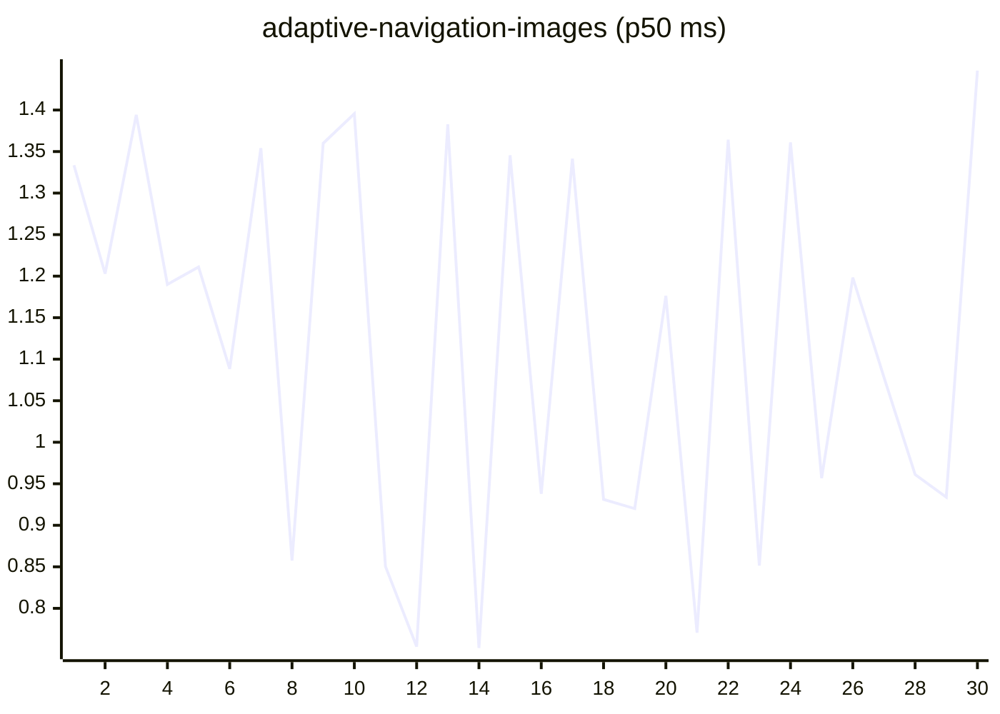
```mermaid
xychart-beta
    title "adaptive-navigation-images (p50 ms)"
    x-axis 1 --> 30
    line [1.3336, 1.2030, 1.3942, 1.1900, 1.2110, 1.0882, 1.3541, 0.8576, 1.3599, 1.3956, 0.8504, 0.7540, 1.3829, 0.7523, 1.3455, 0.9380, 1.3415, 0.9312, 0.9201, 1.1763, 0.7707, 1.3642, 0.8516, 1.3610, 0.9567, 1.1983, 1.0783, 0.9612, 0.9339, 1.4475]
```

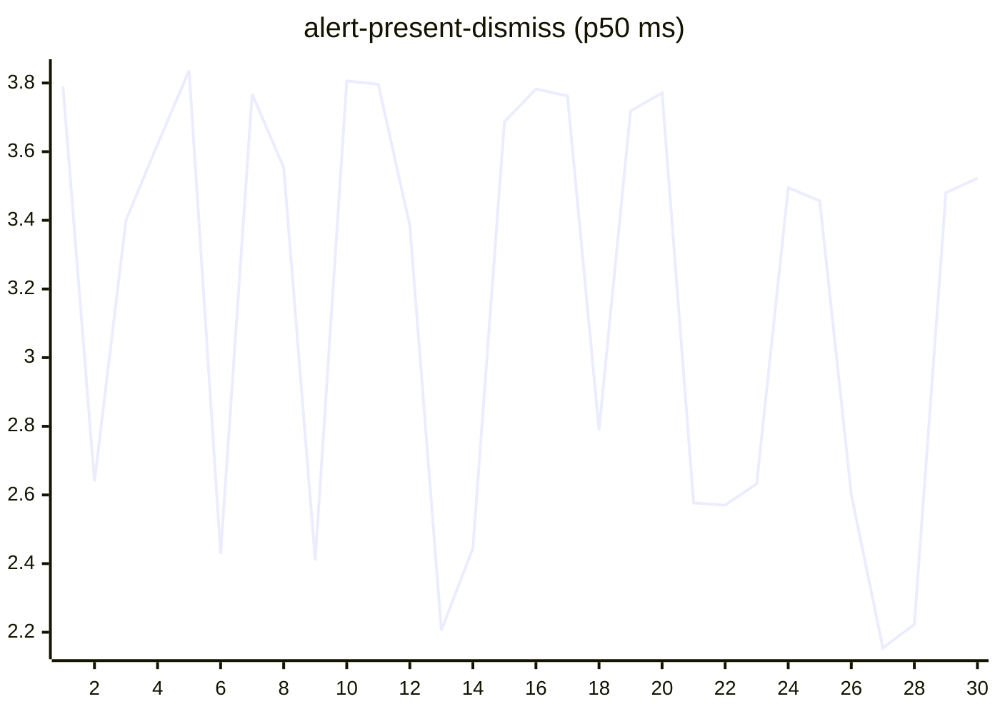
```mermaid
xychart-beta
    title "alert-present-dismiss (p50 ms)"
    x-axis 1 --> 30
    line [3.7906, 2.6392, 3.4008, 3.6212, 3.8362, 2.4288, 3.7676, 3.5538, 2.4095, 3.8060, 3.7961, 3.3851, 2.2058, 2.4450, 3.6869, 3.7826, 3.7621, 2.7891, 3.7187, 3.7708, 2.5766, 2.5704, 2.6324, 3.4949, 3.4566, 2.6019, 2.1543, 2.2230, 3.4803, 3.5227]
```

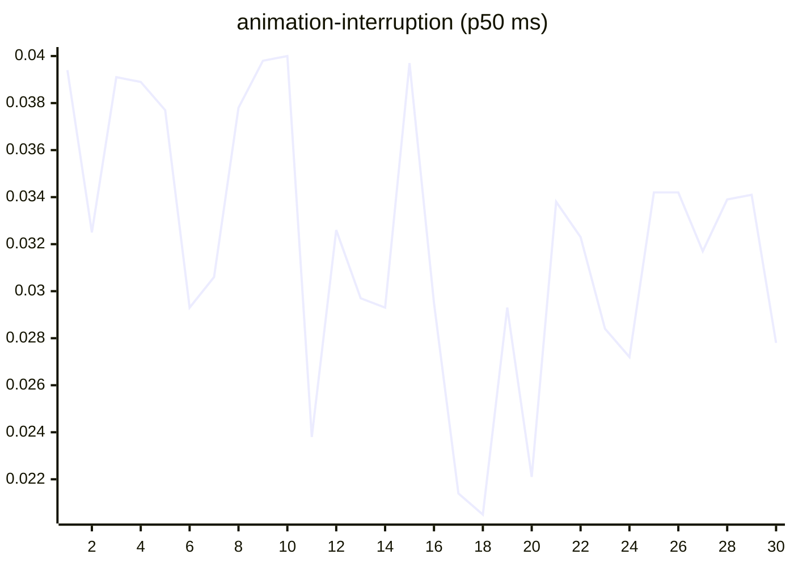
```mermaid
xychart-beta
    title "animation-interruption (p50 ms)"
    x-axis 1 --> 30
    line [0.0394, 0.0325, 0.0391, 0.0389, 0.0377, 0.0293, 0.0306, 0.0378, 0.0398, 0.0400, 0.0238, 0.0326, 0.0297, 0.0293, 0.0397, 0.0295, 0.0214, 0.0205, 0.0293, 0.0221, 0.0338, 0.0323, 0.0284, 0.0272, 0.0342, 0.0342, 0.0317, 0.0339, 0.0341, 0.0278]
```

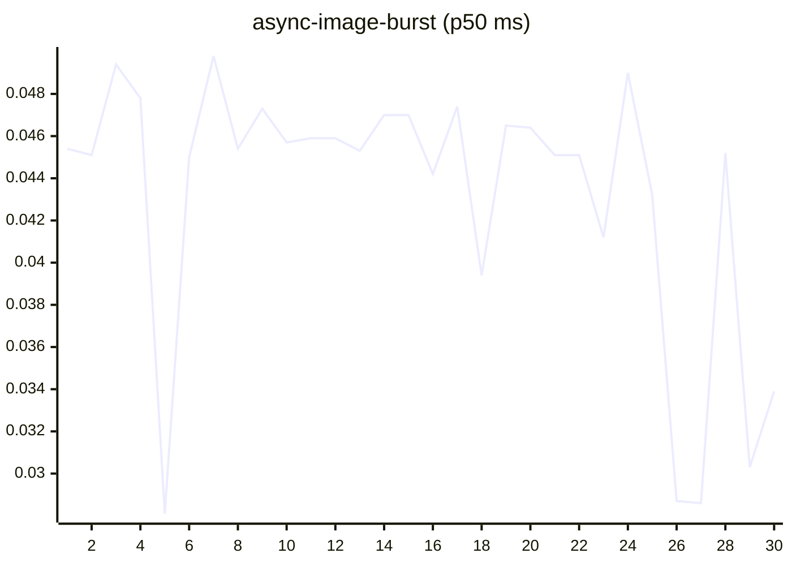
```mermaid
xychart-beta
    title "async-image-burst (p50 ms)"
    x-axis 1 --> 30
    line [0.0454, 0.0451, 0.0494, 0.0478, 0.0281, 0.0450, 0.0498, 0.0454, 0.0473, 0.0457, 0.0459, 0.0459, 0.0453, 0.0470, 0.0470, 0.0442, 0.0474, 0.0394, 0.0465, 0.0464, 0.0451, 0.0451, 0.0412, 0.0490, 0.0432, 0.0287, 0.0286, 0.0452, 0.0303, 0.0339]
```

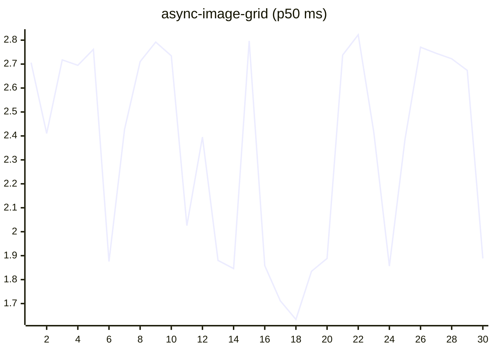
```mermaid
xychart-beta
    title "async-image-grid (p50 ms)"
    x-axis 1 --> 30
    line [2.7059, 2.4103, 2.7175, 2.6949, 2.7614, 1.8756, 2.4277, 2.7103, 2.7919, 2.7346, 2.0254, 2.3955, 1.8801, 1.8461, 2.7970, 1.8583, 1.7113, 1.6337, 1.8346, 1.8885, 2.7375, 2.8223, 2.4153, 1.8565, 2.3845, 2.7705, 2.7451, 2.7222, 2.6737, 1.8884]
```

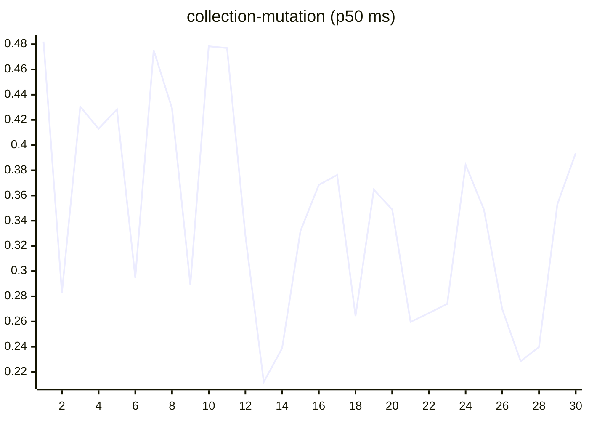
```mermaid
xychart-beta
    title "collection-mutation (p50 ms)"
    x-axis 1 --> 30
    line [0.4821, 0.2826, 0.4305, 0.4130, 0.4283, 0.2946, 0.4753, 0.4292, 0.2890, 0.4784, 0.4770, 0.3282, 0.2120, 0.2388, 0.3318, 0.3684, 0.3763, 0.2643, 0.3646, 0.3489, 0.2597, 0.2667, 0.2740, 0.3845, 0.3488, 0.2697, 0.2285, 0.2398, 0.3530, 0.3937]
```

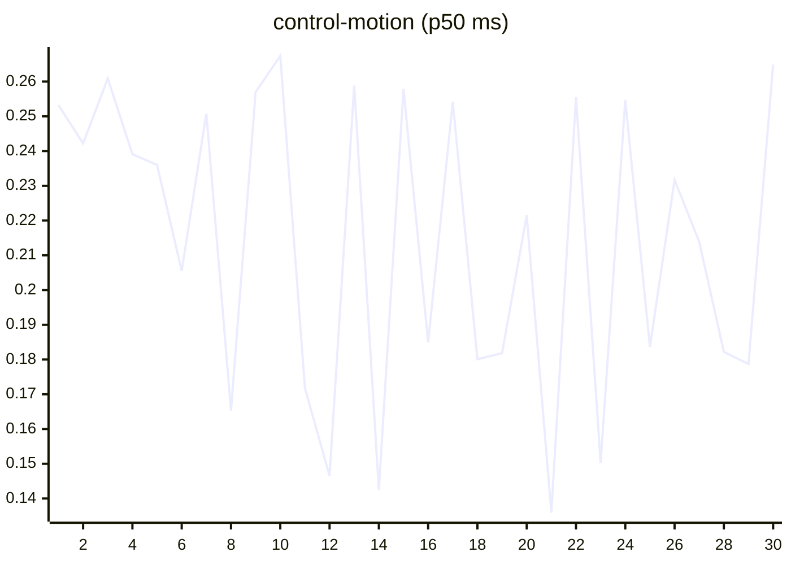
```mermaid
xychart-beta
    title "control-motion (p50 ms)"
    x-axis 1 --> 30
    line [0.2532, 0.2422, 0.2609, 0.2391, 0.2360, 0.2055, 0.2508, 0.1653, 0.2570, 0.2674, 0.1718, 0.1465, 0.2588, 0.1424, 0.2579, 0.1849, 0.2542, 0.1801, 0.1818, 0.2215, 0.1359, 0.2555, 0.1502, 0.2547, 0.1836, 0.2317, 0.2139, 0.1822, 0.1787, 0.2649]
```

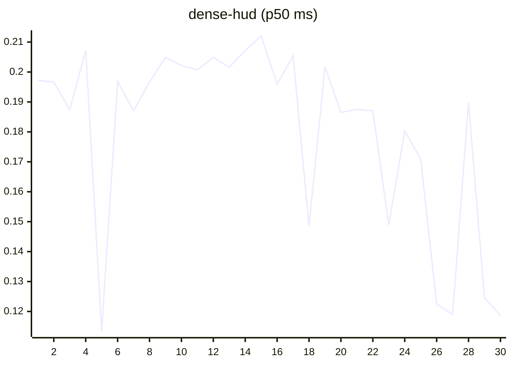
```mermaid
xychart-beta
    title "dense-hud (p50 ms)"
    x-axis 1 --> 30
    line [0.1972, 0.1966, 0.1874, 0.2072, 0.1134, 0.1968, 0.1871, 0.1966, 0.2049, 0.2022, 0.2007, 0.2049, 0.2016, 0.2072, 0.2120, 0.1959, 0.2054, 0.1486, 0.2017, 0.1865, 0.1875, 0.1870, 0.1489, 0.1803, 0.1709, 0.1225, 0.1190, 0.1899, 0.1245, 0.1187]
```

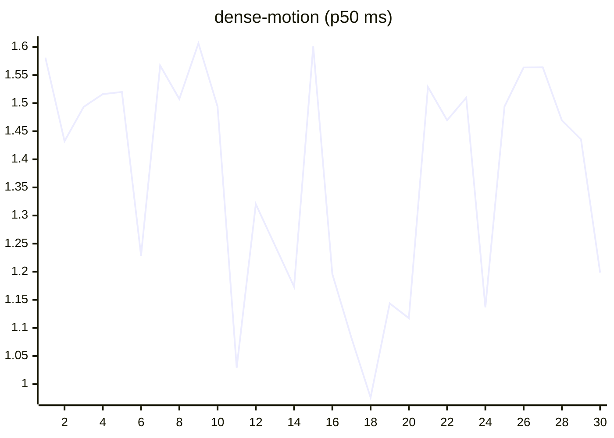
```mermaid
xychart-beta
    title "dense-motion (p50 ms)"
    x-axis 1 --> 30
    line [1.5809, 1.4323, 1.4933, 1.5160, 1.5198, 1.2285, 1.5668, 1.5073, 1.6064, 1.4938, 1.0293, 1.3202, 1.2469, 1.1733, 1.6011, 1.1959, 1.0823, 0.9763, 1.1436, 1.1174, 1.5286, 1.4695, 1.5096, 1.1365, 1.4939, 1.5634, 1.5638, 1.4692, 1.4355, 1.1984]
```

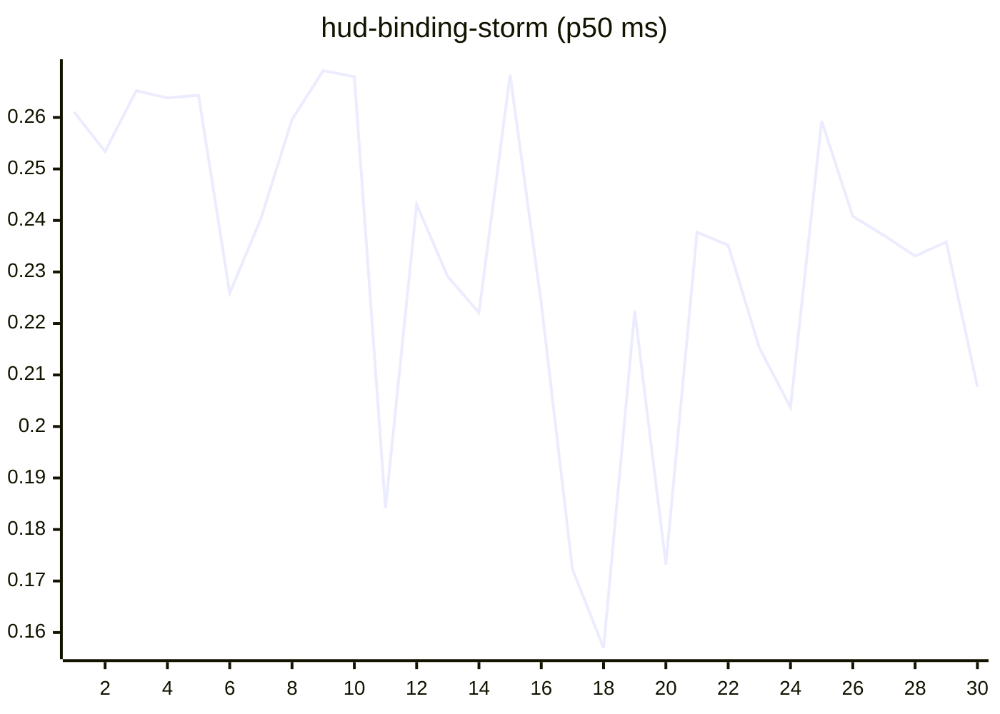
```mermaid
xychart-beta
    title "hud-binding-storm (p50 ms)"
    x-axis 1 --> 30
    line [0.2611, 0.2534, 0.2652, 0.2638, 0.2643, 0.2259, 0.2403, 0.2596, 0.2691, 0.2679, 0.1841, 0.2431, 0.2291, 0.2221, 0.2683, 0.2240, 0.1723, 0.1570, 0.2224, 0.1732, 0.2377, 0.2352, 0.2153, 0.2037, 0.2593, 0.2408, 0.2371, 0.2331, 0.2358, 0.2077]
```

```mermaid
xychart-beta
    title "lab-collection-churn (p50 ms)"
    x-axis 1 --> 30
    line [0.4154, 0.3556, 0.4145, 0.4164, 0.4192, 0.3354, 0.3730, 0.4147, 0.4171, 0.4126, 0.2636, 0.3521, 0.3369, 0.3280, 0.4200, 0.3297, 0.2474, 0.2447, 0.3314, 0.2814, 0.4194, 0.4176, 0.3686, 0.3301, 0.4283, 0.4250, 0.4152, 0.4180, 0.4167, 0.3342]
```

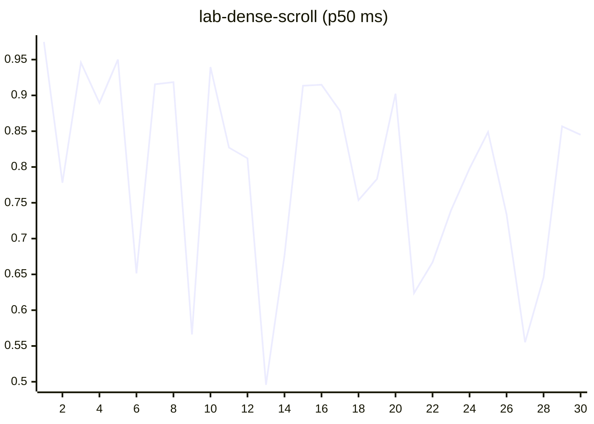
```mermaid
xychart-beta
    title "lab-dense-scroll (p50 ms)"
    x-axis 1 --> 30
    line [0.9747, 0.7780, 0.9459, 0.8894, 0.9501, 0.6514, 0.9155, 0.9185, 0.5661, 0.9396, 0.8271, 0.8121, 0.4958, 0.6764, 0.9135, 0.9149, 0.8783, 0.7537, 0.7833, 0.9024, 0.6238, 0.6669, 0.7395, 0.7979, 0.8489, 0.7339, 0.5552, 0.6458, 0.8568, 0.8450]
```

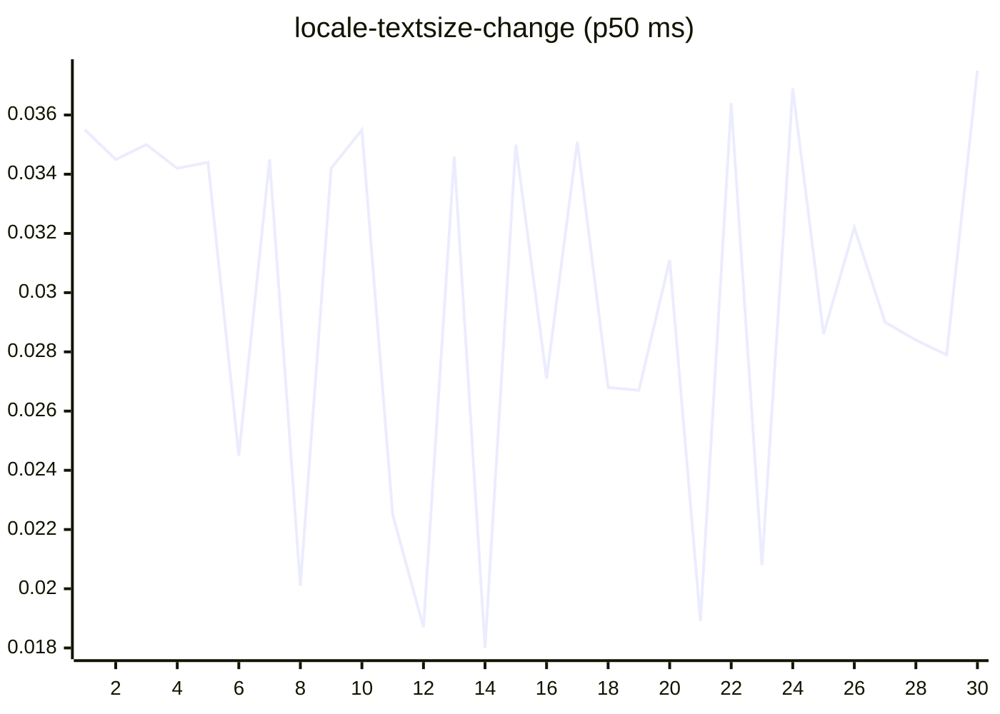
```mermaid
xychart-beta
    title "locale-textsize-change (p50 ms)"
    x-axis 1 --> 30
    line [0.0355, 0.0345, 0.0350, 0.0342, 0.0344, 0.0245, 0.0345, 0.0201, 0.0342, 0.0355, 0.0225, 0.0187, 0.0346, 0.0180, 0.0350, 0.0271, 0.0351, 0.0268, 0.0267, 0.0311, 0.0189, 0.0364, 0.0208, 0.0369, 0.0286, 0.0322, 0.0290, 0.0284, 0.0279, 0.0375]
```

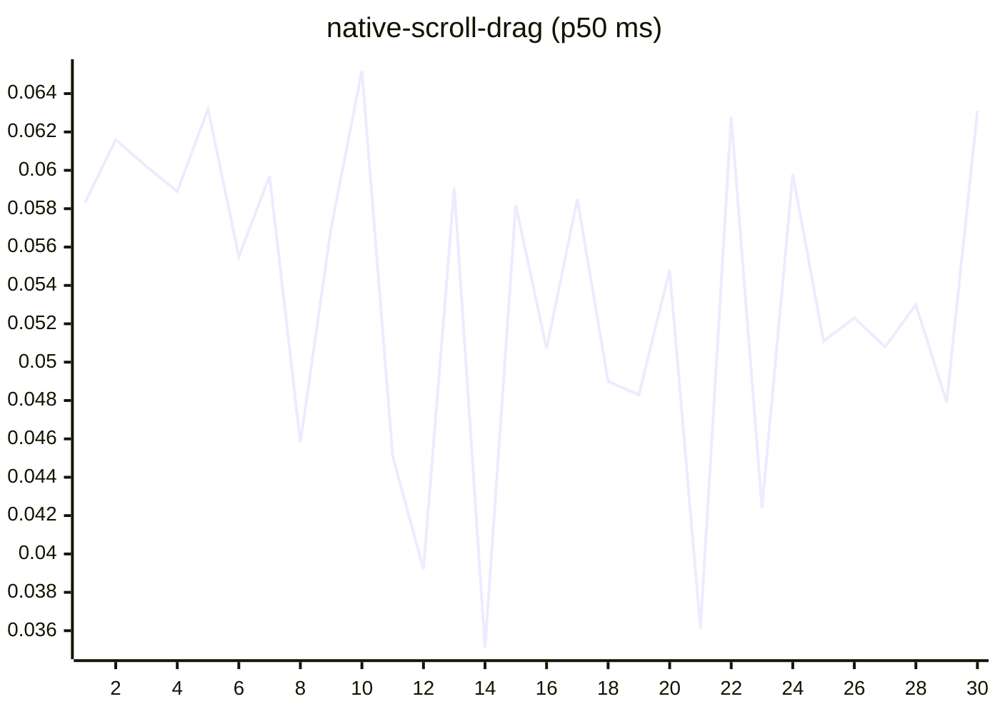
```mermaid
xychart-beta
    title "native-scroll-drag (p50 ms)"
    x-axis 1 --> 30
    line [0.0583, 0.0616, 0.0602, 0.0589, 0.0632, 0.0555, 0.0597, 0.0458, 0.0570, 0.0652, 0.0451, 0.0392, 0.0591, 0.0351, 0.0582, 0.0507, 0.0585, 0.0490, 0.0483, 0.0548, 0.0361, 0.0628, 0.0424, 0.0598, 0.0511, 0.0523, 0.0508, 0.0530, 0.0479, 0.0631]
```

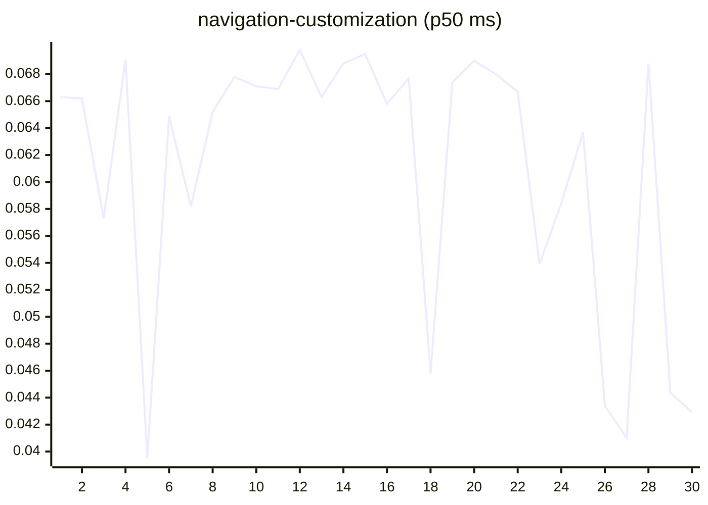
```mermaid
xychart-beta
    title "navigation-customization (p50 ms)"
    x-axis 1 --> 30
    line [0.0663, 0.0662, 0.0573, 0.0691, 0.0395, 0.0649, 0.0582, 0.0652, 0.0678, 0.0671, 0.0669, 0.0698, 0.0663, 0.0688, 0.0695, 0.0658, 0.0677, 0.0458, 0.0674, 0.0690, 0.0680, 0.0667, 0.0539, 0.0584, 0.0637, 0.0434, 0.0410, 0.0688, 0.0444, 0.0429]
```

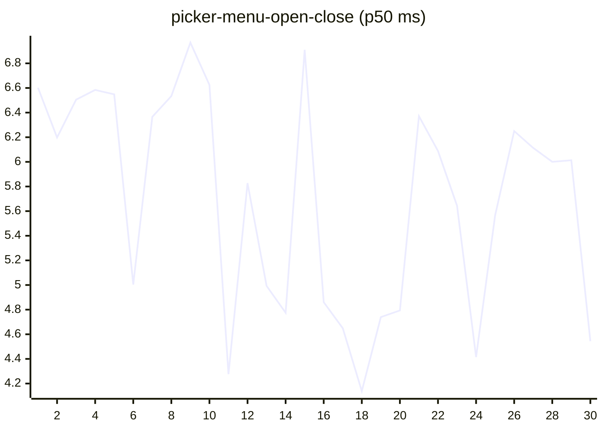
```mermaid
xychart-beta
    title "picker-menu-open-close (p50 ms)"
    x-axis 1 --> 30
    line [6.6018, 6.1978, 6.5053, 6.5840, 6.5483, 5.0039, 6.3653, 6.5343, 6.9684, 6.6249, 4.2762, 5.8275, 4.9929, 4.7749, 6.9094, 4.8605, 4.6493, 4.1383, 4.7397, 4.7934, 6.3713, 6.0885, 5.6440, 4.4145, 5.5656, 6.2500, 6.1133, 6.0006, 6.0128, 4.5439]
```

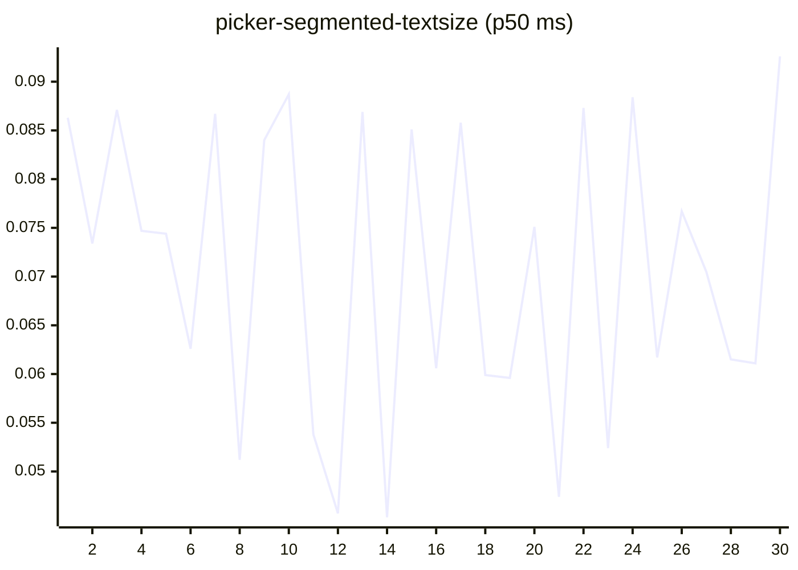
```mermaid
xychart-beta
    title "picker-segmented-textsize (p50 ms)"
    x-axis 1 --> 30
    line [0.0863, 0.0734, 0.0871, 0.0747, 0.0744, 0.0626, 0.0867, 0.0512, 0.0840, 0.0887, 0.0538, 0.0457, 0.0869, 0.0453, 0.0851, 0.0606, 0.0858, 0.0599, 0.0596, 0.0751, 0.0474, 0.0873, 0.0524, 0.0884, 0.0617, 0.0767, 0.0705, 0.0615, 0.0611, 0.0926]
```

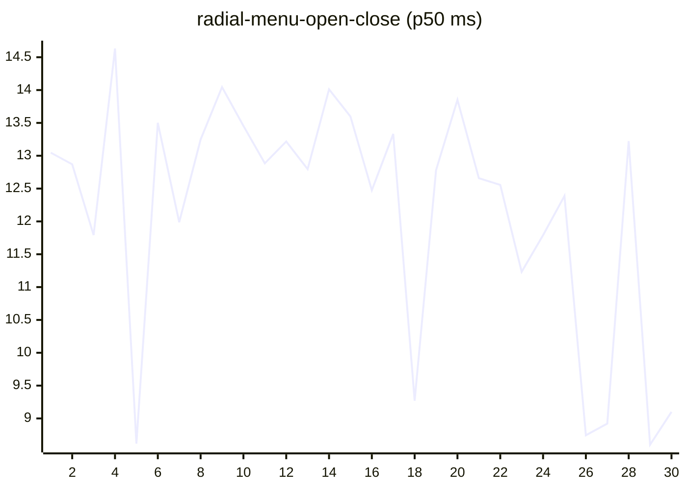
```mermaid
xychart-beta
    title "radial-menu-open-close (p50 ms)"
    x-axis 1 --> 30
    line [13.0462, 12.8695, 11.7917, 14.6337, 8.6157, 13.5015, 11.9875, 13.2473, 14.0454, 13.4545, 12.8844, 13.2172, 12.7956, 14.0106, 13.5975, 12.4751, 13.3321, 9.2701, 12.7803, 13.8513, 12.6574, 12.5560, 11.2324, 11.7902, 12.3880, 8.7436, 8.9215, 13.2239, 8.6006, 9.0993]
```

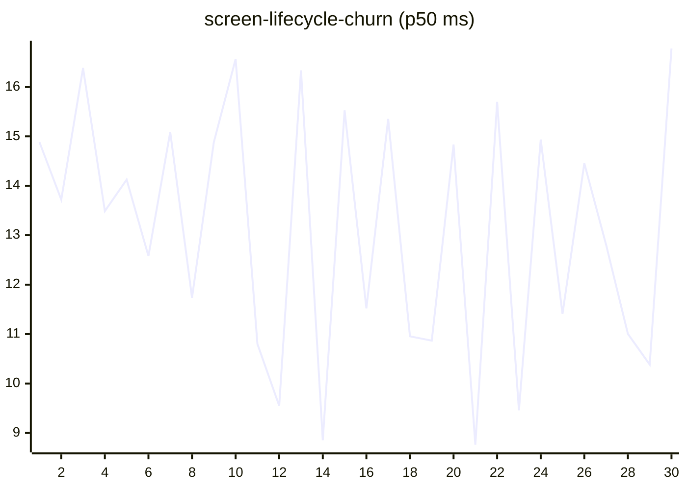
```mermaid
xychart-beta
    title "screen-lifecycle-churn (p50 ms)"
    x-axis 1 --> 30
    line [14.8820, 13.7187, 16.3818, 13.4876, 14.1247, 12.5788, 15.0875, 11.7346, 14.8807, 16.5636, 10.8019, 9.5493, 16.3352, 8.8542, 15.5247, 11.5198, 15.3513, 10.9553, 10.8669, 14.8354, 8.7629, 15.6965, 9.4580, 14.9352, 11.4071, 14.4551, 12.8061, 11.0031, 10.3834, 16.7783]
```

```mermaid
xychart-beta
    title "scroll-focus-traversal (p50 ms)"
    x-axis 1 --> 30
    line [0.4176, 0.4056, 0.3876, 0.4213, 0.2101, 0.4062, 0.3793, 0.4120, 0.4038, 0.4213, 0.4090, 0.4155, 0.4122, 0.4240, 0.4270, 0.4138, 0.4048, 0.2988, 0.4213, 0.3866, 0.3832, 0.3461, 0.2782, 0.3701, 0.3192, 0.1788, 0.2196, 0.3819, 0.2310, 0.1844]
```

```mermaid
xychart-beta
    title "settings-churn (p50 ms)"
    x-axis 1 --> 30
    line [3.7464, 3.3635, 3.8392, 3.3398, 3.4093, 3.0330, 3.8272, 2.5974, 3.8481, 4.0202, 2.5474, 2.2241, 3.9145, 2.1567, 3.9092, 2.7259, 3.8607, 2.7176, 2.6713, 3.4963, 2.1652, 3.9796, 2.3938, 3.8055, 2.7229, 3.5765, 3.1778, 2.7769, 2.6734, 3.9876]
```

```mermaid
xychart-beta
    title "shadow-storm (p50 ms)"
    x-axis 1 --> 30
    line [0.0006, 0.0003, 0.0006, 0.0005, 0.0005, 0.0003, 0.0006, 0.0006, 0.0003, 0.0006, 0.0006, 0.0006, 0.0003, 0.0003, 0.0005, 0.0006, 0.0006, 0.0005, 0.0006, 0.0005, 0.0005, 0.0005, 0.0005, 0.0006, 0.0005, 0.0005, 0.0003, 0.0003, 0.0005, 0.0006]
```

```mermaid
xychart-beta
    title "stylesheet-state-churn (p50 ms)"
    x-axis 1 --> 30
    line [0.4491, 0.2685, 0.4140, 0.3862, 0.4003, 0.2516, 0.4413, 0.4140, 0.2448, 0.4329, 0.4274, 0.3947, 0.2233, 0.2597, 0.3933, 0.4176, 0.4187, 0.3293, 0.4146, 0.3895, 0.3022, 0.3133, 0.3207, 0.4075, 0.3872, 0.3166, 0.2247, 0.2440, 0.3899, 0.4264]
```

```mermaid
xychart-beta
    title "theme-swap-assets (p50 ms)"
    x-axis 1 --> 30
    line [2.1422, 2.1255, 2.1180, 2.5045, 1.2889, 2.1564, 2.1191, 2.1367, 2.1897, 2.1482, 2.1331, 2.1361, 2.1269, 2.7631, 2.1700, 2.0966, 2.1646, 1.6473, 2.1716, 2.2078, 2.1811, 2.1485, 1.9419, 2.1761, 2.1523, 1.3964, 1.3639, 2.2354, 1.6750, 1.3789]
```

```mermaid
xychart-beta
    title "theme-swap-flat (p50 ms)"
    x-axis 1 --> 30
    line [0.5122, 0.5031, 0.5177, 0.5247, 0.3000, 0.5042, 0.5248, 0.5047, 0.5141, 0.4973, 0.4915, 0.4864, 0.4880, 0.5036, 0.5083, 0.4862, 0.5041, 0.3994, 0.4905, 0.4963, 0.5057, 0.4981, 0.3945, 0.5323, 0.4452, 0.3118, 0.2983, 0.5069, 0.3300, 0.3065]
```

```mermaid
xychart-beta
    title "theme-swap-metrics (p50 ms)"
    x-axis 1 --> 30
    line [1.7453, 1.0456, 1.7248, 1.6700, 1.8918, 1.0959, 1.7124, 1.7537, 1.0353, 1.7154, 1.6931, 1.7197, 0.9647, 1.0274, 1.7331, 1.6989, 1.6911, 1.3586, 1.6733, 1.6923, 1.3685, 1.3971, 1.3936, 1.6665, 1.7035, 1.3809, 1.0136, 1.0309, 1.7098, 1.7328]
```

```mermaid
xychart-beta
    title "virtual-list-scroll (p50 ms)"
    x-axis 1 --> 30
    line [0.2003, 0.1791, 0.1989, 0.1985, 0.2049, 0.1461, 0.1827, 0.2005, 0.2129, 0.2040, 0.1374, 0.1721, 0.1458, 0.1361, 0.2069, 0.1392, 0.1285, 0.1161, 0.1268, 0.1753, 0.2339, 0.1940, 0.2069, 0.1286, 0.1608, 0.1954, 0.1973, 0.1907, 0.1884, 0.1321]
```
