# Facet performance

Latest: `008b26f1c2eefd2a0d60574a7dec2a2940d4d8a4` on 2026-10-30T195705Z, measured on the CI Ubuntu runner by the paired performance shards.
Times are milliseconds per frame or operation: the median over paired rounds of each round's p50 and p95.
Retained heap is the scene's mounted retained Luau heap. Change compares the p50 of the previous main commit.

| Scene | p50 ms | p95 ms | Retained KiB | Change |
| --- | ---: | ---: | ---: | ---: |
| adaptive-navigation-images | 0.7263 | 0.8070 | 3629 | -32.2% |
| alert-present-dismiss | 2.6071 | 3.9039 | 1582 | +37.4% |
| animation-interruption | 0.0156 | 0.0178 | 353 | +0.7% |
| async-image-burst | 0.0285 | 0.0340 | 451 | +10.2% |
| async-image-grid | 1.4457 | 2.3955 | 2208 | +7.4% |
| collection-mutation | 0.2844 | 0.3188 | 3576 | +28.1% |
| control-motion | 0.1021 | 0.4011 | 1642 | -41.6% |
| dense-hud | 0.1314 | 0.1471 | 717 | +32.9% |
| dense-motion | 0.6498 | 1.0822 | 2055 | +5.1% |
| hud-binding-storm | 0.1164 | 0.1245 | 438 | +5.8% |
| lab-collection-churn | 0.3763 | 0.5721 | 4033 | +6.4% |
| lab-dense-scroll | 0.7102 | 3.9199 | 6693 | +57.3% |
| locale-textsize-change | 0.0131 | 0.0153 | 492 | -49.1% |
| native-scroll-drag | 0.0226 | 0.0286 | 1799 | -34.5% |
| navigation-customization | 0.0472 | 0.0560 | 3542 | +58.4% |
| picker-menu-open-close | 3.8672 | 6.1470 | 3911 | +7.9% |
| picker-segmented-textsize | 0.0318 | 0.0369 | 926 | -45.7% |
| radial-menu-open-close | 15.1793 | 21.3016 | 1640 | +25.3% |
| screen-lifecycle-churn | 9.5193 | 15.6904 | 1598 | -27.1% |
| scroll-focus-traversal | 0.2960 | 0.5032 | 1186 | +35.5% |
| settings-churn | 2.2059 | 3.7678 | 1457 | -33.0% |
| shadow-storm | 0.0004 | 0.0005 | 1829 | +40.7% |
| stylesheet-state-churn | 0.2148 | 0.2438 | 2637 | +40.7% |
| theme-swap-assets | 1.4339 | 1.8092 | 5859 | +25.8% |
| theme-swap-flat | 0.3627 | 0.4050 | 4168 | +17.6% |
| theme-swap-metrics | 1.1826 | 1.3943 | 4721 | +45.0% |
| virtual-list-scroll | 0.0898 | 0.1323 | 5035 | -1.9% |

| Microbenchmark | p50 ms | p95 ms | Change |
| --- | ---: | ---: | ---: |
| billboard-nameplate-storm | 0.0766 | 0.0838 | +2.3% |
| collection-mutation | 0.0055 | 0.0077 | -29.9% |
| collection-selection-update | 0.0025 | 0.0029 | +8.8% |
| hud-binding-storm | 0.2261 | 0.2416 | +35.9% |
| motion-declarative | 0.5264 | 0.7516 | +8.3% |
| motion-explicit | 0.5099 | 0.7131 | -38.0% |
| mount-ramp | 138.3737 | 154.3344 | +0.5% |
| mount-ramp-inherited | 124.9977 | 138.8757 | +50.1% |
| mounted-slice-update-storm | 0.1182 | 0.1334 | +4.6% |
| outline-measured-update | 0.8034 | 1.2248 | -38.1% |
| reserved-slot-record-update | 0.7249 | 0.9719 | +31.5% |
| settings-churn | 0.0092 | 0.0109 | +29.9% |
| sparse-update-under-load | 0.0013 | 0.0019 | +3.1% |
| table-mutation | 0.1985 | 0.2655 | -35.8% |
| table-resize-drag | 2.1941 | 2.7469 | +34.2% |
| table-sort-values | 0.8769 | 1.4829 | +31.5% |
| table-source-refresh | 0.1386 | 0.3356 | -0.2% |
| textinput-typing-storm | 0.1297 | 0.2501 | -39.0% |
| timer-readout-storm | 0.1586 | 0.7586 | +23.1% |
| zz-yardstick-cpu-after | 0.9400 | 1.0437 | -15.3% |
| zz-yardstick-cpu-before | 0.9335 | 1.0284 | -9.7% |

## Scene p50 over the last 30 main commits

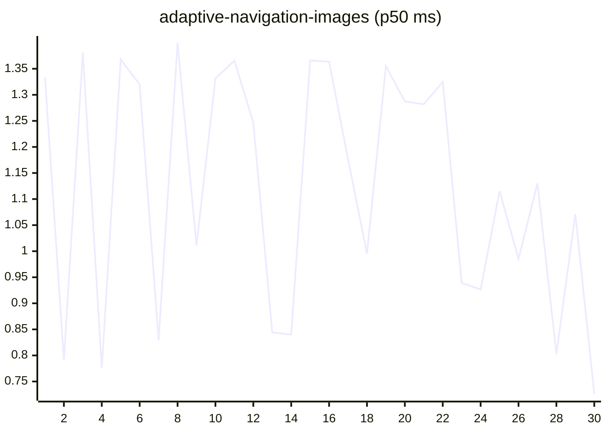
```mermaid
xychart-beta
    title "adaptive-navigation-images (p50 ms)"
    x-axis 1 --> 30
    line [1.3343, 0.7905, 1.3810, 0.7758, 1.3680, 1.3197, 0.8291, 1.3996, 1.0110, 1.3313, 1.3656, 1.2466, 0.8441, 0.8400, 1.3659, 1.3636, 1.1770, 0.9954, 1.3550, 1.2872, 1.2820, 1.3247, 0.9391, 0.9267, 1.1155, 0.9853, 1.1303, 0.8026, 1.0713, 0.7263]
```

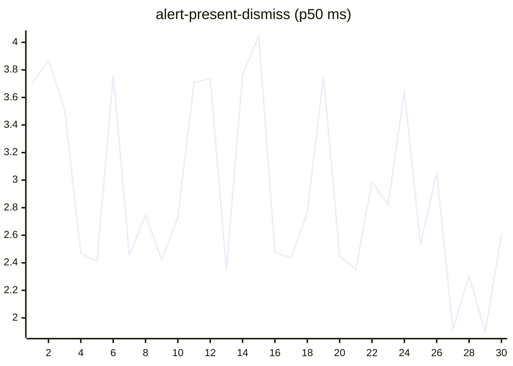
```mermaid
xychart-beta
    title "alert-present-dismiss (p50 ms)"
    x-axis 1 --> 30
    line [3.7022, 3.8703, 3.5157, 2.4688, 2.4093, 3.7592, 2.4564, 2.7475, 2.4232, 2.7312, 3.7096, 3.7340, 2.3506, 3.7650, 4.0447, 2.4759, 2.4363, 2.7635, 3.7527, 2.4474, 2.3546, 2.9892, 2.8222, 3.6482, 2.5337, 3.0542, 1.9177, 2.3034, 1.8969, 2.6071]
```

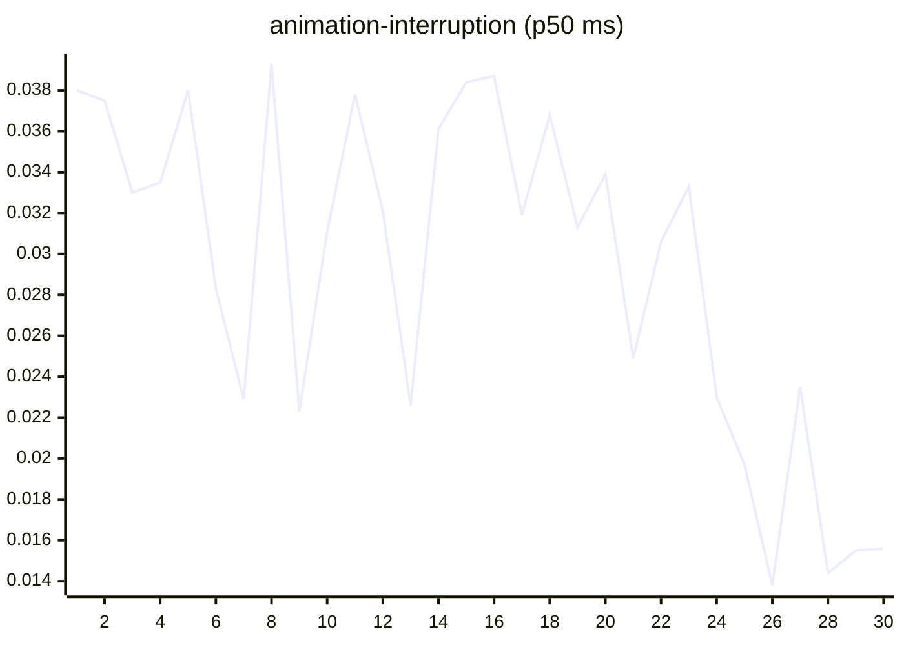
```mermaid
xychart-beta
    title "animation-interruption (p50 ms)"
    x-axis 1 --> 30
    line [0.0380, 0.0375, 0.0330, 0.0335, 0.0380, 0.0283, 0.0229, 0.0393, 0.0223, 0.0311, 0.0378, 0.0321, 0.0226, 0.0361, 0.0384, 0.0387, 0.0319, 0.0368, 0.0313, 0.0339, 0.0249, 0.0306, 0.0333, 0.0230, 0.0197, 0.0138, 0.0235, 0.0144, 0.0155, 0.0156]
```

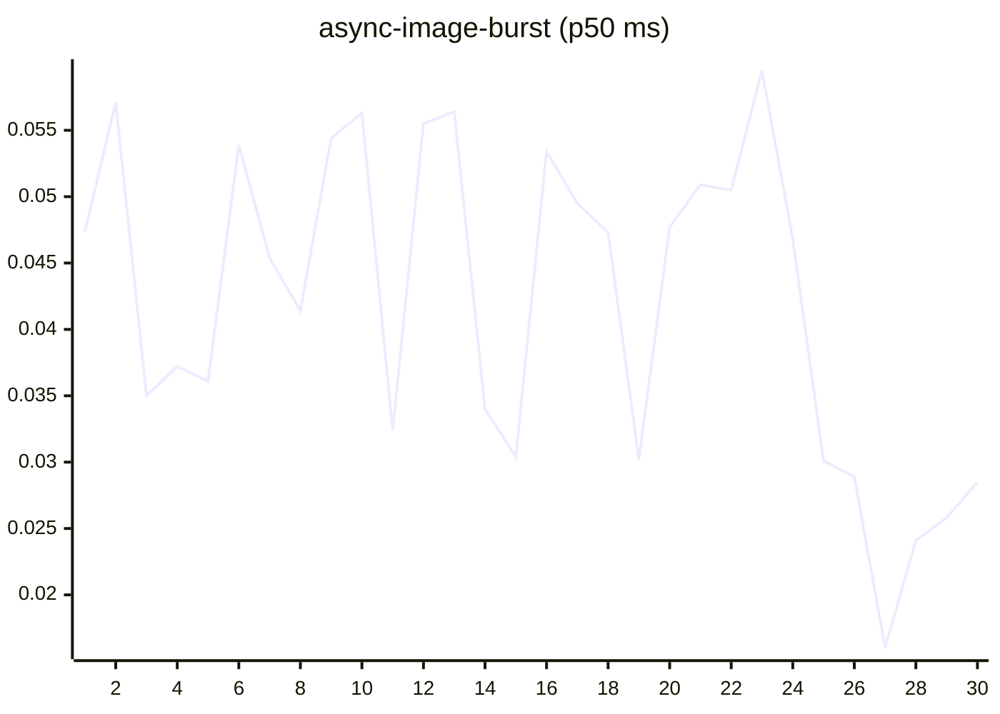
```mermaid
xychart-beta
    title "async-image-burst (p50 ms)"
    x-axis 1 --> 30
    line [0.0474, 0.0571, 0.0350, 0.0372, 0.0361, 0.0539, 0.0454, 0.0414, 0.0544, 0.0563, 0.0324, 0.0555, 0.0564, 0.0340, 0.0304, 0.0534, 0.0495, 0.0473, 0.0302, 0.0477, 0.0509, 0.0505, 0.0595, 0.0468, 0.0301, 0.0289, 0.0160, 0.0241, 0.0258, 0.0285]
```

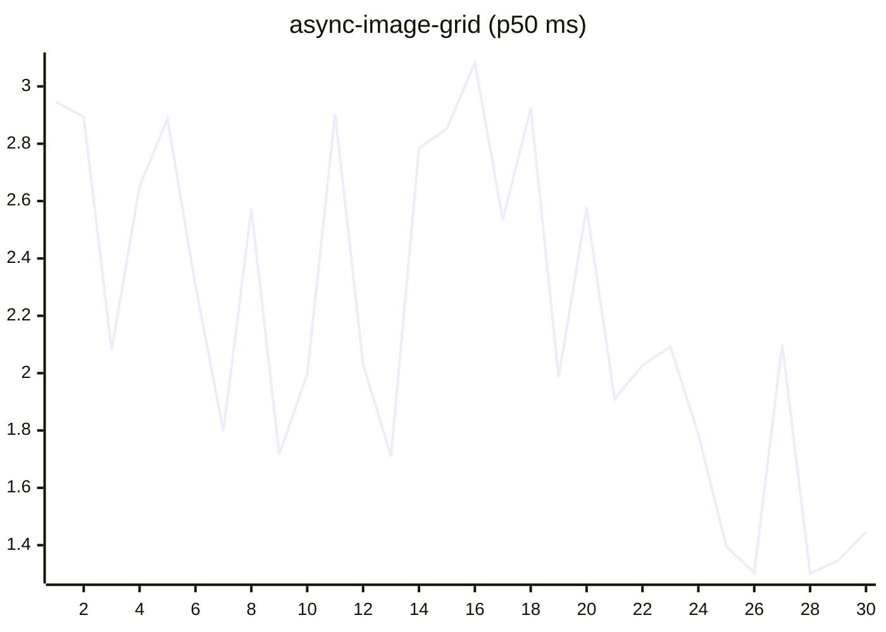
```mermaid
xychart-beta
    title "async-image-grid (p50 ms)"
    x-axis 1 --> 30
    line [2.9463, 2.8940, 2.0815, 2.6515, 2.8871, 2.3060, 1.7979, 2.5726, 1.7163, 1.9964, 2.9032, 2.0307, 1.7099, 2.7848, 2.8523, 3.0834, 2.5349, 2.9237, 1.9862, 2.5787, 1.9102, 2.0270, 2.0924, 1.7862, 1.3954, 1.3043, 2.1007, 1.3011, 1.3467, 1.4457]
```

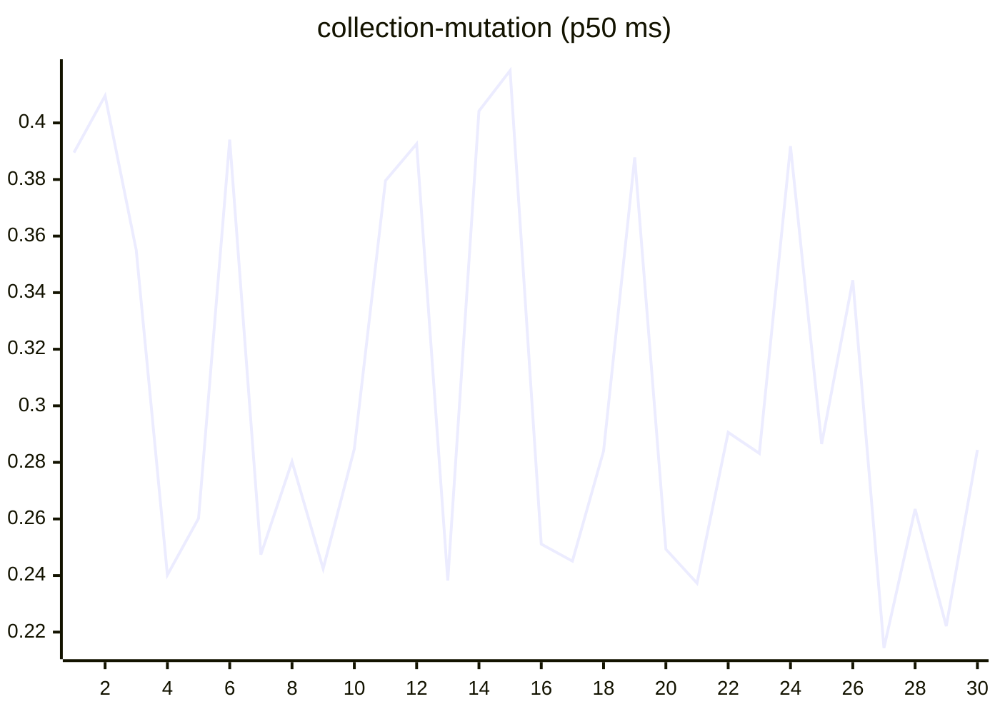
```mermaid
xychart-beta
    title "collection-mutation (p50 ms)"
    x-axis 1 --> 30
    line [0.3895, 0.4096, 0.3550, 0.2402, 0.2602, 0.3941, 0.2474, 0.2803, 0.2424, 0.2848, 0.3796, 0.3926, 0.2382, 0.4042, 0.4185, 0.2511, 0.2451, 0.2840, 0.3878, 0.2493, 0.2373, 0.2906, 0.2832, 0.3918, 0.2865, 0.3444, 0.2144, 0.2635, 0.2221, 0.2844]
```

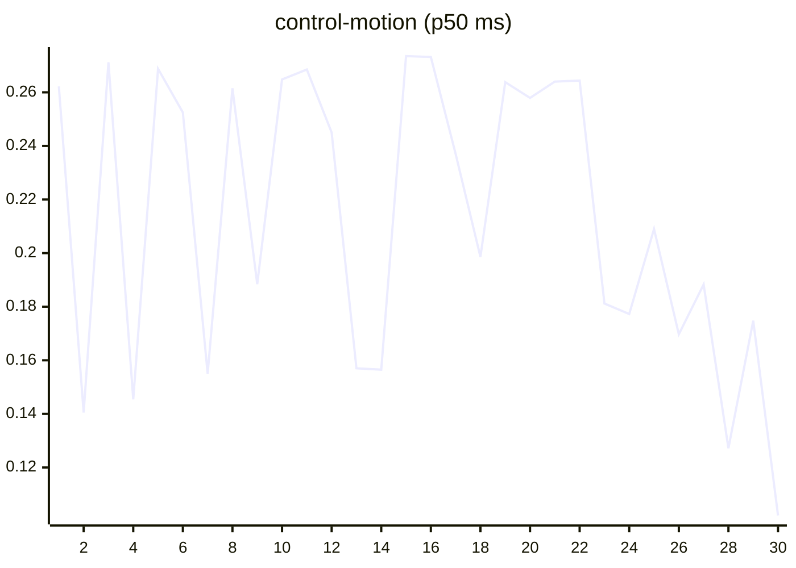
```mermaid
xychart-beta
    title "control-motion (p50 ms)"
    x-axis 1 --> 30
    line [0.2622, 0.1405, 0.2712, 0.1454, 0.2688, 0.2525, 0.1550, 0.2615, 0.1884, 0.2648, 0.2685, 0.2450, 0.1570, 0.1565, 0.2735, 0.2732, 0.2370, 0.1986, 0.2638, 0.2579, 0.2640, 0.2644, 0.1812, 0.1773, 0.2090, 0.1697, 0.1883, 0.1272, 0.1748, 0.1021]
```

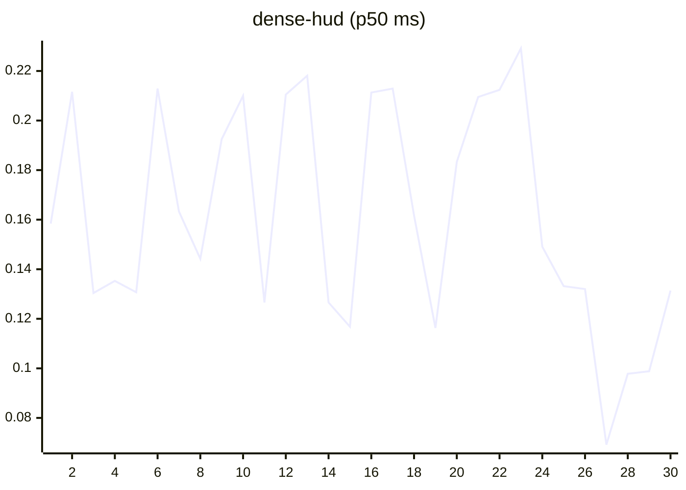
```mermaid
xychart-beta
    title "dense-hud (p50 ms)"
    x-axis 1 --> 30
    line [0.1584, 0.2116, 0.1304, 0.1353, 0.1307, 0.2129, 0.1633, 0.1442, 0.1925, 0.2100, 0.1266, 0.2105, 0.2181, 0.1266, 0.1168, 0.2113, 0.2129, 0.1617, 0.1163, 0.1833, 0.2095, 0.2124, 0.2291, 0.1491, 0.1332, 0.1320, 0.0692, 0.0978, 0.0988, 0.1314]
```

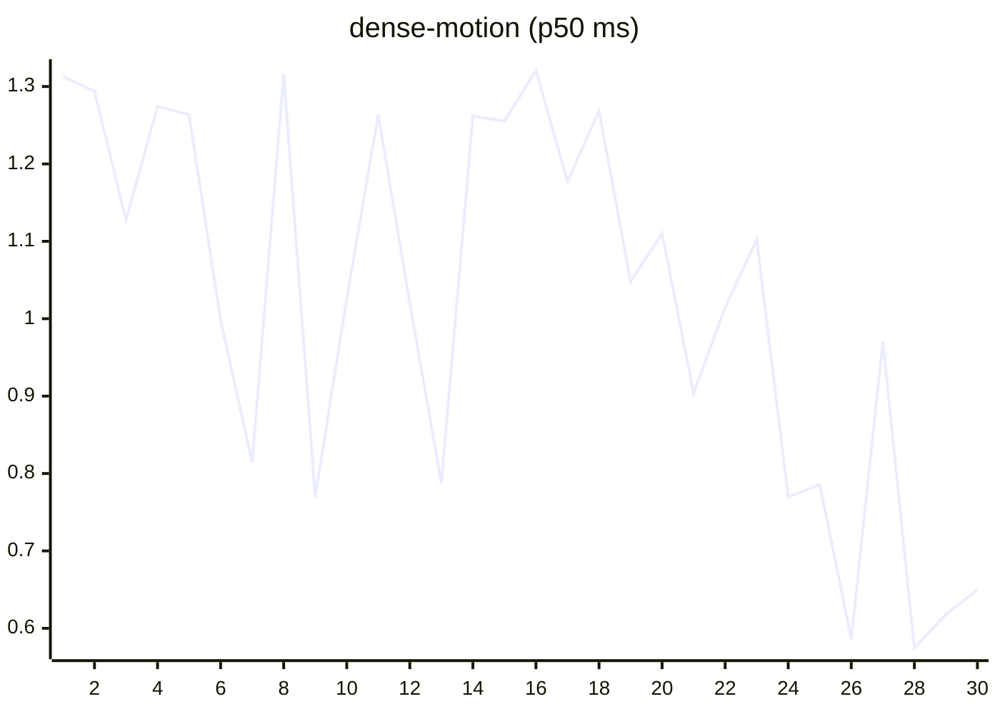
```mermaid
xychart-beta
    title "dense-motion (p50 ms)"
    x-axis 1 --> 30
    line [1.3128, 1.2940, 1.1276, 1.2742, 1.2636, 0.9981, 0.8144, 1.3160, 0.7697, 1.0258, 1.2636, 1.0200, 0.7874, 1.2619, 1.2553, 1.3206, 1.1772, 1.2685, 1.0480, 1.1102, 0.9040, 1.0144, 1.1023, 0.7695, 0.7856, 0.5862, 0.9706, 0.5746, 0.6181, 0.6498]
```

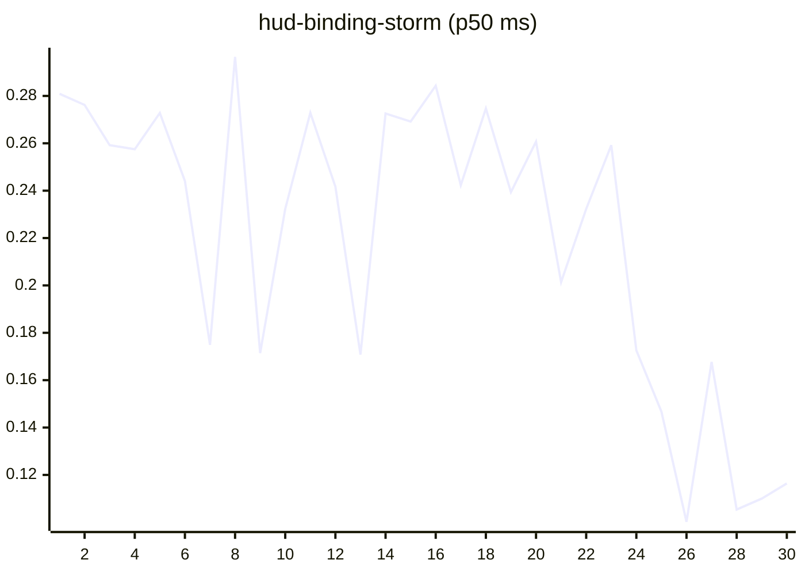
```mermaid
xychart-beta
    title "hud-binding-storm (p50 ms)"
    x-axis 1 --> 30
    line [0.2809, 0.2762, 0.2592, 0.2575, 0.2728, 0.2441, 0.1749, 0.2965, 0.1714, 0.2323, 0.2729, 0.2417, 0.1708, 0.2726, 0.2692, 0.2843, 0.2423, 0.2747, 0.2394, 0.2607, 0.2014, 0.2323, 0.2592, 0.1726, 0.1467, 0.1002, 0.1677, 0.1054, 0.1100, 0.1164]
```

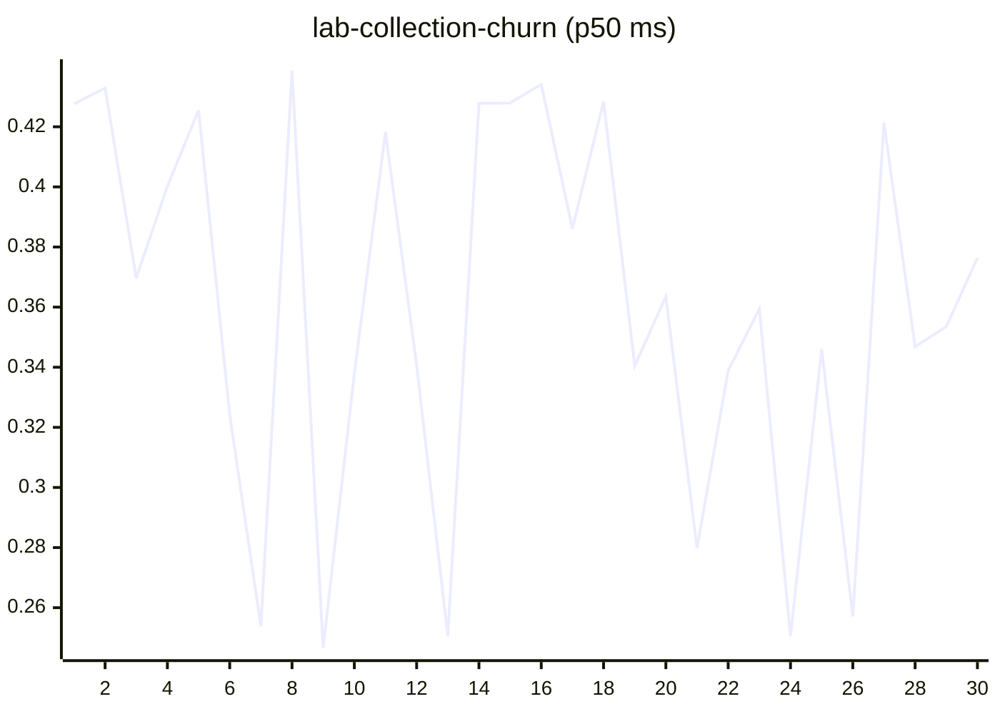
```mermaid
xychart-beta
    title "lab-collection-churn (p50 ms)"
    x-axis 1 --> 30
    line [0.4276, 0.4329, 0.3697, 0.4002, 0.4255, 0.3242, 0.2538, 0.4387, 0.2466, 0.3379, 0.4183, 0.3407, 0.2505, 0.4278, 0.4279, 0.4341, 0.3861, 0.4284, 0.3405, 0.3635, 0.2798, 0.3389, 0.3594, 0.2506, 0.3460, 0.2571, 0.4213, 0.3468, 0.3535, 0.3763]
```

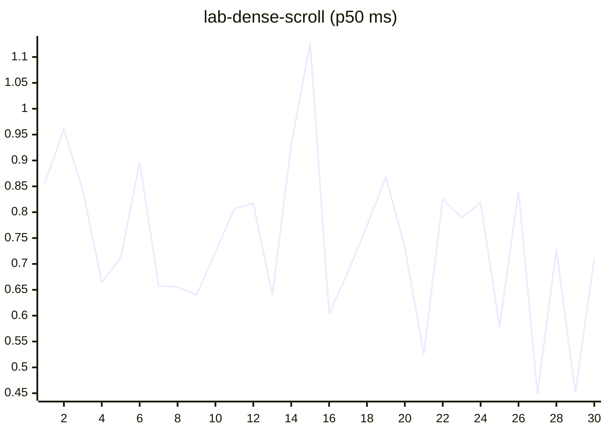
```mermaid
xychart-beta
    title "lab-dense-scroll (p50 ms)"
    x-axis 1 --> 30
    line [0.8570, 0.9604, 0.8416, 0.6647, 0.7120, 0.8968, 0.6580, 0.6552, 0.6397, 0.7226, 0.8071, 0.8171, 0.6401, 0.9297, 1.1273, 0.6038, 0.6843, 0.7739, 0.8680, 0.7317, 0.5254, 0.8252, 0.7895, 0.8186, 0.5785, 0.8409, 0.4488, 0.7278, 0.4517, 0.7102]
```

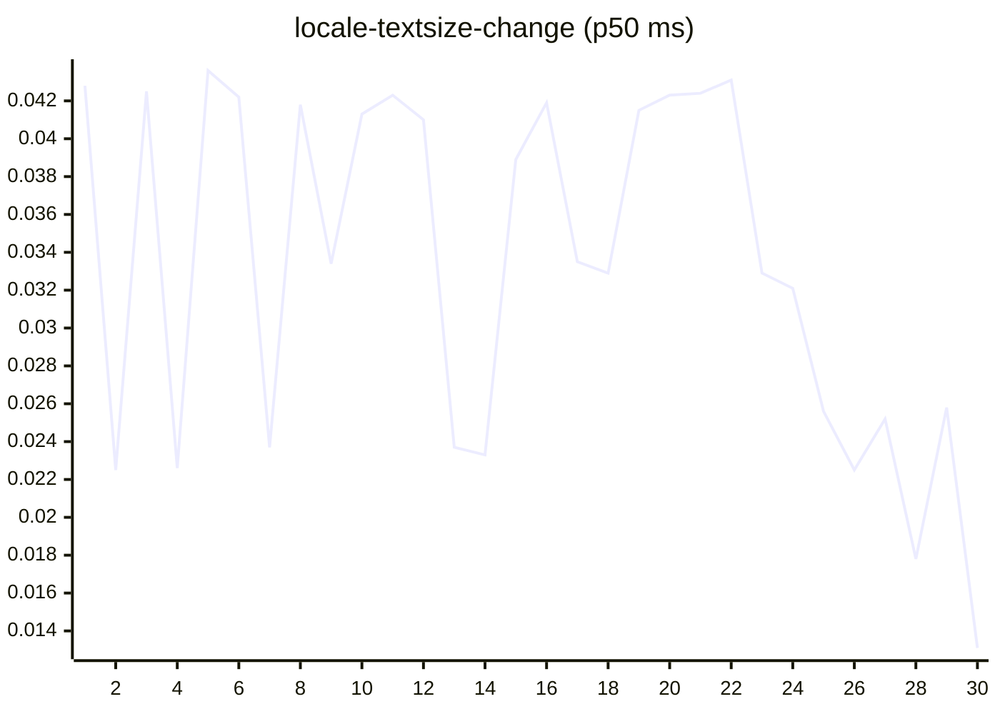
```mermaid
xychart-beta
    title "locale-textsize-change (p50 ms)"
    x-axis 1 --> 30
    line [0.0428, 0.0225, 0.0425, 0.0226, 0.0436, 0.0422, 0.0237, 0.0418, 0.0334, 0.0413, 0.0423, 0.0410, 0.0237, 0.0233, 0.0389, 0.0419, 0.0335, 0.0329, 0.0415, 0.0423, 0.0424, 0.0431, 0.0329, 0.0321, 0.0256, 0.0225, 0.0252, 0.0178, 0.0258, 0.0131]
```

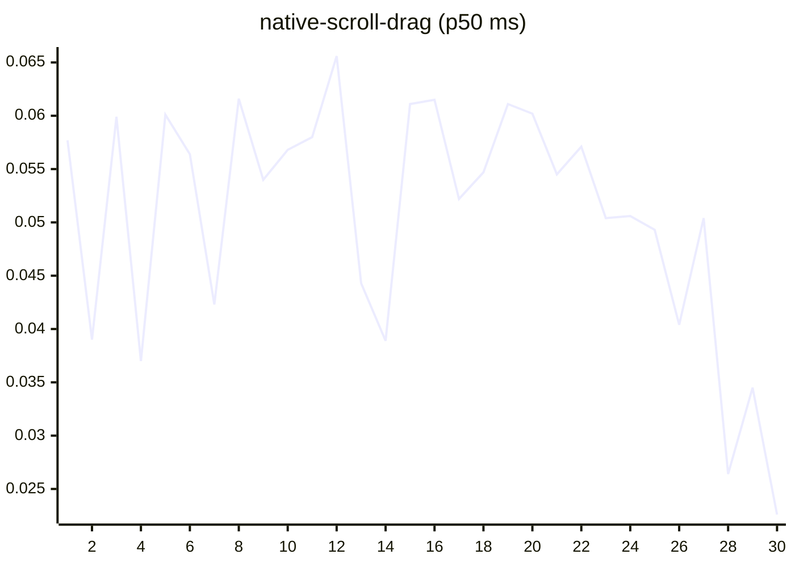
```mermaid
xychart-beta
    title "native-scroll-drag (p50 ms)"
    x-axis 1 --> 30
    line [0.0577, 0.0390, 0.0599, 0.0370, 0.0601, 0.0564, 0.0423, 0.0616, 0.0540, 0.0568, 0.0580, 0.0656, 0.0443, 0.0389, 0.0611, 0.0615, 0.0522, 0.0547, 0.0611, 0.0602, 0.0545, 0.0571, 0.0504, 0.0506, 0.0493, 0.0404, 0.0504, 0.0264, 0.0345, 0.0226]
```

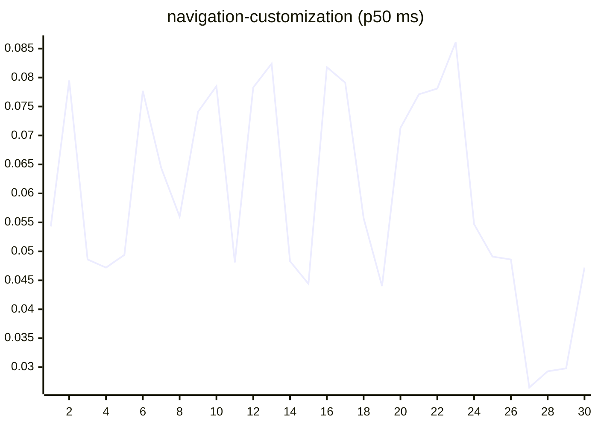
```mermaid
xychart-beta
    title "navigation-customization (p50 ms)"
    x-axis 1 --> 30
    line [0.0543, 0.0795, 0.0486, 0.0472, 0.0494, 0.0777, 0.0644, 0.0560, 0.0741, 0.0785, 0.0481, 0.0783, 0.0824, 0.0483, 0.0444, 0.0818, 0.0791, 0.0557, 0.0440, 0.0713, 0.0771, 0.0781, 0.0861, 0.0547, 0.0491, 0.0486, 0.0265, 0.0293, 0.0298, 0.0472]
```

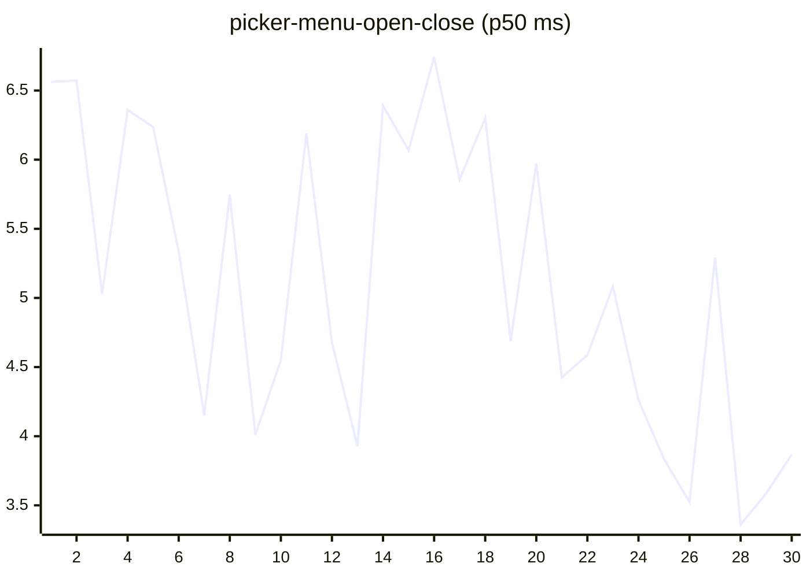
```mermaid
xychart-beta
    title "picker-menu-open-close (p50 ms)"
    x-axis 1 --> 30
    line [6.5623, 6.5728, 5.0278, 6.3599, 6.2355, 5.3362, 4.1492, 5.7473, 4.0112, 4.5489, 6.1919, 4.6774, 3.9267, 6.3897, 6.0683, 6.7415, 5.8582, 6.3016, 4.6878, 5.9725, 4.4246, 4.5868, 5.0832, 4.2609, 3.8354, 3.5244, 5.2942, 3.3612, 3.5857, 3.8672]
```

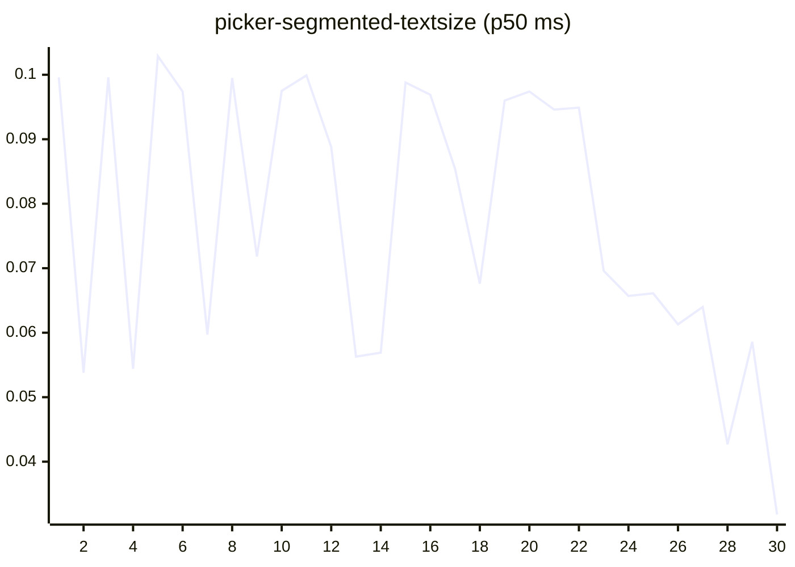
```mermaid
xychart-beta
    title "picker-segmented-textsize (p50 ms)"
    x-axis 1 --> 30
    line [0.0996, 0.0538, 0.0996, 0.0544, 0.1029, 0.0974, 0.0597, 0.0995, 0.0718, 0.0975, 0.0999, 0.0888, 0.0563, 0.0569, 0.0988, 0.0969, 0.0854, 0.0676, 0.0960, 0.0974, 0.0946, 0.0949, 0.0696, 0.0657, 0.0661, 0.0613, 0.0640, 0.0427, 0.0586, 0.0318]
```

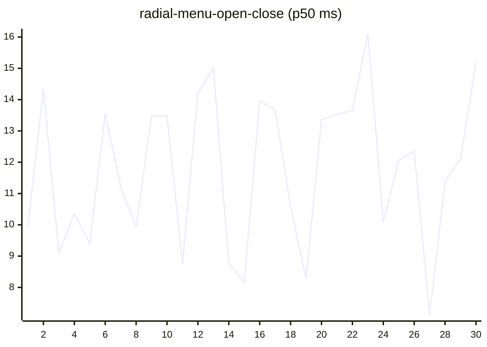
```mermaid
xychart-beta
    title "radial-menu-open-close (p50 ms)"
    x-axis 1 --> 30
    line [9.9631, 14.3516, 9.0969, 10.3580, 9.4040, 13.5562, 11.2086, 9.9173, 13.4886, 13.4731, 8.7442, 14.2081, 15.0064, 8.7734, 8.1647, 13.9647, 13.6671, 10.5695, 8.2821, 13.3516, 13.5281, 13.6578, 16.0867, 10.0812, 12.0610, 12.3566, 7.1223, 11.3851, 12.1177, 15.1793]
```

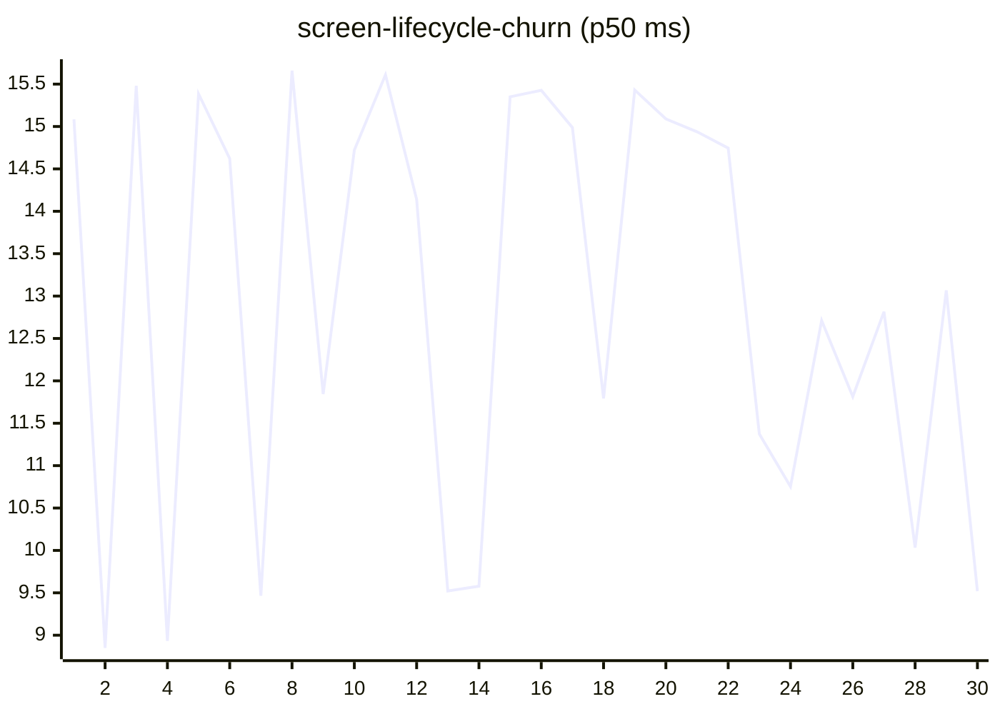
```mermaid
xychart-beta
    title "screen-lifecycle-churn (p50 ms)"
    x-axis 1 --> 30
    line [15.0845, 8.8497, 15.4803, 8.9330, 15.3846, 14.6222, 9.4657, 15.6595, 11.8442, 14.7213, 15.6094, 14.1404, 9.5225, 9.5780, 15.3495, 15.4269, 14.9874, 11.7933, 15.4305, 15.0900, 14.9376, 14.7456, 11.3734, 10.7529, 12.7109, 11.8139, 12.8153, 10.0331, 13.0666, 9.5193]
```

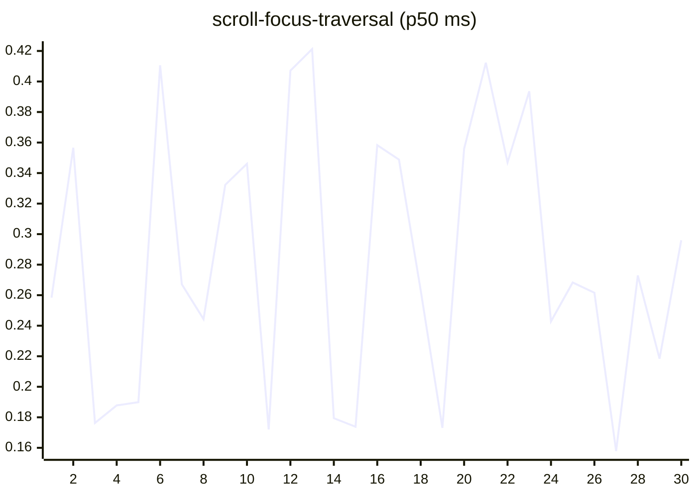
```mermaid
xychart-beta
    title "scroll-focus-traversal (p50 ms)"
    x-axis 1 --> 30
    line [0.2584, 0.3566, 0.1763, 0.1878, 0.1899, 0.4106, 0.2671, 0.2443, 0.3323, 0.3461, 0.1720, 0.4071, 0.4212, 0.1794, 0.1738, 0.3583, 0.3488, 0.2632, 0.1731, 0.3559, 0.4123, 0.3470, 0.3936, 0.2428, 0.2683, 0.2616, 0.1579, 0.2729, 0.2184, 0.2960]
```

```mermaid
xychart-beta
    title "settings-churn (p50 ms)"
    x-axis 1 --> 30
    line [3.9373, 2.2758, 4.0720, 2.3180, 3.9370, 3.8504, 2.4242, 4.0029, 2.9213, 3.9101, 3.9346, 3.5400, 2.4981, 2.4112, 3.9313, 3.9827, 3.6842, 2.9600, 3.9402, 3.9037, 3.8852, 3.8874, 2.8980, 2.7917, 3.2181, 2.9077, 3.2308, 2.5393, 3.2901, 2.2059]
```

```mermaid
xychart-beta
    title "shadow-storm (p50 ms)"
    x-axis 1 --> 30
    line [0.0006, 0.0006, 0.0007, 0.0003, 0.0003, 0.0006, 0.0003, 0.0005, 0.0003, 0.0005, 0.0006, 0.0006, 0.0003, 0.0006, 0.0006, 0.0004, 0.0003, 0.0005, 0.0006, 0.0003, 0.0003, 0.0005, 0.0005, 0.0006, 0.0004, 0.0005, 0.0003, 0.0005, 0.0003, 0.0004]
```

```mermaid
xychart-beta
    title "stylesheet-state-churn (p50 ms)"
    x-axis 1 --> 30
    line [0.4287, 0.4552, 0.4064, 0.2532, 0.2627, 0.4348, 0.2567, 0.3253, 0.2482, 0.3268, 0.4212, 0.4202, 0.2626, 0.4522, 0.4744, 0.2757, 0.2547, 0.3426, 0.4392, 0.2833, 0.2439, 0.3783, 0.3392, 0.4331, 0.2382, 0.3305, 0.1701, 0.2238, 0.1527, 0.2148]
```

```mermaid
xychart-beta
    title "theme-swap-assets (p50 ms)"
    x-axis 1 --> 30
    line [1.4540, 2.0397, 1.1850, 1.2793, 1.1733, 1.8976, 1.6482, 1.4574, 1.9094, 1.9024, 1.1643, 1.7819, 2.1619, 1.1552, 1.0581, 1.8573, 1.8118, 1.4261, 1.0897, 1.8006, 1.8292, 1.8218, 2.7585, 1.4082, 1.4948, 1.4915, 0.8245, 1.1146, 1.1402, 1.4339]
```

```mermaid
xychart-beta
    title "theme-swap-flat (p50 ms)"
    x-axis 1 --> 30
    line [0.3316, 0.4379, 0.2589, 0.2616, 0.2540, 0.4218, 0.3054, 0.2676, 0.3624, 0.4218, 0.2436, 0.4311, 0.4464, 0.2540, 0.2314, 0.4388, 0.4372, 0.3396, 0.2353, 0.3878, 0.4400, 0.4400, 0.4800, 0.3351, 0.3875, 0.3811, 0.2143, 0.2821, 0.3083, 0.3627]
```

```mermaid
xychart-beta
    title "theme-swap-metrics (p50 ms)"
    x-axis 1 --> 30
    line [1.7671, 1.8831, 1.8236, 1.1007, 1.1142, 1.7425, 1.1116, 1.4099, 1.1021, 1.4421, 1.7457, 1.7623, 1.0742, 1.8376, 2.1766, 1.3874, 1.1282, 1.5453, 1.8023, 1.1545, 1.0747, 1.5747, 1.4993, 1.8069, 1.0357, 1.2674, 0.7227, 1.1037, 0.8157, 1.1826]
```

```mermaid
xychart-beta
    title "virtual-list-scroll (p50 ms)"
    x-axis 1 --> 30
    line [0.2004, 0.1915, 0.1452, 0.1766, 0.1937, 0.1545, 0.1192, 0.1725, 0.1146, 0.1237, 0.1937, 0.1328, 0.1149, 0.2387, 0.2094, 0.1951, 0.1690, 0.1968, 0.1330, 0.1860, 0.1610, 0.1608, 0.1380, 0.1069, 0.1039, 0.0963, 0.1546, 0.0862, 0.0915, 0.0898]
```
