# Facet performance

Latest: `4e8bf23126218560833a68890bae99cf2236cf33` on 2026-10-26T215818Z, measured on the CI Ubuntu runner by the paired performance shards.
Times are milliseconds per frame or operation: the median over paired rounds of each round's p50 and p95.
Retained heap is the scene's mounted retained Luau heap. Change compares the p50 of the previous main commit.

| Scene | p50 ms | p95 ms | Retained KiB | Change |
| --- | ---: | ---: | ---: | ---: |
| adaptive-navigation-images | 1.3336 | 1.6099 | 4171 | +62.6% |
| alert-present-dismiss | 3.7906 | 5.4102 | 2432 | +10.5% |
| animation-interruption | 0.0394 | 0.0490 | 396 | +8.0% |
| async-image-burst | 0.0454 | 0.0539 | 526 | -1.1% |
| async-image-grid | 2.7059 | 4.1746 | 1621 | +14.4% |
| collection-mutation | 0.4821 | 0.6548 | 3938 | +18.9% |
| control-motion | 0.2532 | 0.6143 | 1887 | +61.1% |
| dense-hud | 0.1972 | 0.2198 | 822 | +8.0% |
| dense-motion | 1.5809 | 2.5764 | 1425 | +11.3% |
| hud-binding-storm | 0.2611 | 0.2817 | 487 | -7.6% |
| lab-collection-churn | 0.4154 | 0.7400 | 4578 | -1.5% |
| lab-dense-scroll | 0.9747 | 5.6927 | 7544 | +17.3% |
| locale-textsize-change | 0.0355 | 0.0410 | 504 | +83.1% |
| native-scroll-drag | 0.0583 | 0.0732 | 1935 | +39.8% |
| navigation-customization | 0.0663 | 0.0785 | 4680 | +7.6% |
| picker-menu-open-close | 6.6018 | 9.9587 | 1235 | +12.2% |
| picker-segmented-textsize | 0.0863 | 0.1008 | 1014 | +78.8% |
| radial-menu-open-close | 13.0462 | 21.0726 | 1320 | +1.5% |
| screen-lifecycle-churn | 14.8820 | 24.0070 | 1277 | +45.8% |
| scroll-focus-traversal | 0.4176 | 0.6036 | 1371 | +31.5% |
| settings-churn | 3.7464 | 5.7510 | 1957 | +57.3% |
| shadow-storm | 0.0006 | 0.0016 | 1985 | +6.4% |
| stylesheet-state-churn | 0.4491 | 0.7672 | 3199 | +22.0% |
| theme-swap-assets | 2.1422 | 2.5329 | 5126 | -0.6% |
| theme-swap-flat | 0.5122 | 0.6065 | 4425 | +12.8% |
| theme-swap-metrics | 1.7453 | 2.0428 | 4952 | +7.7% |
| virtual-list-scroll | 0.2003 | 0.4375 | 5737 | +4.5% |

| Microbenchmark | p50 ms | p95 ms | Change |
| --- | ---: | ---: | ---: |
| billboard-nameplate-storm | 0.1731 | 0.1987 | -6.5% |
| collection-mutation | 0.0085 | 0.0114 | +49.7% |
| collection-selection-update | 0.0031 | 0.0048 | +6.8% |
| hud-binding-storm | 0.3481 | 0.3630 | +8.0% |
| motion-declarative | 1.2410 | 1.9197 | -0.0% |
| motion-explicit | 1.1933 | 1.7881 | +51.9% |
| mount-ramp | 148.6360 | 162.5953 | +2.3% |
| mount-ramp-inherited | 163.1535 | 179.0443 | +10.6% |
| mounted-slice-update-storm | 0.2469 | 0.2893 | -7.5% |
| outline-measured-update | 1.9262 | 2.9623 | +54.2% |
| reserved-slot-record-update | 0.8639 | 1.3030 | +17.8% |
| settings-churn | 0.0162 | 0.0183 | +12.8% |
| sparse-update-under-load | 0.0024 | 0.0025 | -7.6% |
| table-mutation | 0.4333 | 0.5115 | +64.7% |
| table-resize-drag | 3.3314 | 5.4100 | +6.6% |
| table-sort-values | 1.3829 | 1.9527 | +5.9% |
| table-source-refresh | 0.2598 | 0.4265 | +10.5% |
| textinput-typing-storm | 0.2548 | 0.3828 | +62.7% |
| timer-readout-storm | 0.1623 | 2.4850 | +9.9% |
| zz-yardstick-cpu-after | 1.3047 | 1.3424 | +1.3% |
| zz-yardstick-cpu-before | 1.2966 | 1.3080 | +0.9% |

## Scene p50 over the last 10 main commits

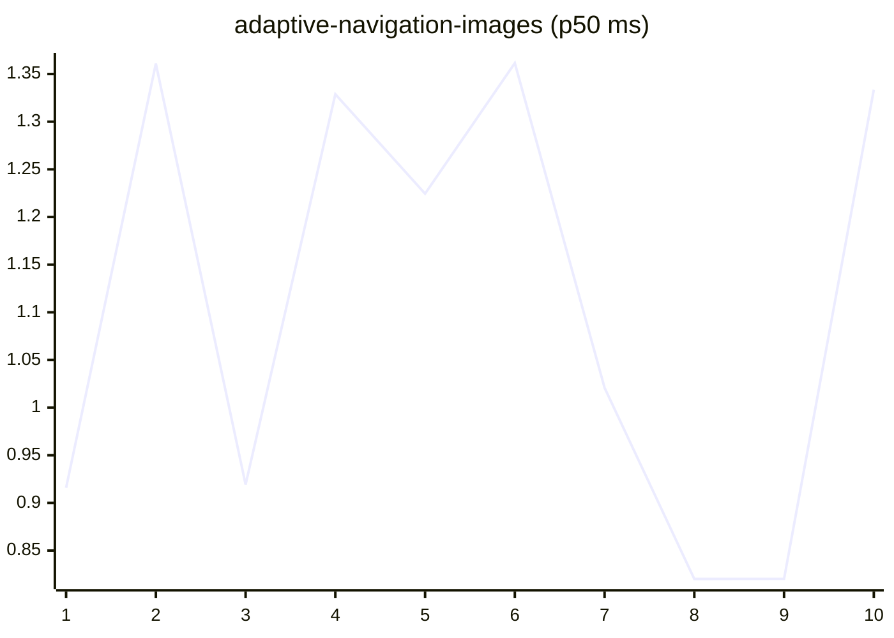
```mermaid
xychart-beta
    title "adaptive-navigation-images (p50 ms)"
    x-axis 1 --> 10
    line [0.9159, 1.3609, 0.9193, 1.3288, 1.2245, 1.3615, 1.0208, 0.8202, 0.8203, 1.3336]
```

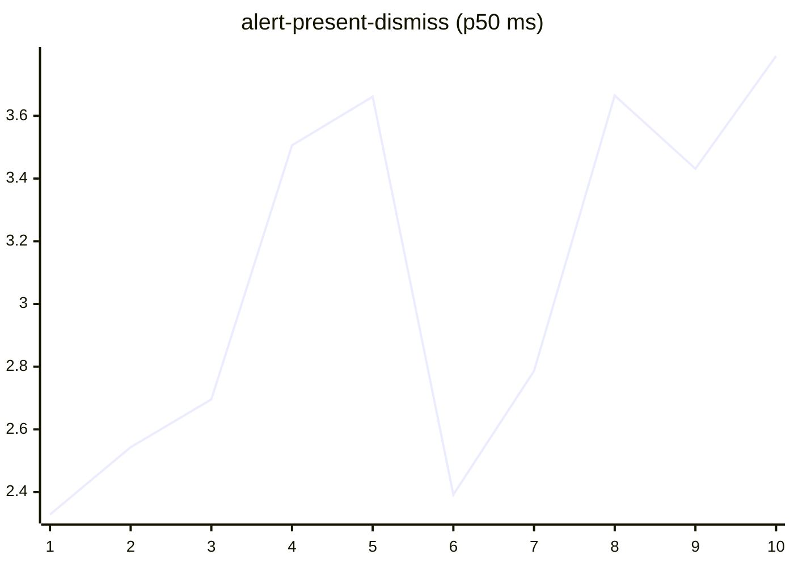
```mermaid
xychart-beta
    title "alert-present-dismiss (p50 ms)"
    x-axis 1 --> 10
    line [2.3284, 2.5432, 2.6957, 3.5058, 3.6611, 2.3918, 2.7865, 3.6648, 3.4312, 3.7906]
```

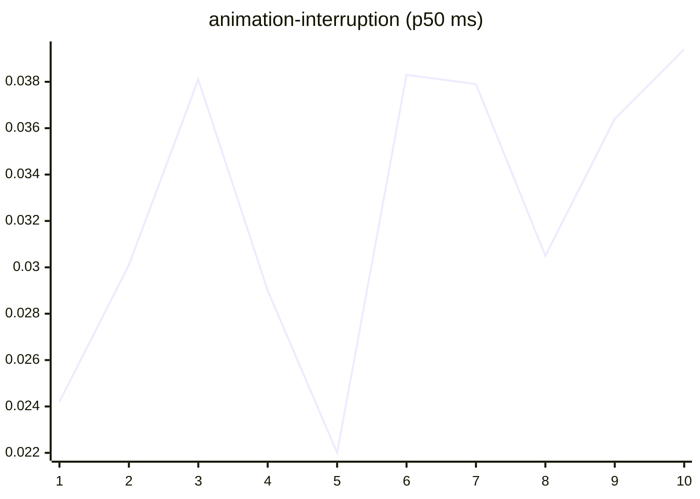
```mermaid
xychart-beta
    title "animation-interruption (p50 ms)"
    x-axis 1 --> 10
    line [0.0242, 0.0301, 0.0381, 0.0290, 0.0220, 0.0383, 0.0379, 0.0305, 0.0364, 0.0394]
```

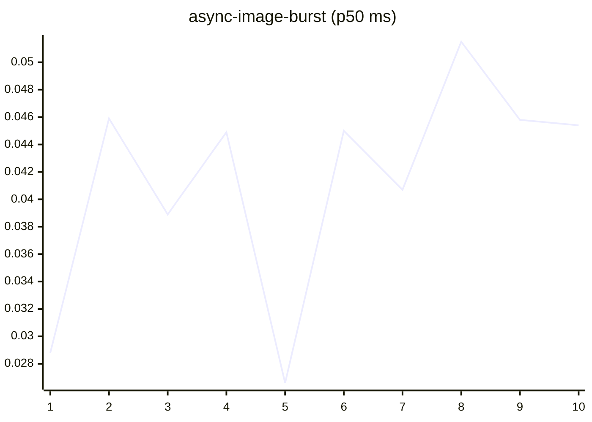
```mermaid
xychart-beta
    title "async-image-burst (p50 ms)"
    x-axis 1 --> 10
    line [0.0288, 0.0459, 0.0389, 0.0449, 0.0266, 0.0450, 0.0407, 0.0515, 0.0458, 0.0454]
```

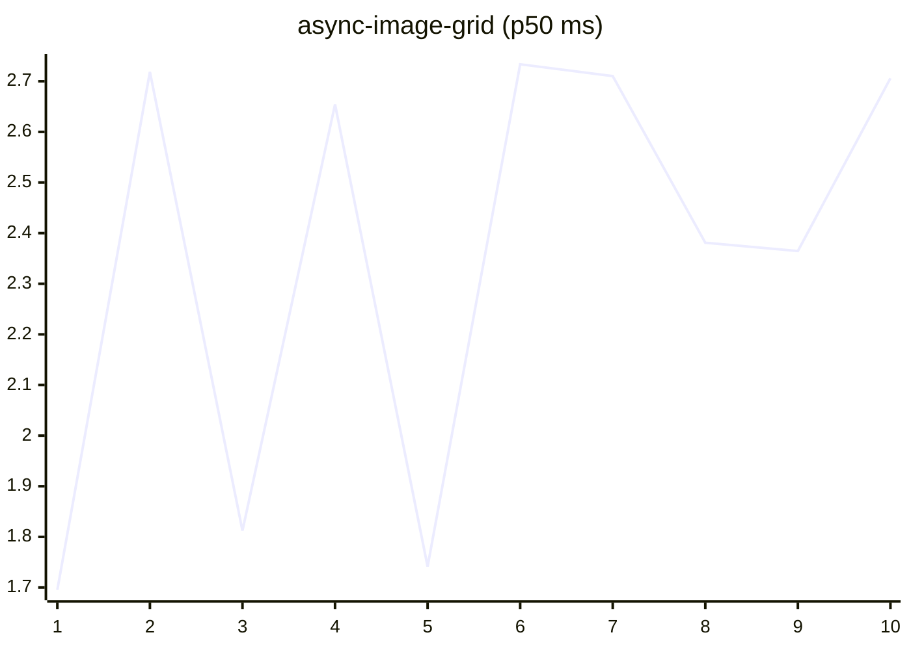
```mermaid
xychart-beta
    title "async-image-grid (p50 ms)"
    x-axis 1 --> 10
    line [1.6953, 2.7184, 1.8124, 2.6543, 1.7415, 2.7336, 2.7103, 2.3810, 2.3646, 2.7059]
```

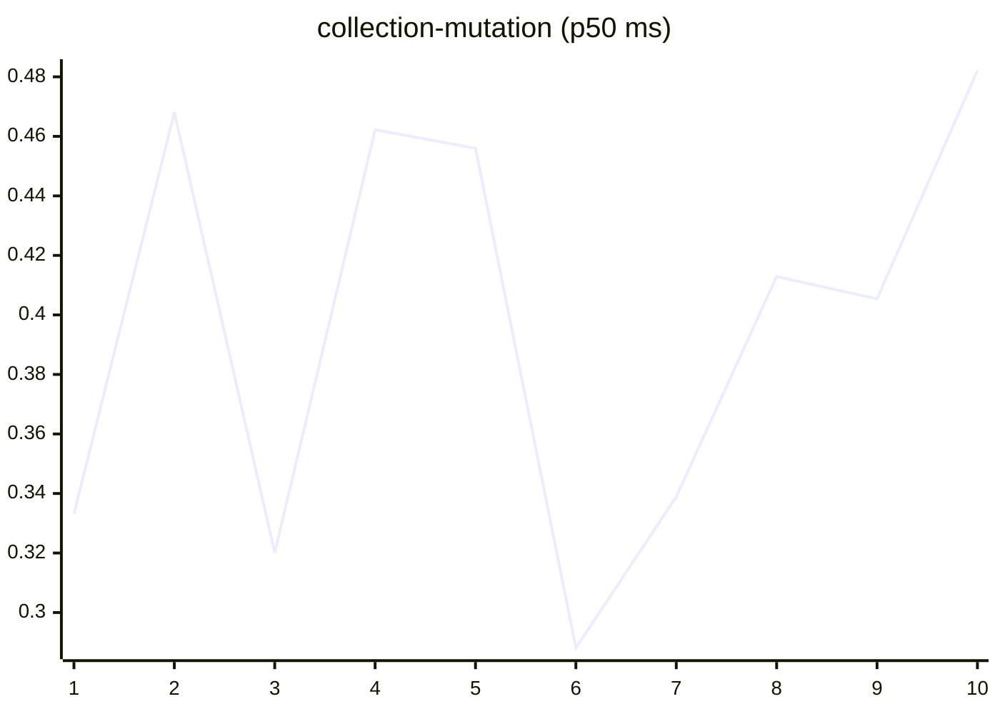
```mermaid
xychart-beta
    title "collection-mutation (p50 ms)"
    x-axis 1 --> 10
    line [0.3332, 0.4681, 0.3201, 0.4622, 0.4560, 0.2881, 0.3389, 0.4129, 0.4054, 0.4821]
```

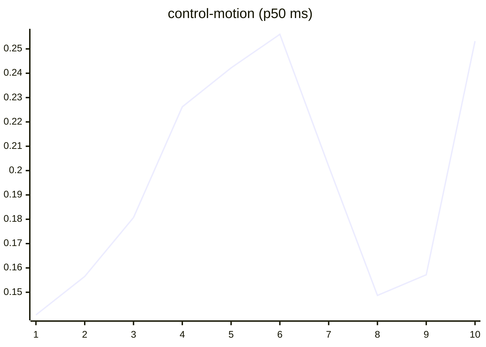
```mermaid
xychart-beta
    title "control-motion (p50 ms)"
    x-axis 1 --> 10
    line [0.1407, 0.1565, 0.1807, 0.2262, 0.2422, 0.2560, 0.2018, 0.1487, 0.1572, 0.2532]
```

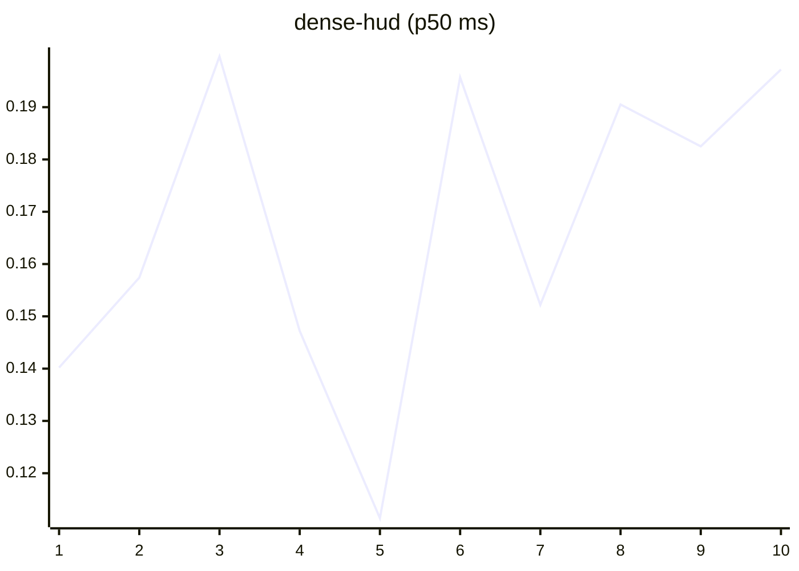
```mermaid
xychart-beta
    title "dense-hud (p50 ms)"
    x-axis 1 --> 10
    line [0.1402, 0.1574, 0.1997, 0.1472, 0.1114, 0.1957, 0.1522, 0.1905, 0.1825, 0.1972]
```

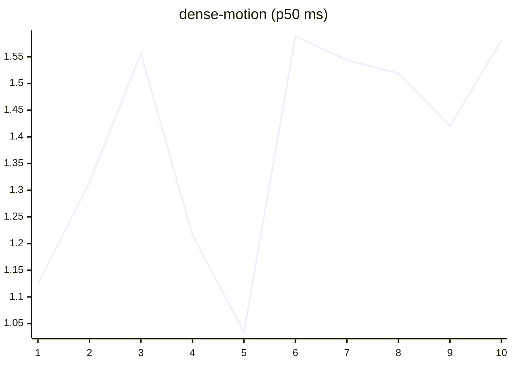
```mermaid
xychart-beta
    title "dense-motion (p50 ms)"
    x-axis 1 --> 10
    line [1.1243, 1.3144, 1.5562, 1.2159, 1.0340, 1.5887, 1.5438, 1.5193, 1.4201, 1.5809]
```

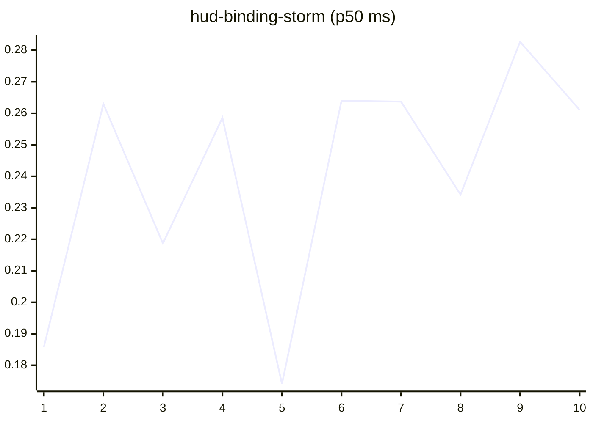
```mermaid
xychart-beta
    title "hud-binding-storm (p50 ms)"
    x-axis 1 --> 10
    line [0.1858, 0.2630, 0.2187, 0.2586, 0.1741, 0.2640, 0.2637, 0.2342, 0.2827, 0.2611]
```

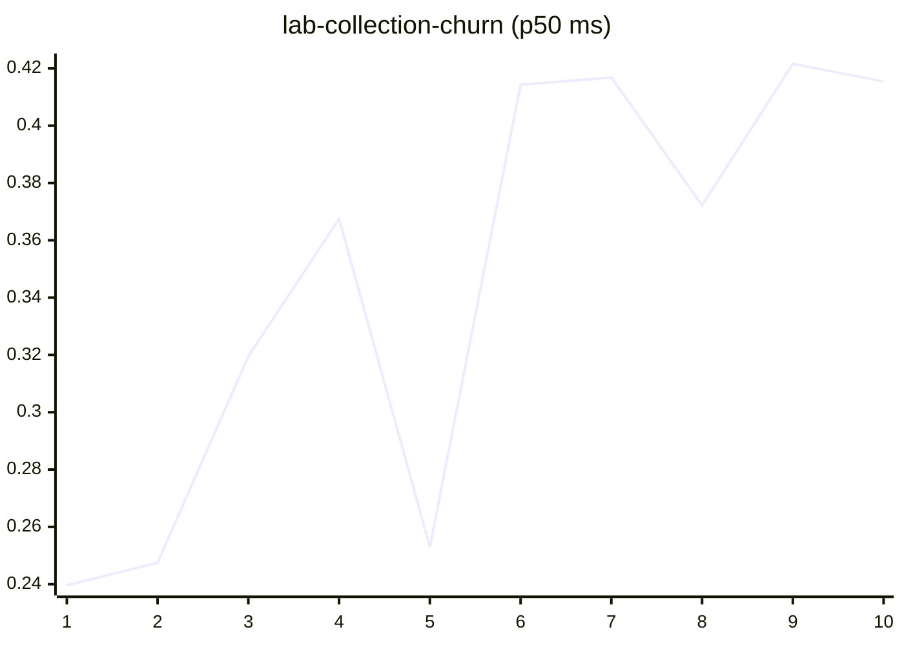
```mermaid
xychart-beta
    title "lab-collection-churn (p50 ms)"
    x-axis 1 --> 10
    line [0.2396, 0.2475, 0.3195, 0.3675, 0.2530, 0.4143, 0.4168, 0.3722, 0.4216, 0.4154]
```

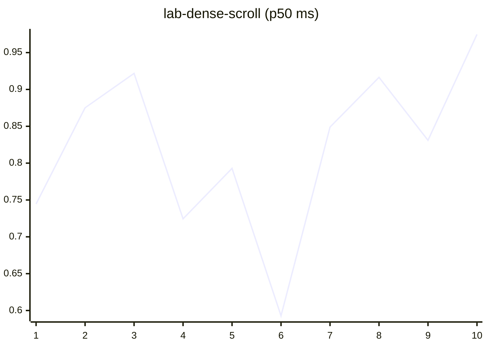
```mermaid
xychart-beta
    title "lab-dense-scroll (p50 ms)"
    x-axis 1 --> 10
    line [0.7446, 0.8751, 0.9218, 0.7244, 0.7929, 0.5928, 0.8489, 0.9164, 0.8310, 0.9747]
```

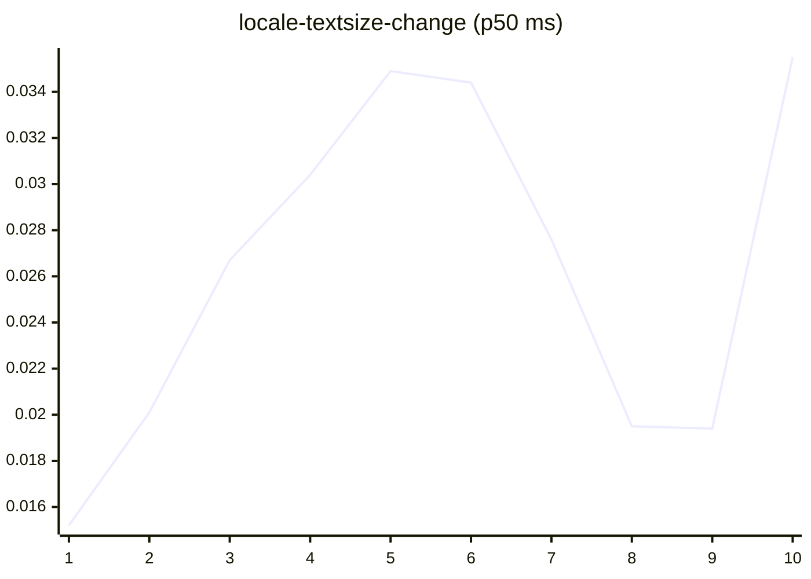
```mermaid
xychart-beta
    title "locale-textsize-change (p50 ms)"
    x-axis 1 --> 10
    line [0.0152, 0.0201, 0.0267, 0.0304, 0.0349, 0.0344, 0.0276, 0.0195, 0.0194, 0.0355]
```

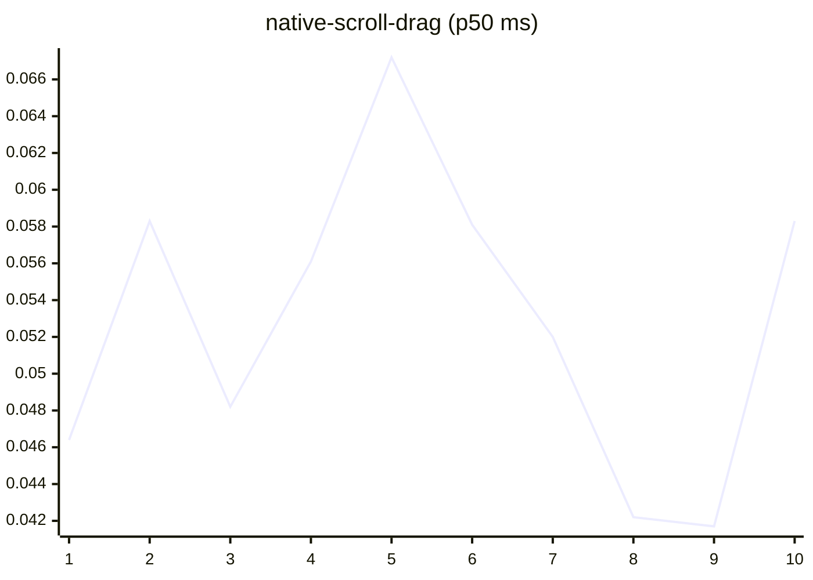
```mermaid
xychart-beta
    title "native-scroll-drag (p50 ms)"
    x-axis 1 --> 10
    line [0.0464, 0.0583, 0.0482, 0.0561, 0.0672, 0.0581, 0.0520, 0.0422, 0.0417, 0.0583]
```

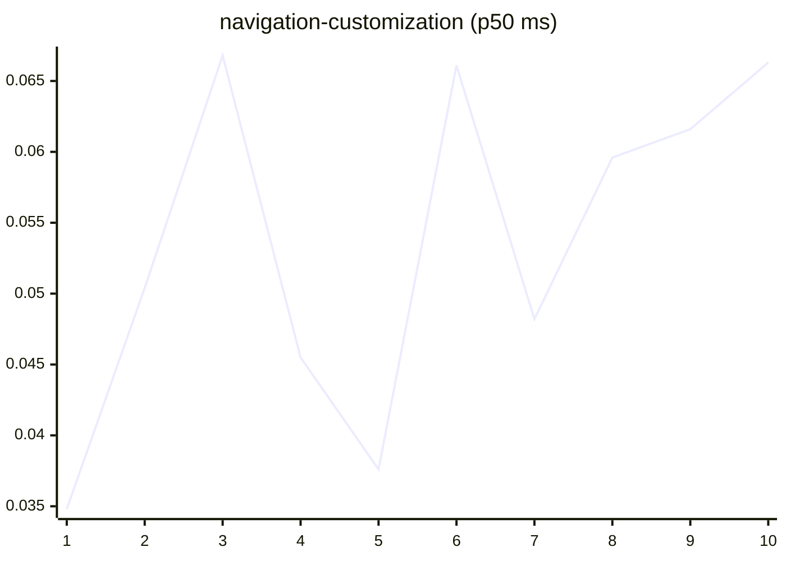
```mermaid
xychart-beta
    title "navigation-customization (p50 ms)"
    x-axis 1 --> 10
    line [0.0348, 0.0504, 0.0668, 0.0455, 0.0376, 0.0661, 0.0482, 0.0596, 0.0616, 0.0663]
```

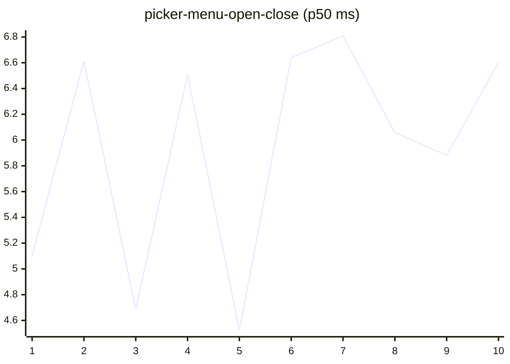
```mermaid
xychart-beta
    title "picker-menu-open-close (p50 ms)"
    x-axis 1 --> 10
    line [5.1020, 6.6154, 4.6873, 6.5076, 4.5232, 6.6400, 6.8077, 6.0581, 5.8829, 6.6018]
```

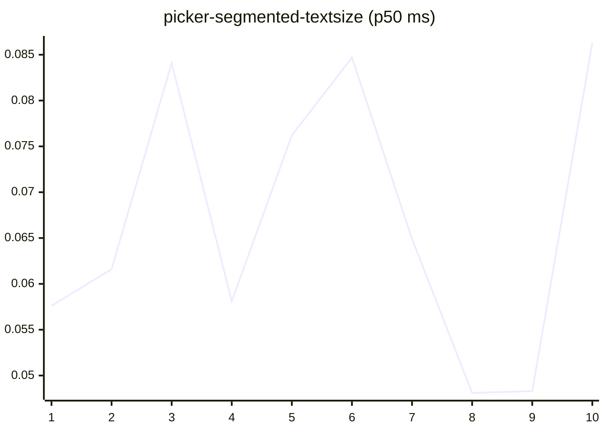
```mermaid
xychart-beta
    title "picker-segmented-textsize (p50 ms)"
    x-axis 1 --> 10
    line [0.0576, 0.0616, 0.0841, 0.0581, 0.0762, 0.0847, 0.0649, 0.0481, 0.0483, 0.0863]
```

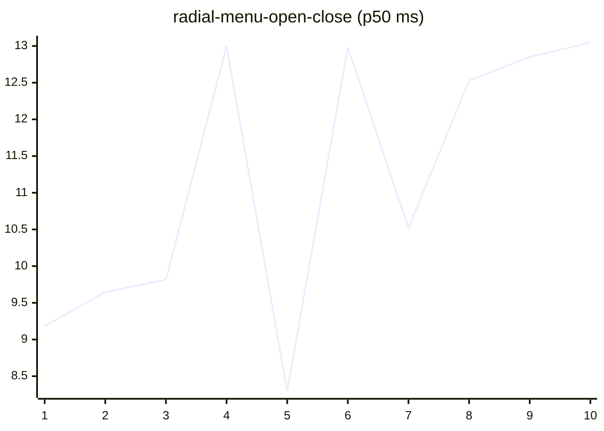
```mermaid
xychart-beta
    title "radial-menu-open-close (p50 ms)"
    x-axis 1 --> 10
    line [9.1824, 9.6461, 9.8160, 12.9977, 8.2964, 12.9826, 10.5207, 12.5300, 12.8509, 13.0462]
```

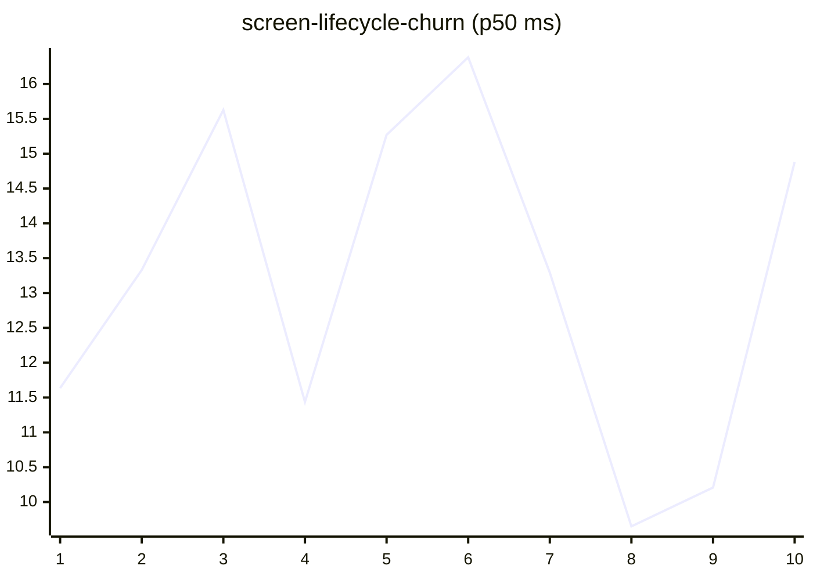
```mermaid
xychart-beta
    title "screen-lifecycle-churn (p50 ms)"
    x-axis 1 --> 10
    line [11.6362, 13.3303, 15.6277, 11.4367, 15.2702, 16.3829, 13.2931, 9.6509, 10.2078, 14.8820]
```

```mermaid
xychart-beta
    title "scroll-focus-traversal (p50 ms)"
    x-axis 1 --> 10
    line [0.1893, 0.1954, 0.2948, 0.3595, 0.2060, 0.4169, 0.3006, 0.3878, 0.3175, 0.4176]
```

```mermaid
xychart-beta
    title "settings-churn (p50 ms)"
    x-axis 1 --> 10
    line [2.4831, 3.3595, 3.8546, 2.7052, 3.5707, 4.0222, 3.0879, 2.4259, 2.3824, 3.7464]
```

```mermaid
xychart-beta
    title "shadow-storm (p50 ms)"
    x-axis 1 --> 10
    line [0.0005, 0.0005, 0.0006, 0.0005, 0.0006, 0.0003, 0.0005, 0.0005, 0.0005, 0.0006]
```

```mermaid
xychart-beta
    title "stylesheet-state-churn (p50 ms)"
    x-axis 1 --> 10
    line [0.2123, 0.2752, 0.3220, 0.3838, 0.4071, 0.2450, 0.3266, 0.3849, 0.3681, 0.4491]
```

```mermaid
xychart-beta
    title "theme-swap-assets (p50 ms)"
    x-axis 1 --> 10
    line [1.5921, 2.1494, 1.6336, 2.1480, 1.2452, 2.1218, 1.7008, 2.1645, 2.1562, 2.1422]
```

```mermaid
xychart-beta
    title "theme-swap-flat (p50 ms)"
    x-axis 1 --> 10
    line [0.3449, 0.3183, 0.4072, 0.4900, 0.2916, 0.5121, 0.4100, 0.5278, 0.4539, 0.5122]
```

```mermaid
xychart-beta
    title "theme-swap-metrics (p50 ms)"
    x-axis 1 --> 10
    line [1.2519, 1.6733, 1.3190, 1.6705, 1.6681, 1.0387, 1.3725, 1.6779, 1.6201, 1.7453]
```

```mermaid
xychart-beta
    title "virtual-list-scroll (p50 ms)"
    x-axis 1 --> 10
    line [0.1263, 0.1363, 0.1356, 0.1842, 0.1329, 0.2108, 0.2004, 0.1771, 0.1917, 0.2003]
```
