# Facet performance

Latest: `e680d0e8708986716e21b7c288c8301e5f8e5fe2` on 2026-10-29T222203Z, measured on the CI Ubuntu runner by the paired performance shards.
Times are milliseconds per frame or operation: the median over paired rounds of each round's p50 and p95.
Retained heap is the scene's mounted retained Luau heap. Change compares the p50 of the previous main commit.

| Scene | p50 ms | p95 ms | Retained KiB | Change |
| --- | ---: | ---: | ---: | ---: |
| adaptive-navigation-images | 1.3659 | 1.7336 | 3564 | +62.6% |
| alert-present-dismiss | 4.0447 | 6.7846 | 2366 | +7.4% |
| animation-interruption | 0.0384 | 0.0473 | 409 | +6.3% |
| async-image-burst | 0.0304 | 0.0363 | 525 | -10.8% |
| async-image-grid | 2.8523 | 3.9790 | 3351 | +2.4% |
| collection-mutation | 0.4185 | 0.6187 | 3803 | +3.5% |
| control-motion | 0.2735 | 0.6847 | 1847 | +74.8% |
| dense-hud | 0.1168 | 0.1269 | 822 | -7.7% |
| dense-motion | 1.2553 | 1.8193 | 2271 | -0.5% |
| hud-binding-storm | 0.2692 | 0.3373 | 490 | -1.2% |
| lab-collection-churn | 0.4279 | 0.7155 | 4285 | +0.0% |
| lab-dense-scroll | 1.1273 | 6.3379 | 6513 | +21.2% |
| locale-textsize-change | 0.0389 | 0.0501 | 545 | +66.9% |
| native-scroll-drag | 0.0611 | 0.0773 | 1596 | +56.9% |
| navigation-customization | 0.0444 | 0.0522 | 3948 | -8.1% |
| picker-menu-open-close | 6.0683 | 8.7398 | 1972 | -5.0% |
| picker-segmented-textsize | 0.0988 | 0.1164 | 970 | +73.8% |
| radial-menu-open-close | 8.1647 | 14.6314 | 1359 | -6.9% |
| screen-lifecycle-churn | 15.3495 | 26.1279 | 3221 | +60.3% |
| scroll-focus-traversal | 0.1738 | 0.3717 | 1244 | -3.1% |
| settings-churn | 3.9313 | 6.0934 | 3108 | +63.0% |
| shadow-storm | 0.0006 | 0.0016 | 1999 | +0.0% |
| stylesheet-state-churn | 0.4744 | 0.8358 | 3057 | +4.9% |
| theme-swap-assets | 1.0581 | 1.4679 | 5441 | -8.4% |
| theme-swap-flat | 0.2314 | 0.3329 | 4197 | -8.9% |
| theme-swap-metrics | 2.1766 | 2.8192 | 4904 | +18.4% |
| virtual-list-scroll | 0.2094 | 0.3836 | 5357 | -12.3% |

| Microbenchmark | p50 ms | p95 ms | Change |
| --- | ---: | ---: | ---: |
| billboard-nameplate-storm | 0.1831 | 0.2336 | +0.4% |
| collection-mutation | 0.0087 | 0.0119 | +48.2% |
| collection-selection-update | 0.0014 | 0.0028 | -5.9% |
| hud-binding-storm | 0.3892 | 0.4091 | +0.1% |
| motion-declarative | 1.2147 | 1.8916 | -2.4% |
| motion-explicit | 1.2400 | 2.0427 | +57.2% |
| mount-ramp | 94.0020 | 107.8091 | -12.0% |
| mount-ramp-inherited | 200.9349 | 220.7009 | +16.8% |
| mounted-slice-update-storm | 0.2350 | 0.2854 | -0.8% |
| outline-measured-update | 1.6703 | 2.4315 | +61.6% |
| reserved-slot-record-update | 0.5212 | 1.2159 | -7.3% |
| settings-churn | 0.0175 | 0.0186 | +2.9% |
| sparse-update-under-load | 0.0026 | 0.0031 | +0.4% |
| table-mutation | 0.3524 | 0.4833 | +61.1% |
| table-resize-drag | 1.8920 | 3.4828 | -9.9% |
| table-sort-values | 1.3350 | 2.0333 | +1.9% |
| table-source-refresh | 0.2613 | 0.3729 | -2.3% |
| textinput-typing-storm | 0.2797 | 0.4446 | +67.7% |
| timer-readout-storm | 0.0896 | 0.5242 | -11.2% |
| zz-yardstick-cpu-after | 1.3214 | 1.3504 | +65.4% |
| zz-yardstick-cpu-before | 1.2906 | 1.2998 | +60.2% |

## Scene p50 over the last 30 main commits

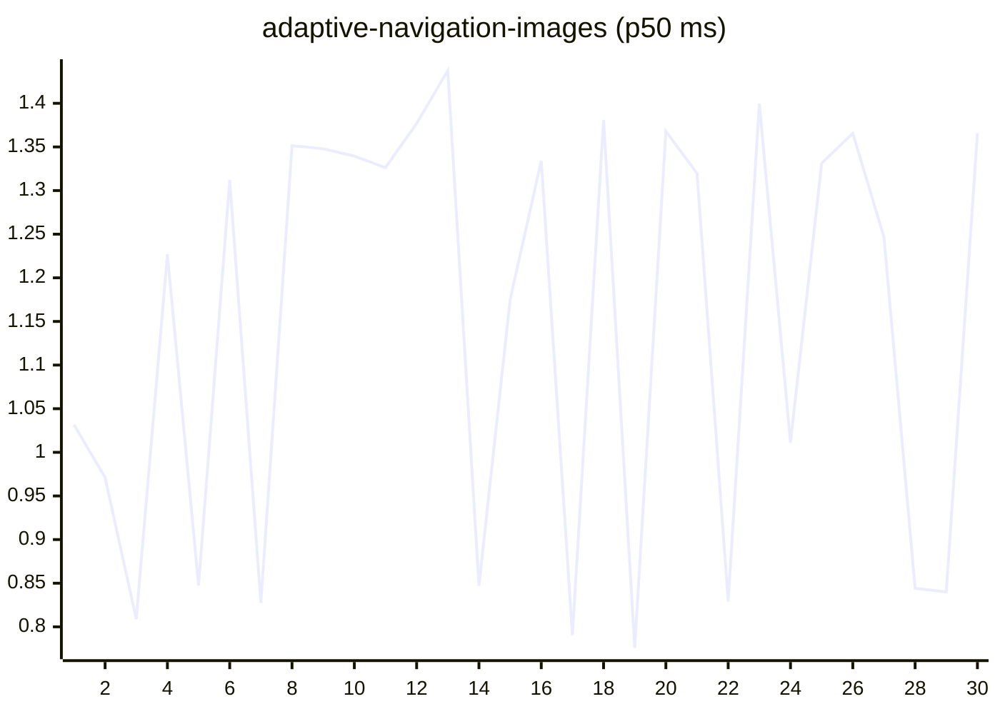
```mermaid
xychart-beta
    title "adaptive-navigation-images (p50 ms)"
    x-axis 1 --> 30
    line [1.0317, 0.9711, 0.8088, 1.2271, 0.8473, 1.3121, 0.8274, 1.3515, 1.3479, 1.3395, 1.3263, 1.3769, 1.4375, 0.8471, 1.1748, 1.3343, 0.7905, 1.3810, 0.7758, 1.3680, 1.3197, 0.8291, 1.3996, 1.0110, 1.3313, 1.3656, 1.2466, 0.8441, 0.8400, 1.3659]
```

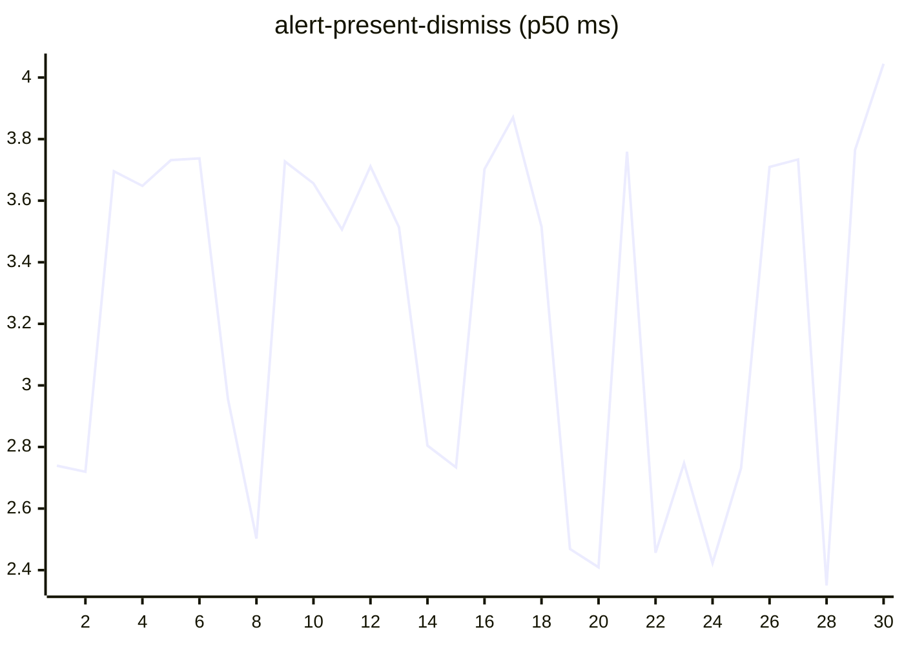
```mermaid
xychart-beta
    title "alert-present-dismiss (p50 ms)"
    x-axis 1 --> 30
    line [2.7393, 2.7195, 3.6955, 3.6480, 3.7318, 3.7373, 2.9562, 2.5024, 3.7273, 3.6562, 3.5064, 3.7112, 3.5136, 2.8044, 2.7337, 3.7022, 3.8703, 3.5157, 2.4688, 2.4093, 3.7592, 2.4564, 2.7475, 2.4232, 2.7312, 3.7096, 3.7340, 2.3506, 3.7650, 4.0447]
```

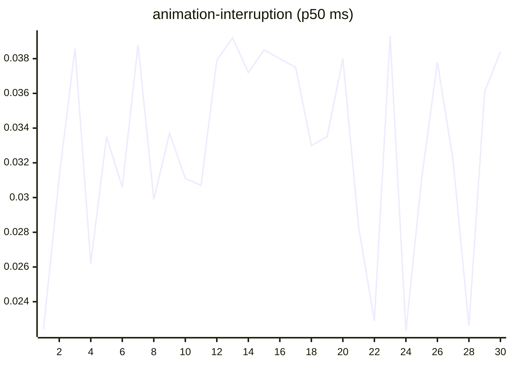
```mermaid
xychart-beta
    title "animation-interruption (p50 ms)"
    x-axis 1 --> 30
    line [0.0224, 0.0312, 0.0386, 0.0262, 0.0335, 0.0306, 0.0388, 0.0299, 0.0337, 0.0311, 0.0307, 0.0379, 0.0392, 0.0372, 0.0385, 0.0380, 0.0375, 0.0330, 0.0335, 0.0380, 0.0283, 0.0229, 0.0393, 0.0223, 0.0311, 0.0378, 0.0321, 0.0226, 0.0361, 0.0384]
```

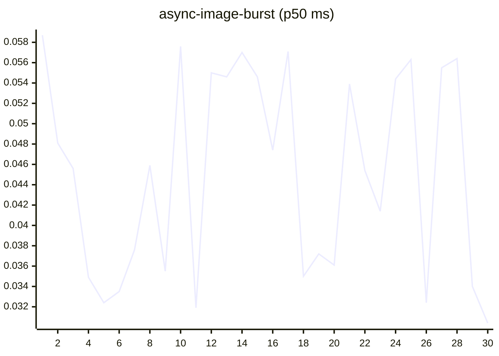
```mermaid
xychart-beta
    title "async-image-burst (p50 ms)"
    x-axis 1 --> 30
    line [0.0587, 0.0481, 0.0456, 0.0349, 0.0324, 0.0335, 0.0376, 0.0459, 0.0355, 0.0576, 0.0319, 0.0550, 0.0546, 0.0570, 0.0546, 0.0474, 0.0571, 0.0350, 0.0372, 0.0361, 0.0539, 0.0454, 0.0414, 0.0544, 0.0563, 0.0324, 0.0555, 0.0564, 0.0340, 0.0304]
```

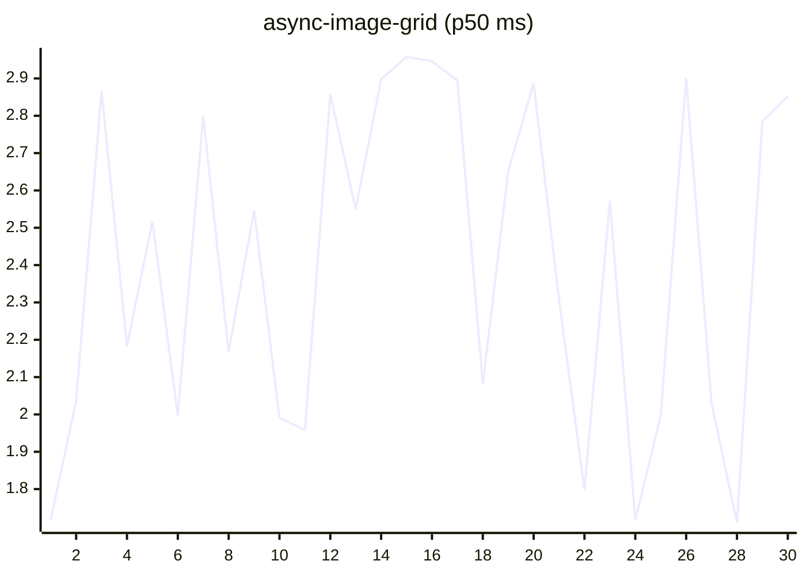
```mermaid
xychart-beta
    title "async-image-grid (p50 ms)"
    x-axis 1 --> 30
    line [1.7177, 2.0365, 2.8674, 2.1819, 2.5171, 1.9970, 2.7988, 2.1671, 2.5459, 1.9906, 1.9586, 2.8577, 2.5497, 2.8980, 2.9576, 2.9463, 2.8940, 2.0815, 2.6515, 2.8871, 2.3060, 1.7979, 2.5726, 1.7163, 1.9964, 2.9032, 2.0307, 1.7099, 2.7848, 2.8523]
```

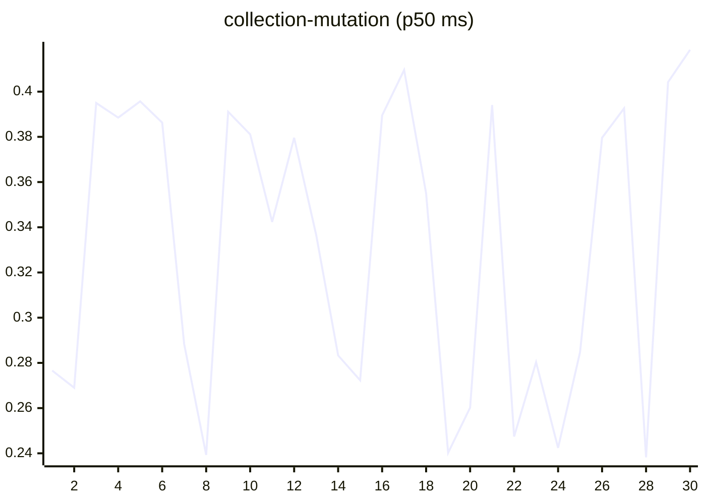
```mermaid
xychart-beta
    title "collection-mutation (p50 ms)"
    x-axis 1 --> 30
    line [0.2766, 0.2690, 0.3950, 0.3885, 0.3957, 0.3863, 0.2883, 0.2393, 0.3911, 0.3811, 0.3424, 0.3796, 0.3367, 0.2833, 0.2723, 0.3895, 0.4096, 0.3550, 0.2402, 0.2602, 0.3941, 0.2474, 0.2803, 0.2424, 0.2848, 0.3796, 0.3926, 0.2382, 0.4042, 0.4185]
```

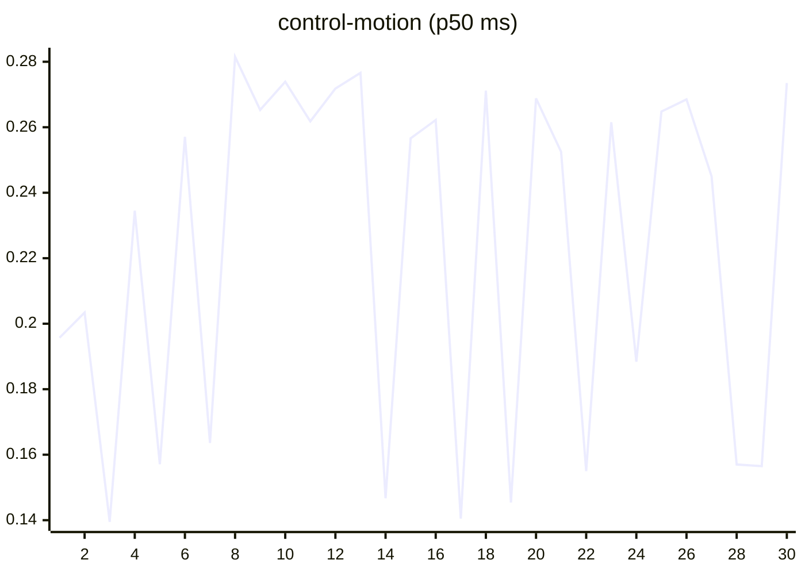
```mermaid
xychart-beta
    title "control-motion (p50 ms)"
    x-axis 1 --> 30
    line [0.1957, 0.2034, 0.1395, 0.2345, 0.1571, 0.2571, 0.1636, 0.2815, 0.2653, 0.2739, 0.2618, 0.2718, 0.2766, 0.1467, 0.2566, 0.2622, 0.1405, 0.2712, 0.1454, 0.2688, 0.2525, 0.1550, 0.2615, 0.1884, 0.2648, 0.2685, 0.2450, 0.1570, 0.1565, 0.2735]
```

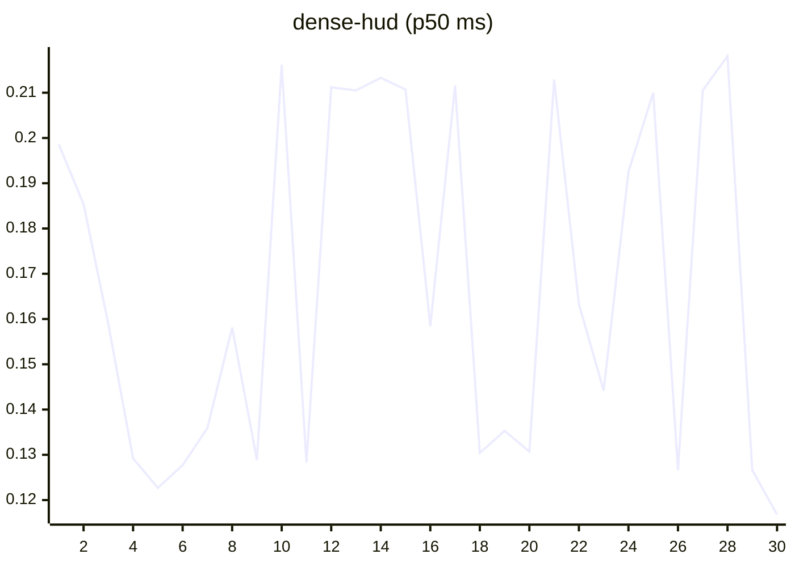
```mermaid
xychart-beta
    title "dense-hud (p50 ms)"
    x-axis 1 --> 30
    line [0.1986, 0.1854, 0.1589, 0.1292, 0.1227, 0.1277, 0.1359, 0.1581, 0.1288, 0.2162, 0.1283, 0.2112, 0.2105, 0.2133, 0.2107, 0.1584, 0.2116, 0.1304, 0.1353, 0.1307, 0.2129, 0.1633, 0.1442, 0.1925, 0.2100, 0.1266, 0.2105, 0.2181, 0.1266, 0.1168]
```

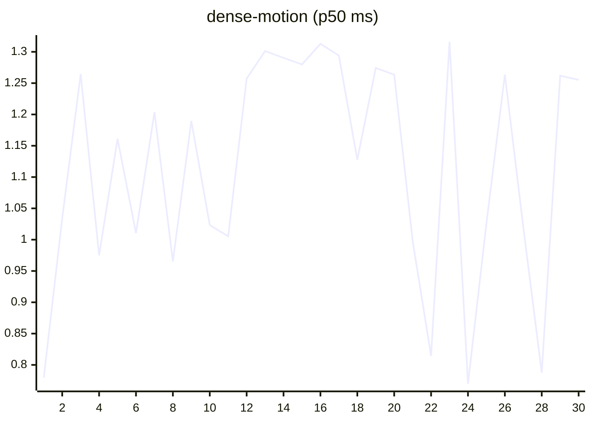
```mermaid
xychart-beta
    title "dense-motion (p50 ms)"
    x-axis 1 --> 30
    line [0.7796, 1.0341, 1.2646, 0.9749, 1.1610, 1.0105, 1.2037, 0.9653, 1.1895, 1.0233, 1.0054, 1.2572, 1.3012, 1.2904, 1.2798, 1.3128, 1.2940, 1.1276, 1.2742, 1.2636, 0.9981, 0.8144, 1.3160, 0.7697, 1.0258, 1.2636, 1.0200, 0.7874, 1.2619, 1.2553]
```

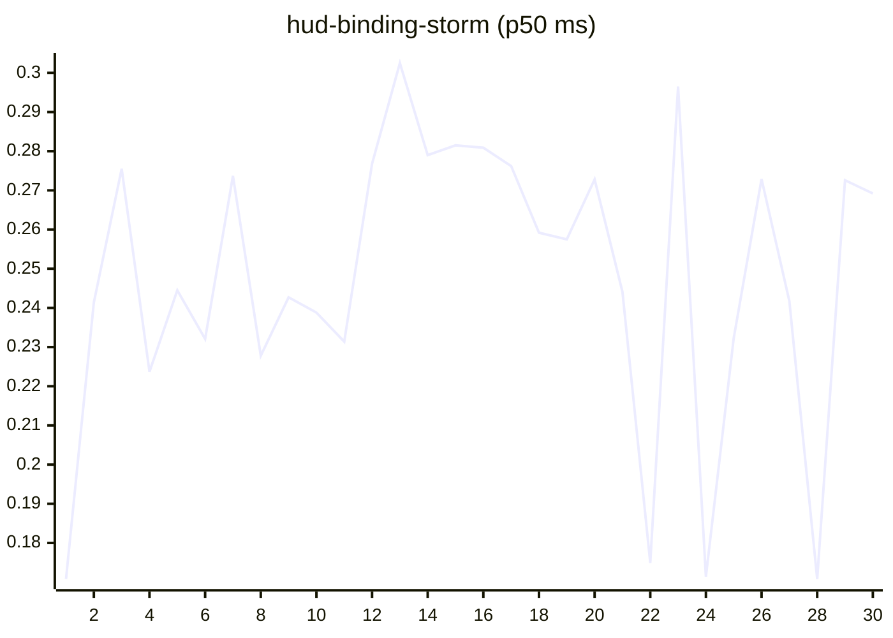
```mermaid
xychart-beta
    title "hud-binding-storm (p50 ms)"
    x-axis 1 --> 30
    line [0.1708, 0.2414, 0.2755, 0.2237, 0.2445, 0.2321, 0.2737, 0.2278, 0.2427, 0.2388, 0.2314, 0.2768, 0.3025, 0.2790, 0.2815, 0.2809, 0.2762, 0.2592, 0.2575, 0.2728, 0.2441, 0.1749, 0.2965, 0.1714, 0.2323, 0.2729, 0.2417, 0.1708, 0.2726, 0.2692]
```

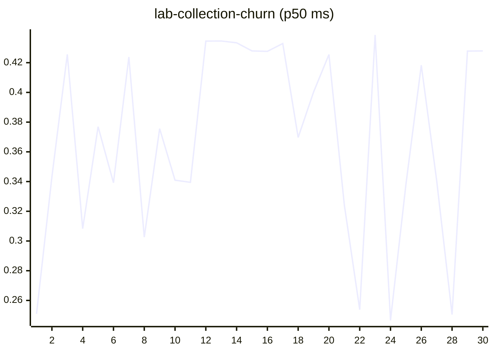
```mermaid
xychart-beta
    title "lab-collection-churn (p50 ms)"
    x-axis 1 --> 30
    line [0.2510, 0.3432, 0.4256, 0.3083, 0.3769, 0.3392, 0.4238, 0.3026, 0.3756, 0.3409, 0.3395, 0.4345, 0.4346, 0.4334, 0.4279, 0.4276, 0.4329, 0.3697, 0.4002, 0.4255, 0.3242, 0.2538, 0.4387, 0.2466, 0.3379, 0.4183, 0.3407, 0.2505, 0.4278, 0.4279]
```

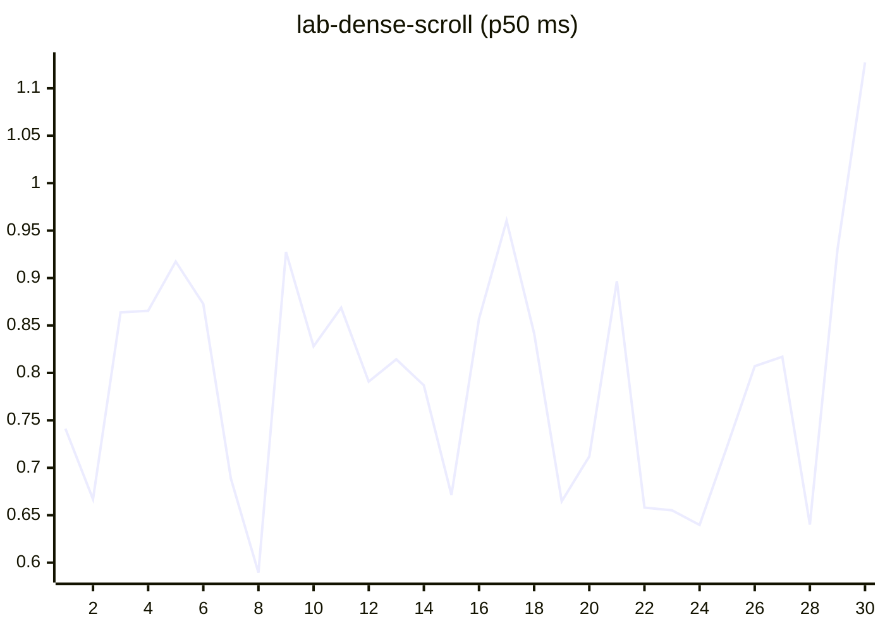
```mermaid
xychart-beta
    title "lab-dense-scroll (p50 ms)"
    x-axis 1 --> 30
    line [0.7412, 0.6669, 0.8638, 0.8655, 0.9174, 0.8727, 0.6887, 0.5895, 0.9275, 0.8280, 0.8687, 0.7908, 0.8143, 0.7869, 0.6713, 0.8570, 0.9604, 0.8416, 0.6647, 0.7120, 0.8968, 0.6580, 0.6552, 0.6397, 0.7226, 0.8071, 0.8171, 0.6401, 0.9297, 1.1273]
```

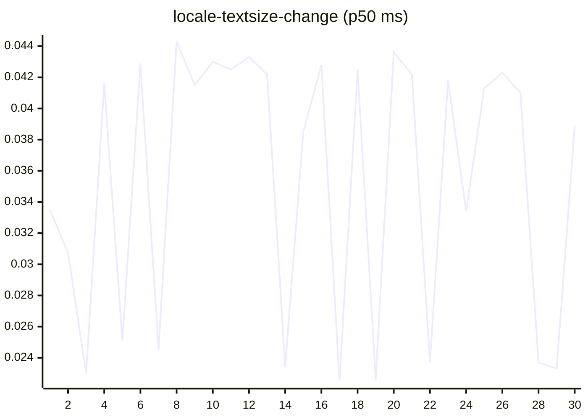
```mermaid
xychart-beta
    title "locale-textsize-change (p50 ms)"
    x-axis 1 --> 30
    line [0.0335, 0.0307, 0.0230, 0.0416, 0.0251, 0.0429, 0.0245, 0.0443, 0.0415, 0.0430, 0.0425, 0.0433, 0.0422, 0.0234, 0.0385, 0.0428, 0.0225, 0.0425, 0.0226, 0.0436, 0.0422, 0.0237, 0.0418, 0.0334, 0.0413, 0.0423, 0.0410, 0.0237, 0.0233, 0.0389]
```

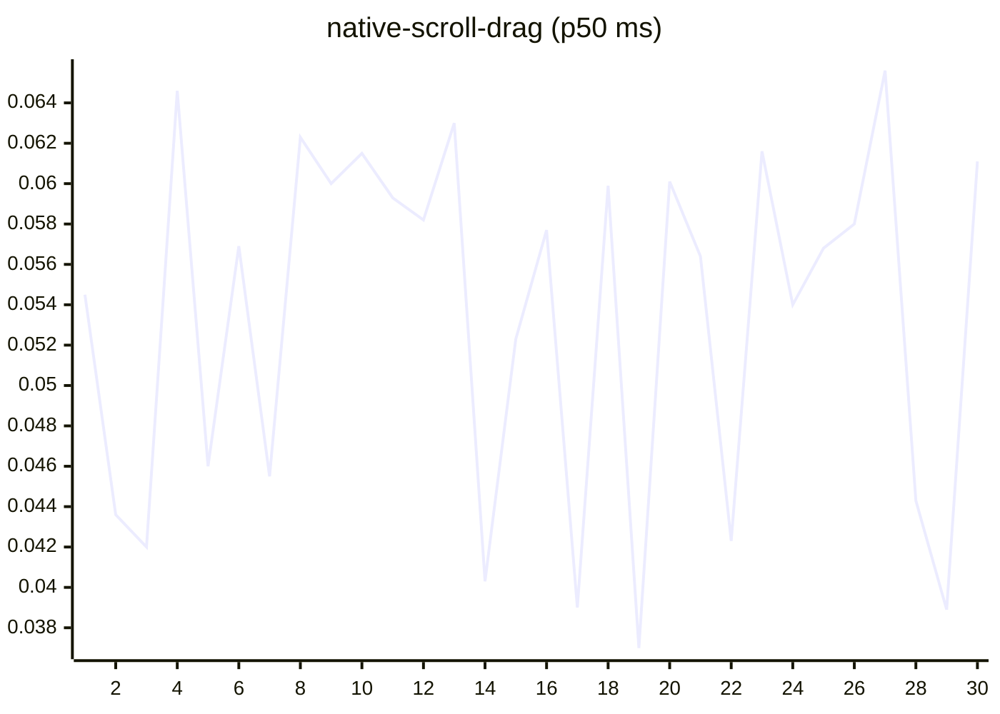
```mermaid
xychart-beta
    title "native-scroll-drag (p50 ms)"
    x-axis 1 --> 30
    line [0.0545, 0.0436, 0.0420, 0.0646, 0.0460, 0.0569, 0.0455, 0.0623, 0.0600, 0.0615, 0.0593, 0.0582, 0.0630, 0.0403, 0.0523, 0.0577, 0.0390, 0.0599, 0.0370, 0.0601, 0.0564, 0.0423, 0.0616, 0.0540, 0.0568, 0.0580, 0.0656, 0.0443, 0.0389, 0.0611]
```

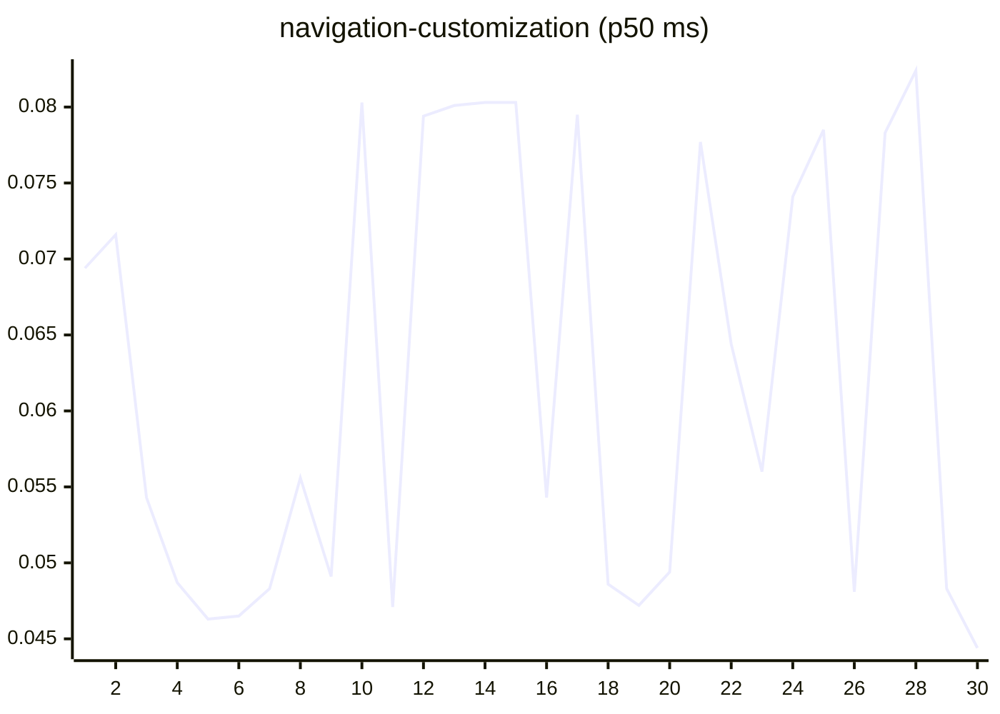
```mermaid
xychart-beta
    title "navigation-customization (p50 ms)"
    x-axis 1 --> 30
    line [0.0694, 0.0716, 0.0543, 0.0487, 0.0463, 0.0465, 0.0483, 0.0556, 0.0491, 0.0803, 0.0471, 0.0794, 0.0801, 0.0803, 0.0803, 0.0543, 0.0795, 0.0486, 0.0472, 0.0494, 0.0777, 0.0644, 0.0560, 0.0741, 0.0785, 0.0481, 0.0783, 0.0824, 0.0483, 0.0444]
```

```mermaid
xychart-beta
    title "picker-menu-open-close (p50 ms)"
    x-axis 1 --> 30
    line [3.9826, 4.7388, 6.1676, 5.0690, 5.6954, 4.5402, 6.1912, 5.0120, 5.7822, 4.6627, 4.5372, 6.2442, 5.9038, 6.6044, 6.2815, 6.5623, 6.5728, 5.0278, 6.3599, 6.2355, 5.3362, 4.1492, 5.7473, 4.0112, 4.5489, 6.1919, 4.6774, 3.9267, 6.3897, 6.0683]
```

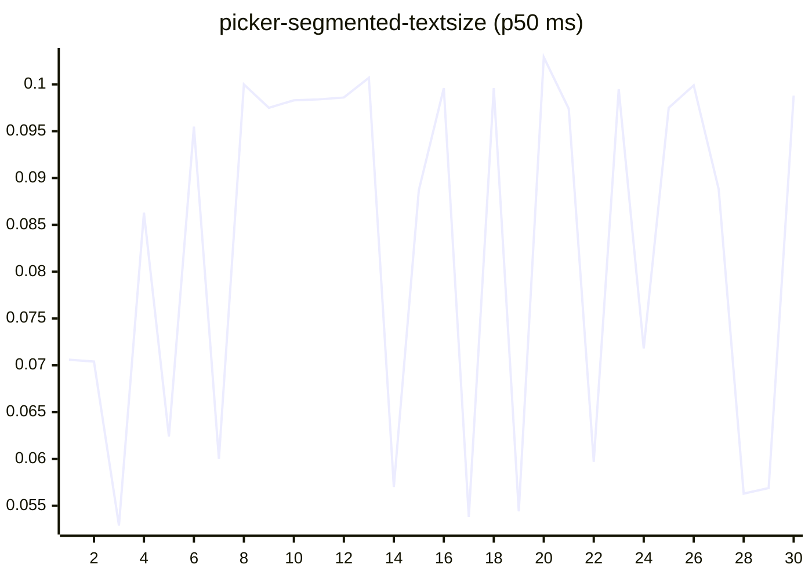
```mermaid
xychart-beta
    title "picker-segmented-textsize (p50 ms)"
    x-axis 1 --> 30
    line [0.0706, 0.0704, 0.0529, 0.0863, 0.0624, 0.0955, 0.0600, 0.1000, 0.0975, 0.0983, 0.0984, 0.0986, 0.1007, 0.0570, 0.0887, 0.0996, 0.0538, 0.0996, 0.0544, 0.1029, 0.0974, 0.0597, 0.0995, 0.0718, 0.0975, 0.0999, 0.0888, 0.0563, 0.0569, 0.0988]
```

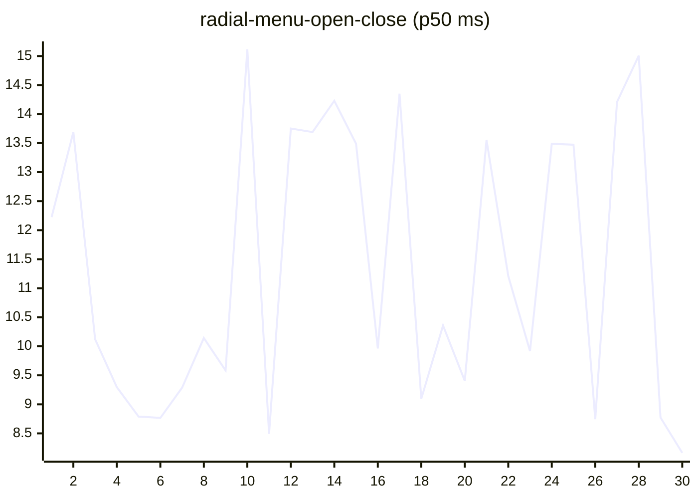
```mermaid
xychart-beta
    title "radial-menu-open-close (p50 ms)"
    x-axis 1 --> 30
    line [12.2246, 13.6922, 10.1222, 9.2955, 8.7896, 8.7658, 9.2868, 10.1425, 9.5839, 15.1159, 8.4930, 13.7518, 13.6910, 14.2293, 13.4899, 9.9631, 14.3516, 9.0969, 10.3580, 9.4040, 13.5562, 11.2086, 9.9173, 13.4886, 13.4731, 8.7442, 14.2081, 15.0064, 8.7734, 8.1647]
```

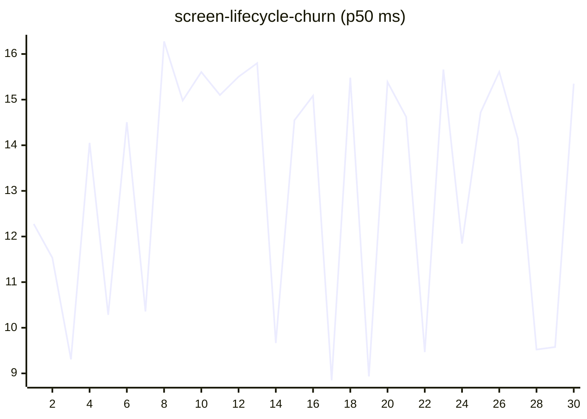
```mermaid
xychart-beta
    title "screen-lifecycle-churn (p50 ms)"
    x-axis 1 --> 30
    line [12.2751, 11.5333, 9.3077, 14.0529, 10.2834, 14.5049, 10.3571, 16.2758, 14.9800, 15.6047, 15.1004, 15.5018, 15.7992, 9.6661, 14.5485, 15.0845, 8.8497, 15.4803, 8.9330, 15.3846, 14.6222, 9.4657, 15.6595, 11.8442, 14.7213, 15.6094, 14.1404, 9.5225, 9.5780, 15.3495]
```

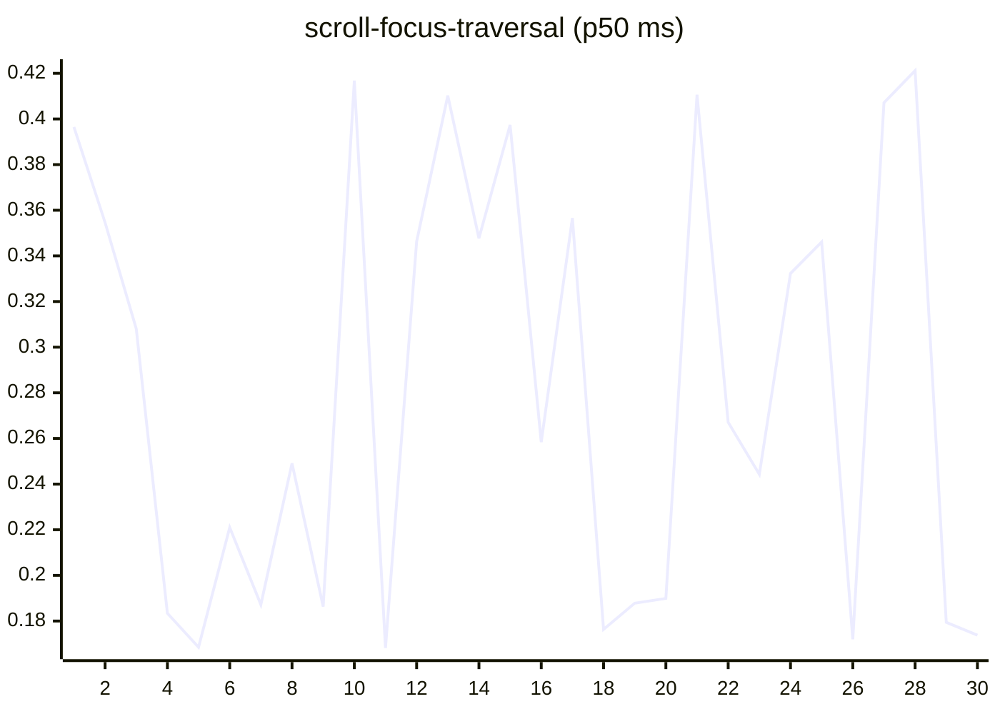
```mermaid
xychart-beta
    title "scroll-focus-traversal (p50 ms)"
    x-axis 1 --> 30
    line [0.3965, 0.3546, 0.3081, 0.1834, 0.1685, 0.2210, 0.1872, 0.2491, 0.1863, 0.4168, 0.1682, 0.3463, 0.4102, 0.3477, 0.3974, 0.2584, 0.3566, 0.1763, 0.1878, 0.1899, 0.4106, 0.2671, 0.2443, 0.3323, 0.3461, 0.1720, 0.4071, 0.4212, 0.1794, 0.1738]
```

```mermaid
xychart-beta
    title "settings-churn (p50 ms)"
    x-axis 1 --> 30
    line [2.9370, 2.9159, 2.3612, 3.5098, 2.5478, 3.8264, 2.5045, 4.1104, 3.9365, 4.0094, 3.9311, 3.8826, 4.0034, 2.4122, 3.5975, 3.9373, 2.2758, 4.0720, 2.3180, 3.9370, 3.8504, 2.4242, 4.0029, 2.9213, 3.9101, 3.9346, 3.5400, 2.4981, 2.4112, 3.9313]
```

```mermaid
xychart-beta
    title "shadow-storm (p50 ms)"
    x-axis 1 --> 30
    line [0.0005, 0.0005, 0.0006, 0.0006, 0.0006, 0.0006, 0.0004, 0.0004, 0.0006, 0.0006, 0.0005, 0.0006, 0.0005, 0.0005, 0.0005, 0.0006, 0.0006, 0.0007, 0.0003, 0.0003, 0.0006, 0.0003, 0.0005, 0.0003, 0.0005, 0.0006, 0.0006, 0.0003, 0.0006, 0.0006]
```

```mermaid
xychart-beta
    title "stylesheet-state-churn (p50 ms)"
    x-axis 1 --> 30
    line [0.3355, 0.3201, 0.4286, 0.4202, 0.4514, 0.4313, 0.3097, 0.2760, 0.4462, 0.4196, 0.3798, 0.4136, 0.3689, 0.3490, 0.3439, 0.4287, 0.4552, 0.4064, 0.2532, 0.2627, 0.4348, 0.2567, 0.3253, 0.2482, 0.3268, 0.4212, 0.4202, 0.2626, 0.4522, 0.4744]
```

```mermaid
xychart-beta
    title "theme-swap-assets (p50 ms)"
    x-axis 1 --> 30
    line [2.2222, 2.3836, 1.7806, 1.4840, 1.3657, 1.3665, 1.4553, 1.7851, 1.4789, 2.4892, 1.3140, 2.3131, 2.2516, 1.9473, 1.8733, 1.4540, 2.0397, 1.1850, 1.2793, 1.1733, 1.8976, 1.6482, 1.4574, 1.9094, 1.9024, 1.1643, 1.7819, 2.1619, 1.1552, 1.0581]
```

```mermaid
xychart-beta
    title "theme-swap-flat (p50 ms)"
    x-axis 1 --> 30
    line [0.4102, 0.3724, 0.3261, 0.2527, 0.2442, 0.2585, 0.2623, 0.3198, 0.2619, 0.4434, 0.2339, 0.4407, 0.4280, 0.4363, 0.4235, 0.3316, 0.4379, 0.2589, 0.2616, 0.2540, 0.4218, 0.3054, 0.2676, 0.3624, 0.4218, 0.2436, 0.4311, 0.4464, 0.2540, 0.2314]
```

```mermaid
xychart-beta
    title "theme-swap-metrics (p50 ms)"
    x-axis 1 --> 30
    line [1.4473, 1.4180, 1.7700, 1.7319, 1.7324, 1.7301, 1.4949, 1.3408, 1.7593, 1.7245, 1.6804, 1.7547, 1.6926, 1.4410, 1.4690, 1.7671, 1.8831, 1.8236, 1.1007, 1.1142, 1.7425, 1.1116, 1.4099, 1.1021, 1.4421, 1.7457, 1.7623, 1.0742, 1.8376, 2.1766]
```

```mermaid
xychart-beta
    title "virtual-list-scroll (p50 ms)"
    x-axis 1 --> 30
    line [0.1116, 0.1343, 0.1908, 0.1463, 0.1654, 0.1331, 0.1880, 0.1434, 0.1653, 0.1332, 0.1296, 0.1949, 0.1709, 0.2205, 0.1936, 0.2004, 0.1915, 0.1452, 0.1766, 0.1937, 0.1545, 0.1192, 0.1725, 0.1146, 0.1237, 0.1937, 0.1328, 0.1149, 0.2387, 0.2094]
```
