# Facet performance

Latest: `12d4715b5e4ca9259167b6f057c7df8192413ee6` on 2026-10-29T051213Z, measured on the CI Ubuntu runner by the paired performance shards.
Times are milliseconds per frame or operation: the median over paired rounds of each round's p50 and p95.
Retained heap is the scene's mounted retained Luau heap. Change compares the p50 of the previous main commit.

| Scene | p50 ms | p95 ms | Retained KiB | Change |
| --- | ---: | ---: | ---: | ---: |
| adaptive-navigation-images | 1.2271 | 1.5500 | 4076 | +51.7% |
| alert-present-dismiss | 3.6480 | 5.0690 | 2489 | -1.3% |
| animation-interruption | 0.0262 | 0.0311 | 410 | -32.0% |
| async-image-burst | 0.0349 | 0.0422 | 524 | -23.5% |
| async-image-grid | 2.1819 | 3.6363 | 2975 | -23.9% |
| collection-mutation | 0.3885 | 0.5267 | 3612 | -1.7% |
| control-motion | 0.2345 | 0.6541 | 1839 | +68.1% |
| dense-hud | 0.1292 | 0.1455 | 813 | -18.7% |
| dense-motion | 0.9749 | 1.5665 | 2904 | -22.9% |
| hud-binding-storm | 0.2237 | 0.2579 | 498 | -18.8% |
| lab-collection-churn | 0.3083 | 0.7560 | 4274 | -27.6% |
| lab-dense-scroll | 0.8655 | 5.3120 | 6511 | +0.2% |
| locale-textsize-change | 0.0416 | 0.0497 | 511 | +80.9% |
| native-scroll-drag | 0.0646 | 0.0806 | 1660 | +54.0% |
| navigation-customization | 0.0487 | 0.0586 | 3929 | -10.3% |
| picker-menu-open-close | 5.0690 | 7.4886 | 1195 | -17.8% |
| picker-segmented-textsize | 0.0863 | 0.0981 | 966 | +63.0% |
| radial-menu-open-close | 9.2955 | 15.1623 | 1350 | -8.2% |
| screen-lifecycle-churn | 14.0529 | 23.7982 | 4061 | +51.0% |
| scroll-focus-traversal | 0.1834 | 0.4205 | 1243 | -40.5% |
| settings-churn | 3.5098 | 5.9615 | 3107 | +48.6% |
| shadow-storm | 0.0006 | 0.0012 | 2031 | -0.0% |
| stylesheet-state-churn | 0.4202 | 0.7359 | 3056 | -1.9% |
| theme-swap-assets | 1.4840 | 2.1250 | 6010 | -16.7% |
| theme-swap-flat | 0.2527 | 0.2937 | 4104 | -22.5% |
| theme-swap-metrics | 1.7319 | 2.3909 | 4884 | -2.2% |
| virtual-list-scroll | 0.1463 | 0.3660 | 5347 | -23.3% |

| Microbenchmark | p50 ms | p95 ms | Change |
| --- | ---: | ---: | ---: |
| billboard-nameplate-storm | 0.1414 | 0.1966 | -22.8% |
| collection-mutation | 0.0097 | 0.0133 | +73.9% |
| collection-selection-update | 0.0016 | 0.0030 | -30.5% |
| hud-binding-storm | 0.3782 | 0.3949 | -1.1% |
| motion-declarative | 1.0820 | 1.9458 | -11.2% |
| motion-explicit | 1.2934 | 2.0111 | +70.6% |
| mount-ramp | 106.3349 | 122.1808 | -18.4% |
| mount-ramp-inherited | 157.7013 | 175.8311 | -3.8% |
| mounted-slice-update-storm | 0.1958 | 0.2648 | -16.4% |
| outline-measured-update | 1.6949 | 2.4859 | +72.6% |
| reserved-slot-record-update | 0.5463 | 1.1118 | -28.7% |
| settings-churn | 0.0176 | 0.0202 | +2.3% |
| sparse-update-under-load | 0.0020 | 0.0024 | -22.2% |
| table-mutation | 0.3016 | 0.4411 | +49.1% |
| table-resize-drag | 2.0863 | 3.9886 | -15.8% |
| table-sort-values | 1.2719 | 2.0682 | -0.5% |
| table-source-refresh | 0.1967 | 0.3910 | -24.9% |
| textinput-typing-storm | 0.2853 | 0.4542 | +74.6% |
| timer-readout-storm | 0.0964 | 0.5583 | -27.0% |
| zz-yardstick-cpu-after | 1.1843 | 1.2065 | -4.5% |
| zz-yardstick-cpu-before | 1.1825 | 1.1884 | -2.1% |

## Scene p50 over the last 30 main commits

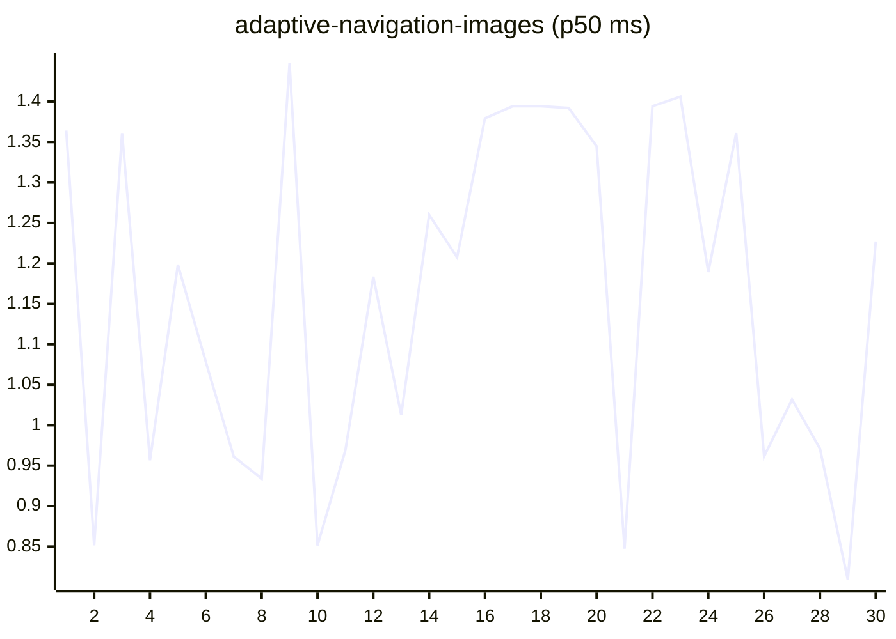
```mermaid
xychart-beta
    title "adaptive-navigation-images (p50 ms)"
    x-axis 1 --> 30
    line [1.3642, 0.8516, 1.3610, 0.9567, 1.1983, 1.0783, 0.9612, 0.9339, 1.4475, 0.8514, 0.9690, 1.1835, 1.0125, 1.2600, 1.2076, 1.3793, 1.3944, 1.3942, 1.3921, 1.3447, 0.8475, 1.3944, 1.4060, 1.1893, 1.3612, 0.9615, 1.0317, 0.9711, 0.8088, 1.2271]
```

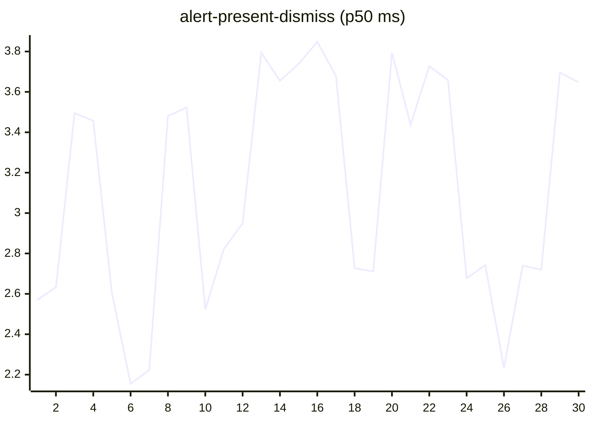
```mermaid
xychart-beta
    title "alert-present-dismiss (p50 ms)"
    x-axis 1 --> 30
    line [2.5704, 2.6324, 3.4949, 3.4566, 2.6019, 2.1543, 2.2230, 3.4803, 3.5227, 2.5229, 2.8233, 2.9484, 3.7942, 3.6546, 3.7386, 3.8479, 3.6788, 2.7270, 2.7111, 3.7936, 3.4376, 3.7274, 3.6582, 2.6769, 2.7425, 2.2328, 2.7393, 2.7195, 3.6955, 3.6480]
```

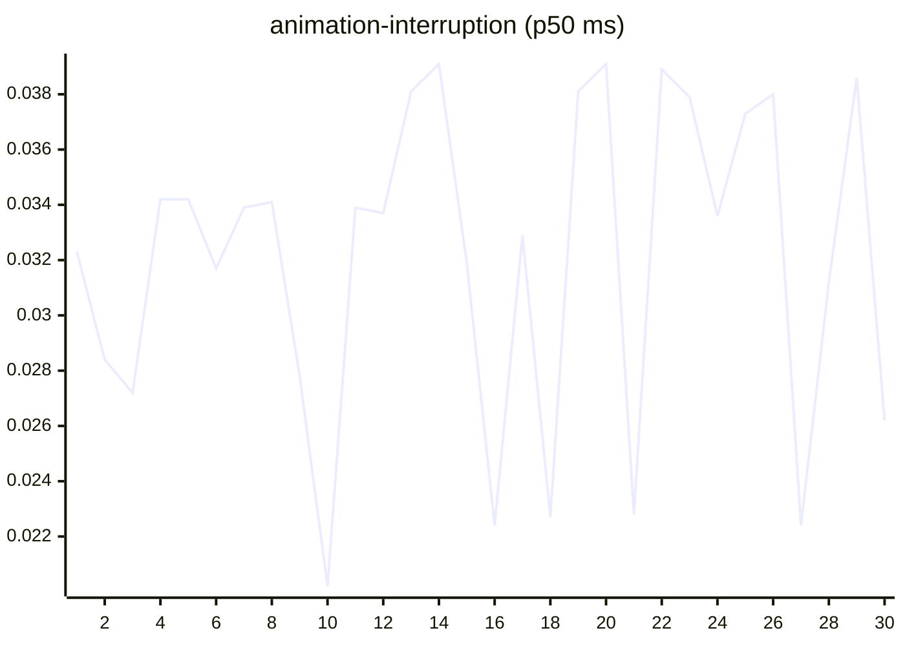
```mermaid
xychart-beta
    title "animation-interruption (p50 ms)"
    x-axis 1 --> 30
    line [0.0323, 0.0284, 0.0272, 0.0342, 0.0342, 0.0317, 0.0339, 0.0341, 0.0278, 0.0202, 0.0339, 0.0337, 0.0381, 0.0391, 0.0319, 0.0224, 0.0329, 0.0227, 0.0381, 0.0391, 0.0228, 0.0389, 0.0379, 0.0336, 0.0373, 0.0380, 0.0224, 0.0312, 0.0386, 0.0262]
```

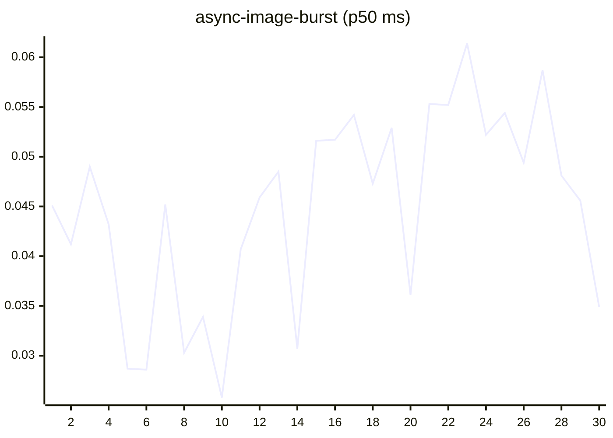
```mermaid
xychart-beta
    title "async-image-burst (p50 ms)"
    x-axis 1 --> 30
    line [0.0451, 0.0412, 0.0490, 0.0432, 0.0287, 0.0286, 0.0452, 0.0303, 0.0339, 0.0258, 0.0407, 0.0459, 0.0485, 0.0307, 0.0516, 0.0517, 0.0542, 0.0473, 0.0529, 0.0361, 0.0553, 0.0552, 0.0614, 0.0522, 0.0544, 0.0494, 0.0587, 0.0481, 0.0456, 0.0349]
```

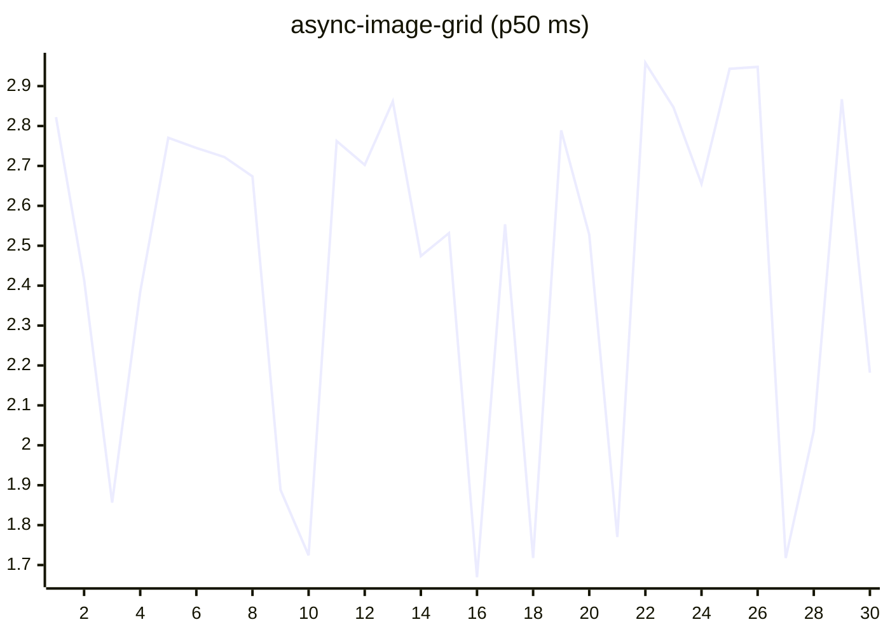
```mermaid
xychart-beta
    title "async-image-grid (p50 ms)"
    x-axis 1 --> 30
    line [2.8223, 2.4153, 1.8565, 2.3845, 2.7705, 2.7451, 2.7222, 2.6737, 1.8884, 1.7244, 2.7624, 2.7026, 2.8617, 2.4742, 2.5316, 1.6696, 2.5539, 1.7175, 2.7892, 2.5277, 1.7701, 2.9582, 2.8471, 2.6552, 2.9433, 2.9481, 1.7177, 2.0365, 2.8674, 2.1819]
```

```mermaid
xychart-beta
    title "collection-mutation (p50 ms)"
    x-axis 1 --> 30
    line [0.2667, 0.2740, 0.3845, 0.3488, 0.2697, 0.2285, 0.2398, 0.3530, 0.3937, 0.2612, 0.2812, 0.2898, 0.3883, 0.3861, 0.4024, 0.3910, 0.3862, 0.2784, 0.2797, 0.3953, 0.3359, 0.3908, 0.3842, 0.2754, 0.2746, 0.2214, 0.2766, 0.2690, 0.3950, 0.3885]
```

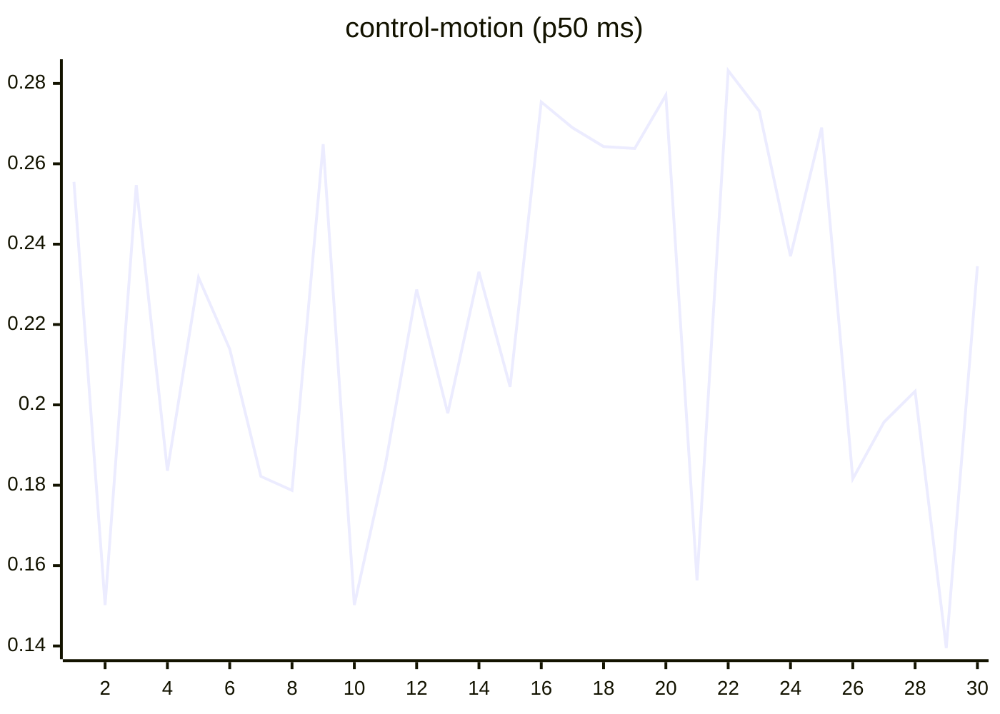
```mermaid
xychart-beta
    title "control-motion (p50 ms)"
    x-axis 1 --> 30
    line [0.2555, 0.1502, 0.2547, 0.1836, 0.2317, 0.2139, 0.1822, 0.1787, 0.2649, 0.1502, 0.1852, 0.2287, 0.1979, 0.2331, 0.2045, 0.2754, 0.2690, 0.2643, 0.2638, 0.2771, 0.1563, 0.2832, 0.2731, 0.2370, 0.2690, 0.1816, 0.1957, 0.2034, 0.1395, 0.2345]
```

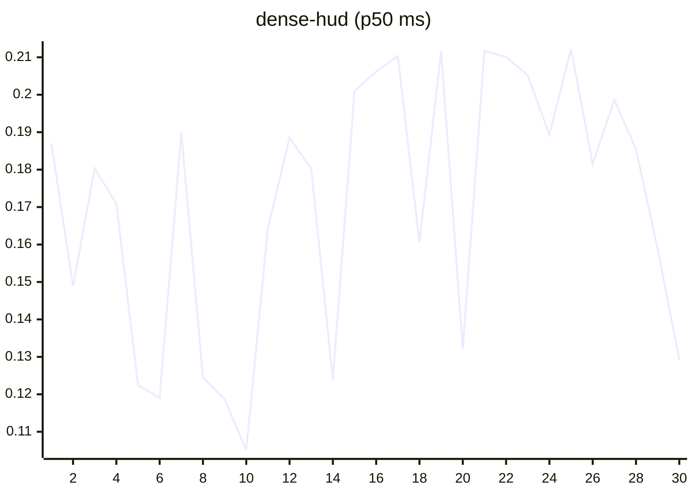
```mermaid
xychart-beta
    title "dense-hud (p50 ms)"
    x-axis 1 --> 30
    line [0.1870, 0.1489, 0.1803, 0.1709, 0.1225, 0.1190, 0.1899, 0.1245, 0.1187, 0.1051, 0.1644, 0.1885, 0.1802, 0.1239, 0.2010, 0.2062, 0.2103, 0.1605, 0.2117, 0.1321, 0.2117, 0.2101, 0.2052, 0.1893, 0.2122, 0.1815, 0.1986, 0.1854, 0.1589, 0.1292]
```

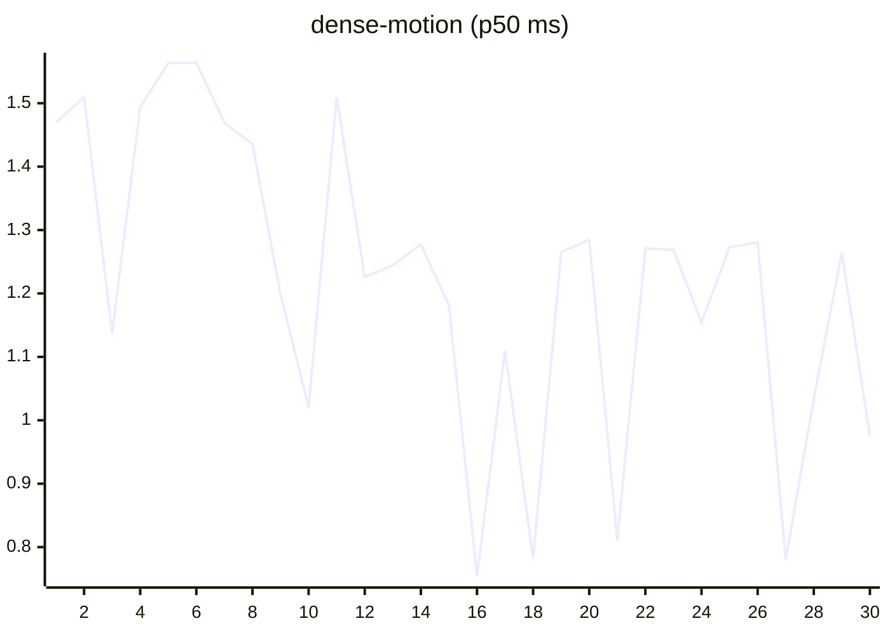
```mermaid
xychart-beta
    title "dense-motion (p50 ms)"
    x-axis 1 --> 30
    line [1.4695, 1.5096, 1.1365, 1.4939, 1.5634, 1.5638, 1.4692, 1.4355, 1.1984, 1.0205, 1.5093, 1.2258, 1.2445, 1.2773, 1.1817, 0.7540, 1.1093, 0.7822, 1.2651, 1.2846, 0.8102, 1.2712, 1.2688, 1.1544, 1.2730, 1.2805, 0.7796, 1.0341, 1.2646, 0.9749]
```

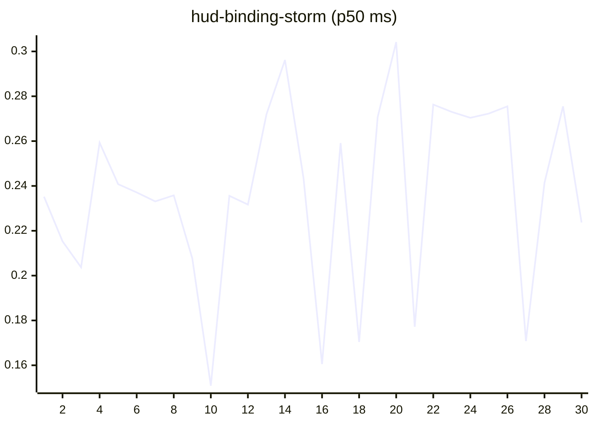
```mermaid
xychart-beta
    title "hud-binding-storm (p50 ms)"
    x-axis 1 --> 30
    line [0.2352, 0.2153, 0.2037, 0.2593, 0.2408, 0.2371, 0.2331, 0.2358, 0.2077, 0.1509, 0.2356, 0.2317, 0.2719, 0.2962, 0.2435, 0.1605, 0.2591, 0.1704, 0.2707, 0.3042, 0.1772, 0.2763, 0.2730, 0.2704, 0.2723, 0.2755, 0.1708, 0.2414, 0.2755, 0.2237]
```

```mermaid
xychart-beta
    title "lab-collection-churn (p50 ms)"
    x-axis 1 --> 30
    line [0.4176, 0.3686, 0.3301, 0.4283, 0.4250, 0.4152, 0.4180, 0.4167, 0.3342, 0.2545, 0.4221, 0.4258, 0.4158, 0.4286, 0.3753, 0.2419, 0.3575, 0.2441, 0.4215, 0.4279, 0.2490, 0.4243, 0.4265, 0.3676, 0.4284, 0.4331, 0.2510, 0.3432, 0.4256, 0.3083]
```

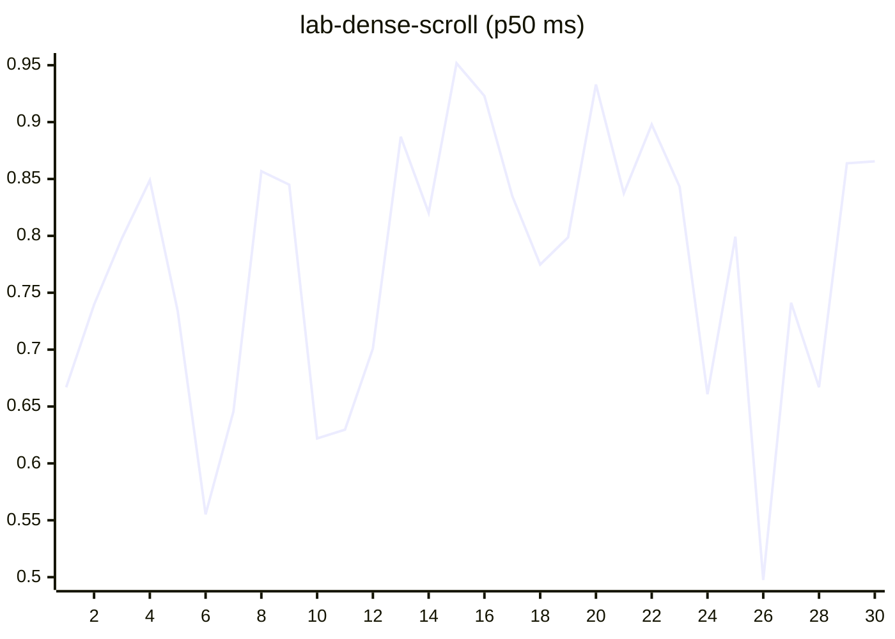
```mermaid
xychart-beta
    title "lab-dense-scroll (p50 ms)"
    x-axis 1 --> 30
    line [0.6669, 0.7395, 0.7979, 0.8489, 0.7339, 0.5552, 0.6458, 0.8568, 0.8450, 0.6219, 0.6297, 0.7010, 0.8871, 0.8203, 0.9518, 0.9230, 0.8349, 0.7748, 0.7987, 0.9331, 0.8374, 0.8979, 0.8432, 0.6608, 0.7993, 0.4976, 0.7412, 0.6669, 0.8638, 0.8655]
```

```mermaid
xychart-beta
    title "locale-textsize-change (p50 ms)"
    x-axis 1 --> 30
    line [0.0364, 0.0208, 0.0369, 0.0286, 0.0322, 0.0290, 0.0284, 0.0279, 0.0375, 0.0200, 0.0285, 0.0328, 0.0327, 0.0378, 0.0377, 0.0414, 0.0427, 0.0420, 0.0423, 0.0407, 0.0249, 0.0432, 0.0443, 0.0377, 0.0434, 0.0332, 0.0335, 0.0307, 0.0230, 0.0416]
```

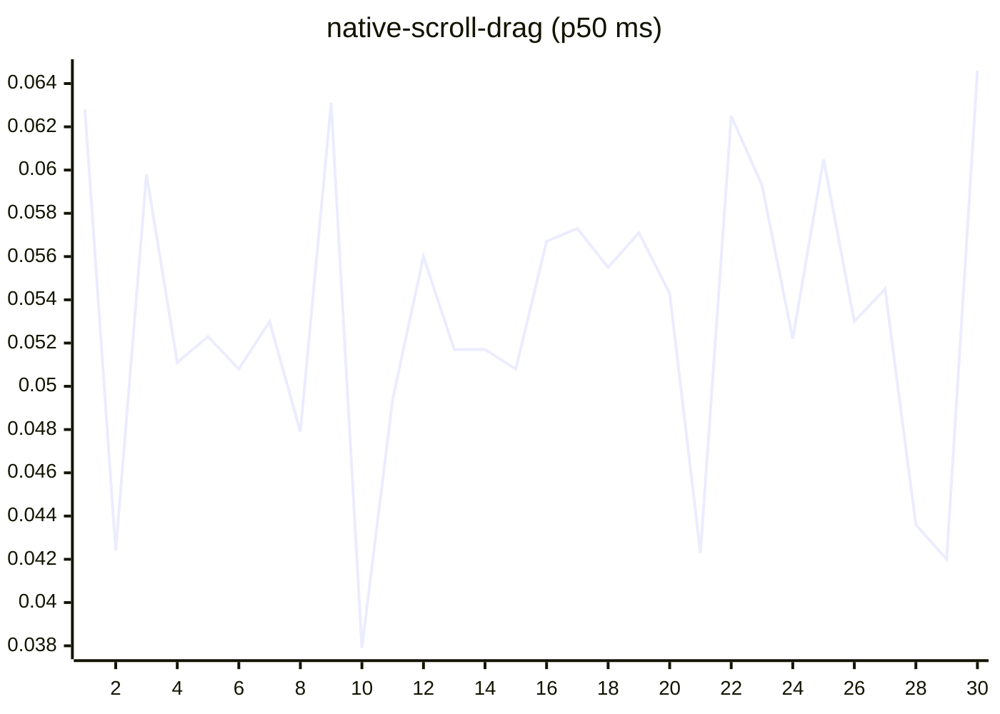
```mermaid
xychart-beta
    title "native-scroll-drag (p50 ms)"
    x-axis 1 --> 30
    line [0.0628, 0.0424, 0.0598, 0.0511, 0.0523, 0.0508, 0.0530, 0.0479, 0.0631, 0.0379, 0.0494, 0.0560, 0.0517, 0.0517, 0.0508, 0.0567, 0.0573, 0.0555, 0.0571, 0.0543, 0.0423, 0.0625, 0.0593, 0.0522, 0.0605, 0.0530, 0.0545, 0.0436, 0.0420, 0.0646]
```

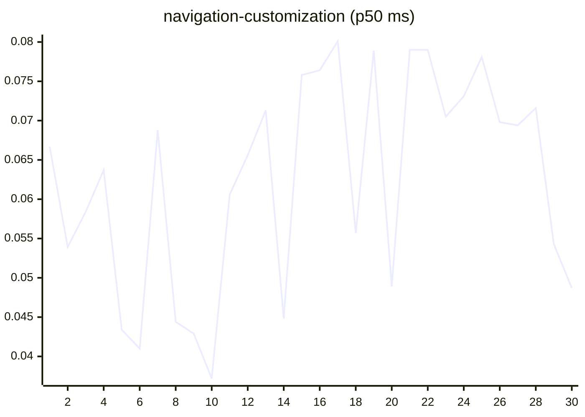
```mermaid
xychart-beta
    title "navigation-customization (p50 ms)"
    x-axis 1 --> 30
    line [0.0667, 0.0539, 0.0584, 0.0637, 0.0434, 0.0410, 0.0688, 0.0444, 0.0429, 0.0372, 0.0606, 0.0656, 0.0713, 0.0448, 0.0758, 0.0764, 0.0801, 0.0557, 0.0789, 0.0489, 0.0790, 0.0790, 0.0705, 0.0731, 0.0781, 0.0698, 0.0694, 0.0716, 0.0543, 0.0487]
```

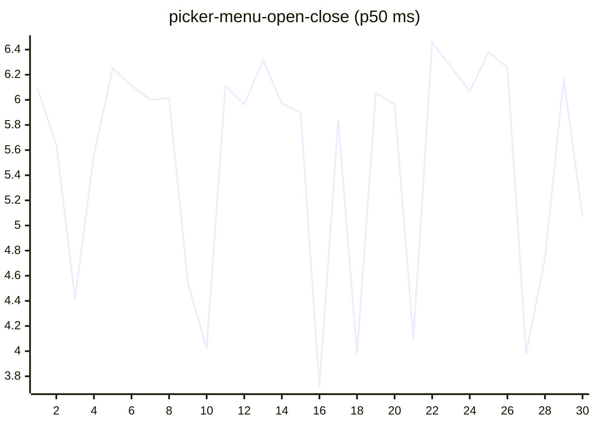
```mermaid
xychart-beta
    title "picker-menu-open-close (p50 ms)"
    x-axis 1 --> 30
    line [6.0885, 5.6440, 4.4145, 5.5656, 6.2500, 6.1133, 6.0006, 6.0128, 4.5439, 4.0216, 6.1100, 5.9646, 6.3137, 5.9733, 5.8960, 3.7179, 5.8378, 3.9788, 6.0543, 5.9629, 4.0972, 6.4594, 6.2618, 6.0678, 6.3801, 6.2569, 3.9826, 4.7388, 6.1676, 5.0690]
```

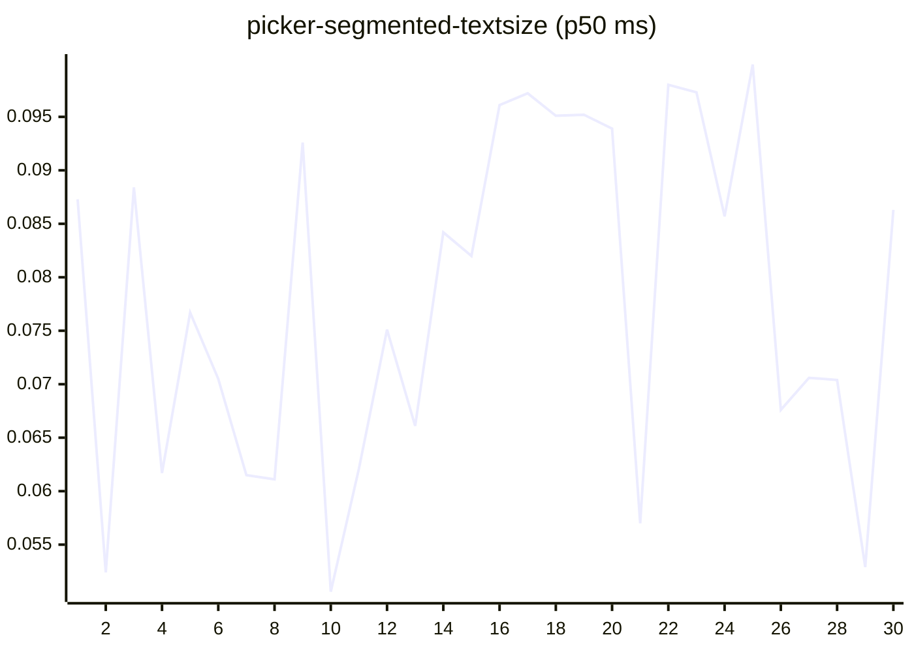
```mermaid
xychart-beta
    title "picker-segmented-textsize (p50 ms)"
    x-axis 1 --> 30
    line [0.0873, 0.0524, 0.0884, 0.0617, 0.0767, 0.0705, 0.0615, 0.0611, 0.0926, 0.0506, 0.0621, 0.0751, 0.0661, 0.0842, 0.0820, 0.0961, 0.0972, 0.0951, 0.0952, 0.0939, 0.0570, 0.0980, 0.0973, 0.0857, 0.0999, 0.0676, 0.0706, 0.0704, 0.0529, 0.0863]
```

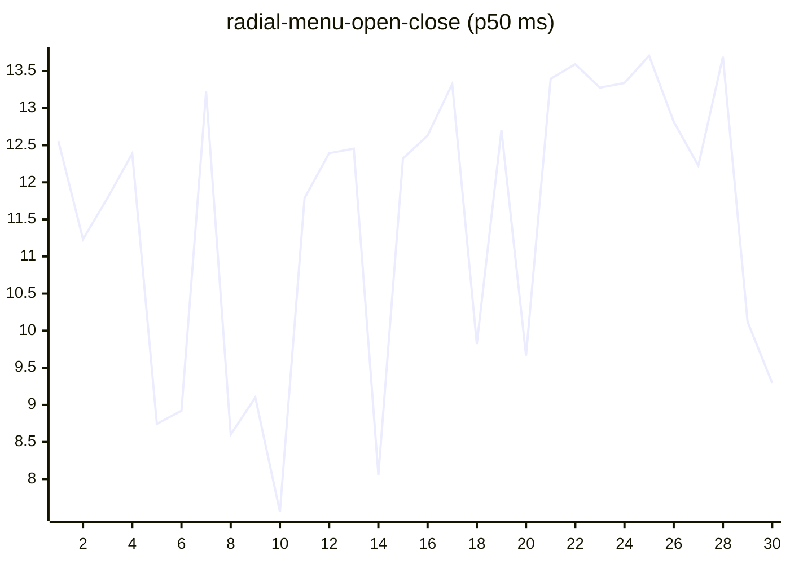
```mermaid
xychart-beta
    title "radial-menu-open-close (p50 ms)"
    x-axis 1 --> 30
    line [12.5560, 11.2324, 11.7902, 12.3880, 8.7436, 8.9215, 13.2239, 8.6006, 9.0993, 7.5583, 11.7873, 12.3922, 12.4543, 8.0551, 12.3218, 12.6302, 13.3250, 9.8198, 12.7062, 9.6636, 13.3949, 13.5923, 13.2760, 13.3385, 13.7060, 12.8177, 12.2246, 13.6922, 10.1222, 9.2955]
```

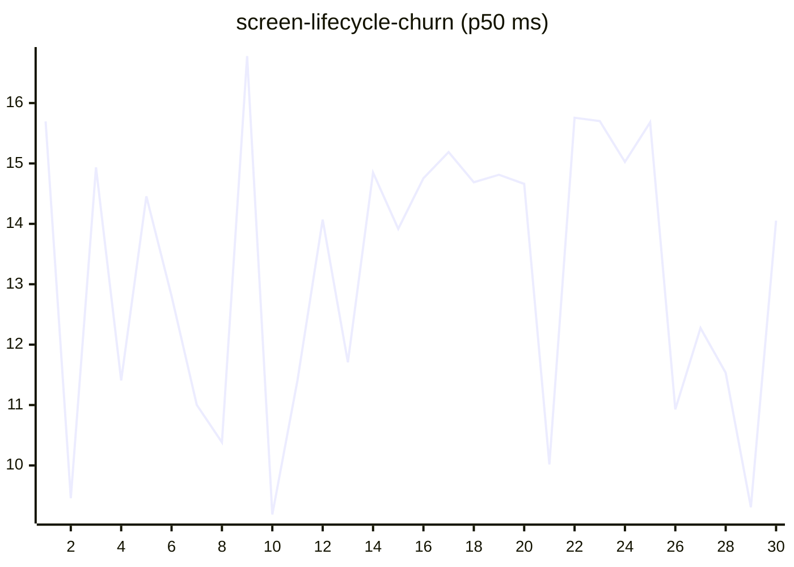
```mermaid
xychart-beta
    title "screen-lifecycle-churn (p50 ms)"
    x-axis 1 --> 30
    line [15.6965, 9.4580, 14.9352, 11.4071, 14.4551, 12.8061, 11.0031, 10.3834, 16.7783, 9.1867, 11.4109, 14.0699, 11.7084, 14.8494, 13.9181, 14.7553, 15.1887, 14.6881, 14.8127, 14.6619, 10.0163, 15.7570, 15.7018, 15.0249, 15.6801, 10.9284, 12.2751, 11.5333, 9.3077, 14.0529]
```

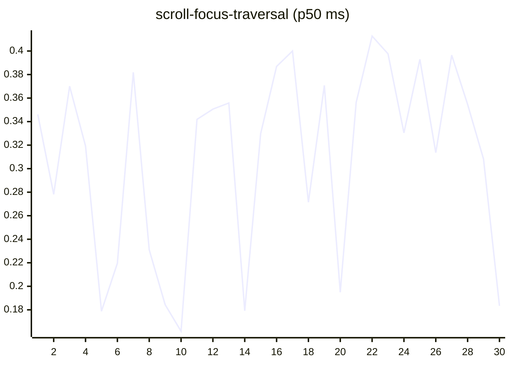
```mermaid
xychart-beta
    title "scroll-focus-traversal (p50 ms)"
    x-axis 1 --> 30
    line [0.3461, 0.2782, 0.3701, 0.3192, 0.1788, 0.2196, 0.3819, 0.2310, 0.1844, 0.1618, 0.3419, 0.3506, 0.3558, 0.1792, 0.3298, 0.3869, 0.4000, 0.2715, 0.3708, 0.1950, 0.3563, 0.4127, 0.3976, 0.3304, 0.3929, 0.3136, 0.3965, 0.3546, 0.3081, 0.1834]
```

```mermaid
xychart-beta
    title "settings-churn (p50 ms)"
    x-axis 1 --> 30
    line [3.9796, 2.3938, 3.8055, 2.7229, 3.5765, 3.1778, 2.7769, 2.6734, 3.9876, 2.3310, 2.7543, 3.5518, 2.8813, 3.6313, 3.5451, 3.8489, 3.9751, 3.8729, 3.8766, 3.8491, 2.5341, 4.0915, 3.9543, 3.7316, 4.0067, 2.8263, 2.9370, 2.9159, 2.3612, 3.5098]
```

```mermaid
xychart-beta
    title "shadow-storm (p50 ms)"
    x-axis 1 --> 30
    line [0.0005, 0.0005, 0.0006, 0.0005, 0.0005, 0.0003, 0.0003, 0.0005, 0.0006, 0.0005, 0.0004, 0.0005, 0.0006, 0.0006, 0.0006, 0.0006, 0.0006, 0.0005, 0.0005, 0.0006, 0.0005, 0.0006, 0.0006, 0.0005, 0.0005, 0.0003, 0.0005, 0.0005, 0.0006, 0.0006]
```

```mermaid
xychart-beta
    title "stylesheet-state-churn (p50 ms)"
    x-axis 1 --> 30
    line [0.3133, 0.3207, 0.4075, 0.3872, 0.3166, 0.2247, 0.2440, 0.3899, 0.4264, 0.3076, 0.3168, 0.3185, 0.4226, 0.4133, 0.4433, 0.4391, 0.4332, 0.3455, 0.3353, 0.4294, 0.3824, 0.4506, 0.4237, 0.3265, 0.3265, 0.2283, 0.3355, 0.3201, 0.4286, 0.4202]
```

```mermaid
xychart-beta
    title "theme-swap-assets (p50 ms)"
    x-axis 1 --> 30
    line [2.1485, 1.9419, 2.1761, 2.1523, 1.3964, 1.3639, 2.2354, 1.6750, 1.3789, 1.2597, 2.0726, 2.1873, 2.2356, 1.3506, 2.2291, 2.2751, 2.3414, 1.8548, 2.3108, 1.6943, 2.3746, 2.2533, 2.3007, 2.2073, 2.2534, 2.1207, 2.2222, 2.3836, 1.7806, 1.4840]
```

```mermaid
xychart-beta
    title "theme-swap-flat (p50 ms)"
    x-axis 1 --> 30
    line [0.4981, 0.3945, 0.5323, 0.4452, 0.3118, 0.2983, 0.5069, 0.3300, 0.3065, 0.2940, 0.4635, 0.4866, 0.4686, 0.2849, 0.5021, 0.4978, 0.5151, 0.3992, 0.5116, 0.3078, 0.5063, 0.4302, 0.4218, 0.3602, 0.4256, 0.3454, 0.4102, 0.3724, 0.3261, 0.2527]
```

```mermaid
xychart-beta
    title "theme-swap-metrics (p50 ms)"
    x-axis 1 --> 30
    line [1.3971, 1.3936, 1.6665, 1.7035, 1.3809, 1.0136, 1.0309, 1.7098, 1.7328, 1.3483, 1.4430, 1.4724, 1.7911, 1.7798, 1.8444, 1.8026, 1.7927, 1.4878, 1.4622, 1.8082, 1.7316, 1.7971, 1.7405, 1.4212, 1.4274, 0.9894, 1.4473, 1.4180, 1.7700, 1.7319]
```

```mermaid
xychart-beta
    title "virtual-list-scroll (p50 ms)"
    x-axis 1 --> 30
    line [0.1940, 0.2069, 0.1286, 0.1608, 0.1954, 0.1973, 0.1907, 0.1884, 0.1321, 0.1157, 0.1945, 0.2189, 0.1888, 0.1710, 0.1839, 0.1033, 0.1770, 0.1139, 0.1890, 0.1664, 0.1136, 0.1929, 0.1833, 0.1777, 0.1982, 0.1924, 0.1116, 0.1343, 0.1908, 0.1463]
```
