# Facet performance

Latest: `e3c1fce31461779107be8ce2e974379264cbde3b` on 2026-10-26T225001Z, measured on the CI Ubuntu runner by the paired performance shards.
Times are milliseconds per frame or operation: the median over paired rounds of each round's p50 and p95.
Retained heap is the scene's mounted retained Luau heap. Change compares the p50 of the previous main commit.

| Scene | p50 ms | p95 ms | Retained KiB | Change |
| --- | ---: | ---: | ---: | ---: |
| adaptive-navigation-images | 1.2110 | 1.6448 | 4172 | +1.8% |
| alert-present-dismiss | 3.8362 | 5.6823 | 2491 | +5.9% |
| animation-interruption | 0.0377 | 0.0436 | 395 | -3.1% |
| async-image-burst | 0.0281 | 0.0327 | 510 | -41.3% |
| async-image-grid | 2.7614 | 4.1221 | 1374 | +2.5% |
| collection-mutation | 0.4283 | 0.6617 | 3917 | +3.7% |
| control-motion | 0.2360 | 0.6035 | 1879 | -1.3% |
| dense-hud | 0.1134 | 0.1242 | 830 | -45.3% |
| dense-motion | 1.5198 | 2.6395 | 2954 | +0.3% |
| hud-binding-storm | 0.2643 | 0.2914 | 486 | +0.2% |
| lab-collection-churn | 0.4192 | 0.7225 | 4578 | +0.7% |
| lab-dense-scroll | 0.9501 | 5.8683 | 7681 | +6.8% |
| locale-textsize-change | 0.0344 | 0.0406 | 489 | +0.5% |
| native-scroll-drag | 0.0632 | 0.0804 | 1935 | +7.3% |
| navigation-customization | 0.0395 | 0.0464 | 4680 | -42.8% |
| picker-menu-open-close | 6.5483 | 9.3143 | 1225 | -0.5% |
| picker-segmented-textsize | 0.0744 | 0.0874 | 1014 | -0.4% |
| radial-menu-open-close | 8.6157 | 13.5414 | 1544 | -41.1% |
| screen-lifecycle-churn | 14.1247 | 22.9847 | 1401 | +4.7% |
| scroll-focus-traversal | 0.2101 | 0.3830 | 1371 | -50.1% |
| settings-churn | 3.4093 | 5.3670 | 2461 | +2.1% |
| shadow-storm | 0.0005 | 0.0017 | 1983 | +4.2% |
| stylesheet-state-churn | 0.4003 | 0.8077 | 3196 | +3.7% |
| theme-swap-assets | 1.2889 | 1.6619 | 5133 | -48.5% |
| theme-swap-flat | 0.3000 | 0.3429 | 4432 | -42.8% |
| theme-swap-metrics | 1.8918 | 2.4250 | 4887 | +13.3% |
| virtual-list-scroll | 0.2049 | 0.4158 | 5736 | +3.2% |

| Microbenchmark | p50 ms | p95 ms | Change |
| --- | ---: | ---: | ---: |
| billboard-nameplate-storm | 0.1711 | 0.2011 | +0.1% |
| collection-mutation | 0.0095 | 0.0129 | +1.4% |
| collection-selection-update | 0.0017 | 0.0029 | -49.5% |
| hud-binding-storm | 0.3224 | 0.3334 | +0.7% |
| motion-declarative | 1.2491 | 1.9059 | +3.5% |
| motion-explicit | 1.2924 | 2.0599 | +6.5% |
| mount-ramp | 93.7333 | 103.2267 | -45.3% |
| mount-ramp-inherited | 172.2603 | 188.0549 | +8.0% |
| mounted-slice-update-storm | 0.2444 | 0.3037 | -1.3% |
| outline-measured-update | 1.9887 | 3.2482 | +2.6% |
| reserved-slot-record-update | 0.4937 | 0.9592 | -43.8% |
| settings-churn | 0.0144 | 0.0156 | -4.5% |
| sparse-update-under-load | 0.0024 | 0.0025 | +0.4% |
| table-mutation | 0.3879 | 0.4805 | +2.8% |
| table-resize-drag | 2.0230 | 3.8059 | -41.5% |
| table-sort-values | 1.3481 | 2.1960 | +2.2% |
| table-source-refresh | 0.2611 | 0.4239 | -0.6% |
| textinput-typing-storm | 0.2686 | 0.4056 | +2.0% |
| timer-readout-storm | 0.0989 | 1.5884 | -42.1% |
| zz-yardstick-cpu-after | 1.3178 | 1.3249 | -2.2% |
| zz-yardstick-cpu-before | 1.2847 | 1.2912 | -0.4% |

## Scene p50 over the last 14 main commits

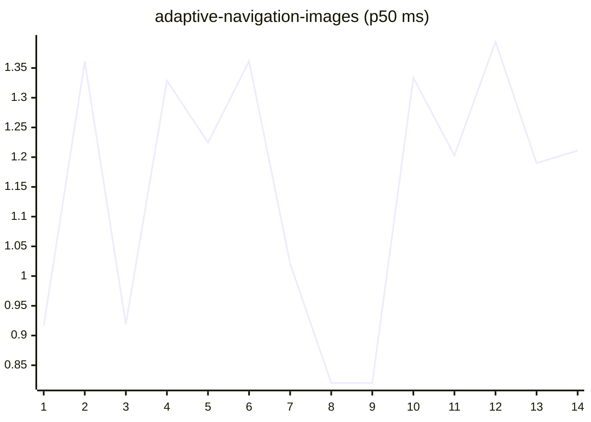
```mermaid
xychart-beta
    title "adaptive-navigation-images (p50 ms)"
    x-axis 1 --> 14
    line [0.9159, 1.3609, 0.9193, 1.3288, 1.2245, 1.3615, 1.0208, 0.8202, 0.8203, 1.3336, 1.2030, 1.3942, 1.1900, 1.2110]
```

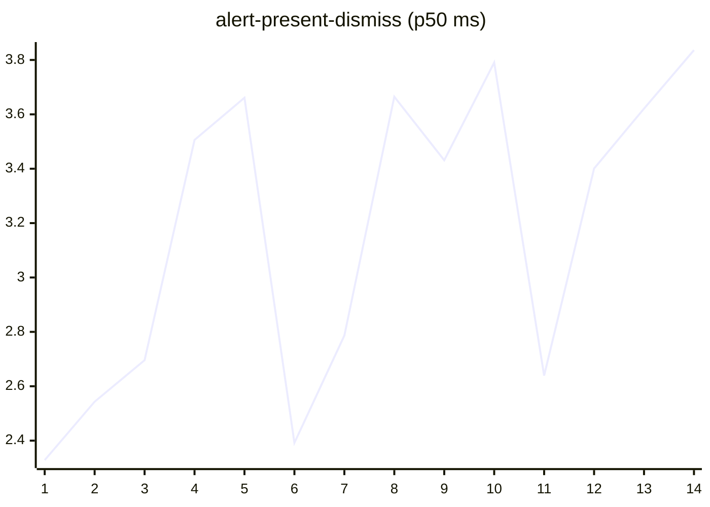
```mermaid
xychart-beta
    title "alert-present-dismiss (p50 ms)"
    x-axis 1 --> 14
    line [2.3284, 2.5432, 2.6957, 3.5058, 3.6611, 2.3918, 2.7865, 3.6648, 3.4312, 3.7906, 2.6392, 3.4008, 3.6212, 3.8362]
```

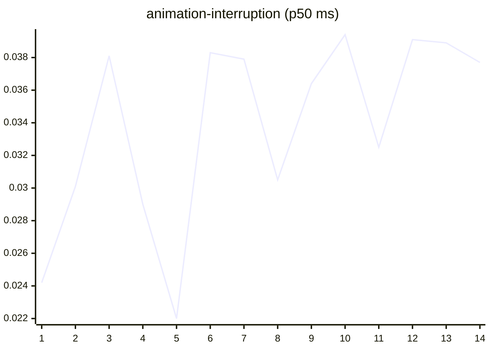
```mermaid
xychart-beta
    title "animation-interruption (p50 ms)"
    x-axis 1 --> 14
    line [0.0242, 0.0301, 0.0381, 0.0290, 0.0220, 0.0383, 0.0379, 0.0305, 0.0364, 0.0394, 0.0325, 0.0391, 0.0389, 0.0377]
```

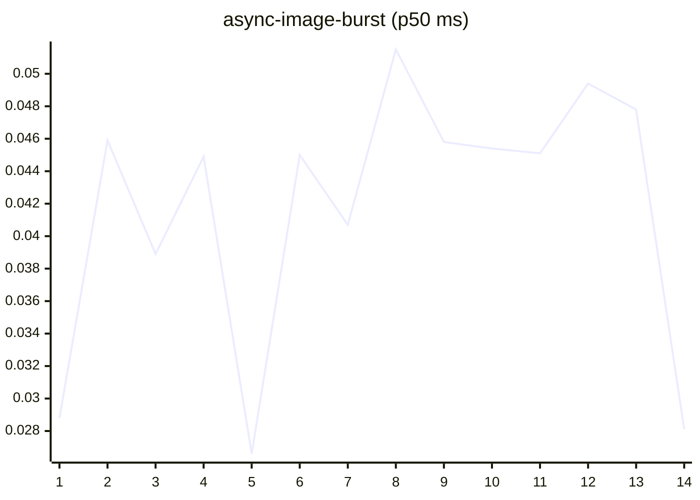
```mermaid
xychart-beta
    title "async-image-burst (p50 ms)"
    x-axis 1 --> 14
    line [0.0288, 0.0459, 0.0389, 0.0449, 0.0266, 0.0450, 0.0407, 0.0515, 0.0458, 0.0454, 0.0451, 0.0494, 0.0478, 0.0281]
```

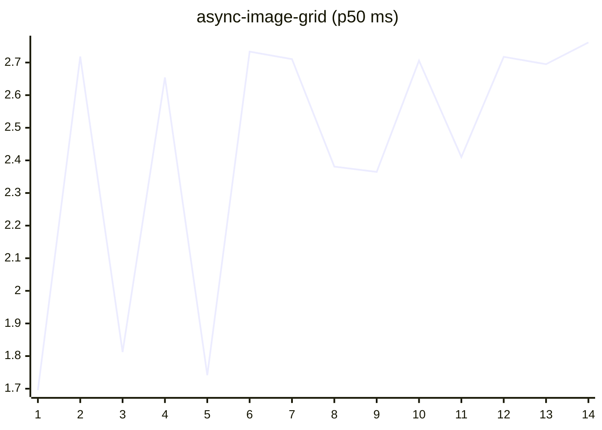
```mermaid
xychart-beta
    title "async-image-grid (p50 ms)"
    x-axis 1 --> 14
    line [1.6953, 2.7184, 1.8124, 2.6543, 1.7415, 2.7336, 2.7103, 2.3810, 2.3646, 2.7059, 2.4103, 2.7175, 2.6949, 2.7614]
```

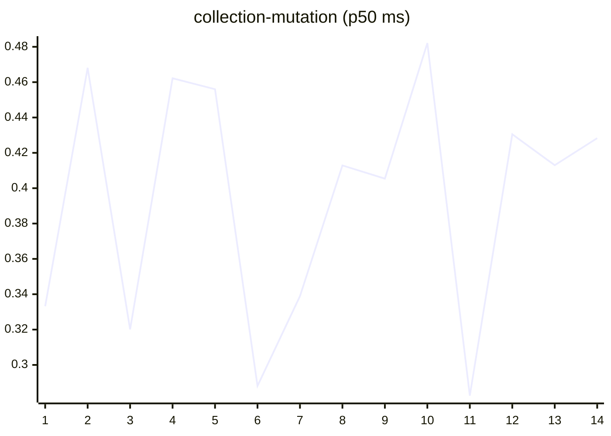
```mermaid
xychart-beta
    title "collection-mutation (p50 ms)"
    x-axis 1 --> 14
    line [0.3332, 0.4681, 0.3201, 0.4622, 0.4560, 0.2881, 0.3389, 0.4129, 0.4054, 0.4821, 0.2826, 0.4305, 0.4130, 0.4283]
```

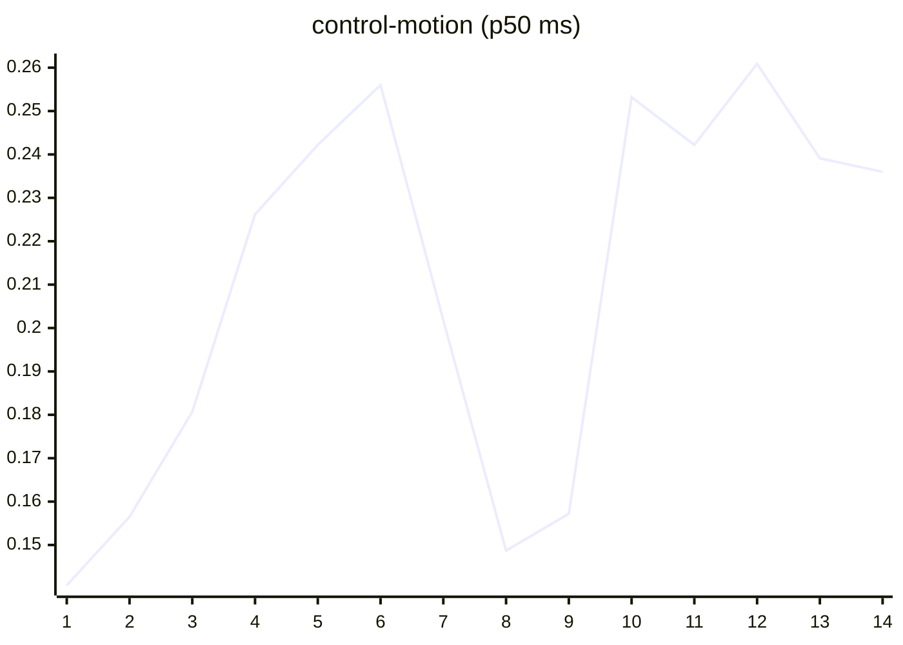
```mermaid
xychart-beta
    title "control-motion (p50 ms)"
    x-axis 1 --> 14
    line [0.1407, 0.1565, 0.1807, 0.2262, 0.2422, 0.2560, 0.2018, 0.1487, 0.1572, 0.2532, 0.2422, 0.2609, 0.2391, 0.2360]
```

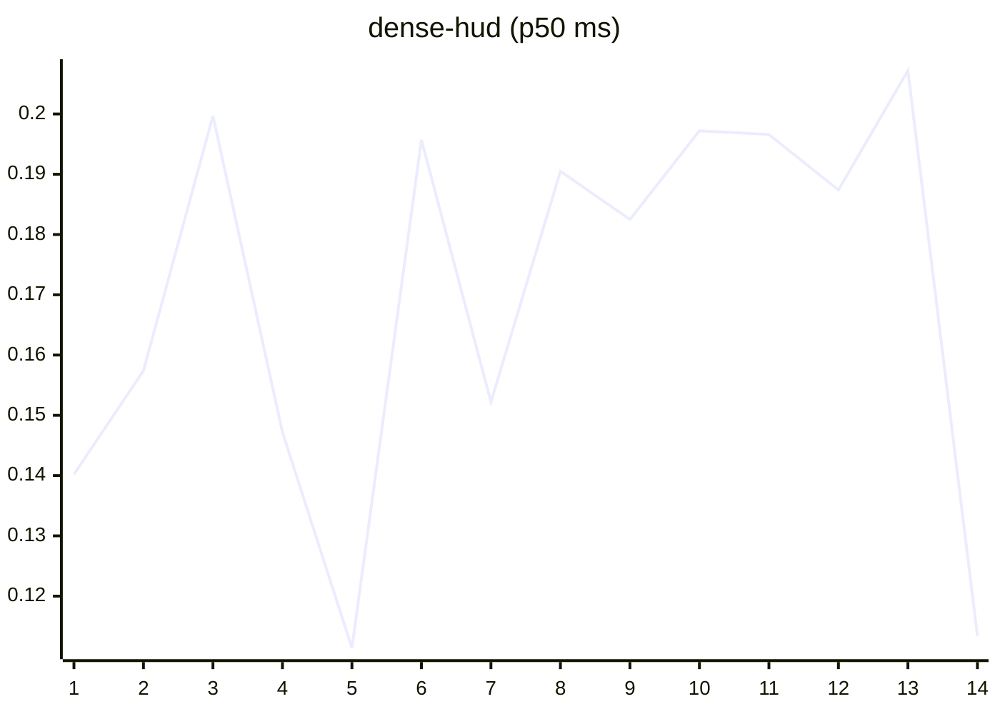
```mermaid
xychart-beta
    title "dense-hud (p50 ms)"
    x-axis 1 --> 14
    line [0.1402, 0.1574, 0.1997, 0.1472, 0.1114, 0.1957, 0.1522, 0.1905, 0.1825, 0.1972, 0.1966, 0.1874, 0.2072, 0.1134]
```

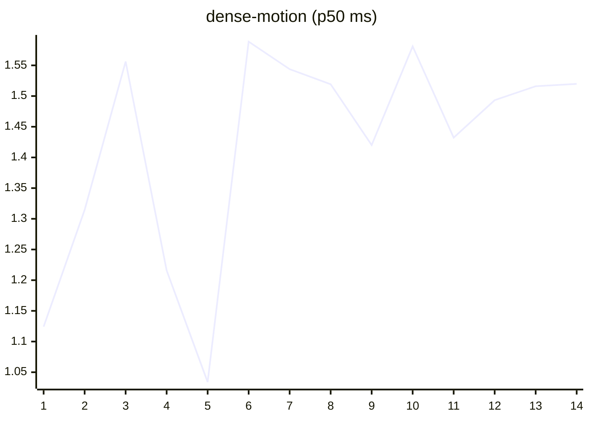
```mermaid
xychart-beta
    title "dense-motion (p50 ms)"
    x-axis 1 --> 14
    line [1.1243, 1.3144, 1.5562, 1.2159, 1.0340, 1.5887, 1.5438, 1.5193, 1.4201, 1.5809, 1.4323, 1.4933, 1.5160, 1.5198]
```

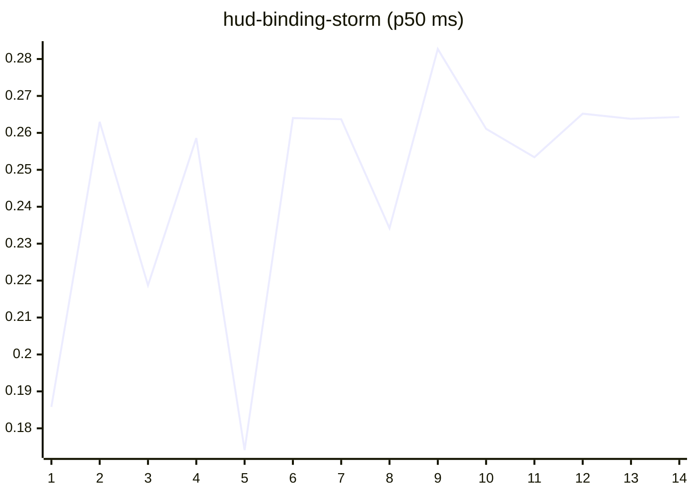
```mermaid
xychart-beta
    title "hud-binding-storm (p50 ms)"
    x-axis 1 --> 14
    line [0.1858, 0.2630, 0.2187, 0.2586, 0.1741, 0.2640, 0.2637, 0.2342, 0.2827, 0.2611, 0.2534, 0.2652, 0.2638, 0.2643]
```

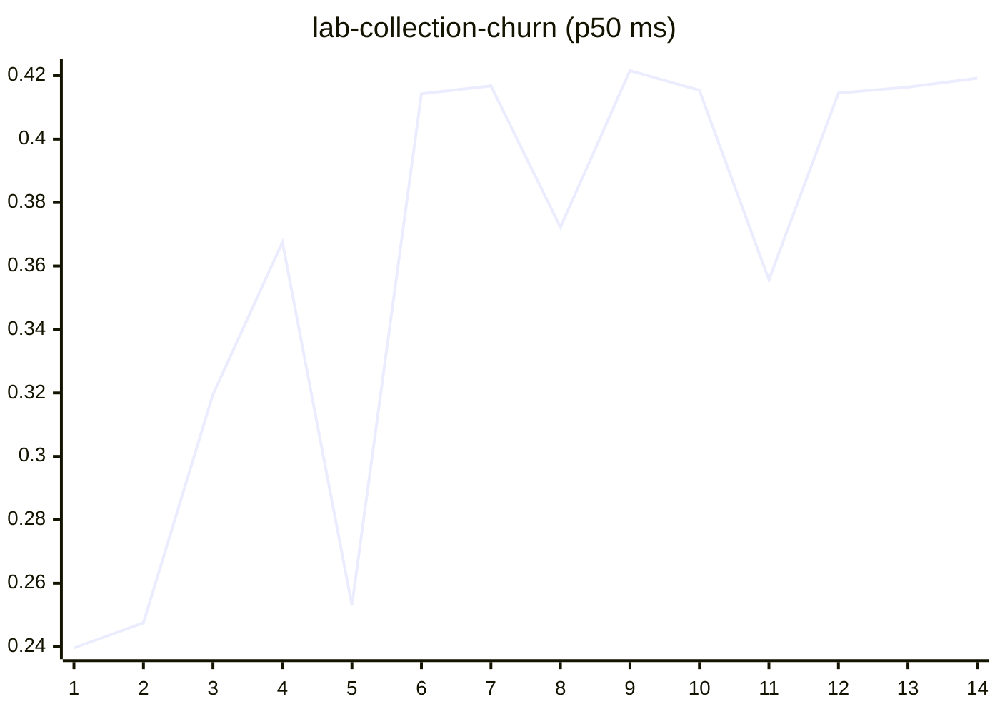
```mermaid
xychart-beta
    title "lab-collection-churn (p50 ms)"
    x-axis 1 --> 14
    line [0.2396, 0.2475, 0.3195, 0.3675, 0.2530, 0.4143, 0.4168, 0.3722, 0.4216, 0.4154, 0.3556, 0.4145, 0.4164, 0.4192]
```

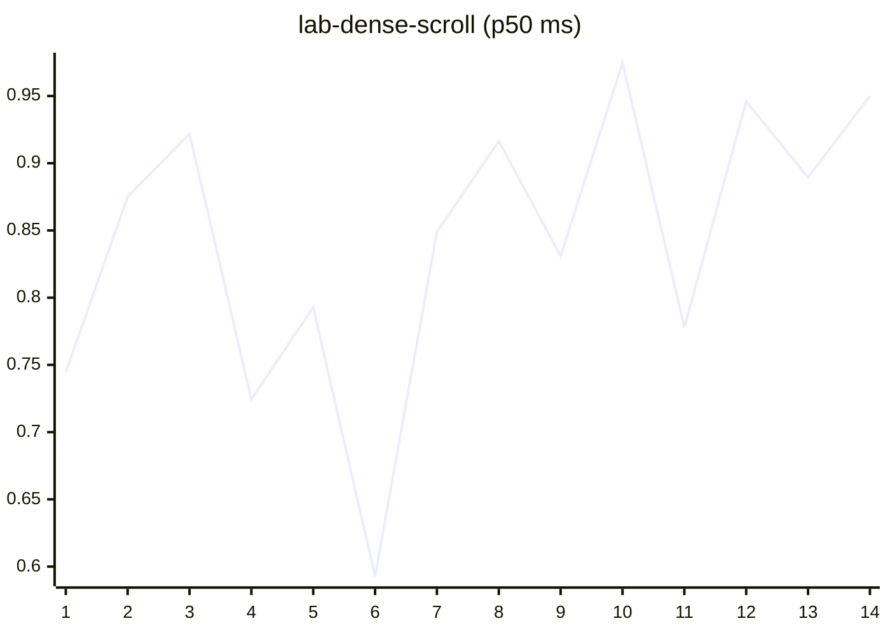
```mermaid
xychart-beta
    title "lab-dense-scroll (p50 ms)"
    x-axis 1 --> 14
    line [0.7446, 0.8751, 0.9218, 0.7244, 0.7929, 0.5928, 0.8489, 0.9164, 0.8310, 0.9747, 0.7780, 0.9459, 0.8894, 0.9501]
```

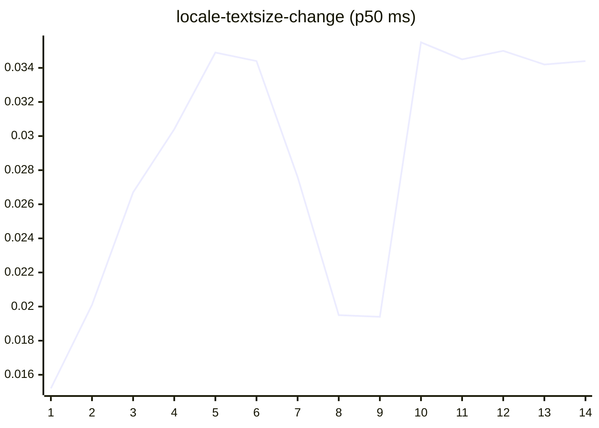
```mermaid
xychart-beta
    title "locale-textsize-change (p50 ms)"
    x-axis 1 --> 14
    line [0.0152, 0.0201, 0.0267, 0.0304, 0.0349, 0.0344, 0.0276, 0.0195, 0.0194, 0.0355, 0.0345, 0.0350, 0.0342, 0.0344]
```

```mermaid
xychart-beta
    title "native-scroll-drag (p50 ms)"
    x-axis 1 --> 14
    line [0.0464, 0.0583, 0.0482, 0.0561, 0.0672, 0.0581, 0.0520, 0.0422, 0.0417, 0.0583, 0.0616, 0.0602, 0.0589, 0.0632]
```

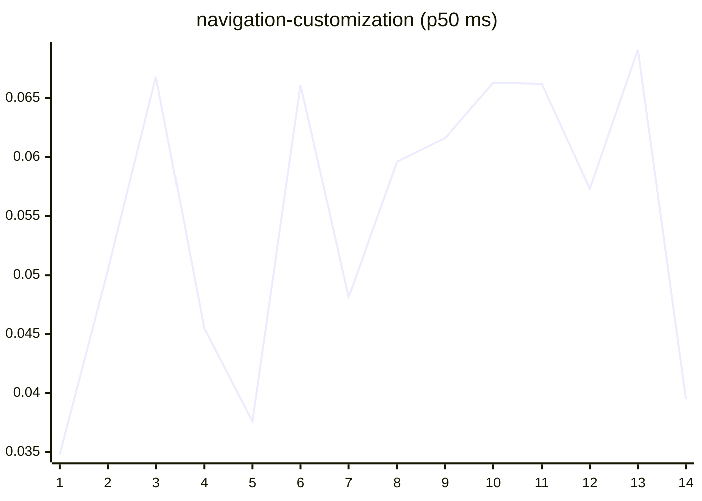
```mermaid
xychart-beta
    title "navigation-customization (p50 ms)"
    x-axis 1 --> 14
    line [0.0348, 0.0504, 0.0668, 0.0455, 0.0376, 0.0661, 0.0482, 0.0596, 0.0616, 0.0663, 0.0662, 0.0573, 0.0691, 0.0395]
```

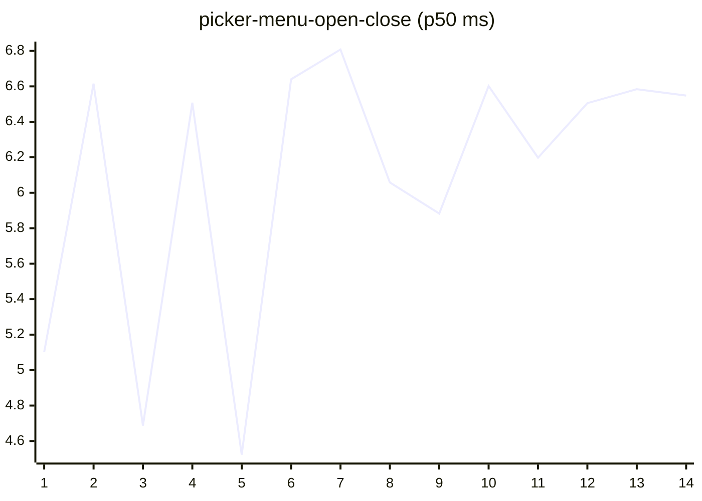
```mermaid
xychart-beta
    title "picker-menu-open-close (p50 ms)"
    x-axis 1 --> 14
    line [5.1020, 6.6154, 4.6873, 6.5076, 4.5232, 6.6400, 6.8077, 6.0581, 5.8829, 6.6018, 6.1978, 6.5053, 6.5840, 6.5483]
```

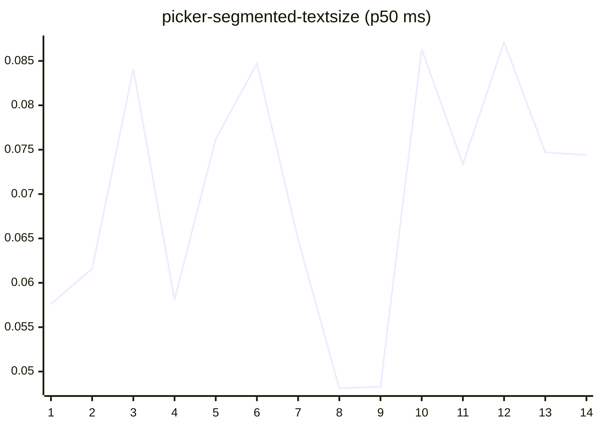
```mermaid
xychart-beta
    title "picker-segmented-textsize (p50 ms)"
    x-axis 1 --> 14
    line [0.0576, 0.0616, 0.0841, 0.0581, 0.0762, 0.0847, 0.0649, 0.0481, 0.0483, 0.0863, 0.0734, 0.0871, 0.0747, 0.0744]
```

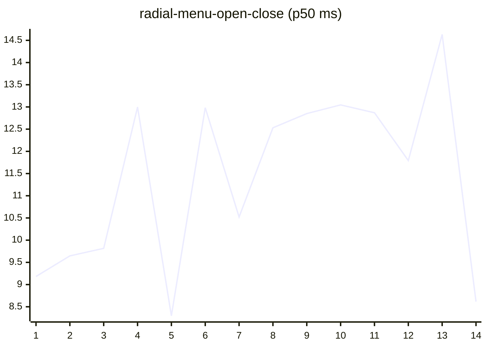
```mermaid
xychart-beta
    title "radial-menu-open-close (p50 ms)"
    x-axis 1 --> 14
    line [9.1824, 9.6461, 9.8160, 12.9977, 8.2964, 12.9826, 10.5207, 12.5300, 12.8509, 13.0462, 12.8695, 11.7917, 14.6337, 8.6157]
```

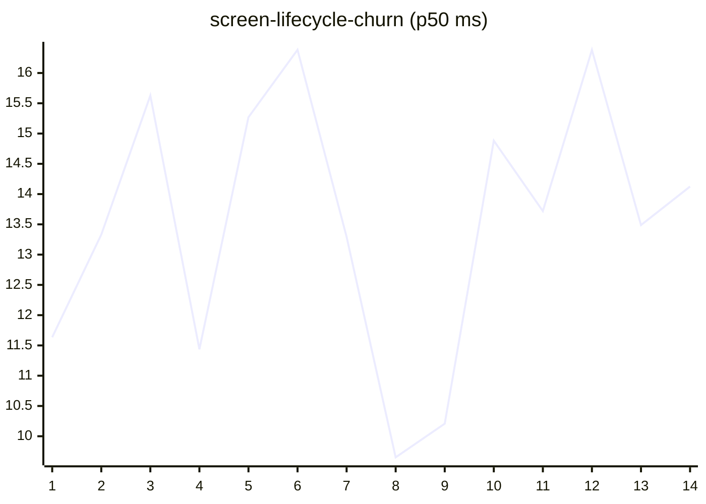
```mermaid
xychart-beta
    title "screen-lifecycle-churn (p50 ms)"
    x-axis 1 --> 14
    line [11.6362, 13.3303, 15.6277, 11.4367, 15.2702, 16.3829, 13.2931, 9.6509, 10.2078, 14.8820, 13.7187, 16.3818, 13.4876, 14.1247]
```

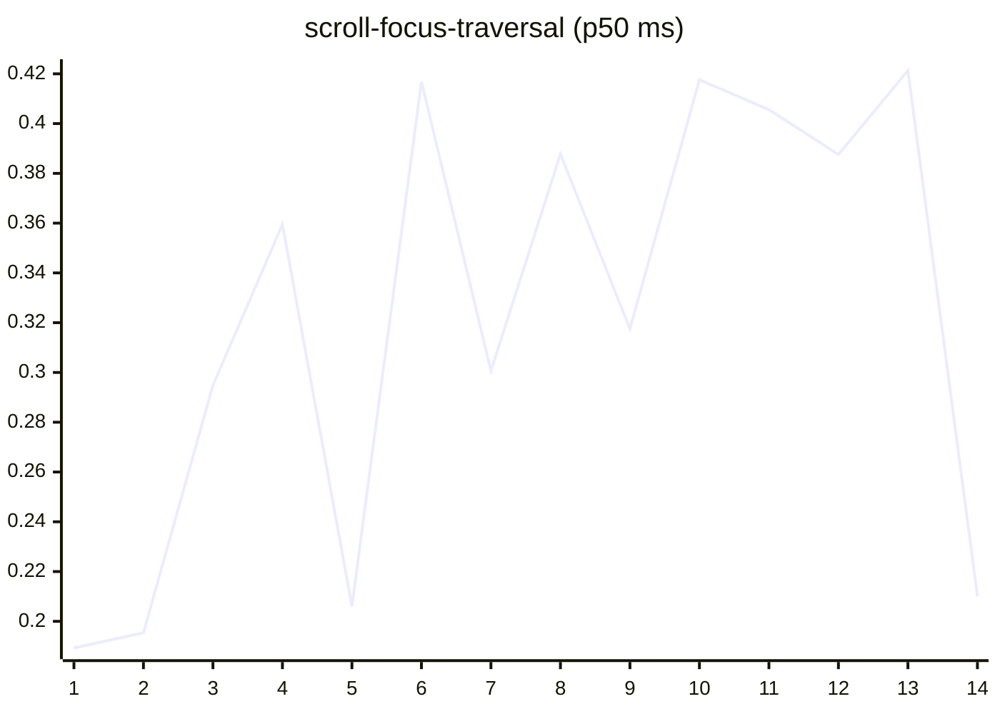
```mermaid
xychart-beta
    title "scroll-focus-traversal (p50 ms)"
    x-axis 1 --> 14
    line [0.1893, 0.1954, 0.2948, 0.3595, 0.2060, 0.4169, 0.3006, 0.3878, 0.3175, 0.4176, 0.4056, 0.3876, 0.4213, 0.2101]
```

```mermaid
xychart-beta
    title "settings-churn (p50 ms)"
    x-axis 1 --> 14
    line [2.4831, 3.3595, 3.8546, 2.7052, 3.5707, 4.0222, 3.0879, 2.4259, 2.3824, 3.7464, 3.3635, 3.8392, 3.3398, 3.4093]
```

```mermaid
xychart-beta
    title "shadow-storm (p50 ms)"
    x-axis 1 --> 14
    line [0.0005, 0.0005, 0.0006, 0.0005, 0.0006, 0.0003, 0.0005, 0.0005, 0.0005, 0.0006, 0.0003, 0.0006, 0.0005, 0.0005]
```

```mermaid
xychart-beta
    title "stylesheet-state-churn (p50 ms)"
    x-axis 1 --> 14
    line [0.2123, 0.2752, 0.3220, 0.3838, 0.4071, 0.2450, 0.3266, 0.3849, 0.3681, 0.4491, 0.2685, 0.4140, 0.3862, 0.4003]
```

```mermaid
xychart-beta
    title "theme-swap-assets (p50 ms)"
    x-axis 1 --> 14
    line [1.5921, 2.1494, 1.6336, 2.1480, 1.2452, 2.1218, 1.7008, 2.1645, 2.1562, 2.1422, 2.1255, 2.1180, 2.5045, 1.2889]
```

```mermaid
xychart-beta
    title "theme-swap-flat (p50 ms)"
    x-axis 1 --> 14
    line [0.3449, 0.3183, 0.4072, 0.4900, 0.2916, 0.5121, 0.4100, 0.5278, 0.4539, 0.5122, 0.5031, 0.5177, 0.5247, 0.3000]
```

```mermaid
xychart-beta
    title "theme-swap-metrics (p50 ms)"
    x-axis 1 --> 14
    line [1.2519, 1.6733, 1.3190, 1.6705, 1.6681, 1.0387, 1.3725, 1.6779, 1.6201, 1.7453, 1.0456, 1.7248, 1.6700, 1.8918]
```

```mermaid
xychart-beta
    title "virtual-list-scroll (p50 ms)"
    x-axis 1 --> 14
    line [0.1263, 0.1363, 0.1356, 0.1842, 0.1329, 0.2108, 0.2004, 0.1771, 0.1917, 0.2003, 0.1791, 0.1989, 0.1985, 0.2049]
```
