# Facet performance

Latest: `e5d88d804535899f3b7a5fa66b7b80ddc01205a3` on 2026-11-02T020827Z, measured on the CI Ubuntu runner by the paired performance shards.
Times are milliseconds per frame or operation: the median over paired rounds of each round's p50 and p95.
Retained heap is the scene's mounted retained Luau heap. Change compares the p50 of the previous main commit.

| Scene | p50 ms | p95 ms | Retained KiB | Change |
| --- | ---: | ---: | ---: | ---: |
| adaptive-navigation-images | 1.0293 | 1.2818 | 3643 | +0.8% |
| alert-present-dismiss | 1.8924 | 2.7962 | 7958 | -38.3% |
| animation-interruption | 0.0218 | 0.0234 | 386 | -23.3% |
| async-image-burst | 0.0346 | 0.0424 | 487 | +21.8% |
| async-image-grid | 1.5548 | 2.2740 | 952 | -34.3% |
| collection-mutation | 0.2047 | 0.2664 | 3149 | -42.6% |
| control-motion | 0.1873 | 0.5960 | 1685 | -0.1% |
| dense-hud | 0.1325 | 0.1437 | 754 | +24.9% |
| dense-motion | 0.7142 | 1.1566 | 1806 | -24.7% |
| hud-binding-storm | 0.1705 | 0.1830 | 469 | -13.6% |
| lab-collection-churn | 0.3374 | 0.6832 | 3975 | -20.3% |
| lab-dense-scroll | 0.4937 | 2.7066 | 8881 | -45.0% |
| locale-textsize-change | 0.0269 | 0.0285 | 519 | -0.6% |
| native-scroll-drag | 0.0479 | 0.0631 | 1851 | -4.0% |
| navigation-customization | 0.0399 | 0.0474 | 3617 | +26.5% |
| picker-menu-open-close | 4.1198 | 7.0719 | 14382 | -25.2% |
| picker-segmented-textsize | 0.0657 | 0.0788 | 949 | +0.2% |
| radial-menu-open-close | 10.6468 | 15.9814 | 25754 | +20.2% |
| screen-lifecycle-churn | 13.5467 | 21.5233 | 23835 | +2.1% |
| scroll-focus-traversal | 0.3441 | 0.5228 | 1247 | +26.3% |
| settings-churn | 3.4134 | 5.5075 | 7765 | +1.8% |
| shadow-storm | 0.0003 | 0.0003 | 1836 | -47.3% |
| stylesheet-state-churn | 0.1706 | 0.2670 | 2202 | -46.2% |
| theme-swap-assets | 1.4400 | 1.6769 | 5248 | +25.8% |
| theme-swap-flat | 0.3797 | 0.4771 | 4193 | +34.6% |
| theme-swap-metrics | 0.7291 | 0.8838 | 4667 | -45.6% |
| virtual-list-scroll | 0.0966 | 0.1485 | 4528 | -34.2% |

| Microbenchmark | p50 ms | p95 ms | Change |
| --- | ---: | ---: | ---: |
| billboard-nameplate-storm | 0.1183 | 0.1267 | -13.9% |
| collection-mutation | 0.0085 | 0.0114 | -0.2% |
| collection-selection-update | 0.0026 | 0.0032 | +20.7% |
| hud-binding-storm | 0.1506 | 0.1580 | -48.8% |
| motion-declarative | 0.6994 | 0.9146 | -17.4% |
| motion-explicit | 0.8487 | 1.0466 | +1.4% |
| mount-ramp | 143.8300 | 162.1917 | +15.3% |
| mount-ramp-inherited | 81.3243 | 96.6883 | -46.4% |
| mounted-slice-update-storm | 0.1719 | 0.1846 | -13.0% |
| outline-measured-update | 1.3440 | 1.7611 | -0.9% |
| reserved-slot-record-update | 0.6207 | 0.6609 | +23.0% |
| settings-churn | 0.0070 | 0.0079 | -56.9% |
| sparse-update-under-load | 0.0018 | 0.0020 | -16.5% |
| table-mutation | 0.3054 | 0.3792 | -0.5% |
| table-resize-drag | 1.9518 | 2.6569 | +23.6% |
| table-sort-values | 0.6336 | 0.8621 | -42.9% |
| table-source-refresh | 0.1733 | 0.3074 | -28.4% |
| textinput-typing-storm | 0.2067 | 0.3454 | -1.6% |
| timer-readout-storm | 0.1576 | 0.7267 | +33.7% |
| zz-yardstick-cpu-after | 1.2384 | 1.2438 | -5.3% |
| zz-yardstick-cpu-before | 1.2101 | 1.2152 | -6.4% |

## Scene p50 over the last 30 main commits

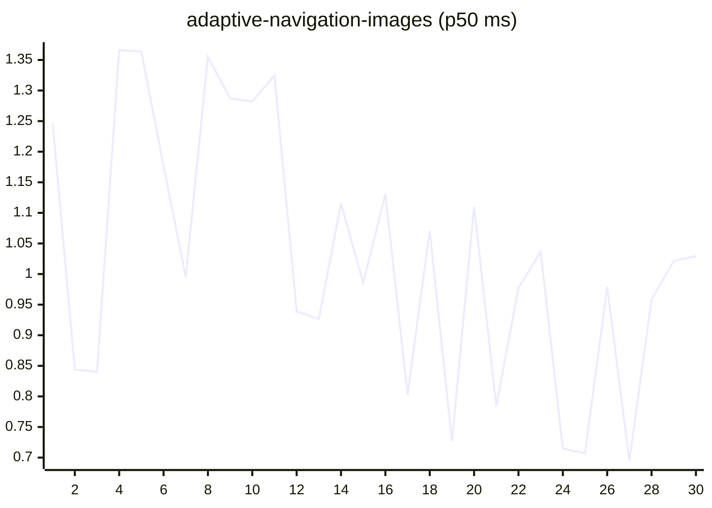
```mermaid
xychart-beta
    title "adaptive-navigation-images (p50 ms)"
    x-axis 1 --> 30
    line [1.2466, 0.8441, 0.8400, 1.3659, 1.3636, 1.1770, 0.9954, 1.3550, 1.2872, 1.2820, 1.3247, 0.9391, 0.9267, 1.1155, 0.9853, 1.1303, 0.8026, 1.0713, 0.7263, 1.1106, 0.7839, 0.9774, 1.0368, 0.7148, 0.7071, 0.9787, 0.6944, 0.9583, 1.0213, 1.0293]
```

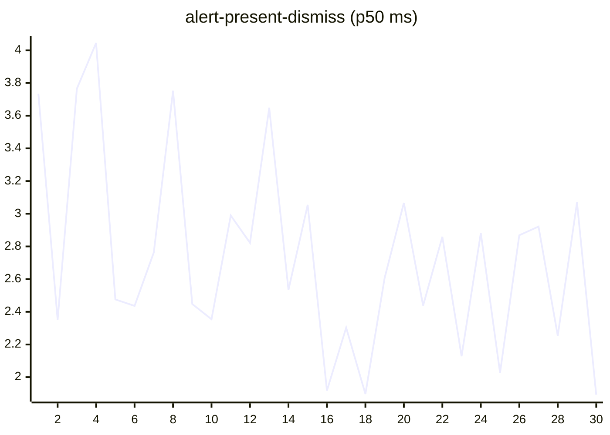
```mermaid
xychart-beta
    title "alert-present-dismiss (p50 ms)"
    x-axis 1 --> 30
    line [3.7340, 2.3506, 3.7650, 4.0447, 2.4759, 2.4363, 2.7635, 3.7527, 2.4474, 2.3546, 2.9892, 2.8222, 3.6482, 2.5337, 3.0542, 1.9177, 2.3034, 1.8969, 2.6071, 3.0667, 2.4384, 2.8591, 2.1282, 2.8816, 2.0266, 2.8685, 2.9214, 2.2534, 3.0695, 1.8924]
```

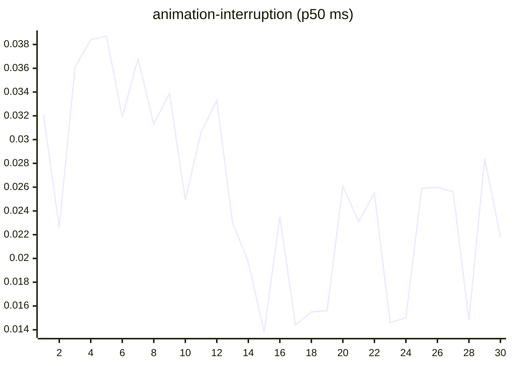
```mermaid
xychart-beta
    title "animation-interruption (p50 ms)"
    x-axis 1 --> 30
    line [0.0321, 0.0226, 0.0361, 0.0384, 0.0387, 0.0319, 0.0368, 0.0313, 0.0339, 0.0249, 0.0306, 0.0333, 0.0230, 0.0197, 0.0138, 0.0235, 0.0144, 0.0155, 0.0156, 0.0261, 0.0231, 0.0255, 0.0146, 0.0150, 0.0259, 0.0260, 0.0256, 0.0148, 0.0284, 0.0218]
```

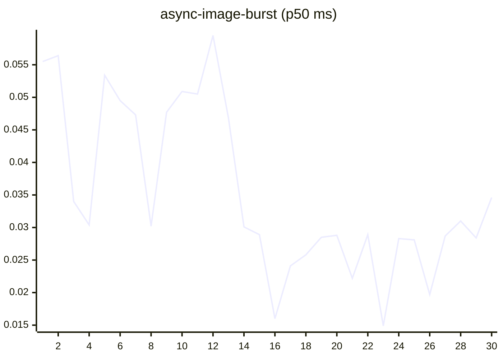
```mermaid
xychart-beta
    title "async-image-burst (p50 ms)"
    x-axis 1 --> 30
    line [0.0555, 0.0564, 0.0340, 0.0304, 0.0534, 0.0495, 0.0473, 0.0302, 0.0477, 0.0509, 0.0505, 0.0595, 0.0468, 0.0301, 0.0289, 0.0160, 0.0241, 0.0258, 0.0285, 0.0288, 0.0222, 0.0289, 0.0149, 0.0283, 0.0281, 0.0197, 0.0287, 0.0310, 0.0284, 0.0346]
```

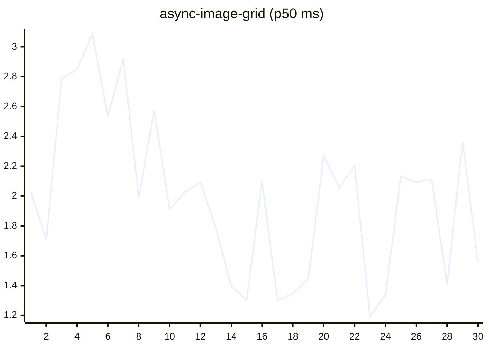
```mermaid
xychart-beta
    title "async-image-grid (p50 ms)"
    x-axis 1 --> 30
    line [2.0307, 1.7099, 2.7848, 2.8523, 3.0834, 2.5349, 2.9237, 1.9862, 2.5787, 1.9102, 2.0270, 2.0924, 1.7862, 1.3954, 1.3043, 2.1007, 1.3011, 1.3467, 1.4457, 2.2705, 2.0555, 2.2044, 1.1914, 1.3367, 2.1339, 2.0928, 2.1114, 1.4048, 2.3659, 1.5548]
```

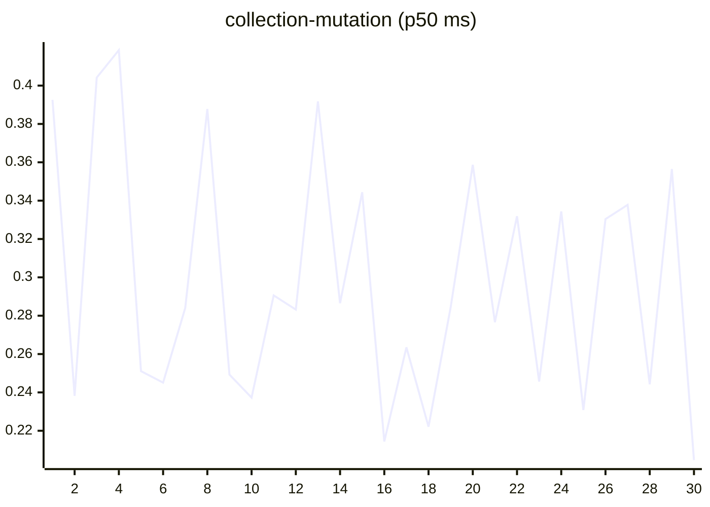
```mermaid
xychart-beta
    title "collection-mutation (p50 ms)"
    x-axis 1 --> 30
    line [0.3926, 0.2382, 0.4042, 0.4185, 0.2511, 0.2451, 0.2840, 0.3878, 0.2493, 0.2373, 0.2906, 0.2832, 0.3918, 0.2865, 0.3444, 0.2144, 0.2635, 0.2221, 0.2844, 0.3587, 0.2766, 0.3319, 0.2457, 0.3344, 0.2308, 0.3304, 0.3378, 0.2442, 0.3565, 0.2047]
```

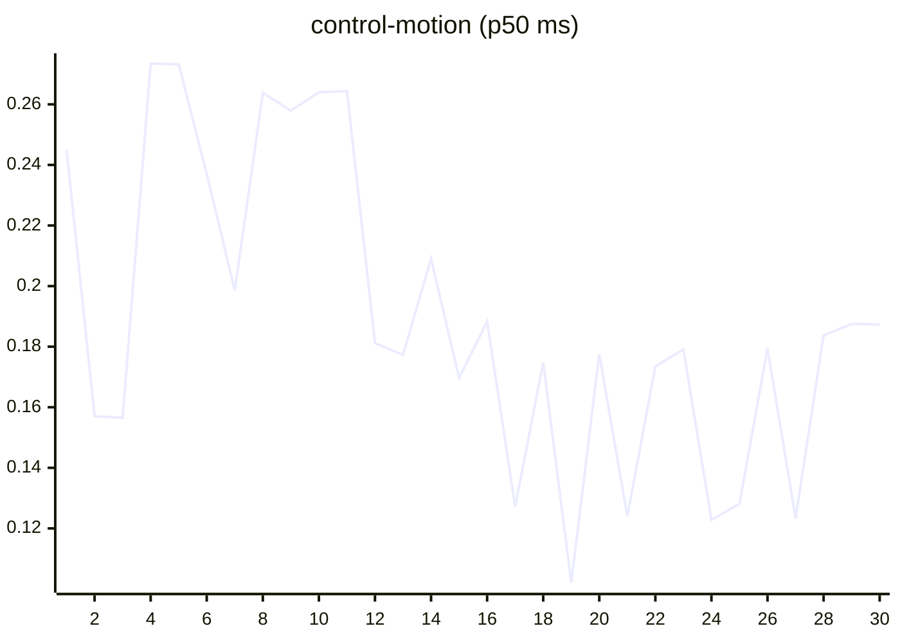
```mermaid
xychart-beta
    title "control-motion (p50 ms)"
    x-axis 1 --> 30
    line [0.2450, 0.1570, 0.1565, 0.2735, 0.2732, 0.2370, 0.1986, 0.2638, 0.2579, 0.2640, 0.2644, 0.1812, 0.1773, 0.2090, 0.1697, 0.1883, 0.1272, 0.1748, 0.1021, 0.1776, 0.1240, 0.1735, 0.1791, 0.1228, 0.1281, 0.1795, 0.1233, 0.1837, 0.1875, 0.1873]
```

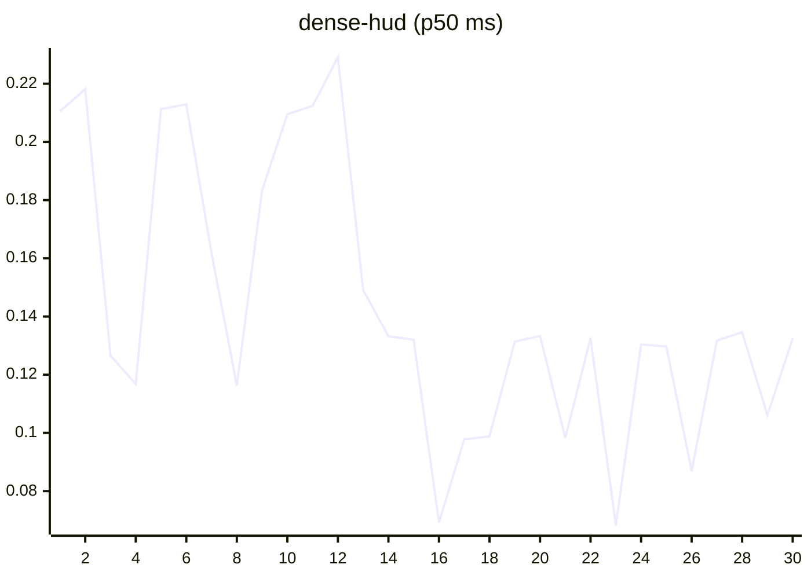
```mermaid
xychart-beta
    title "dense-hud (p50 ms)"
    x-axis 1 --> 30
    line [0.2105, 0.2181, 0.1266, 0.1168, 0.2113, 0.2129, 0.1617, 0.1163, 0.1833, 0.2095, 0.2124, 0.2291, 0.1491, 0.1332, 0.1320, 0.0692, 0.0978, 0.0988, 0.1314, 0.1333, 0.0983, 0.1326, 0.0682, 0.1304, 0.1297, 0.0869, 0.1317, 0.1346, 0.1061, 0.1325]
```

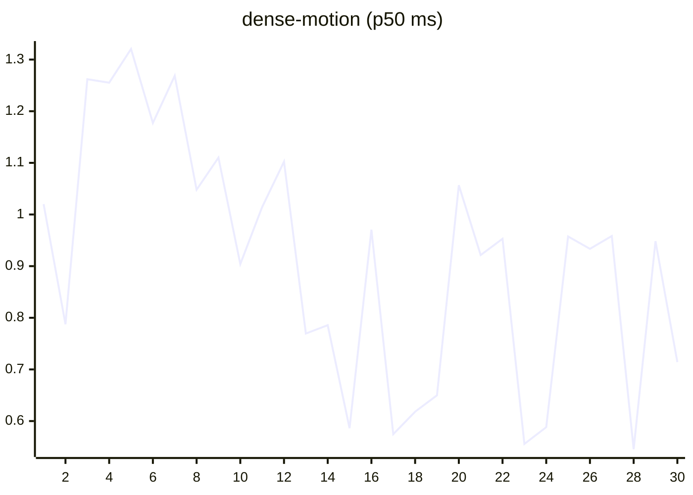
```mermaid
xychart-beta
    title "dense-motion (p50 ms)"
    x-axis 1 --> 30
    line [1.0200, 0.7874, 1.2619, 1.2553, 1.3206, 1.1772, 1.2685, 1.0480, 1.1102, 0.9040, 1.0144, 1.1023, 0.7695, 0.7856, 0.5862, 0.9706, 0.5746, 0.6181, 0.6498, 1.0567, 0.9215, 0.9530, 0.5557, 0.5881, 0.9575, 0.9335, 0.9584, 0.5455, 0.9484, 0.7142]
```

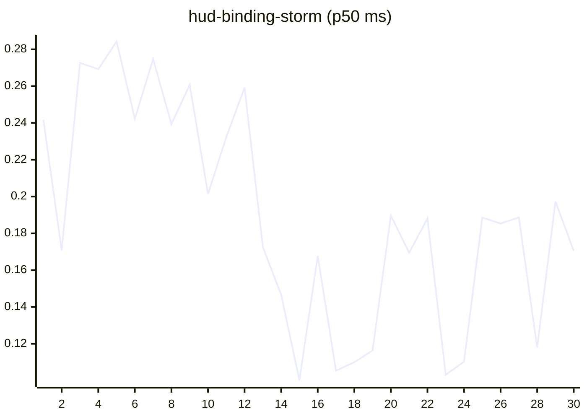
```mermaid
xychart-beta
    title "hud-binding-storm (p50 ms)"
    x-axis 1 --> 30
    line [0.2417, 0.1708, 0.2726, 0.2692, 0.2843, 0.2423, 0.2747, 0.2394, 0.2607, 0.2014, 0.2323, 0.2592, 0.1726, 0.1467, 0.1002, 0.1677, 0.1054, 0.1100, 0.1164, 0.1897, 0.1695, 0.1881, 0.1032, 0.1103, 0.1886, 0.1853, 0.1887, 0.1180, 0.1973, 0.1705]
```

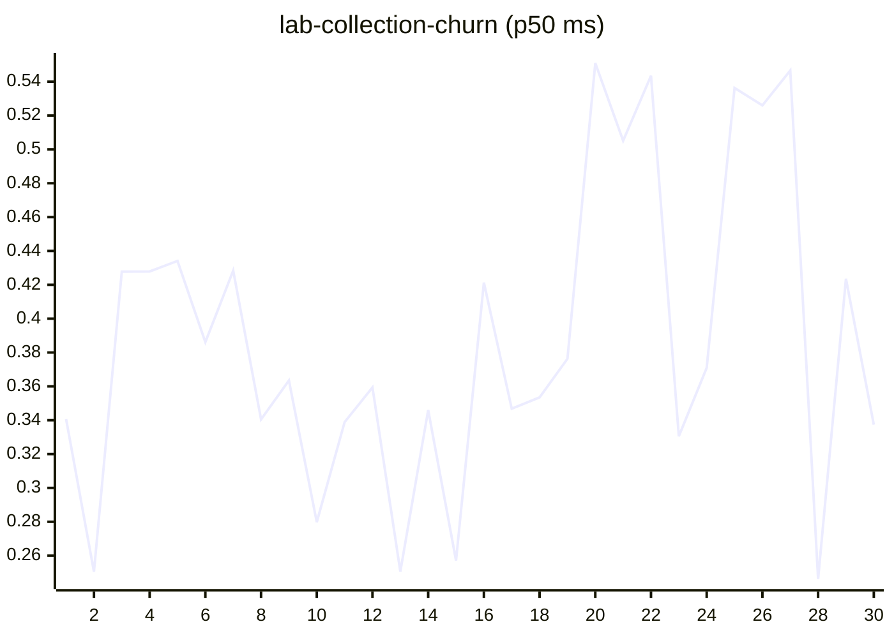
```mermaid
xychart-beta
    title "lab-collection-churn (p50 ms)"
    x-axis 1 --> 30
    line [0.3407, 0.2505, 0.4278, 0.4279, 0.4341, 0.3861, 0.4284, 0.3405, 0.3635, 0.2798, 0.3389, 0.3594, 0.2506, 0.3460, 0.2571, 0.4213, 0.3468, 0.3535, 0.3763, 0.5510, 0.5051, 0.5435, 0.3305, 0.3710, 0.5363, 0.5260, 0.5466, 0.2462, 0.4236, 0.3374]
```

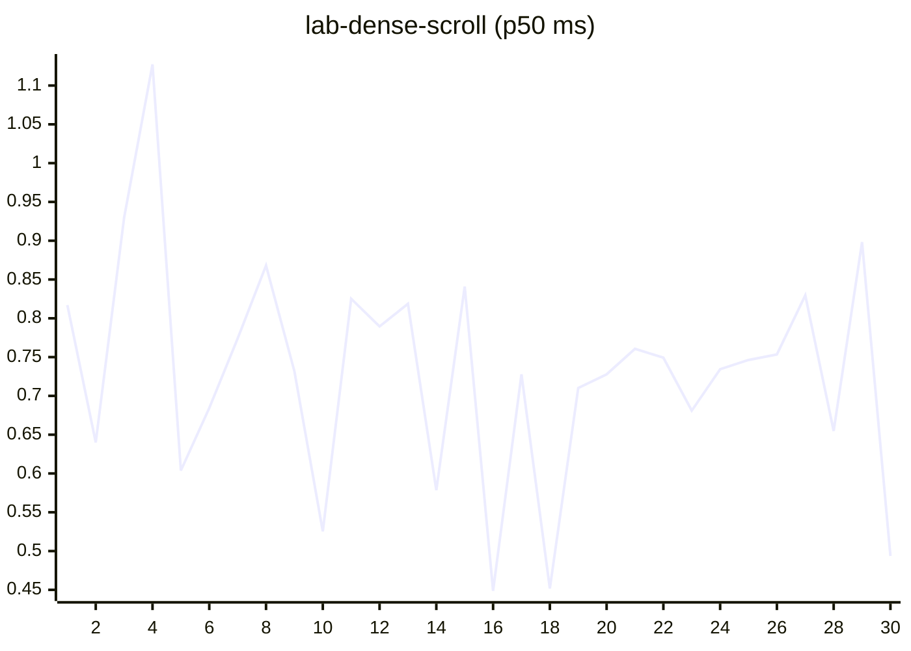
```mermaid
xychart-beta
    title "lab-dense-scroll (p50 ms)"
    x-axis 1 --> 30
    line [0.8171, 0.6401, 0.9297, 1.1273, 0.6038, 0.6843, 0.7739, 0.8680, 0.7317, 0.5254, 0.8252, 0.7895, 0.8186, 0.5785, 0.8409, 0.4488, 0.7278, 0.4517, 0.7102, 0.7278, 0.7607, 0.7492, 0.6810, 0.7343, 0.7463, 0.7534, 0.8296, 0.6548, 0.8982, 0.4937]
```

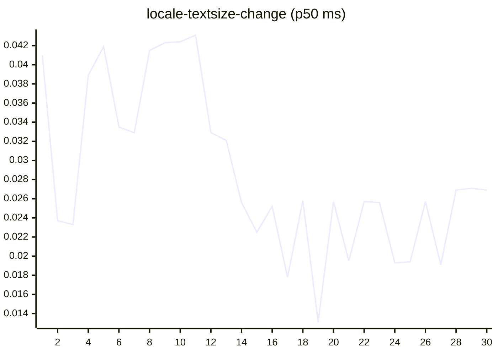
```mermaid
xychart-beta
    title "locale-textsize-change (p50 ms)"
    x-axis 1 --> 30
    line [0.0410, 0.0237, 0.0233, 0.0389, 0.0419, 0.0335, 0.0329, 0.0415, 0.0423, 0.0424, 0.0431, 0.0329, 0.0321, 0.0256, 0.0225, 0.0252, 0.0178, 0.0258, 0.0131, 0.0257, 0.0195, 0.0257, 0.0256, 0.0193, 0.0194, 0.0257, 0.0191, 0.0269, 0.0271, 0.0269]
```

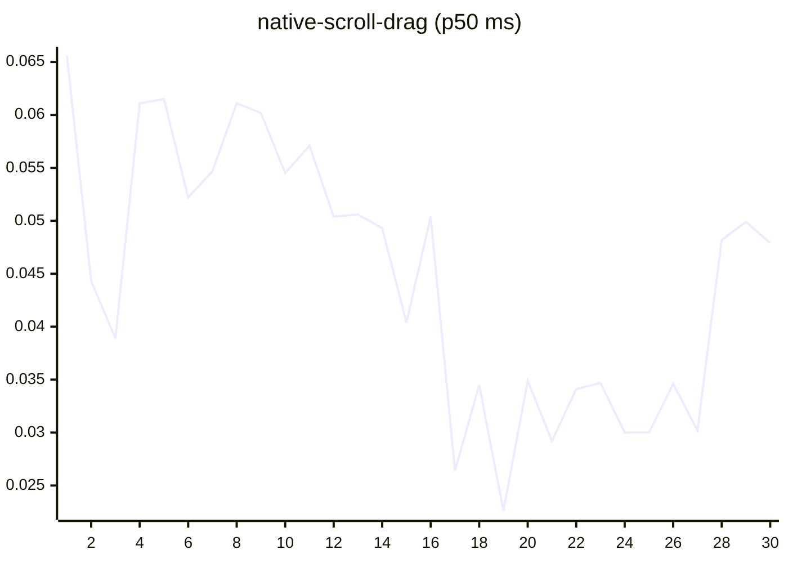
```mermaid
xychart-beta
    title "native-scroll-drag (p50 ms)"
    x-axis 1 --> 30
    line [0.0656, 0.0443, 0.0389, 0.0611, 0.0615, 0.0522, 0.0547, 0.0611, 0.0602, 0.0545, 0.0571, 0.0504, 0.0506, 0.0493, 0.0404, 0.0504, 0.0264, 0.0345, 0.0226, 0.0349, 0.0292, 0.0341, 0.0347, 0.0300, 0.0300, 0.0346, 0.0302, 0.0482, 0.0499, 0.0479]
```

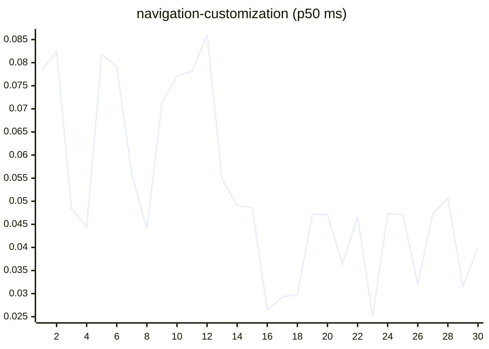
```mermaid
xychart-beta
    title "navigation-customization (p50 ms)"
    x-axis 1 --> 30
    line [0.0783, 0.0824, 0.0483, 0.0444, 0.0818, 0.0791, 0.0557, 0.0440, 0.0713, 0.0771, 0.0781, 0.0861, 0.0547, 0.0491, 0.0486, 0.0265, 0.0293, 0.0298, 0.0472, 0.0471, 0.0364, 0.0466, 0.0250, 0.0473, 0.0472, 0.0320, 0.0473, 0.0508, 0.0316, 0.0399]
```

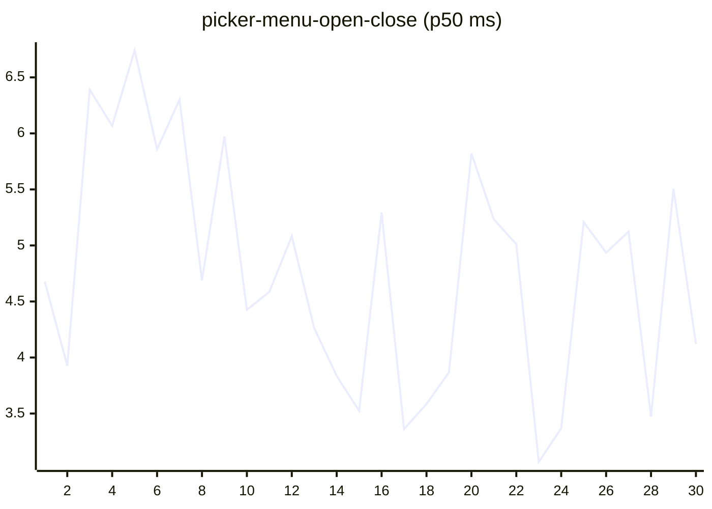
```mermaid
xychart-beta
    title "picker-menu-open-close (p50 ms)"
    x-axis 1 --> 30
    line [4.6774, 3.9267, 6.3897, 6.0683, 6.7415, 5.8582, 6.3016, 4.6878, 5.9725, 4.4246, 4.5868, 5.0832, 4.2609, 3.8354, 3.5244, 5.2942, 3.3612, 3.5857, 3.8672, 5.8216, 5.2328, 5.0107, 3.0683, 3.3695, 5.2090, 4.9360, 5.1232, 3.4711, 5.5061, 4.1198]
```

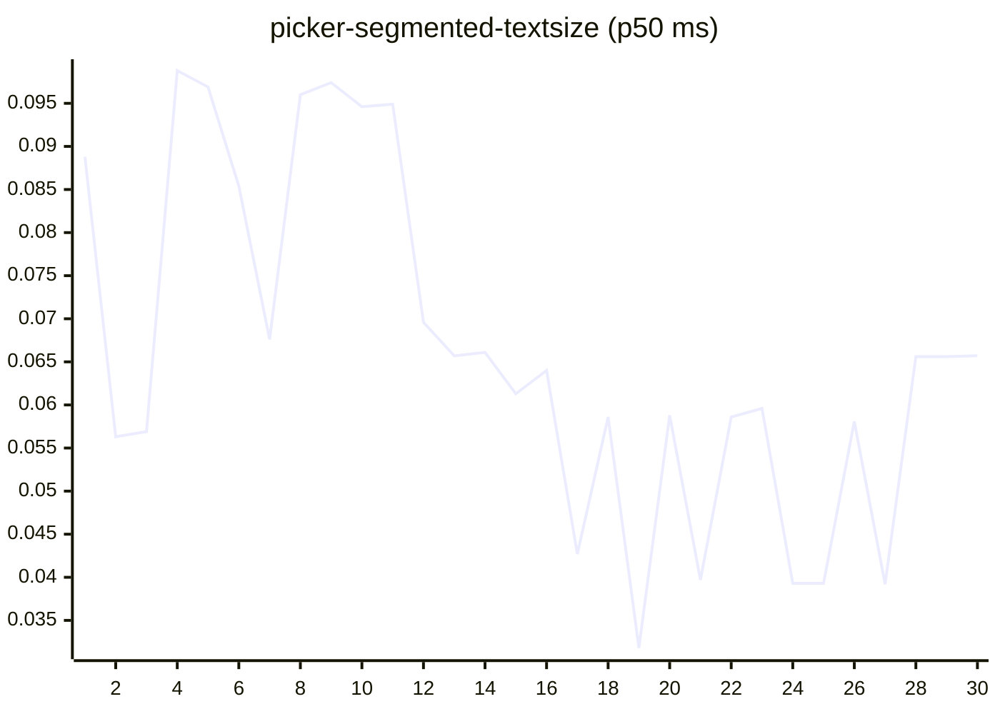
```mermaid
xychart-beta
    title "picker-segmented-textsize (p50 ms)"
    x-axis 1 --> 30
    line [0.0888, 0.0563, 0.0569, 0.0988, 0.0969, 0.0854, 0.0676, 0.0960, 0.0974, 0.0946, 0.0949, 0.0696, 0.0657, 0.0661, 0.0613, 0.0640, 0.0427, 0.0586, 0.0318, 0.0588, 0.0397, 0.0586, 0.0596, 0.0393, 0.0393, 0.0581, 0.0392, 0.0656, 0.0656, 0.0657]
```

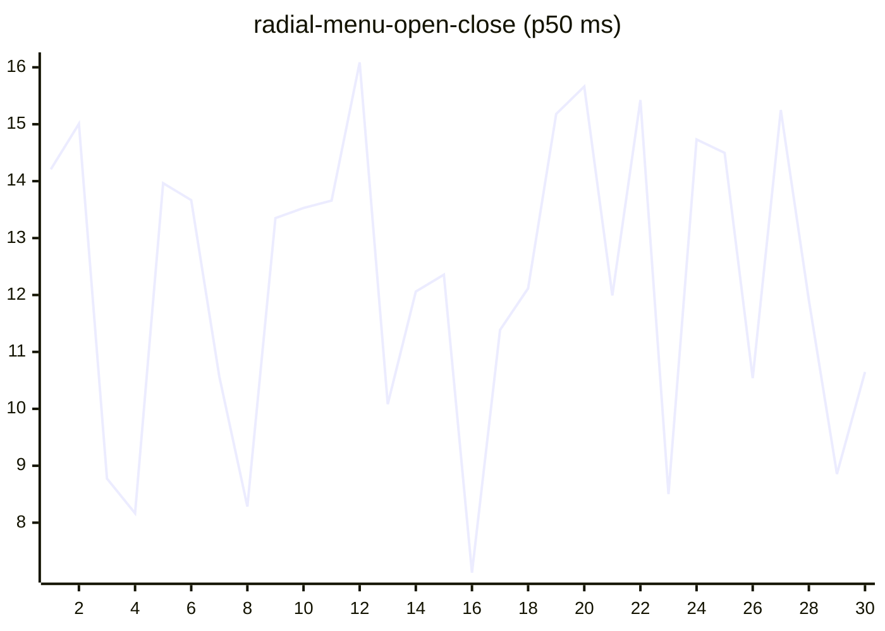
```mermaid
xychart-beta
    title "radial-menu-open-close (p50 ms)"
    x-axis 1 --> 30
    line [14.2081, 15.0064, 8.7734, 8.1647, 13.9647, 13.6671, 10.5695, 8.2821, 13.3516, 13.5281, 13.6578, 16.0867, 10.0812, 12.0610, 12.3566, 7.1223, 11.3851, 12.1177, 15.1793, 15.6625, 11.9922, 15.4241, 8.5021, 14.7322, 14.4967, 10.5386, 15.2491, 11.9098, 8.8559, 10.6468]
```

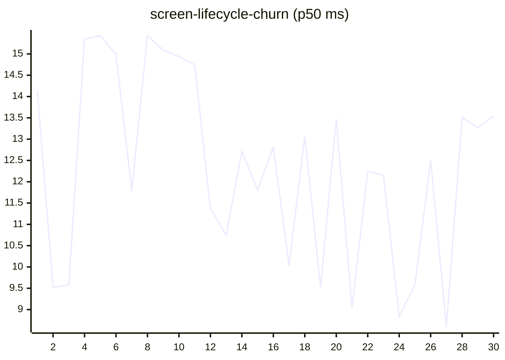
```mermaid
xychart-beta
    title "screen-lifecycle-churn (p50 ms)"
    x-axis 1 --> 30
    line [14.1404, 9.5225, 9.5780, 15.3495, 15.4269, 14.9874, 11.7933, 15.4305, 15.0900, 14.9376, 14.7456, 11.3734, 10.7529, 12.7109, 11.8139, 12.8153, 10.0331, 13.0666, 9.5193, 13.4743, 9.0409, 12.2455, 12.1517, 8.8344, 9.5778, 12.4966, 8.5977, 13.5093, 13.2704, 13.5467]
```

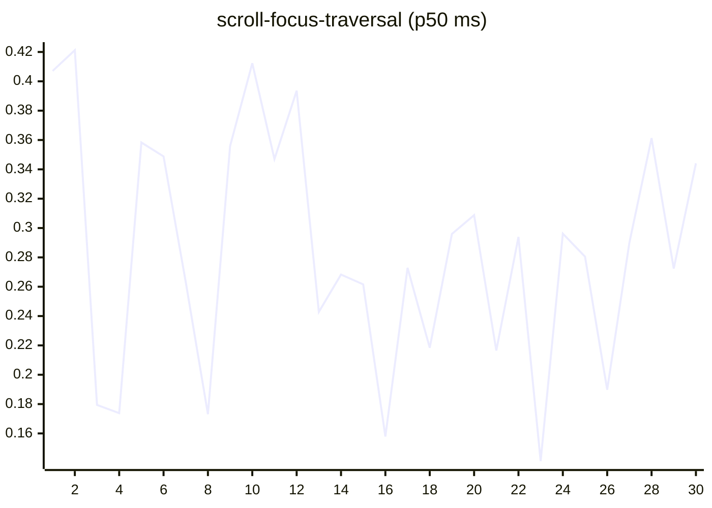
```mermaid
xychart-beta
    title "scroll-focus-traversal (p50 ms)"
    x-axis 1 --> 30
    line [0.4071, 0.4212, 0.1794, 0.1738, 0.3583, 0.3488, 0.2632, 0.1731, 0.3559, 0.4123, 0.3470, 0.3936, 0.2428, 0.2683, 0.2616, 0.1579, 0.2729, 0.2184, 0.2960, 0.3088, 0.2165, 0.2939, 0.1412, 0.2962, 0.2805, 0.1898, 0.2900, 0.3613, 0.2724, 0.3441]
```

```mermaid
xychart-beta
    title "settings-churn (p50 ms)"
    x-axis 1 --> 30
    line [3.5400, 2.4981, 2.4112, 3.9313, 3.9827, 3.6842, 2.9600, 3.9402, 3.9037, 3.8852, 3.8874, 2.8980, 2.7917, 3.2181, 2.9077, 3.2308, 2.5393, 3.2901, 2.2059, 3.3073, 2.2876, 3.0787, 3.1293, 2.1529, 2.2320, 3.1547, 2.1109, 3.4087, 3.3518, 3.4134]
```

```mermaid
xychart-beta
    title "shadow-storm (p50 ms)"
    x-axis 1 --> 30
    line [0.0006, 0.0003, 0.0006, 0.0006, 0.0004, 0.0003, 0.0005, 0.0006, 0.0003, 0.0003, 0.0005, 0.0005, 0.0006, 0.0004, 0.0005, 0.0003, 0.0005, 0.0003, 0.0004, 0.0006, 0.0005, 0.0005, 0.0005, 0.0006, 0.0003, 0.0006, 0.0006, 0.0005, 0.0005, 0.0003]
```

```mermaid
xychart-beta
    title "stylesheet-state-churn (p50 ms)"
    x-axis 1 --> 30
    line [0.4202, 0.2626, 0.4522, 0.4744, 0.2757, 0.2547, 0.3426, 0.4392, 0.2833, 0.2439, 0.3783, 0.3392, 0.4331, 0.2382, 0.3305, 0.1701, 0.2238, 0.1527, 0.2148, 0.2818, 0.2531, 0.2763, 0.2052, 0.2751, 0.1649, 0.2753, 0.2849, 0.2226, 0.3169, 0.1706]
```

```mermaid
xychart-beta
    title "theme-swap-assets (p50 ms)"
    x-axis 1 --> 30
    line [1.7819, 2.1619, 1.1552, 1.0581, 1.8573, 1.8118, 1.4261, 1.0897, 1.8006, 1.8292, 1.8218, 2.7585, 1.4082, 1.4948, 1.4915, 0.8245, 1.1146, 1.1402, 1.4339, 1.4804, 1.2601, 1.4628, 0.8150, 1.4251, 1.3983, 1.1987, 1.4628, 1.5047, 1.1448, 1.4400]
```

```mermaid
xychart-beta
    title "theme-swap-flat (p50 ms)"
    x-axis 1 --> 30
    line [0.4311, 0.4464, 0.2540, 0.2314, 0.4388, 0.4372, 0.3396, 0.2353, 0.3878, 0.4400, 0.4400, 0.4800, 0.3351, 0.3875, 0.3811, 0.2143, 0.2821, 0.3083, 0.3627, 0.3699, 0.2574, 0.3669, 0.2145, 0.3647, 0.3618, 0.2296, 0.3704, 0.3698, 0.2821, 0.3797]
```

```mermaid
xychart-beta
    title "theme-swap-metrics (p50 ms)"
    x-axis 1 --> 30
    line [1.7623, 1.0742, 1.8376, 2.1766, 1.3874, 1.1282, 1.5453, 1.8023, 1.1545, 1.0747, 1.5747, 1.4993, 1.8069, 1.0357, 1.2674, 0.7227, 1.1037, 0.8157, 1.1826, 1.3409, 1.1553, 1.3565, 1.0868, 1.3565, 0.8402, 1.3457, 1.3628, 1.0277, 1.3393, 0.7291]
```

```mermaid
xychart-beta
    title "virtual-list-scroll (p50 ms)"
    x-axis 1 --> 30
    line [0.1328, 0.1149, 0.2387, 0.2094, 0.1951, 0.1690, 0.1968, 0.1330, 0.1860, 0.1610, 0.1608, 0.1380, 0.1069, 0.1039, 0.0963, 0.1546, 0.0862, 0.0915, 0.0898, 0.1373, 0.1218, 0.1290, 0.0734, 0.0848, 0.1283, 0.1268, 0.1281, 0.0894, 0.1468, 0.0966]
```
