# Facet performance

Latest: `0f91aa23f1c4c0fba03536a4aa8d37fe3e7e3aee` on 2026-10-26T221356Z, measured on the CI Ubuntu runner by the paired performance shards.
Times are milliseconds per frame or operation: the median over paired rounds of each round's p50 and p95.
Retained heap is the scene's mounted retained Luau heap. Change compares the p50 of the previous main commit.

| Scene | p50 ms | p95 ms | Retained KiB | Change |
| --- | ---: | ---: | ---: | ---: |
| adaptive-navigation-images | 1.2030 | 1.5412 | 4170 | -9.8% |
| alert-present-dismiss | 2.6392 | 4.1051 | 2370 | -30.4% |
| animation-interruption | 0.0325 | 0.0374 | 396 | -17.4% |
| async-image-burst | 0.0451 | 0.0539 | 518 | -0.6% |
| async-image-grid | 2.4103 | 3.5913 | 2125 | -10.9% |
| collection-mutation | 0.2826 | 0.4488 | 3915 | -41.4% |
| control-motion | 0.2422 | 0.5738 | 1880 | -4.3% |
| dense-hud | 0.1966 | 0.2173 | 822 | -0.3% |
| dense-motion | 1.4323 | 2.4582 | 2185 | -9.4% |
| hud-binding-storm | 0.2534 | 0.2674 | 487 | -3.0% |
| lab-collection-churn | 0.3556 | 0.6633 | 4571 | -14.4% |
| lab-dense-scroll | 0.7780 | 3.8272 | 8057 | -20.2% |
| locale-textsize-change | 0.0345 | 0.0421 | 496 | -2.7% |
| native-scroll-drag | 0.0616 | 0.0743 | 1935 | +5.6% |
| navigation-customization | 0.0662 | 0.0772 | 4672 | -0.1% |
| picker-menu-open-close | 6.1978 | 9.1124 | 0 | -6.1% |
| picker-segmented-textsize | 0.0734 | 0.0831 | 1014 | -15.0% |
| radial-menu-open-close | 12.8695 | 18.9705 | 1212 | -1.4% |
| screen-lifecycle-churn | 13.7187 | 22.5196 | 1395 | -7.8% |
| scroll-focus-traversal | 0.4056 | 0.5833 | 1372 | -2.9% |
| settings-churn | 3.3635 | 5.2071 | 2357 | -10.2% |
| shadow-storm | 0.0003 | 0.0015 | 1985 | -48.4% |
| stylesheet-state-churn | 0.2685 | 0.5403 | 3188 | -40.2% |
| theme-swap-assets | 2.1255 | 2.5470 | 5126 | -0.8% |
| theme-swap-flat | 0.5031 | 0.5802 | 4441 | -1.8% |
| theme-swap-metrics | 1.0456 | 1.2663 | 4952 | -40.1% |
| virtual-list-scroll | 0.1791 | 0.3742 | 5727 | -10.6% |

| Microbenchmark | p50 ms | p95 ms | Change |
| --- | ---: | ---: | ---: |
| billboard-nameplate-storm | 0.1565 | 0.1884 | -9.6% |
| collection-mutation | 0.0092 | 0.0124 | +8.8% |
| collection-selection-update | 0.0032 | 0.0048 | +0.6% |
| hud-binding-storm | 0.2083 | 0.2214 | -40.2% |
| motion-declarative | 1.2280 | 1.9145 | -1.0% |
| motion-explicit | 1.2248 | 1.9916 | +2.6% |
| mount-ramp | 148.6508 | 162.9204 | +0.0% |
| mount-ramp-inherited | 114.1553 | 135.4916 | -30.0% |
| mounted-slice-update-storm | 0.2352 | 0.2899 | -4.7% |
| outline-measured-update | 1.9539 | 3.0064 | +1.4% |
| reserved-slot-record-update | 0.8485 | 1.3113 | -1.8% |
| settings-churn | 0.0083 | 0.0094 | -48.7% |
| sparse-update-under-load | 0.0022 | 0.0025 | -11.0% |
| table-mutation | 0.3785 | 0.4650 | -12.7% |
| table-resize-drag | 3.2887 | 5.3777 | -1.3% |
| table-sort-values | 0.9158 | 1.3722 | -33.8% |
| table-source-refresh | 0.2304 | 0.4107 | -11.3% |
| textinput-typing-storm | 0.2624 | 0.4088 | +3.0% |
| timer-readout-storm | 0.1621 | 2.5089 | -0.2% |
| zz-yardstick-cpu-after | 1.2925 | 1.3258 | -0.9% |
| zz-yardstick-cpu-before | 1.2788 | 1.2839 | -1.4% |

## Scene p50 over the last 11 main commits

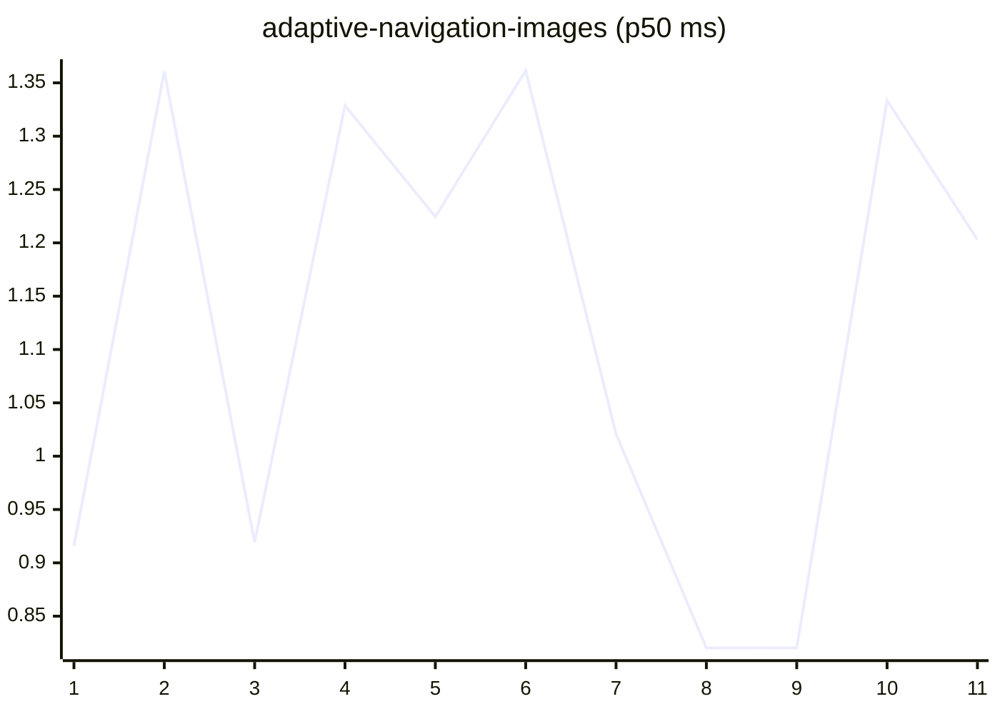
```mermaid
xychart-beta
    title "adaptive-navigation-images (p50 ms)"
    x-axis 1 --> 11
    line [0.9159, 1.3609, 0.9193, 1.3288, 1.2245, 1.3615, 1.0208, 0.8202, 0.8203, 1.3336, 1.2030]
```

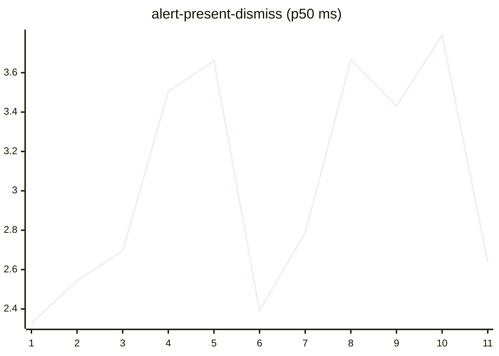
```mermaid
xychart-beta
    title "alert-present-dismiss (p50 ms)"
    x-axis 1 --> 11
    line [2.3284, 2.5432, 2.6957, 3.5058, 3.6611, 2.3918, 2.7865, 3.6648, 3.4312, 3.7906, 2.6392]
```

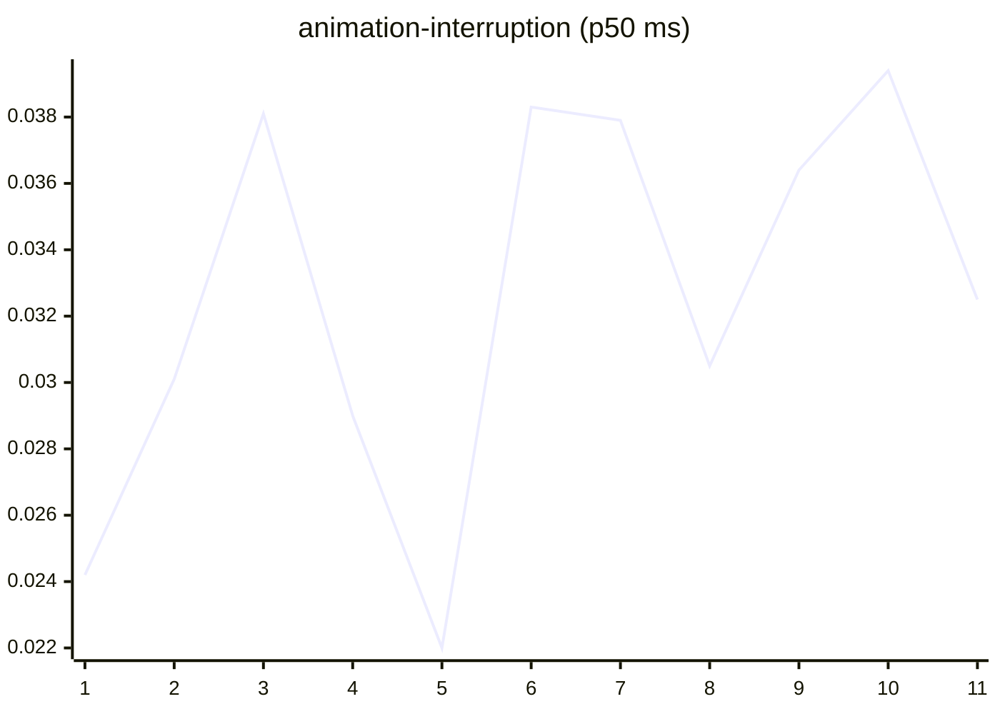
```mermaid
xychart-beta
    title "animation-interruption (p50 ms)"
    x-axis 1 --> 11
    line [0.0242, 0.0301, 0.0381, 0.0290, 0.0220, 0.0383, 0.0379, 0.0305, 0.0364, 0.0394, 0.0325]
```

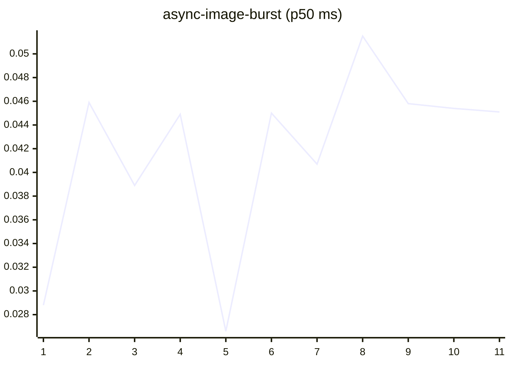
```mermaid
xychart-beta
    title "async-image-burst (p50 ms)"
    x-axis 1 --> 11
    line [0.0288, 0.0459, 0.0389, 0.0449, 0.0266, 0.0450, 0.0407, 0.0515, 0.0458, 0.0454, 0.0451]
```

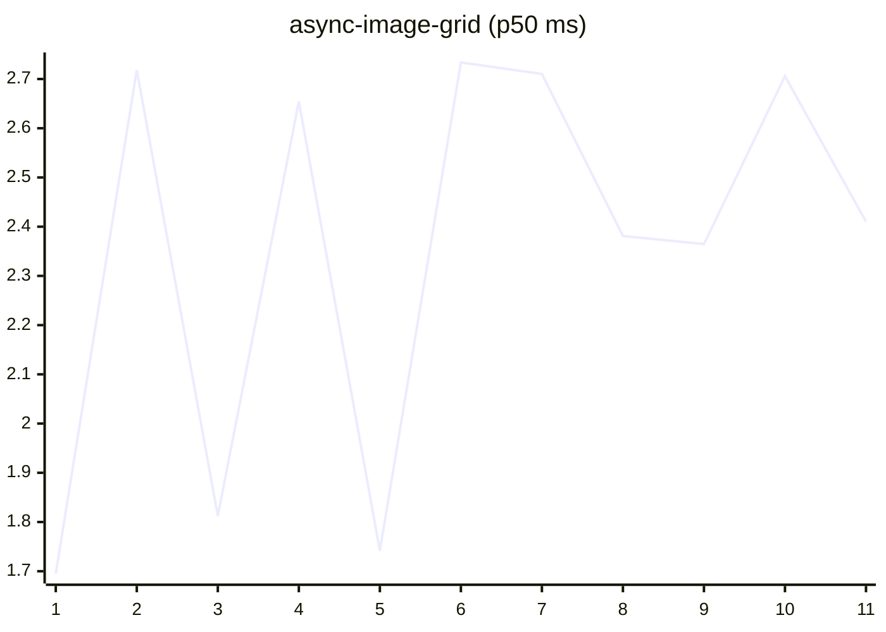
```mermaid
xychart-beta
    title "async-image-grid (p50 ms)"
    x-axis 1 --> 11
    line [1.6953, 2.7184, 1.8124, 2.6543, 1.7415, 2.7336, 2.7103, 2.3810, 2.3646, 2.7059, 2.4103]
```

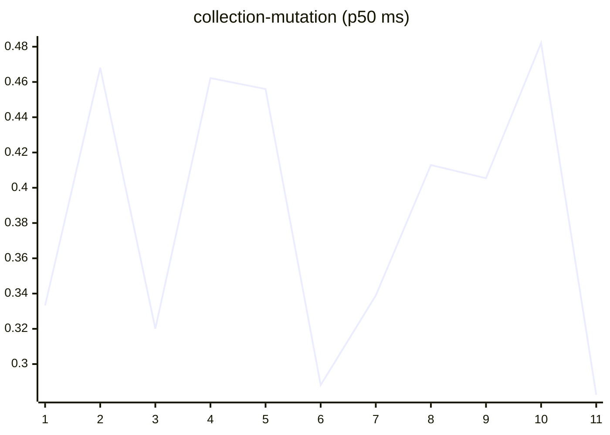
```mermaid
xychart-beta
    title "collection-mutation (p50 ms)"
    x-axis 1 --> 11
    line [0.3332, 0.4681, 0.3201, 0.4622, 0.4560, 0.2881, 0.3389, 0.4129, 0.4054, 0.4821, 0.2826]
```

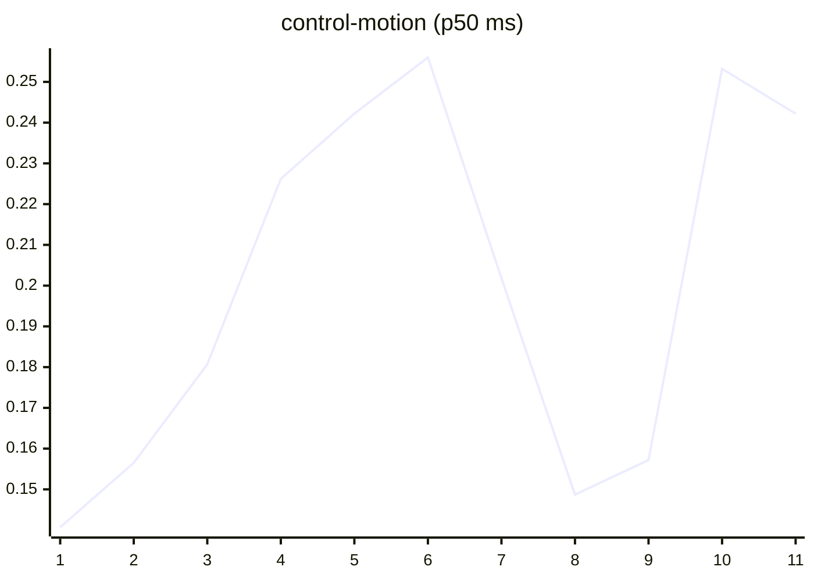
```mermaid
xychart-beta
    title "control-motion (p50 ms)"
    x-axis 1 --> 11
    line [0.1407, 0.1565, 0.1807, 0.2262, 0.2422, 0.2560, 0.2018, 0.1487, 0.1572, 0.2532, 0.2422]
```

```mermaid
xychart-beta
    title "dense-hud (p50 ms)"
    x-axis 1 --> 11
    line [0.1402, 0.1574, 0.1997, 0.1472, 0.1114, 0.1957, 0.1522, 0.1905, 0.1825, 0.1972, 0.1966]
```

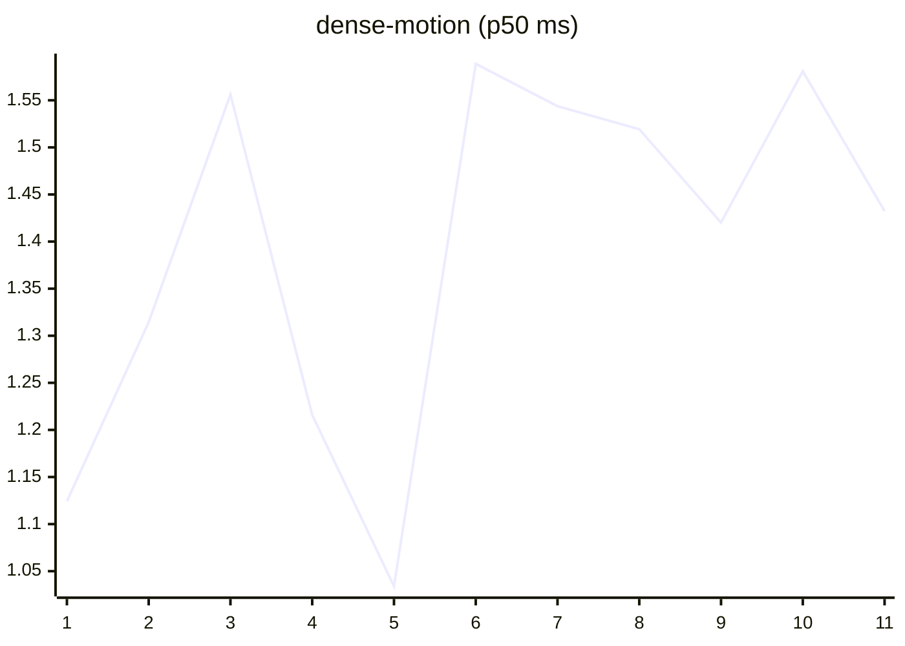
```mermaid
xychart-beta
    title "dense-motion (p50 ms)"
    x-axis 1 --> 11
    line [1.1243, 1.3144, 1.5562, 1.2159, 1.0340, 1.5887, 1.5438, 1.5193, 1.4201, 1.5809, 1.4323]
```

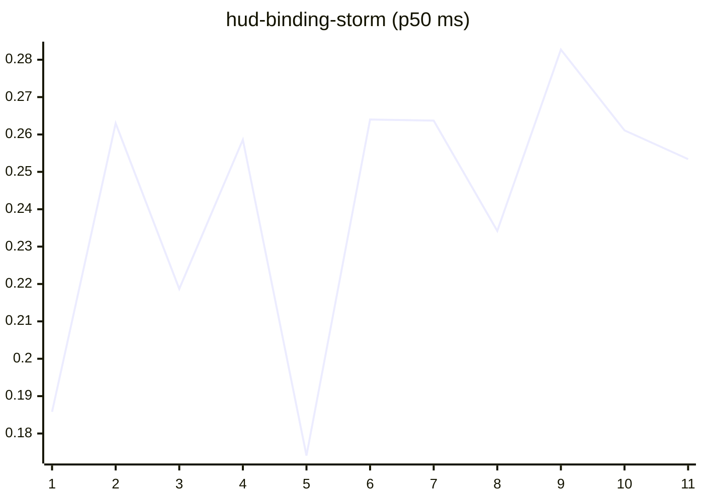
```mermaid
xychart-beta
    title "hud-binding-storm (p50 ms)"
    x-axis 1 --> 11
    line [0.1858, 0.2630, 0.2187, 0.2586, 0.1741, 0.2640, 0.2637, 0.2342, 0.2827, 0.2611, 0.2534]
```

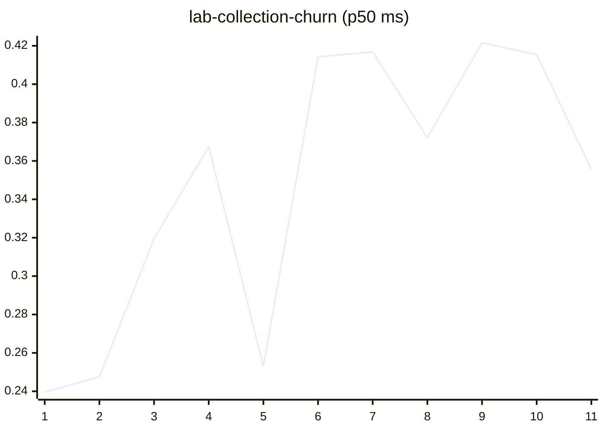
```mermaid
xychart-beta
    title "lab-collection-churn (p50 ms)"
    x-axis 1 --> 11
    line [0.2396, 0.2475, 0.3195, 0.3675, 0.2530, 0.4143, 0.4168, 0.3722, 0.4216, 0.4154, 0.3556]
```

```mermaid
xychart-beta
    title "lab-dense-scroll (p50 ms)"
    x-axis 1 --> 11
    line [0.7446, 0.8751, 0.9218, 0.7244, 0.7929, 0.5928, 0.8489, 0.9164, 0.8310, 0.9747, 0.7780]
```

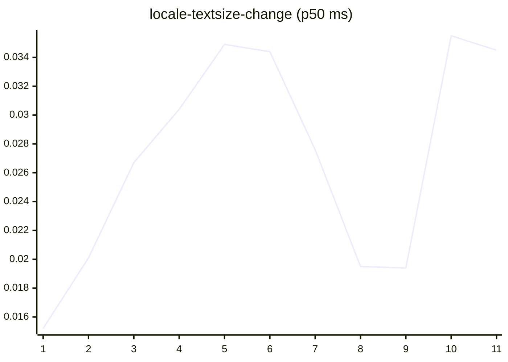
```mermaid
xychart-beta
    title "locale-textsize-change (p50 ms)"
    x-axis 1 --> 11
    line [0.0152, 0.0201, 0.0267, 0.0304, 0.0349, 0.0344, 0.0276, 0.0195, 0.0194, 0.0355, 0.0345]
```

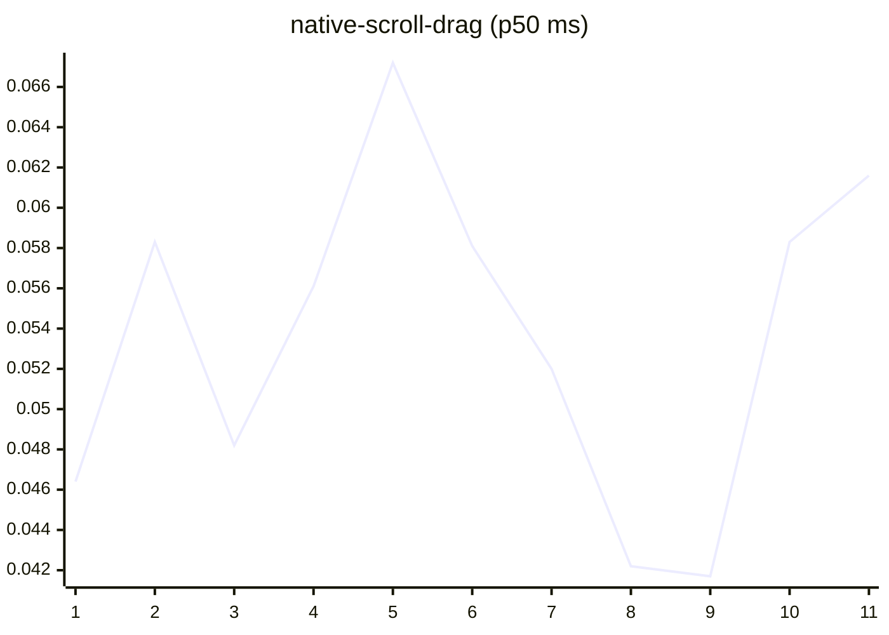
```mermaid
xychart-beta
    title "native-scroll-drag (p50 ms)"
    x-axis 1 --> 11
    line [0.0464, 0.0583, 0.0482, 0.0561, 0.0672, 0.0581, 0.0520, 0.0422, 0.0417, 0.0583, 0.0616]
```

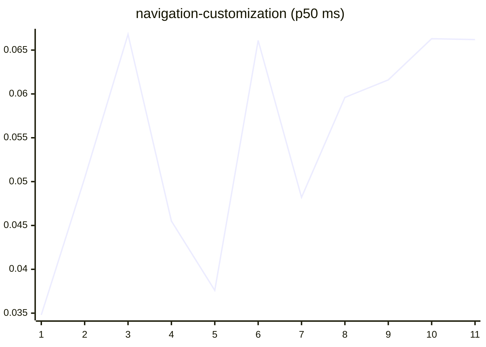
```mermaid
xychart-beta
    title "navigation-customization (p50 ms)"
    x-axis 1 --> 11
    line [0.0348, 0.0504, 0.0668, 0.0455, 0.0376, 0.0661, 0.0482, 0.0596, 0.0616, 0.0663, 0.0662]
```

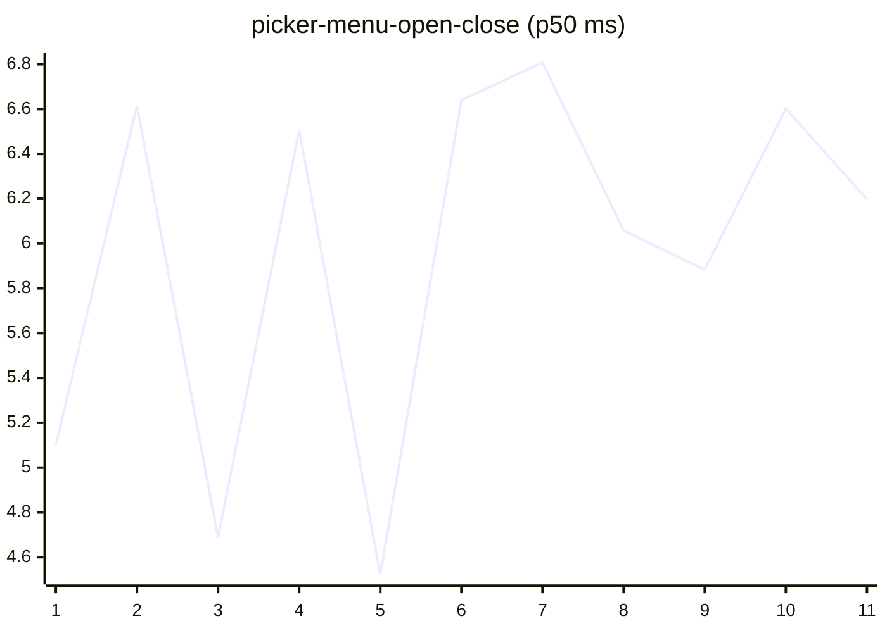
```mermaid
xychart-beta
    title "picker-menu-open-close (p50 ms)"
    x-axis 1 --> 11
    line [5.1020, 6.6154, 4.6873, 6.5076, 4.5232, 6.6400, 6.8077, 6.0581, 5.8829, 6.6018, 6.1978]
```

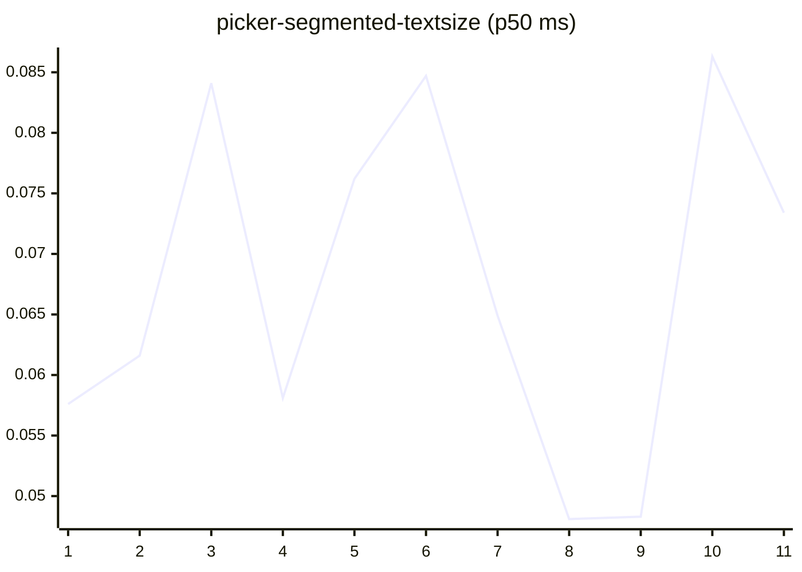
```mermaid
xychart-beta
    title "picker-segmented-textsize (p50 ms)"
    x-axis 1 --> 11
    line [0.0576, 0.0616, 0.0841, 0.0581, 0.0762, 0.0847, 0.0649, 0.0481, 0.0483, 0.0863, 0.0734]
```

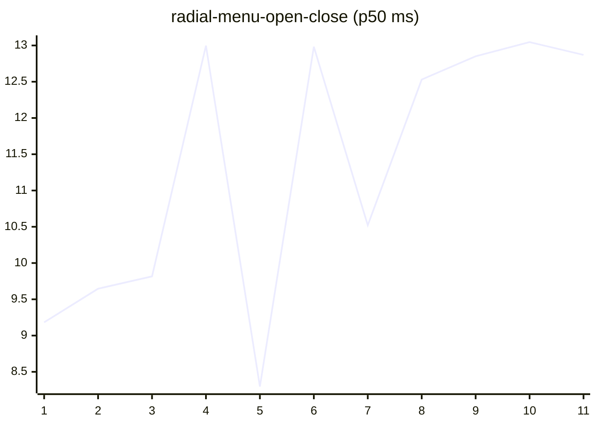
```mermaid
xychart-beta
    title "radial-menu-open-close (p50 ms)"
    x-axis 1 --> 11
    line [9.1824, 9.6461, 9.8160, 12.9977, 8.2964, 12.9826, 10.5207, 12.5300, 12.8509, 13.0462, 12.8695]
```

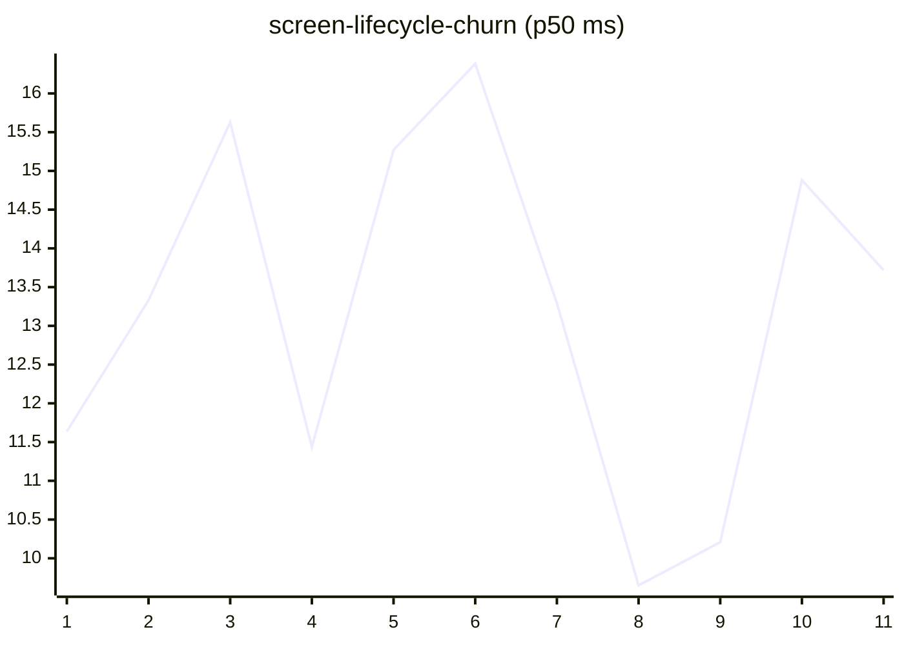
```mermaid
xychart-beta
    title "screen-lifecycle-churn (p50 ms)"
    x-axis 1 --> 11
    line [11.6362, 13.3303, 15.6277, 11.4367, 15.2702, 16.3829, 13.2931, 9.6509, 10.2078, 14.8820, 13.7187]
```

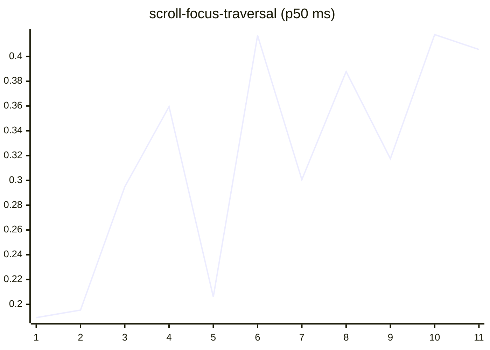
```mermaid
xychart-beta
    title "scroll-focus-traversal (p50 ms)"
    x-axis 1 --> 11
    line [0.1893, 0.1954, 0.2948, 0.3595, 0.2060, 0.4169, 0.3006, 0.3878, 0.3175, 0.4176, 0.4056]
```

```mermaid
xychart-beta
    title "settings-churn (p50 ms)"
    x-axis 1 --> 11
    line [2.4831, 3.3595, 3.8546, 2.7052, 3.5707, 4.0222, 3.0879, 2.4259, 2.3824, 3.7464, 3.3635]
```

```mermaid
xychart-beta
    title "shadow-storm (p50 ms)"
    x-axis 1 --> 11
    line [0.0005, 0.0005, 0.0006, 0.0005, 0.0006, 0.0003, 0.0005, 0.0005, 0.0005, 0.0006, 0.0003]
```

```mermaid
xychart-beta
    title "stylesheet-state-churn (p50 ms)"
    x-axis 1 --> 11
    line [0.2123, 0.2752, 0.3220, 0.3838, 0.4071, 0.2450, 0.3266, 0.3849, 0.3681, 0.4491, 0.2685]
```

```mermaid
xychart-beta
    title "theme-swap-assets (p50 ms)"
    x-axis 1 --> 11
    line [1.5921, 2.1494, 1.6336, 2.1480, 1.2452, 2.1218, 1.7008, 2.1645, 2.1562, 2.1422, 2.1255]
```

```mermaid
xychart-beta
    title "theme-swap-flat (p50 ms)"
    x-axis 1 --> 11
    line [0.3449, 0.3183, 0.4072, 0.4900, 0.2916, 0.5121, 0.4100, 0.5278, 0.4539, 0.5122, 0.5031]
```

```mermaid
xychart-beta
    title "theme-swap-metrics (p50 ms)"
    x-axis 1 --> 11
    line [1.2519, 1.6733, 1.3190, 1.6705, 1.6681, 1.0387, 1.3725, 1.6779, 1.6201, 1.7453, 1.0456]
```

```mermaid
xychart-beta
    title "virtual-list-scroll (p50 ms)"
    x-axis 1 --> 11
    line [0.1263, 0.1363, 0.1356, 0.1842, 0.1329, 0.2108, 0.2004, 0.1771, 0.1917, 0.2003, 0.1791]
```
