# Facet performance

Latest: `391eaf645ad94b85cb294d38bacb3d5c60df6aa0` on 2026-10-28T050505Z, measured on the CI Ubuntu runner by the paired performance shards.
Times are milliseconds per frame or operation: the median over paired rounds of each round's p50 and p95.
Retained heap is the scene's mounted retained Luau heap. Change compares the p50 of the previous main commit.

| Scene | p50 ms | p95 ms | Retained KiB | Change |
| --- | ---: | ---: | ---: | ---: |
| adaptive-navigation-images | 1.3942 | 1.6818 | 2031 | -0.0% |
| alert-present-dismiss | 2.7270 | 4.3418 | 2360 | -25.9% |
| animation-interruption | 0.0227 | 0.0271 | 408 | -30.9% |
| async-image-burst | 0.0473 | 0.0556 | 519 | -12.6% |
| async-image-grid | 1.7175 | 2.7976 | 3358 | -32.7% |
| collection-mutation | 0.2784 | 0.4317 | 3808 | -27.9% |
| control-motion | 0.2643 | 0.6749 | 1836 | -1.8% |
| dense-hud | 0.1605 | 0.1779 | 820 | -23.7% |
| dense-motion | 0.7822 | 1.2062 | 2502 | -29.5% |
| hud-binding-storm | 0.1704 | 0.2374 | 497 | -34.2% |
| lab-collection-churn | 0.2441 | 0.4986 | 4212 | -31.7% |
| lab-dense-scroll | 0.7748 | 4.1177 | 6508 | -7.2% |
| locale-textsize-change | 0.0420 | 0.0492 | 517 | -1.4% |
| native-scroll-drag | 0.0555 | 0.0678 | 1658 | -3.1% |
| navigation-customization | 0.0557 | 0.0636 | 3923 | -30.5% |
| picker-menu-open-close | 3.9788 | 5.7566 | 1199 | -31.8% |
| picker-segmented-textsize | 0.0951 | 0.1140 | 955 | -2.1% |
| radial-menu-open-close | 9.8198 | 16.0722 | 1723 | -26.3% |
| screen-lifecycle-churn | 14.6881 | 26.6859 | 3940 | -3.3% |
| scroll-focus-traversal | 0.2715 | 0.4994 | 1241 | -32.1% |
| settings-churn | 3.8729 | 5.6675 | 3114 | -2.6% |
| shadow-storm | 0.0005 | 0.0014 | 2022 | -15.5% |
| stylesheet-state-churn | 0.3455 | 0.6729 | 3063 | -20.2% |
| theme-swap-assets | 1.8548 | 2.3777 | 5987 | -20.8% |
| theme-swap-flat | 0.3992 | 0.5953 | 4093 | -22.5% |
| theme-swap-metrics | 1.4878 | 1.9405 | 4862 | -17.0% |
| virtual-list-scroll | 0.1139 | 0.2563 | 5365 | -35.7% |

| Microbenchmark | p50 ms | p95 ms | Change |
| --- | ---: | ---: | ---: |
| billboard-nameplate-storm | 0.1059 | 0.1486 | -35.4% |
| collection-mutation | 0.0084 | 0.0111 | -0.4% |
| collection-selection-update | 0.0022 | 0.0040 | -16.9% |
| hud-binding-storm | 0.3179 | 0.3313 | -15.3% |
| motion-declarative | 0.7854 | 1.3378 | -35.6% |
| motion-explicit | 1.2091 | 1.9255 | -0.5% |
| mount-ramp | 133.7856 | 150.3330 | -21.7% |
| mount-ramp-inherited | 134.9838 | 150.8969 | -16.3% |
| mounted-slice-update-storm | 0.1448 | 0.1856 | -34.4% |
| outline-measured-update | 1.6451 | 2.3486 | -0.9% |
| reserved-slot-record-update | 0.7645 | 1.2722 | -20.7% |
| settings-churn | 0.0118 | 0.0150 | -30.7% |
| sparse-update-under-load | 0.0014 | 0.0016 | -39.2% |
| table-mutation | 0.3482 | 0.4809 | +2.7% |
| table-resize-drag | 2.5326 | 4.6609 | -26.0% |
| table-sort-values | 0.9544 | 1.3998 | -24.5% |
| table-source-refresh | 0.1443 | 0.3054 | -36.7% |
| textinput-typing-storm | 0.2918 | 0.4571 | +4.4% |
| timer-readout-storm | 0.1321 | 0.7433 | -18.3% |
| zz-yardstick-cpu-after | 1.1429 | 1.1737 | -11.4% |
| zz-yardstick-cpu-before | 1.0366 | 1.0438 | -19.6% |

## Scene p50 over the last 30 main commits

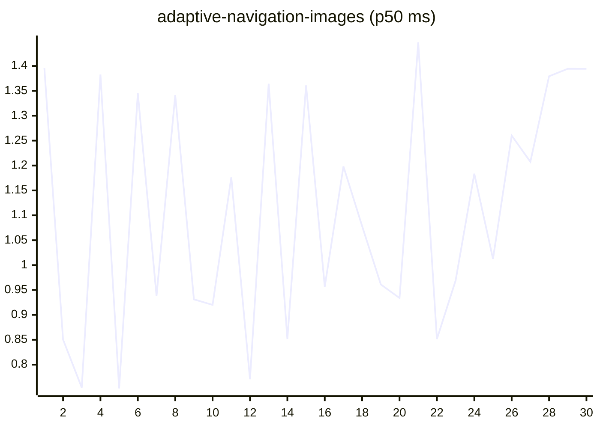
```mermaid
xychart-beta
    title "adaptive-navigation-images (p50 ms)"
    x-axis 1 --> 30
    line [1.3956, 0.8504, 0.7540, 1.3829, 0.7523, 1.3455, 0.9380, 1.3415, 0.9312, 0.9201, 1.1763, 0.7707, 1.3642, 0.8516, 1.3610, 0.9567, 1.1983, 1.0783, 0.9612, 0.9339, 1.4475, 0.8514, 0.9690, 1.1835, 1.0125, 1.2600, 1.2076, 1.3793, 1.3944, 1.3942]
```

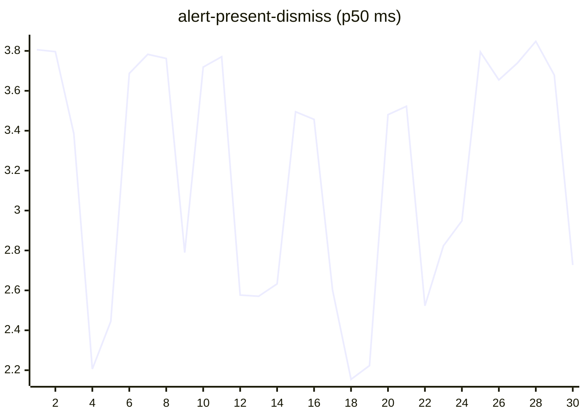
```mermaid
xychart-beta
    title "alert-present-dismiss (p50 ms)"
    x-axis 1 --> 30
    line [3.8060, 3.7961, 3.3851, 2.2058, 2.4450, 3.6869, 3.7826, 3.7621, 2.7891, 3.7187, 3.7708, 2.5766, 2.5704, 2.6324, 3.4949, 3.4566, 2.6019, 2.1543, 2.2230, 3.4803, 3.5227, 2.5229, 2.8233, 2.9484, 3.7942, 3.6546, 3.7386, 3.8479, 3.6788, 2.7270]
```

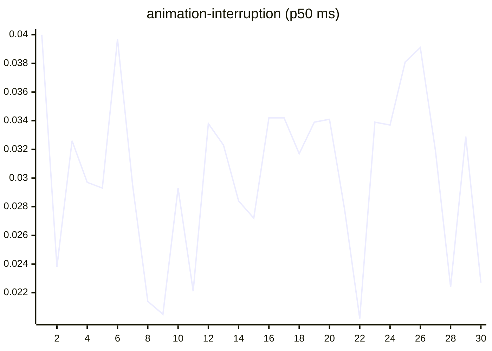
```mermaid
xychart-beta
    title "animation-interruption (p50 ms)"
    x-axis 1 --> 30
    line [0.0400, 0.0238, 0.0326, 0.0297, 0.0293, 0.0397, 0.0295, 0.0214, 0.0205, 0.0293, 0.0221, 0.0338, 0.0323, 0.0284, 0.0272, 0.0342, 0.0342, 0.0317, 0.0339, 0.0341, 0.0278, 0.0202, 0.0339, 0.0337, 0.0381, 0.0391, 0.0319, 0.0224, 0.0329, 0.0227]
```

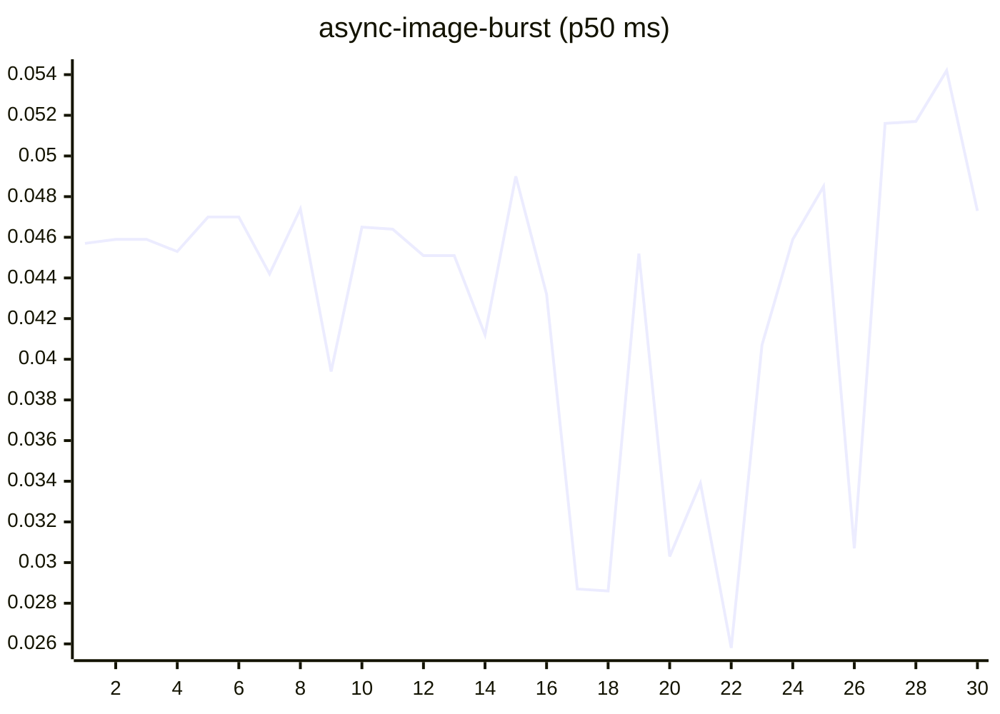
```mermaid
xychart-beta
    title "async-image-burst (p50 ms)"
    x-axis 1 --> 30
    line [0.0457, 0.0459, 0.0459, 0.0453, 0.0470, 0.0470, 0.0442, 0.0474, 0.0394, 0.0465, 0.0464, 0.0451, 0.0451, 0.0412, 0.0490, 0.0432, 0.0287, 0.0286, 0.0452, 0.0303, 0.0339, 0.0258, 0.0407, 0.0459, 0.0485, 0.0307, 0.0516, 0.0517, 0.0542, 0.0473]
```

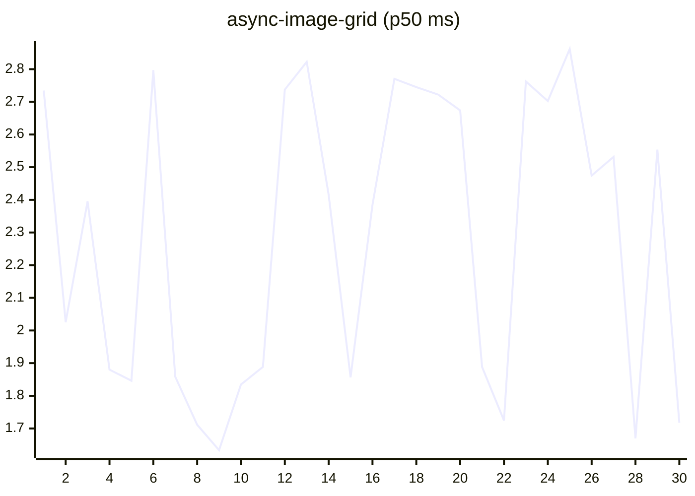
```mermaid
xychart-beta
    title "async-image-grid (p50 ms)"
    x-axis 1 --> 30
    line [2.7346, 2.0254, 2.3955, 1.8801, 1.8461, 2.7970, 1.8583, 1.7113, 1.6337, 1.8346, 1.8885, 2.7375, 2.8223, 2.4153, 1.8565, 2.3845, 2.7705, 2.7451, 2.7222, 2.6737, 1.8884, 1.7244, 2.7624, 2.7026, 2.8617, 2.4742, 2.5316, 1.6696, 2.5539, 1.7175]
```

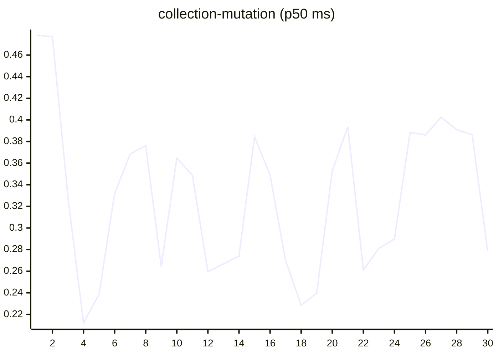
```mermaid
xychart-beta
    title "collection-mutation (p50 ms)"
    x-axis 1 --> 30
    line [0.4784, 0.4770, 0.3282, 0.2120, 0.2388, 0.3318, 0.3684, 0.3763, 0.2643, 0.3646, 0.3489, 0.2597, 0.2667, 0.2740, 0.3845, 0.3488, 0.2697, 0.2285, 0.2398, 0.3530, 0.3937, 0.2612, 0.2812, 0.2898, 0.3883, 0.3861, 0.4024, 0.3910, 0.3862, 0.2784]
```

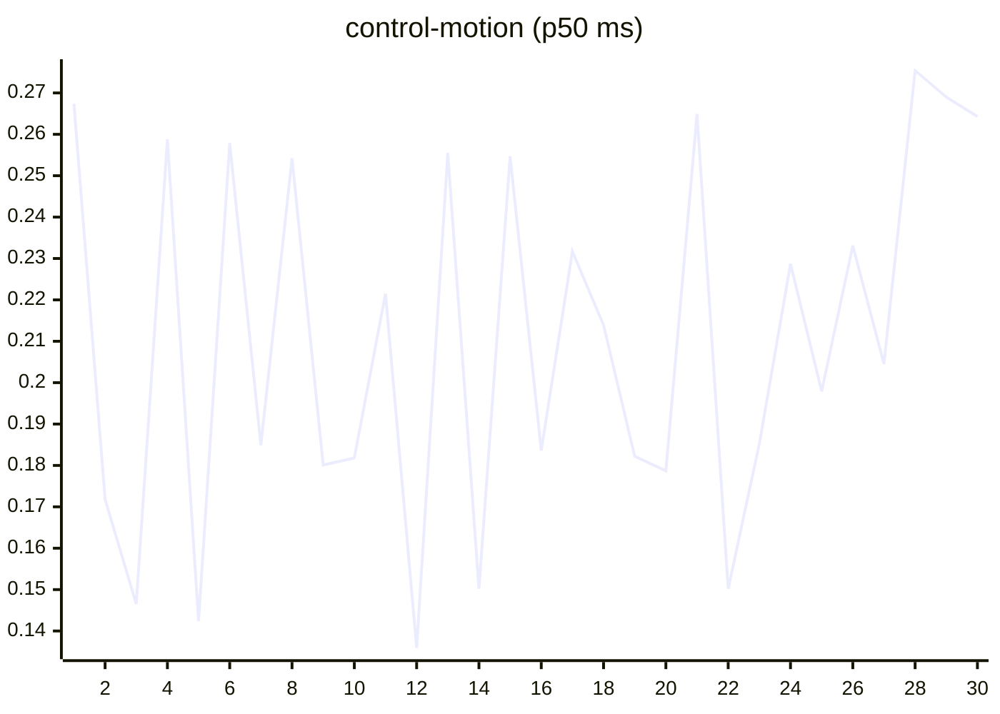
```mermaid
xychart-beta
    title "control-motion (p50 ms)"
    x-axis 1 --> 30
    line [0.2674, 0.1718, 0.1465, 0.2588, 0.1424, 0.2579, 0.1849, 0.2542, 0.1801, 0.1818, 0.2215, 0.1359, 0.2555, 0.1502, 0.2547, 0.1836, 0.2317, 0.2139, 0.1822, 0.1787, 0.2649, 0.1502, 0.1852, 0.2287, 0.1979, 0.2331, 0.2045, 0.2754, 0.2690, 0.2643]
```

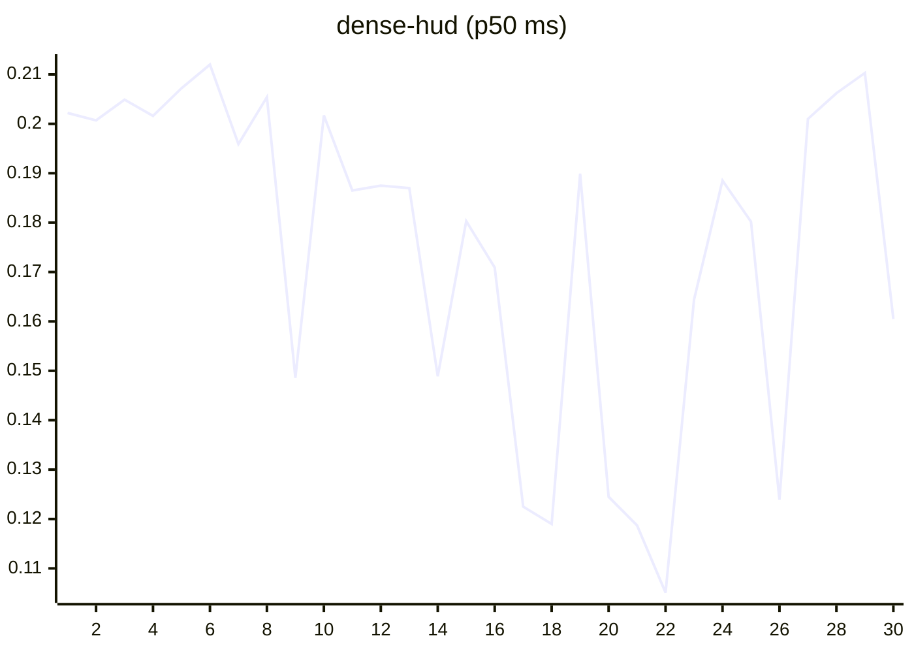
```mermaid
xychart-beta
    title "dense-hud (p50 ms)"
    x-axis 1 --> 30
    line [0.2022, 0.2007, 0.2049, 0.2016, 0.2072, 0.2120, 0.1959, 0.2054, 0.1486, 0.2017, 0.1865, 0.1875, 0.1870, 0.1489, 0.1803, 0.1709, 0.1225, 0.1190, 0.1899, 0.1245, 0.1187, 0.1051, 0.1644, 0.1885, 0.1802, 0.1239, 0.2010, 0.2062, 0.2103, 0.1605]
```

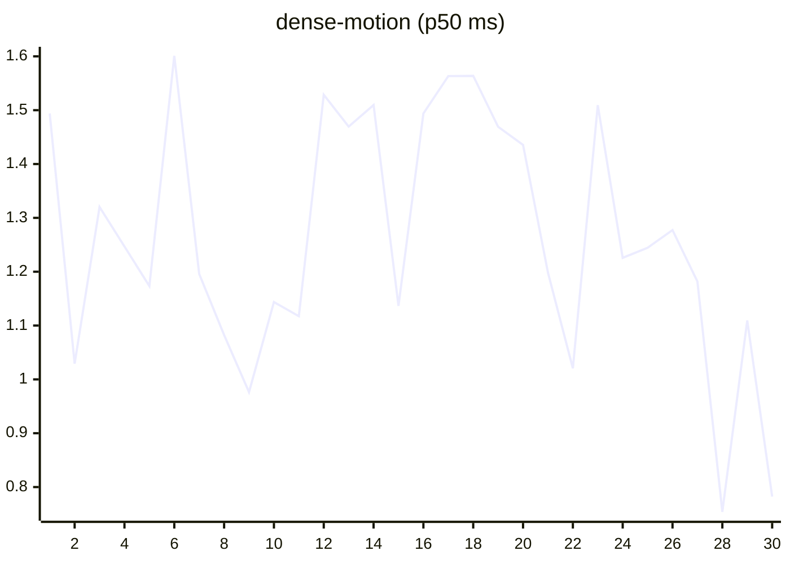
```mermaid
xychart-beta
    title "dense-motion (p50 ms)"
    x-axis 1 --> 30
    line [1.4938, 1.0293, 1.3202, 1.2469, 1.1733, 1.6011, 1.1959, 1.0823, 0.9763, 1.1436, 1.1174, 1.5286, 1.4695, 1.5096, 1.1365, 1.4939, 1.5634, 1.5638, 1.4692, 1.4355, 1.1984, 1.0205, 1.5093, 1.2258, 1.2445, 1.2773, 1.1817, 0.7540, 1.1093, 0.7822]
```

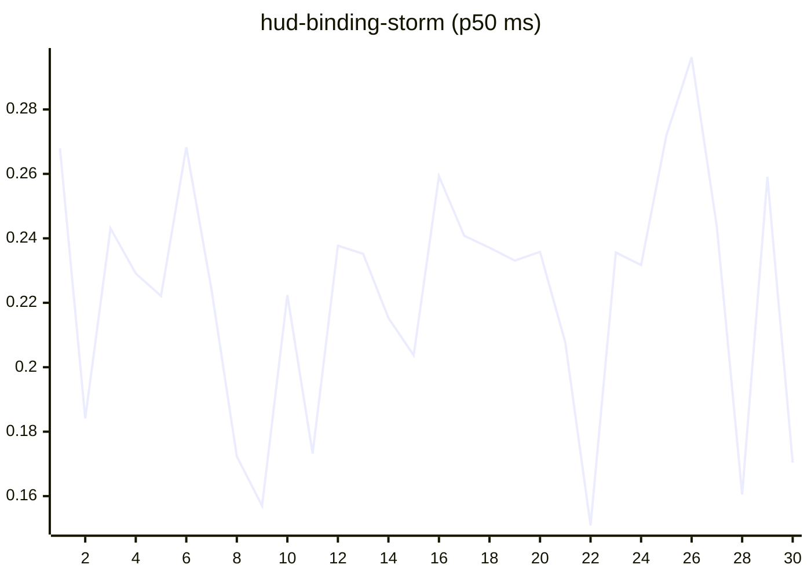
```mermaid
xychart-beta
    title "hud-binding-storm (p50 ms)"
    x-axis 1 --> 30
    line [0.2679, 0.1841, 0.2431, 0.2291, 0.2221, 0.2683, 0.2240, 0.1723, 0.1570, 0.2224, 0.1732, 0.2377, 0.2352, 0.2153, 0.2037, 0.2593, 0.2408, 0.2371, 0.2331, 0.2358, 0.2077, 0.1509, 0.2356, 0.2317, 0.2719, 0.2962, 0.2435, 0.1605, 0.2591, 0.1704]
```

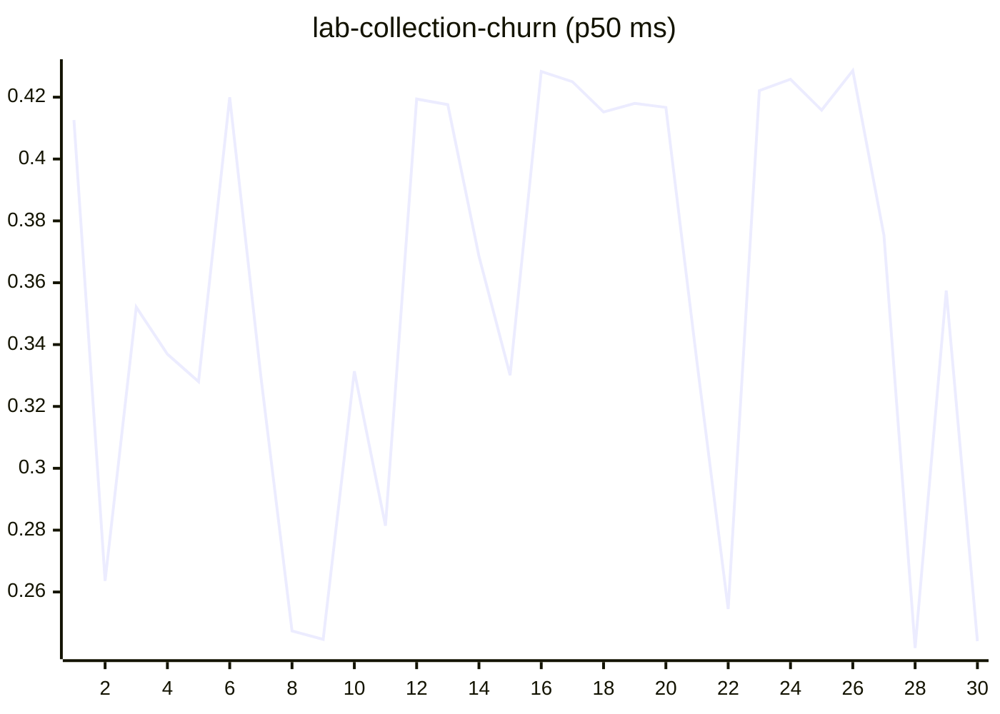
```mermaid
xychart-beta
    title "lab-collection-churn (p50 ms)"
    x-axis 1 --> 30
    line [0.4126, 0.2636, 0.3521, 0.3369, 0.3280, 0.4200, 0.3297, 0.2474, 0.2447, 0.3314, 0.2814, 0.4194, 0.4176, 0.3686, 0.3301, 0.4283, 0.4250, 0.4152, 0.4180, 0.4167, 0.3342, 0.2545, 0.4221, 0.4258, 0.4158, 0.4286, 0.3753, 0.2419, 0.3575, 0.2441]
```

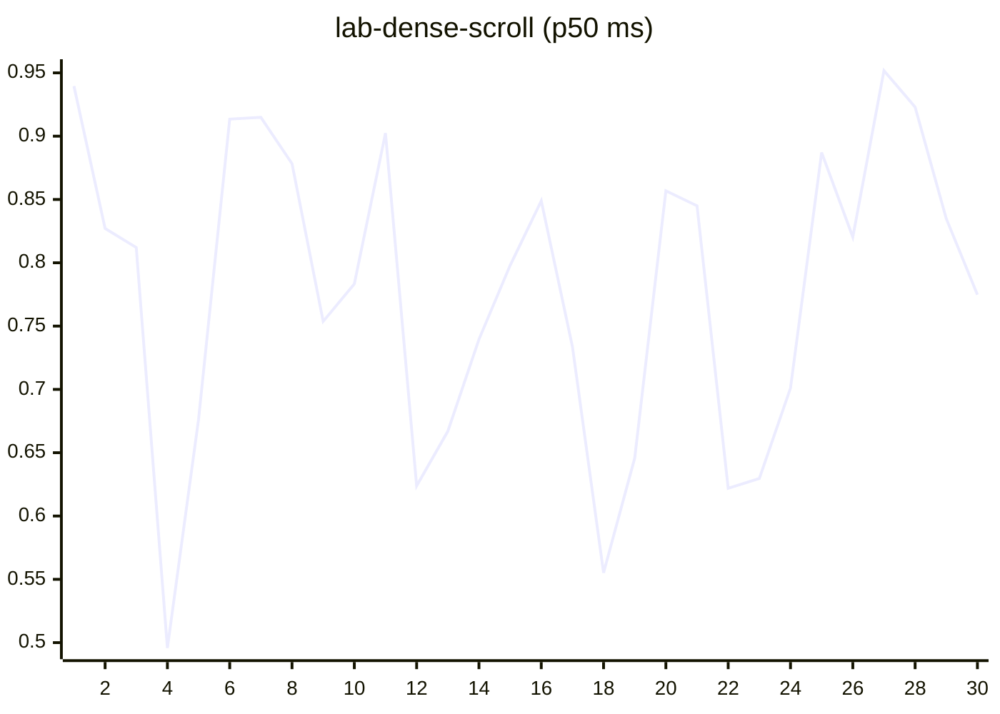
```mermaid
xychart-beta
    title "lab-dense-scroll (p50 ms)"
    x-axis 1 --> 30
    line [0.9396, 0.8271, 0.8121, 0.4958, 0.6764, 0.9135, 0.9149, 0.8783, 0.7537, 0.7833, 0.9024, 0.6238, 0.6669, 0.7395, 0.7979, 0.8489, 0.7339, 0.5552, 0.6458, 0.8568, 0.8450, 0.6219, 0.6297, 0.7010, 0.8871, 0.8203, 0.9518, 0.9230, 0.8349, 0.7748]
```

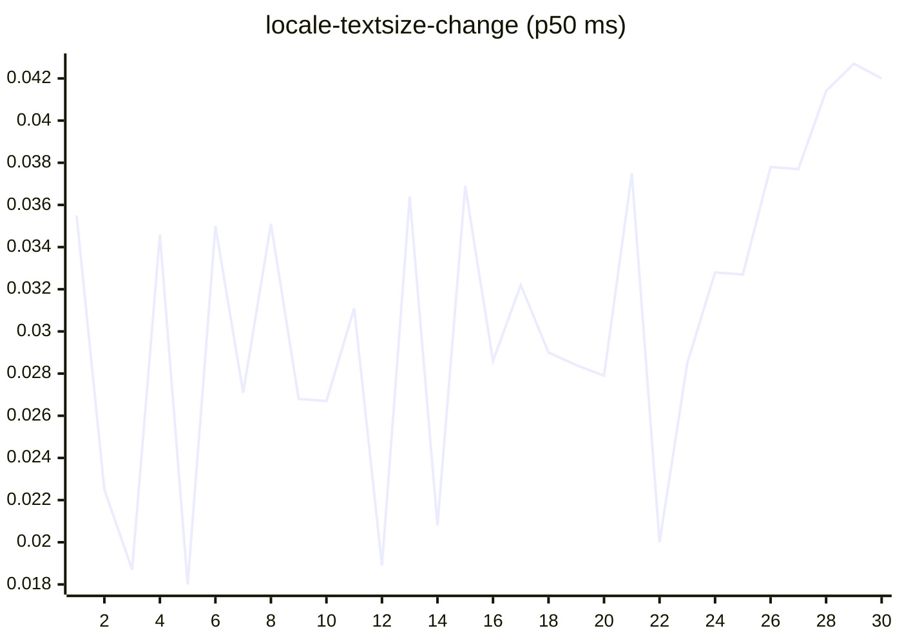
```mermaid
xychart-beta
    title "locale-textsize-change (p50 ms)"
    x-axis 1 --> 30
    line [0.0355, 0.0225, 0.0187, 0.0346, 0.0180, 0.0350, 0.0271, 0.0351, 0.0268, 0.0267, 0.0311, 0.0189, 0.0364, 0.0208, 0.0369, 0.0286, 0.0322, 0.0290, 0.0284, 0.0279, 0.0375, 0.0200, 0.0285, 0.0328, 0.0327, 0.0378, 0.0377, 0.0414, 0.0427, 0.0420]
```

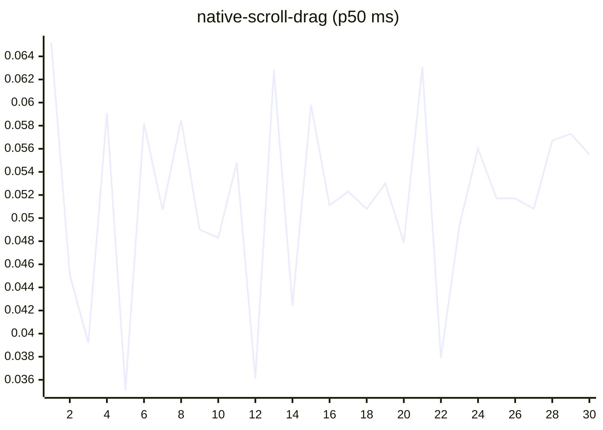
```mermaid
xychart-beta
    title "native-scroll-drag (p50 ms)"
    x-axis 1 --> 30
    line [0.0652, 0.0451, 0.0392, 0.0591, 0.0351, 0.0582, 0.0507, 0.0585, 0.0490, 0.0483, 0.0548, 0.0361, 0.0628, 0.0424, 0.0598, 0.0511, 0.0523, 0.0508, 0.0530, 0.0479, 0.0631, 0.0379, 0.0494, 0.0560, 0.0517, 0.0517, 0.0508, 0.0567, 0.0573, 0.0555]
```

```mermaid
xychart-beta
    title "navigation-customization (p50 ms)"
    x-axis 1 --> 30
    line [0.0671, 0.0669, 0.0698, 0.0663, 0.0688, 0.0695, 0.0658, 0.0677, 0.0458, 0.0674, 0.0690, 0.0680, 0.0667, 0.0539, 0.0584, 0.0637, 0.0434, 0.0410, 0.0688, 0.0444, 0.0429, 0.0372, 0.0606, 0.0656, 0.0713, 0.0448, 0.0758, 0.0764, 0.0801, 0.0557]
```

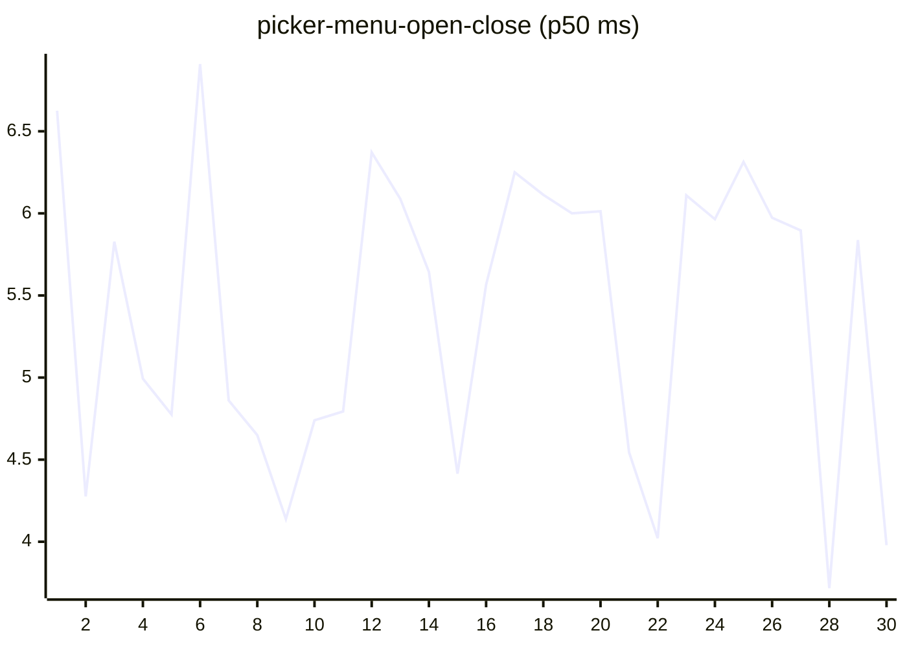
```mermaid
xychart-beta
    title "picker-menu-open-close (p50 ms)"
    x-axis 1 --> 30
    line [6.6249, 4.2762, 5.8275, 4.9929, 4.7749, 6.9094, 4.8605, 4.6493, 4.1383, 4.7397, 4.7934, 6.3713, 6.0885, 5.6440, 4.4145, 5.5656, 6.2500, 6.1133, 6.0006, 6.0128, 4.5439, 4.0216, 6.1100, 5.9646, 6.3137, 5.9733, 5.8960, 3.7179, 5.8378, 3.9788]
```

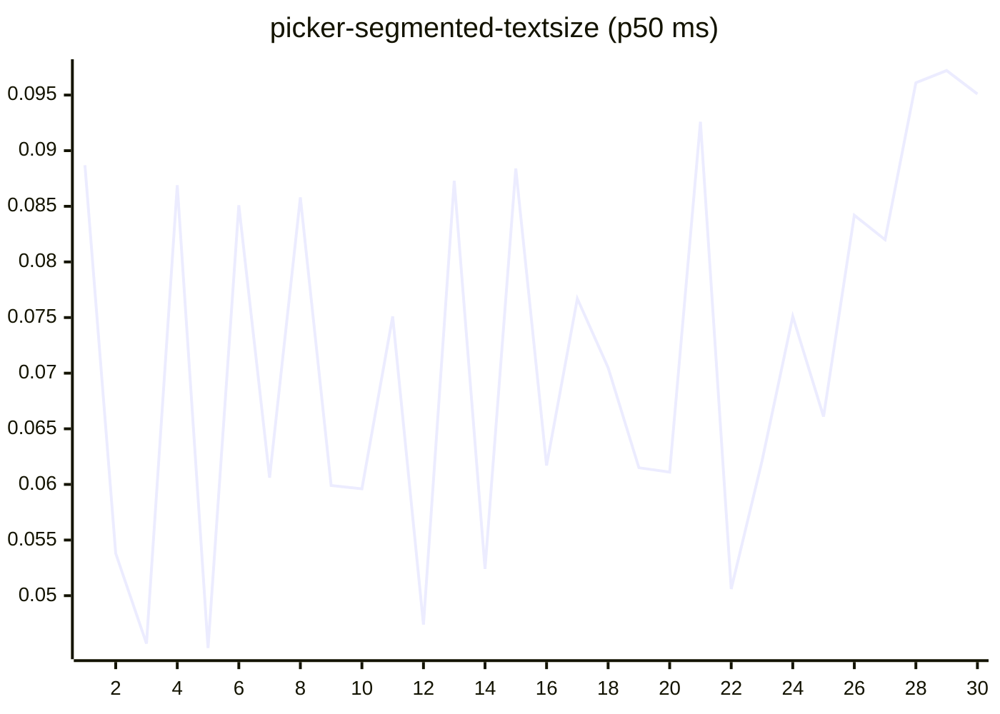
```mermaid
xychart-beta
    title "picker-segmented-textsize (p50 ms)"
    x-axis 1 --> 30
    line [0.0887, 0.0538, 0.0457, 0.0869, 0.0453, 0.0851, 0.0606, 0.0858, 0.0599, 0.0596, 0.0751, 0.0474, 0.0873, 0.0524, 0.0884, 0.0617, 0.0767, 0.0705, 0.0615, 0.0611, 0.0926, 0.0506, 0.0621, 0.0751, 0.0661, 0.0842, 0.0820, 0.0961, 0.0972, 0.0951]
```

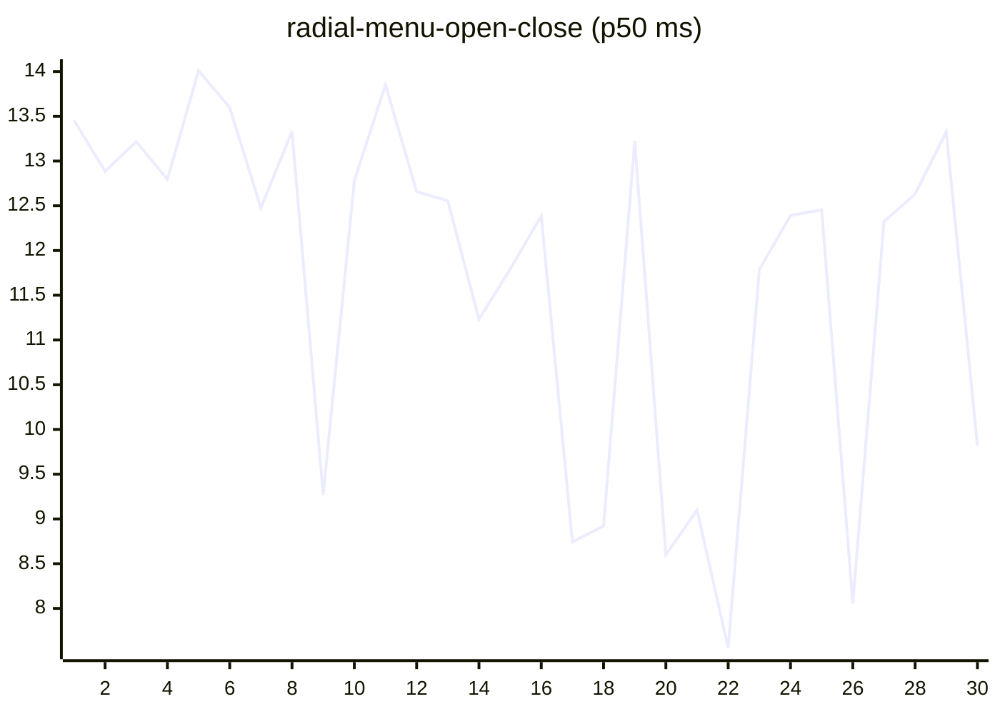
```mermaid
xychart-beta
    title "radial-menu-open-close (p50 ms)"
    x-axis 1 --> 30
    line [13.4545, 12.8844, 13.2172, 12.7956, 14.0106, 13.5975, 12.4751, 13.3321, 9.2701, 12.7803, 13.8513, 12.6574, 12.5560, 11.2324, 11.7902, 12.3880, 8.7436, 8.9215, 13.2239, 8.6006, 9.0993, 7.5583, 11.7873, 12.3922, 12.4543, 8.0551, 12.3218, 12.6302, 13.3250, 9.8198]
```

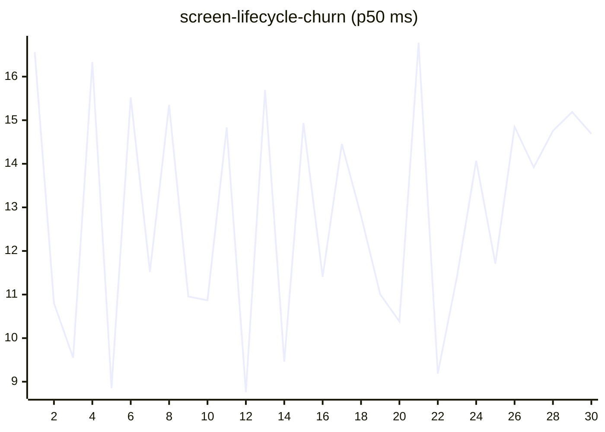
```mermaid
xychart-beta
    title "screen-lifecycle-churn (p50 ms)"
    x-axis 1 --> 30
    line [16.5636, 10.8019, 9.5493, 16.3352, 8.8542, 15.5247, 11.5198, 15.3513, 10.9553, 10.8669, 14.8354, 8.7629, 15.6965, 9.4580, 14.9352, 11.4071, 14.4551, 12.8061, 11.0031, 10.3834, 16.7783, 9.1867, 11.4109, 14.0699, 11.7084, 14.8494, 13.9181, 14.7553, 15.1887, 14.6881]
```

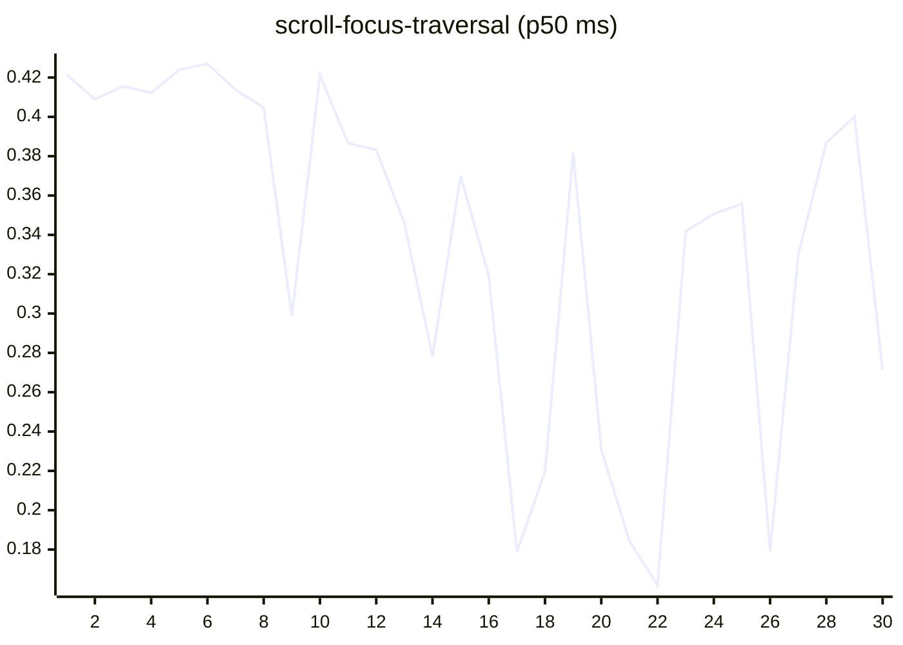
```mermaid
xychart-beta
    title "scroll-focus-traversal (p50 ms)"
    x-axis 1 --> 30
    line [0.4213, 0.4090, 0.4155, 0.4122, 0.4240, 0.4270, 0.4138, 0.4048, 0.2988, 0.4213, 0.3866, 0.3832, 0.3461, 0.2782, 0.3701, 0.3192, 0.1788, 0.2196, 0.3819, 0.2310, 0.1844, 0.1618, 0.3419, 0.3506, 0.3558, 0.1792, 0.3298, 0.3869, 0.4000, 0.2715]
```

```mermaid
xychart-beta
    title "settings-churn (p50 ms)"
    x-axis 1 --> 30
    line [4.0202, 2.5474, 2.2241, 3.9145, 2.1567, 3.9092, 2.7259, 3.8607, 2.7176, 2.6713, 3.4963, 2.1652, 3.9796, 2.3938, 3.8055, 2.7229, 3.5765, 3.1778, 2.7769, 2.6734, 3.9876, 2.3310, 2.7543, 3.5518, 2.8813, 3.6313, 3.5451, 3.8489, 3.9751, 3.8729]
```

```mermaid
xychart-beta
    title "shadow-storm (p50 ms)"
    x-axis 1 --> 30
    line [0.0006, 0.0006, 0.0006, 0.0003, 0.0003, 0.0005, 0.0006, 0.0006, 0.0005, 0.0006, 0.0005, 0.0005, 0.0005, 0.0005, 0.0006, 0.0005, 0.0005, 0.0003, 0.0003, 0.0005, 0.0006, 0.0005, 0.0004, 0.0005, 0.0006, 0.0006, 0.0006, 0.0006, 0.0006, 0.0005]
```

```mermaid
xychart-beta
    title "stylesheet-state-churn (p50 ms)"
    x-axis 1 --> 30
    line [0.4329, 0.4274, 0.3947, 0.2233, 0.2597, 0.3933, 0.4176, 0.4187, 0.3293, 0.4146, 0.3895, 0.3022, 0.3133, 0.3207, 0.4075, 0.3872, 0.3166, 0.2247, 0.2440, 0.3899, 0.4264, 0.3076, 0.3168, 0.3185, 0.4226, 0.4133, 0.4433, 0.4391, 0.4332, 0.3455]
```

```mermaid
xychart-beta
    title "theme-swap-assets (p50 ms)"
    x-axis 1 --> 30
    line [2.1482, 2.1331, 2.1361, 2.1269, 2.7631, 2.1700, 2.0966, 2.1646, 1.6473, 2.1716, 2.2078, 2.1811, 2.1485, 1.9419, 2.1761, 2.1523, 1.3964, 1.3639, 2.2354, 1.6750, 1.3789, 1.2597, 2.0726, 2.1873, 2.2356, 1.3506, 2.2291, 2.2751, 2.3414, 1.8548]
```

```mermaid
xychart-beta
    title "theme-swap-flat (p50 ms)"
    x-axis 1 --> 30
    line [0.4973, 0.4915, 0.4864, 0.4880, 0.5036, 0.5083, 0.4862, 0.5041, 0.3994, 0.4905, 0.4963, 0.5057, 0.4981, 0.3945, 0.5323, 0.4452, 0.3118, 0.2983, 0.5069, 0.3300, 0.3065, 0.2940, 0.4635, 0.4866, 0.4686, 0.2849, 0.5021, 0.4978, 0.5151, 0.3992]
```

```mermaid
xychart-beta
    title "theme-swap-metrics (p50 ms)"
    x-axis 1 --> 30
    line [1.7154, 1.6931, 1.7197, 0.9647, 1.0274, 1.7331, 1.6989, 1.6911, 1.3586, 1.6733, 1.6923, 1.3685, 1.3971, 1.3936, 1.6665, 1.7035, 1.3809, 1.0136, 1.0309, 1.7098, 1.7328, 1.3483, 1.4430, 1.4724, 1.7911, 1.7798, 1.8444, 1.8026, 1.7927, 1.4878]
```

```mermaid
xychart-beta
    title "virtual-list-scroll (p50 ms)"
    x-axis 1 --> 30
    line [0.2040, 0.1374, 0.1721, 0.1458, 0.1361, 0.2069, 0.1392, 0.1285, 0.1161, 0.1268, 0.1753, 0.2339, 0.1940, 0.2069, 0.1286, 0.1608, 0.1954, 0.1973, 0.1907, 0.1884, 0.1321, 0.1157, 0.1945, 0.2189, 0.1888, 0.1710, 0.1839, 0.1033, 0.1770, 0.1139]
```
