# Facet performance

Latest: `dbd7b9ba4271e27f09077328eb81e445ff7284b7` on 2026-10-29T180536Z, measured on the CI Ubuntu runner by the paired performance shards.
Times are milliseconds per frame or operation: the median over paired rounds of each round's p50 and p95.
Retained heap is the scene's mounted retained Luau heap. Change compares the p50 of the previous main commit.

| Scene | p50 ms | p95 ms | Retained KiB | Change |
| --- | ---: | ---: | ---: | ---: |
| adaptive-navigation-images | 1.3197 | 1.5941 | 3703 | -3.5% |
| alert-present-dismiss | 3.7592 | 5.2868 | 2493 | +56.0% |
| animation-interruption | 0.0283 | 0.0346 | 410 | -25.6% |
| async-image-burst | 0.0539 | 0.0659 | 524 | +49.3% |
| async-image-grid | 2.3060 | 3.5020 | 2976 | -20.1% |
| collection-mutation | 0.3941 | 0.5471 | 3748 | +51.5% |
| control-motion | 0.2525 | 0.7044 | 1840 | -6.1% |
| dense-hud | 0.2129 | 0.2358 | 830 | +62.9% |
| dense-motion | 0.9981 | 1.6381 | 2927 | -21.0% |
| hud-binding-storm | 0.2441 | 0.3230 | 491 | -10.5% |
| lab-collection-churn | 0.3242 | 0.7092 | 4279 | -23.8% |
| lab-dense-scroll | 0.8968 | 5.4432 | 6513 | +25.9% |
| locale-textsize-change | 0.0422 | 0.0511 | 511 | -3.2% |
| native-scroll-drag | 0.0564 | 0.0740 | 1651 | -6.1% |
| navigation-customization | 0.0777 | 0.0920 | 3940 | +57.3% |
| picker-menu-open-close | 5.3362 | 8.2196 | 1965 | -14.4% |
| picker-segmented-textsize | 0.0974 | 0.1128 | 949 | -5.3% |
| radial-menu-open-close | 13.5562 | 22.6917 | 1873 | +44.2% |
| screen-lifecycle-churn | 14.6222 | 24.1384 | 1178 | -5.0% |
| scroll-focus-traversal | 0.4106 | 0.6514 | 1234 | +116.2% |
| settings-churn | 3.8504 | 5.8814 | 3107 | -2.2% |
| shadow-storm | 0.0006 | 0.0012 | 1998 | +81.6% |
| stylesheet-state-churn | 0.4348 | 0.6802 | 3056 | +65.5% |
| theme-swap-assets | 1.8976 | 2.3823 | 5424 | +61.7% |
| theme-swap-flat | 0.4218 | 0.5772 | 4109 | +66.0% |
| theme-swap-metrics | 1.7425 | 2.2886 | 4825 | +56.4% |
| virtual-list-scroll | 0.1545 | 0.3441 | 5357 | -20.2% |

| Microbenchmark | p50 ms | p95 ms | Change |
| --- | ---: | ---: | ---: |
| billboard-nameplate-storm | 0.1477 | 0.1975 | -19.0% |
| collection-mutation | 0.0086 | 0.0117 | -0.7% |
| collection-selection-update | 0.0028 | 0.0047 | +74.8% |
| hud-binding-storm | 0.3836 | 0.3993 | +77.5% |
| motion-declarative | 1.1416 | 1.8987 | -6.6% |
| motion-explicit | 1.2128 | 1.9591 | -3.1% |
| mount-ramp | 168.5712 | 187.5652 | +47.3% |
| mount-ramp-inherited | 172.8911 | 191.4782 | +60.1% |
| mounted-slice-update-storm | 0.1981 | 0.2524 | -16.4% |
| outline-measured-update | 1.6222 | 2.2868 | -4.5% |
| reserved-slot-record-update | 0.9638 | 1.5011 | +65.5% |
| settings-churn | 0.0180 | 0.0215 | +121.2% |
| sparse-update-under-load | 0.0020 | 0.0022 | -22.3% |
| table-mutation | 0.3489 | 0.4526 | -0.4% |
| table-resize-drag | 3.4323 | 5.6489 | +55.7% |
| table-sort-values | 1.2958 | 1.8518 | +59.1% |
| table-source-refresh | 0.2096 | 0.3845 | -19.9% |
| textinput-typing-storm | 0.2722 | 0.4264 | -5.9% |
| timer-readout-storm | 0.1736 | 0.9066 | +81.2% |
| zz-yardstick-cpu-after | 1.3205 | 1.3318 | +24.3% |
| zz-yardstick-cpu-before | 1.2981 | 1.3055 | +21.8% |

## Scene p50 over the last 30 main commits

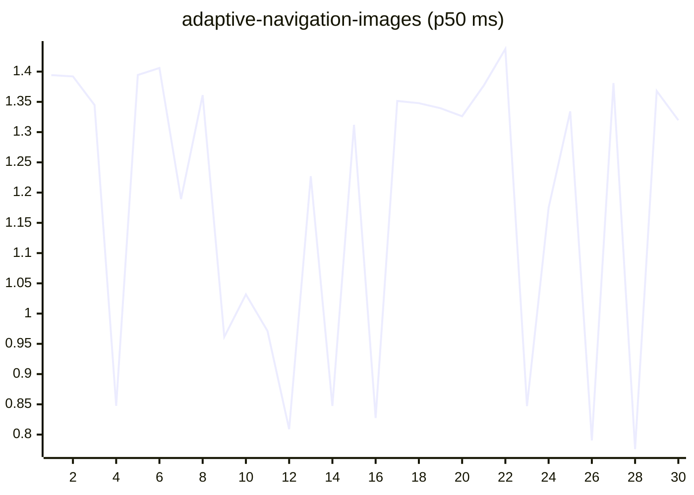
```mermaid
xychart-beta
    title "adaptive-navigation-images (p50 ms)"
    x-axis 1 --> 30
    line [1.3942, 1.3921, 1.3447, 0.8475, 1.3944, 1.4060, 1.1893, 1.3612, 0.9615, 1.0317, 0.9711, 0.8088, 1.2271, 0.8473, 1.3121, 0.8274, 1.3515, 1.3479, 1.3395, 1.3263, 1.3769, 1.4375, 0.8471, 1.1748, 1.3343, 0.7905, 1.3810, 0.7758, 1.3680, 1.3197]
```

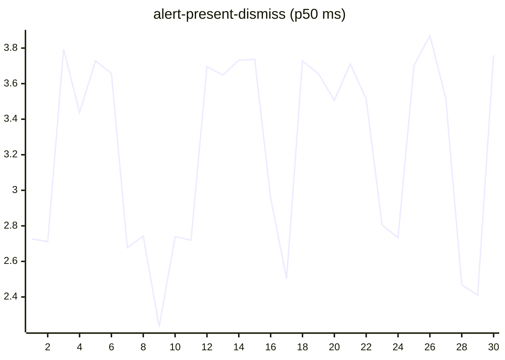
```mermaid
xychart-beta
    title "alert-present-dismiss (p50 ms)"
    x-axis 1 --> 30
    line [2.7270, 2.7111, 3.7936, 3.4376, 3.7274, 3.6582, 2.6769, 2.7425, 2.2328, 2.7393, 2.7195, 3.6955, 3.6480, 3.7318, 3.7373, 2.9562, 2.5024, 3.7273, 3.6562, 3.5064, 3.7112, 3.5136, 2.8044, 2.7337, 3.7022, 3.8703, 3.5157, 2.4688, 2.4093, 3.7592]
```

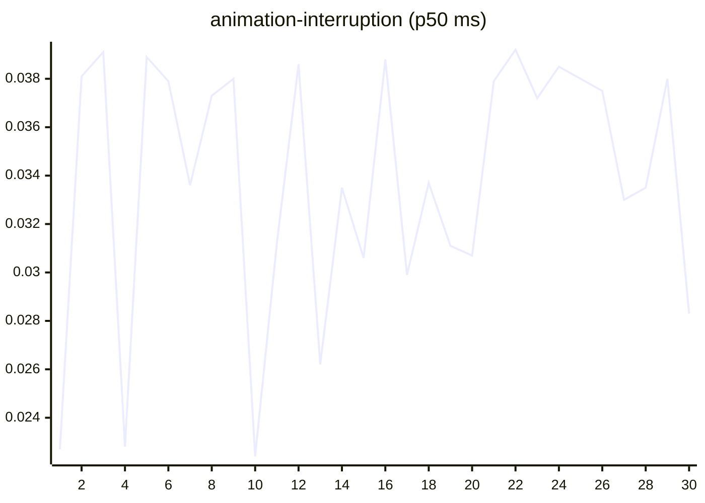
```mermaid
xychart-beta
    title "animation-interruption (p50 ms)"
    x-axis 1 --> 30
    line [0.0227, 0.0381, 0.0391, 0.0228, 0.0389, 0.0379, 0.0336, 0.0373, 0.0380, 0.0224, 0.0312, 0.0386, 0.0262, 0.0335, 0.0306, 0.0388, 0.0299, 0.0337, 0.0311, 0.0307, 0.0379, 0.0392, 0.0372, 0.0385, 0.0380, 0.0375, 0.0330, 0.0335, 0.0380, 0.0283]
```

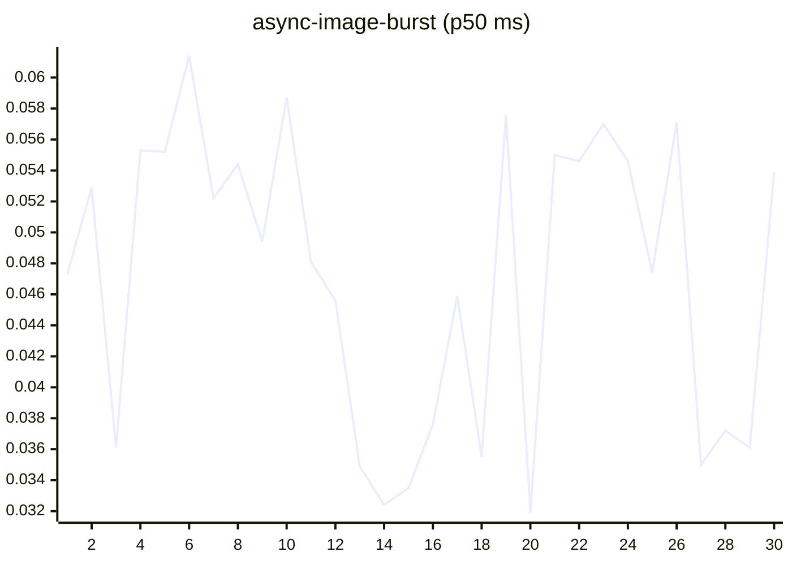
```mermaid
xychart-beta
    title "async-image-burst (p50 ms)"
    x-axis 1 --> 30
    line [0.0473, 0.0529, 0.0361, 0.0553, 0.0552, 0.0614, 0.0522, 0.0544, 0.0494, 0.0587, 0.0481, 0.0456, 0.0349, 0.0324, 0.0335, 0.0376, 0.0459, 0.0355, 0.0576, 0.0319, 0.0550, 0.0546, 0.0570, 0.0546, 0.0474, 0.0571, 0.0350, 0.0372, 0.0361, 0.0539]
```

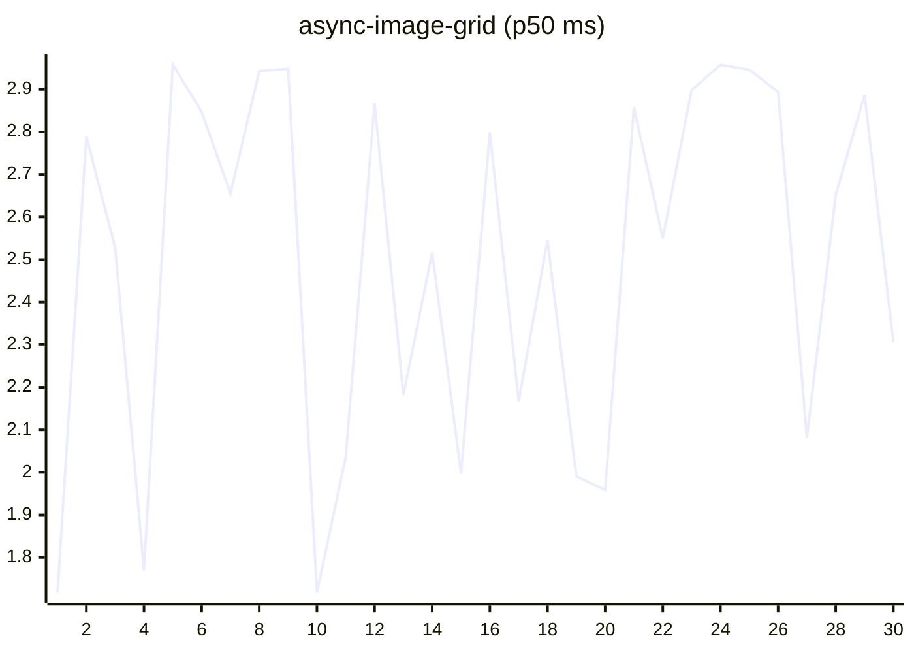
```mermaid
xychart-beta
    title "async-image-grid (p50 ms)"
    x-axis 1 --> 30
    line [1.7175, 2.7892, 2.5277, 1.7701, 2.9582, 2.8471, 2.6552, 2.9433, 2.9481, 1.7177, 2.0365, 2.8674, 2.1819, 2.5171, 1.9970, 2.7988, 2.1671, 2.5459, 1.9906, 1.9586, 2.8577, 2.5497, 2.8980, 2.9576, 2.9463, 2.8940, 2.0815, 2.6515, 2.8871, 2.3060]
```

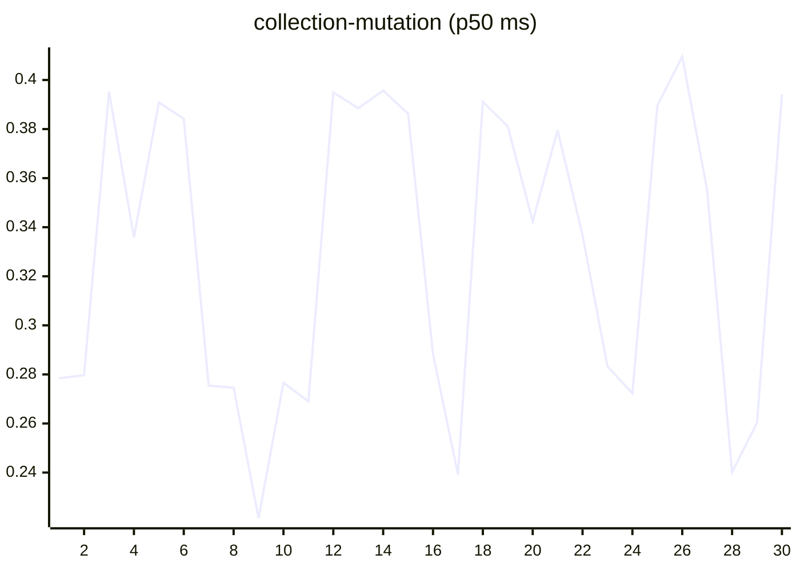
```mermaid
xychart-beta
    title "collection-mutation (p50 ms)"
    x-axis 1 --> 30
    line [0.2784, 0.2797, 0.3953, 0.3359, 0.3908, 0.3842, 0.2754, 0.2746, 0.2214, 0.2766, 0.2690, 0.3950, 0.3885, 0.3957, 0.3863, 0.2883, 0.2393, 0.3911, 0.3811, 0.3424, 0.3796, 0.3367, 0.2833, 0.2723, 0.3895, 0.4096, 0.3550, 0.2402, 0.2602, 0.3941]
```

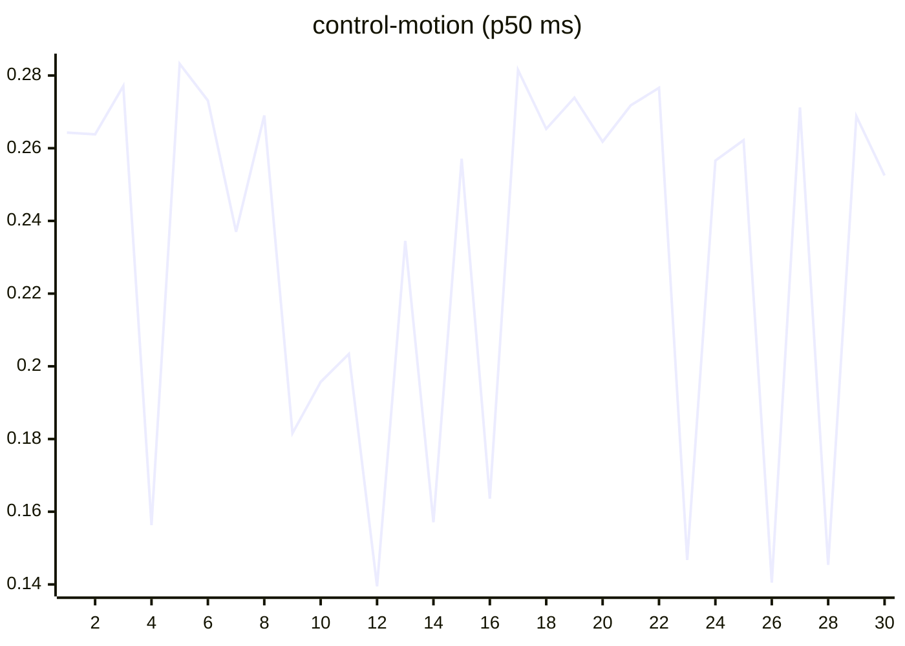
```mermaid
xychart-beta
    title "control-motion (p50 ms)"
    x-axis 1 --> 30
    line [0.2643, 0.2638, 0.2771, 0.1563, 0.2832, 0.2731, 0.2370, 0.2690, 0.1816, 0.1957, 0.2034, 0.1395, 0.2345, 0.1571, 0.2571, 0.1636, 0.2815, 0.2653, 0.2739, 0.2618, 0.2718, 0.2766, 0.1467, 0.2566, 0.2622, 0.1405, 0.2712, 0.1454, 0.2688, 0.2525]
```

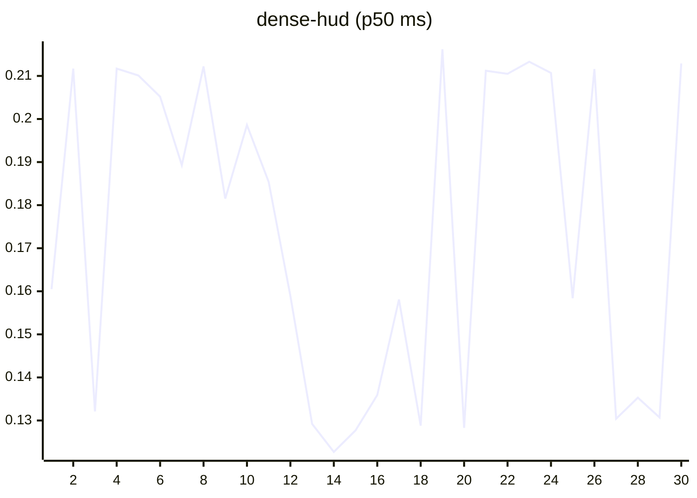
```mermaid
xychart-beta
    title "dense-hud (p50 ms)"
    x-axis 1 --> 30
    line [0.1605, 0.2117, 0.1321, 0.2117, 0.2101, 0.2052, 0.1893, 0.2122, 0.1815, 0.1986, 0.1854, 0.1589, 0.1292, 0.1227, 0.1277, 0.1359, 0.1581, 0.1288, 0.2162, 0.1283, 0.2112, 0.2105, 0.2133, 0.2107, 0.1584, 0.2116, 0.1304, 0.1353, 0.1307, 0.2129]
```

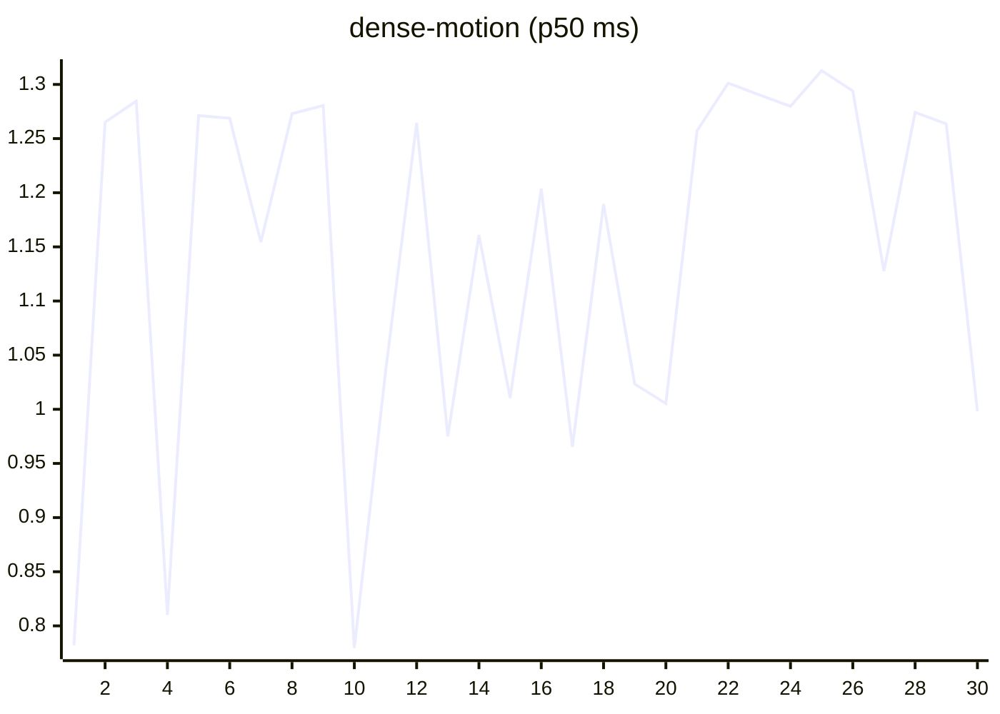
```mermaid
xychart-beta
    title "dense-motion (p50 ms)"
    x-axis 1 --> 30
    line [0.7822, 1.2651, 1.2846, 0.8102, 1.2712, 1.2688, 1.1544, 1.2730, 1.2805, 0.7796, 1.0341, 1.2646, 0.9749, 1.1610, 1.0105, 1.2037, 0.9653, 1.1895, 1.0233, 1.0054, 1.2572, 1.3012, 1.2904, 1.2798, 1.3128, 1.2940, 1.1276, 1.2742, 1.2636, 0.9981]
```

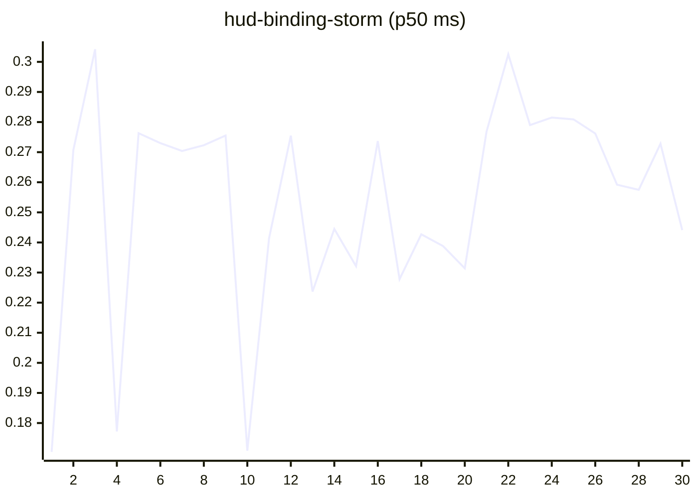
```mermaid
xychart-beta
    title "hud-binding-storm (p50 ms)"
    x-axis 1 --> 30
    line [0.1704, 0.2707, 0.3042, 0.1772, 0.2763, 0.2730, 0.2704, 0.2723, 0.2755, 0.1708, 0.2414, 0.2755, 0.2237, 0.2445, 0.2321, 0.2737, 0.2278, 0.2427, 0.2388, 0.2314, 0.2768, 0.3025, 0.2790, 0.2815, 0.2809, 0.2762, 0.2592, 0.2575, 0.2728, 0.2441]
```

```mermaid
xychart-beta
    title "lab-collection-churn (p50 ms)"
    x-axis 1 --> 30
    line [0.2441, 0.4215, 0.4279, 0.2490, 0.4243, 0.4265, 0.3676, 0.4284, 0.4331, 0.2510, 0.3432, 0.4256, 0.3083, 0.3769, 0.3392, 0.4238, 0.3026, 0.3756, 0.3409, 0.3395, 0.4345, 0.4346, 0.4334, 0.4279, 0.4276, 0.4329, 0.3697, 0.4002, 0.4255, 0.3242]
```

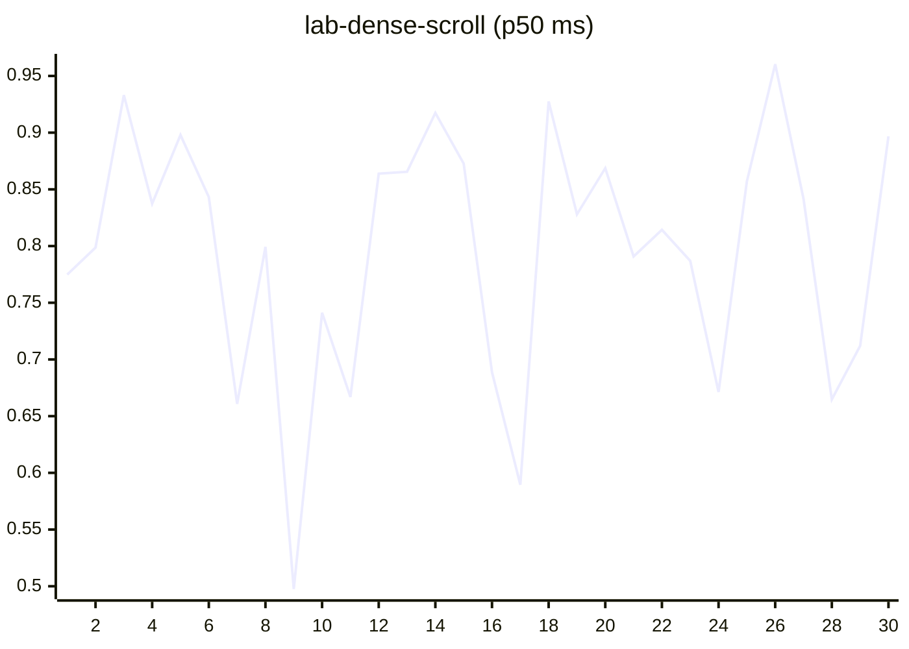
```mermaid
xychart-beta
    title "lab-dense-scroll (p50 ms)"
    x-axis 1 --> 30
    line [0.7748, 0.7987, 0.9331, 0.8374, 0.8979, 0.8432, 0.6608, 0.7993, 0.4976, 0.7412, 0.6669, 0.8638, 0.8655, 0.9174, 0.8727, 0.6887, 0.5895, 0.9275, 0.8280, 0.8687, 0.7908, 0.8143, 0.7869, 0.6713, 0.8570, 0.9604, 0.8416, 0.6647, 0.7120, 0.8968]
```

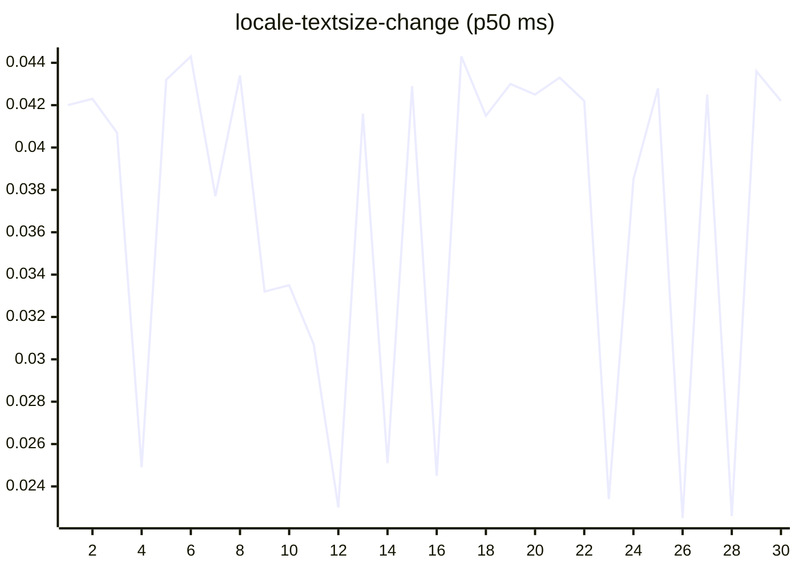
```mermaid
xychart-beta
    title "locale-textsize-change (p50 ms)"
    x-axis 1 --> 30
    line [0.0420, 0.0423, 0.0407, 0.0249, 0.0432, 0.0443, 0.0377, 0.0434, 0.0332, 0.0335, 0.0307, 0.0230, 0.0416, 0.0251, 0.0429, 0.0245, 0.0443, 0.0415, 0.0430, 0.0425, 0.0433, 0.0422, 0.0234, 0.0385, 0.0428, 0.0225, 0.0425, 0.0226, 0.0436, 0.0422]
```

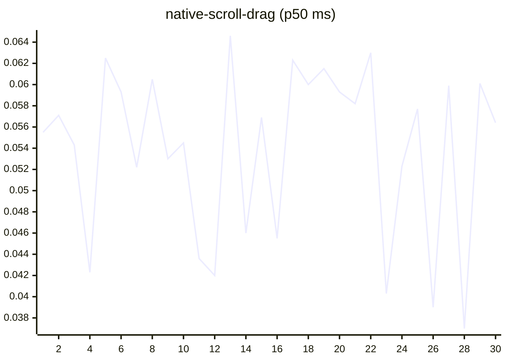
```mermaid
xychart-beta
    title "native-scroll-drag (p50 ms)"
    x-axis 1 --> 30
    line [0.0555, 0.0571, 0.0543, 0.0423, 0.0625, 0.0593, 0.0522, 0.0605, 0.0530, 0.0545, 0.0436, 0.0420, 0.0646, 0.0460, 0.0569, 0.0455, 0.0623, 0.0600, 0.0615, 0.0593, 0.0582, 0.0630, 0.0403, 0.0523, 0.0577, 0.0390, 0.0599, 0.0370, 0.0601, 0.0564]
```

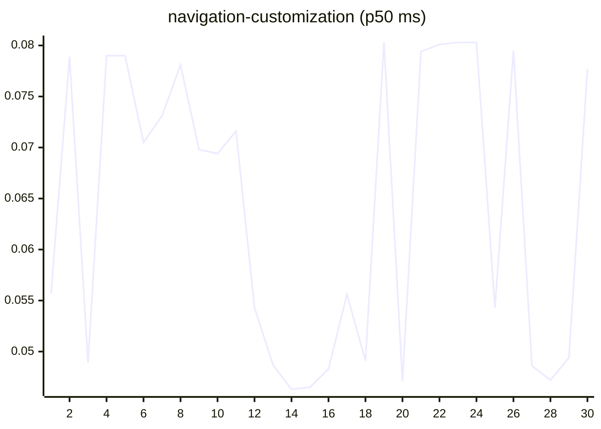
```mermaid
xychart-beta
    title "navigation-customization (p50 ms)"
    x-axis 1 --> 30
    line [0.0557, 0.0789, 0.0489, 0.0790, 0.0790, 0.0705, 0.0731, 0.0781, 0.0698, 0.0694, 0.0716, 0.0543, 0.0487, 0.0463, 0.0465, 0.0483, 0.0556, 0.0491, 0.0803, 0.0471, 0.0794, 0.0801, 0.0803, 0.0803, 0.0543, 0.0795, 0.0486, 0.0472, 0.0494, 0.0777]
```

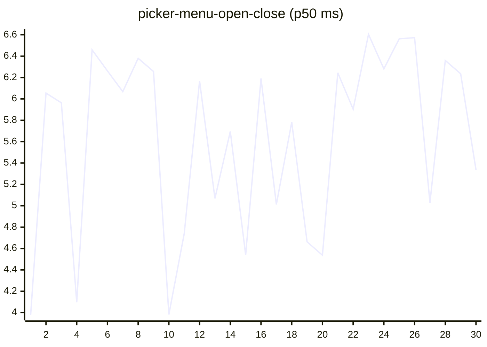
```mermaid
xychart-beta
    title "picker-menu-open-close (p50 ms)"
    x-axis 1 --> 30
    line [3.9788, 6.0543, 5.9629, 4.0972, 6.4594, 6.2618, 6.0678, 6.3801, 6.2569, 3.9826, 4.7388, 6.1676, 5.0690, 5.6954, 4.5402, 6.1912, 5.0120, 5.7822, 4.6627, 4.5372, 6.2442, 5.9038, 6.6044, 6.2815, 6.5623, 6.5728, 5.0278, 6.3599, 6.2355, 5.3362]
```

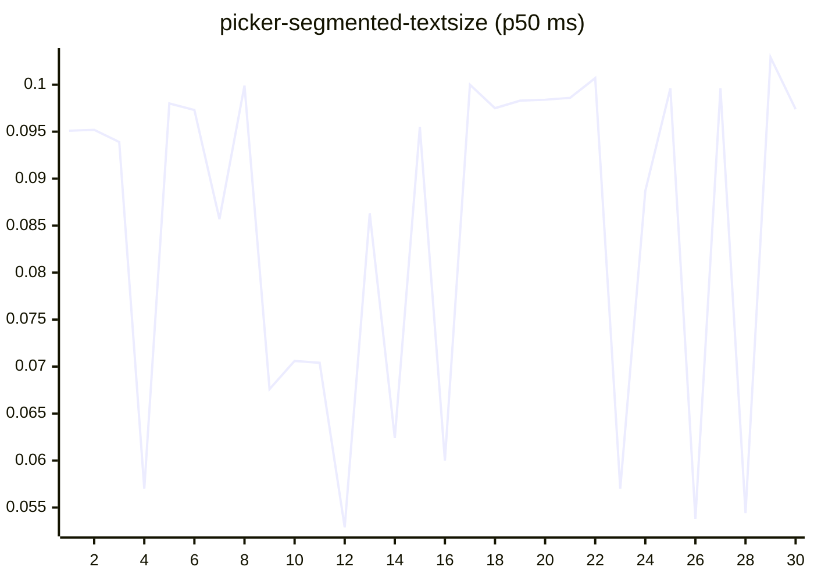
```mermaid
xychart-beta
    title "picker-segmented-textsize (p50 ms)"
    x-axis 1 --> 30
    line [0.0951, 0.0952, 0.0939, 0.0570, 0.0980, 0.0973, 0.0857, 0.0999, 0.0676, 0.0706, 0.0704, 0.0529, 0.0863, 0.0624, 0.0955, 0.0600, 0.1000, 0.0975, 0.0983, 0.0984, 0.0986, 0.1007, 0.0570, 0.0887, 0.0996, 0.0538, 0.0996, 0.0544, 0.1029, 0.0974]
```

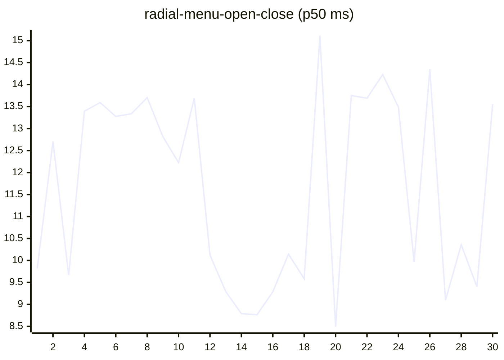
```mermaid
xychart-beta
    title "radial-menu-open-close (p50 ms)"
    x-axis 1 --> 30
    line [9.8198, 12.7062, 9.6636, 13.3949, 13.5923, 13.2760, 13.3385, 13.7060, 12.8177, 12.2246, 13.6922, 10.1222, 9.2955, 8.7896, 8.7658, 9.2868, 10.1425, 9.5839, 15.1159, 8.4930, 13.7518, 13.6910, 14.2293, 13.4899, 9.9631, 14.3516, 9.0969, 10.3580, 9.4040, 13.5562]
```

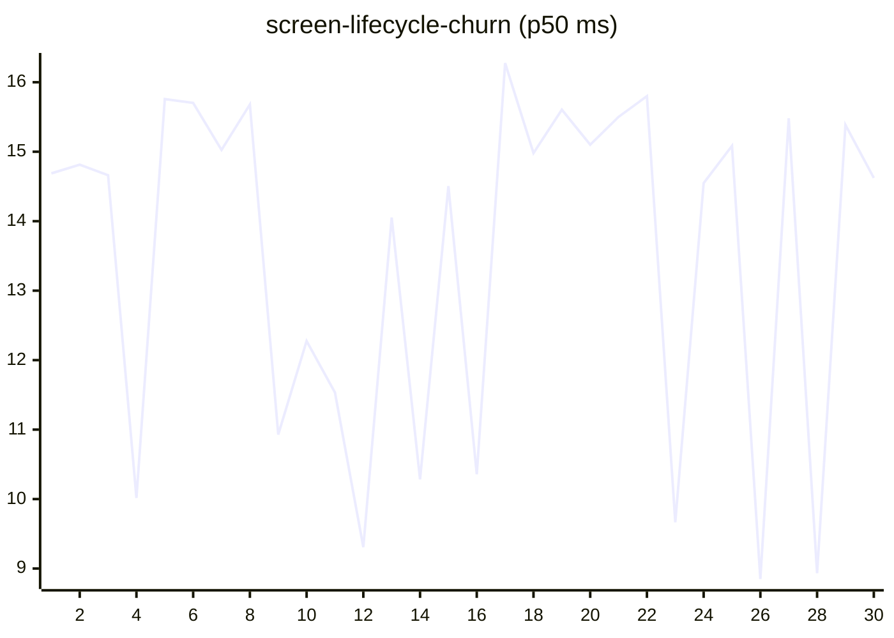
```mermaid
xychart-beta
    title "screen-lifecycle-churn (p50 ms)"
    x-axis 1 --> 30
    line [14.6881, 14.8127, 14.6619, 10.0163, 15.7570, 15.7018, 15.0249, 15.6801, 10.9284, 12.2751, 11.5333, 9.3077, 14.0529, 10.2834, 14.5049, 10.3571, 16.2758, 14.9800, 15.6047, 15.1004, 15.5018, 15.7992, 9.6661, 14.5485, 15.0845, 8.8497, 15.4803, 8.9330, 15.3846, 14.6222]
```

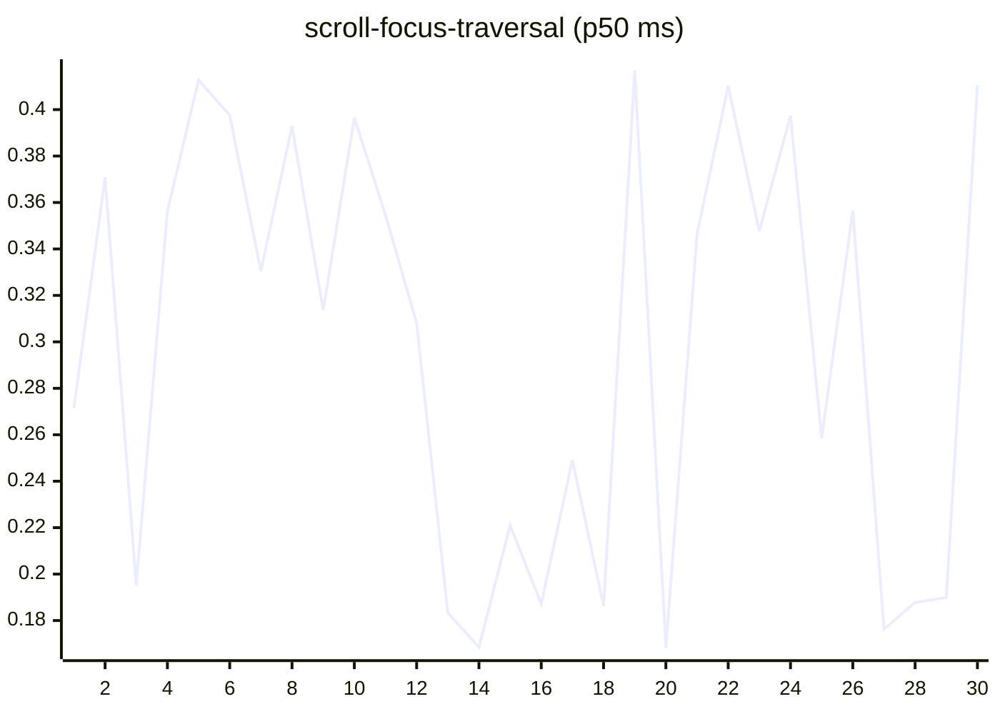
```mermaid
xychart-beta
    title "scroll-focus-traversal (p50 ms)"
    x-axis 1 --> 30
    line [0.2715, 0.3708, 0.1950, 0.3563, 0.4127, 0.3976, 0.3304, 0.3929, 0.3136, 0.3965, 0.3546, 0.3081, 0.1834, 0.1685, 0.2210, 0.1872, 0.2491, 0.1863, 0.4168, 0.1682, 0.3463, 0.4102, 0.3477, 0.3974, 0.2584, 0.3566, 0.1763, 0.1878, 0.1899, 0.4106]
```

```mermaid
xychart-beta
    title "settings-churn (p50 ms)"
    x-axis 1 --> 30
    line [3.8729, 3.8766, 3.8491, 2.5341, 4.0915, 3.9543, 3.7316, 4.0067, 2.8263, 2.9370, 2.9159, 2.3612, 3.5098, 2.5478, 3.8264, 2.5045, 4.1104, 3.9365, 4.0094, 3.9311, 3.8826, 4.0034, 2.4122, 3.5975, 3.9373, 2.2758, 4.0720, 2.3180, 3.9370, 3.8504]
```

```mermaid
xychart-beta
    title "shadow-storm (p50 ms)"
    x-axis 1 --> 30
    line [0.0005, 0.0005, 0.0006, 0.0005, 0.0006, 0.0006, 0.0005, 0.0005, 0.0003, 0.0005, 0.0005, 0.0006, 0.0006, 0.0006, 0.0006, 0.0004, 0.0004, 0.0006, 0.0006, 0.0005, 0.0006, 0.0005, 0.0005, 0.0005, 0.0006, 0.0006, 0.0007, 0.0003, 0.0003, 0.0006]
```

```mermaid
xychart-beta
    title "stylesheet-state-churn (p50 ms)"
    x-axis 1 --> 30
    line [0.3455, 0.3353, 0.4294, 0.3824, 0.4506, 0.4237, 0.3265, 0.3265, 0.2283, 0.3355, 0.3201, 0.4286, 0.4202, 0.4514, 0.4313, 0.3097, 0.2760, 0.4462, 0.4196, 0.3798, 0.4136, 0.3689, 0.3490, 0.3439, 0.4287, 0.4552, 0.4064, 0.2532, 0.2627, 0.4348]
```

```mermaid
xychart-beta
    title "theme-swap-assets (p50 ms)"
    x-axis 1 --> 30
    line [1.8548, 2.3108, 1.6943, 2.3746, 2.2533, 2.3007, 2.2073, 2.2534, 2.1207, 2.2222, 2.3836, 1.7806, 1.4840, 1.3657, 1.3665, 1.4553, 1.7851, 1.4789, 2.4892, 1.3140, 2.3131, 2.2516, 1.9473, 1.8733, 1.4540, 2.0397, 1.1850, 1.2793, 1.1733, 1.8976]
```

```mermaid
xychart-beta
    title "theme-swap-flat (p50 ms)"
    x-axis 1 --> 30
    line [0.3992, 0.5116, 0.3078, 0.5063, 0.4302, 0.4218, 0.3602, 0.4256, 0.3454, 0.4102, 0.3724, 0.3261, 0.2527, 0.2442, 0.2585, 0.2623, 0.3198, 0.2619, 0.4434, 0.2339, 0.4407, 0.4280, 0.4363, 0.4235, 0.3316, 0.4379, 0.2589, 0.2616, 0.2540, 0.4218]
```

```mermaid
xychart-beta
    title "theme-swap-metrics (p50 ms)"
    x-axis 1 --> 30
    line [1.4878, 1.4622, 1.8082, 1.7316, 1.7971, 1.7405, 1.4212, 1.4274, 0.9894, 1.4473, 1.4180, 1.7700, 1.7319, 1.7324, 1.7301, 1.4949, 1.3408, 1.7593, 1.7245, 1.6804, 1.7547, 1.6926, 1.4410, 1.4690, 1.7671, 1.8831, 1.8236, 1.1007, 1.1142, 1.7425]
```

```mermaid
xychart-beta
    title "virtual-list-scroll (p50 ms)"
    x-axis 1 --> 30
    line [0.1139, 0.1890, 0.1664, 0.1136, 0.1929, 0.1833, 0.1777, 0.1982, 0.1924, 0.1116, 0.1343, 0.1908, 0.1463, 0.1654, 0.1331, 0.1880, 0.1434, 0.1653, 0.1332, 0.1296, 0.1949, 0.1709, 0.2205, 0.1936, 0.2004, 0.1915, 0.1452, 0.1766, 0.1937, 0.1545]
```
