# Facet performance

Latest: `aa60e186b7a02692e68c5aee47a624257f59b10f` on 2026-10-30T050915Z, measured on the CI Ubuntu runner by the paired performance shards.
Times are milliseconds per frame or operation: the median over paired rounds of each round's p50 and p95.
Retained heap is the scene's mounted retained Luau heap. Change compares the p50 of the previous main commit.

| Scene | p50 ms | p95 ms | Retained KiB | Change |
| --- | ---: | ---: | ---: | ---: |
| adaptive-navigation-images | 1.3247 | 1.6606 | 3195 | +3.3% |
| alert-present-dismiss | 2.9892 | 5.4504 | 2361 | +27.0% |
| animation-interruption | 0.0306 | 0.0359 | 401 | +23.1% |
| async-image-burst | 0.0505 | 0.0647 | 525 | -0.9% |
| async-image-grid | 2.0270 | 3.0719 | 3363 | +6.1% |
| collection-mutation | 0.2906 | 0.4977 | 3836 | +22.5% |
| control-motion | 0.2644 | 0.6871 | 1847 | +0.2% |
| dense-hud | 0.2124 | 0.2350 | 832 | +1.4% |
| dense-motion | 1.0144 | 1.5137 | 2155 | +12.2% |
| hud-binding-storm | 0.2323 | 0.3163 | 482 | +15.3% |
| lab-collection-churn | 0.3389 | 0.5904 | 4301 | +21.1% |
| lab-dense-scroll | 0.8252 | 4.4998 | 6555 | +57.1% |
| locale-textsize-change | 0.0431 | 0.0520 | 562 | +1.7% |
| native-scroll-drag | 0.0571 | 0.0731 | 1672 | +4.7% |
| navigation-customization | 0.0781 | 0.0946 | 3952 | +1.3% |
| picker-menu-open-close | 4.5868 | 6.5542 | 1226 | +3.7% |
| picker-segmented-textsize | 0.0949 | 0.1151 | 983 | +0.3% |
| radial-menu-open-close | 13.6578 | 24.9299 | 1356 | +1.0% |
| screen-lifecycle-churn | 14.7456 | 24.7015 | 1150 | -1.3% |
| scroll-focus-traversal | 0.3470 | 0.6095 | 1269 | -15.8% |
| settings-churn | 3.8874 | 5.8189 | 3236 | +0.1% |
| shadow-storm | 0.0005 | 0.0016 | 2012 | +63.1% |
| stylesheet-state-churn | 0.3783 | 0.7102 | 3057 | +55.1% |
| theme-swap-assets | 1.8218 | 2.3183 | 5212 | -0.4% |
| theme-swap-flat | 0.4400 | 0.5026 | 4222 | -0.0% |
| theme-swap-metrics | 1.5747 | 2.4218 | 4873 | +46.5% |
| virtual-list-scroll | 0.1608 | 0.3336 | 5361 | -0.1% |

| Microbenchmark | p50 ms | p95 ms | Change |
| --- | ---: | ---: | ---: |
| billboard-nameplate-storm | 0.1563 | 0.1977 | +25.5% |
| collection-mutation | 0.0086 | 0.0117 | -0.8% |
| collection-selection-update | 0.0027 | 0.0046 | +0.6% |
| hud-binding-storm | 0.3250 | 0.3382 | +60.1% |
| motion-declarative | 1.0696 | 1.7996 | +10.7% |
| motion-explicit | 1.2724 | 2.0765 | -0.2% |
| mount-ramp | 162.9599 | 179.7634 | +0.3% |
| mount-ramp-inherited | 165.9436 | 183.0847 | +65.9% |
| mounted-slice-update-storm | 0.2057 | 0.2531 | +23.3% |
| outline-measured-update | 1.5887 | 2.2413 | +0.2% |
| reserved-slot-record-update | 0.9467 | 1.4069 | +0.0% |
| settings-churn | 0.0117 | 0.0162 | +52.7% |
| sparse-update-under-load | 0.0022 | 0.0027 | +27.4% |
| table-mutation | 0.3490 | 0.4698 | -0.4% |
| table-resize-drag | 3.2189 | 5.6008 | +0.9% |
| table-sort-values | 0.9799 | 1.4990 | +26.6% |
| table-source-refresh | 0.1841 | 0.4207 | +13.9% |
| textinput-typing-storm | 0.2723 | 0.4355 | -3.3% |
| timer-readout-storm | 0.1731 | 1.0230 | +7.6% |
| zz-yardstick-cpu-after | 1.2316 | 1.2599 | -6.6% |
| zz-yardstick-cpu-before | 1.1675 | 1.1810 | -9.5% |

## Scene p50 over the last 30 main commits

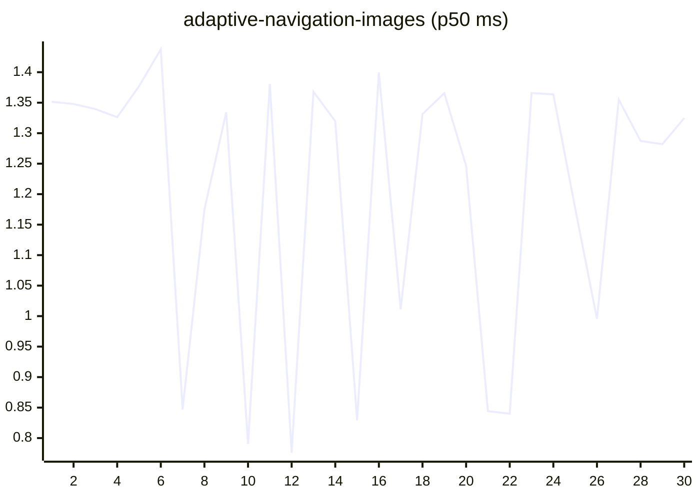
```mermaid
xychart-beta
    title "adaptive-navigation-images (p50 ms)"
    x-axis 1 --> 30
    line [1.3515, 1.3479, 1.3395, 1.3263, 1.3769, 1.4375, 0.8471, 1.1748, 1.3343, 0.7905, 1.3810, 0.7758, 1.3680, 1.3197, 0.8291, 1.3996, 1.0110, 1.3313, 1.3656, 1.2466, 0.8441, 0.8400, 1.3659, 1.3636, 1.1770, 0.9954, 1.3550, 1.2872, 1.2820, 1.3247]
```

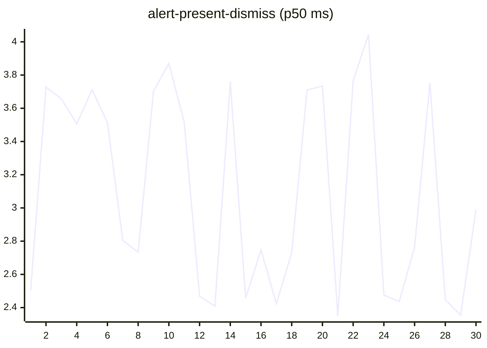
```mermaid
xychart-beta
    title "alert-present-dismiss (p50 ms)"
    x-axis 1 --> 30
    line [2.5024, 3.7273, 3.6562, 3.5064, 3.7112, 3.5136, 2.8044, 2.7337, 3.7022, 3.8703, 3.5157, 2.4688, 2.4093, 3.7592, 2.4564, 2.7475, 2.4232, 2.7312, 3.7096, 3.7340, 2.3506, 3.7650, 4.0447, 2.4759, 2.4363, 2.7635, 3.7527, 2.4474, 2.3546, 2.9892]
```

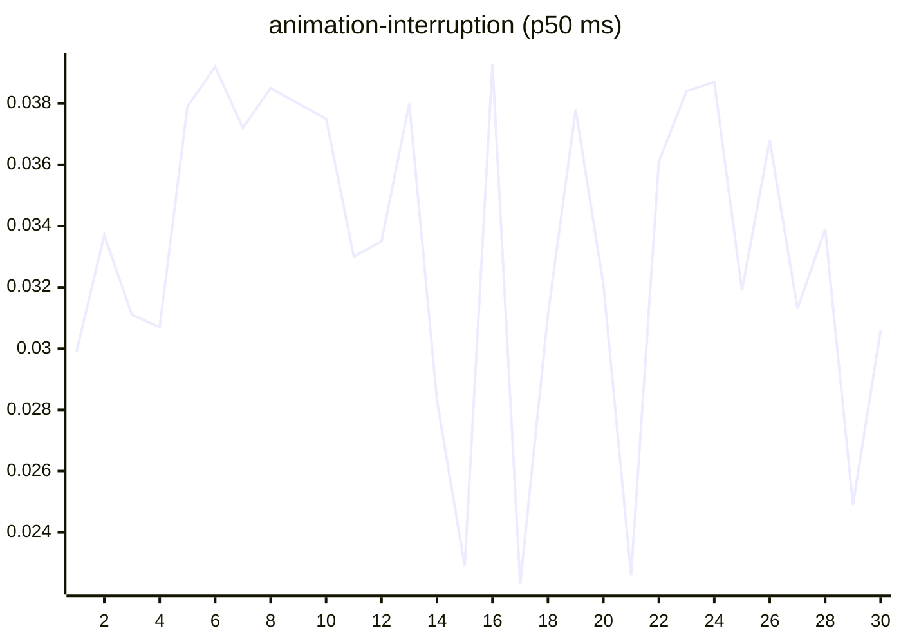
```mermaid
xychart-beta
    title "animation-interruption (p50 ms)"
    x-axis 1 --> 30
    line [0.0299, 0.0337, 0.0311, 0.0307, 0.0379, 0.0392, 0.0372, 0.0385, 0.0380, 0.0375, 0.0330, 0.0335, 0.0380, 0.0283, 0.0229, 0.0393, 0.0223, 0.0311, 0.0378, 0.0321, 0.0226, 0.0361, 0.0384, 0.0387, 0.0319, 0.0368, 0.0313, 0.0339, 0.0249, 0.0306]
```

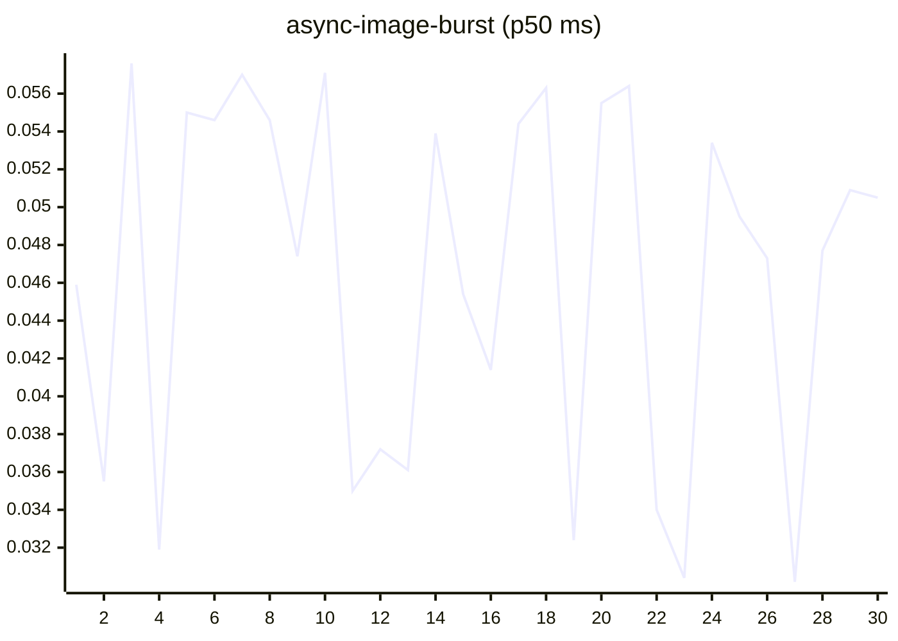
```mermaid
xychart-beta
    title "async-image-burst (p50 ms)"
    x-axis 1 --> 30
    line [0.0459, 0.0355, 0.0576, 0.0319, 0.0550, 0.0546, 0.0570, 0.0546, 0.0474, 0.0571, 0.0350, 0.0372, 0.0361, 0.0539, 0.0454, 0.0414, 0.0544, 0.0563, 0.0324, 0.0555, 0.0564, 0.0340, 0.0304, 0.0534, 0.0495, 0.0473, 0.0302, 0.0477, 0.0509, 0.0505]
```

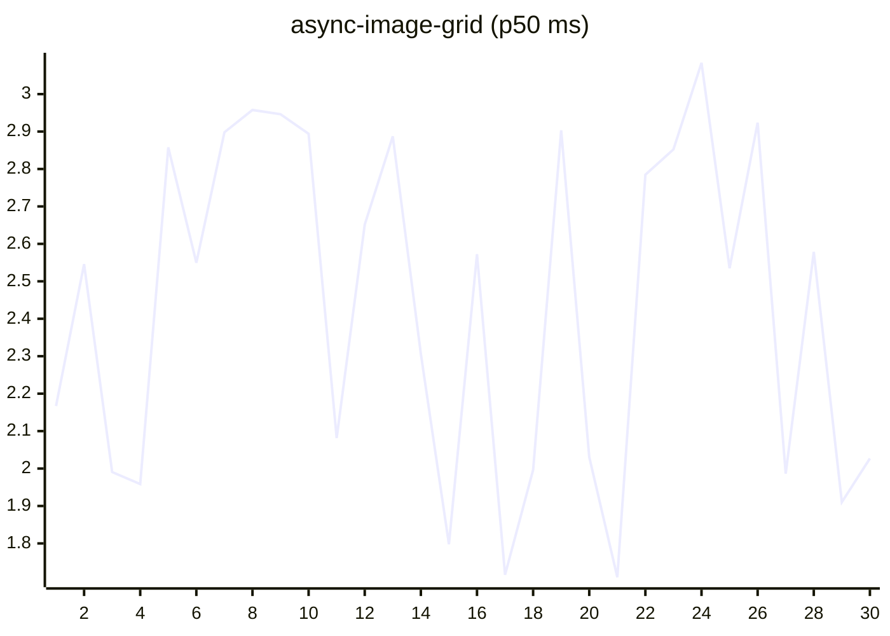
```mermaid
xychart-beta
    title "async-image-grid (p50 ms)"
    x-axis 1 --> 30
    line [2.1671, 2.5459, 1.9906, 1.9586, 2.8577, 2.5497, 2.8980, 2.9576, 2.9463, 2.8940, 2.0815, 2.6515, 2.8871, 2.3060, 1.7979, 2.5726, 1.7163, 1.9964, 2.9032, 2.0307, 1.7099, 2.7848, 2.8523, 3.0834, 2.5349, 2.9237, 1.9862, 2.5787, 1.9102, 2.0270]
```

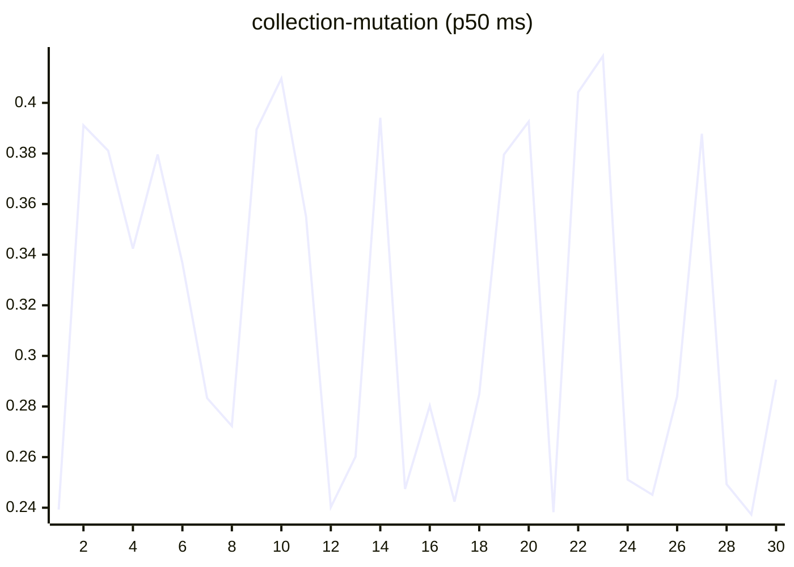
```mermaid
xychart-beta
    title "collection-mutation (p50 ms)"
    x-axis 1 --> 30
    line [0.2393, 0.3911, 0.3811, 0.3424, 0.3796, 0.3367, 0.2833, 0.2723, 0.3895, 0.4096, 0.3550, 0.2402, 0.2602, 0.3941, 0.2474, 0.2803, 0.2424, 0.2848, 0.3796, 0.3926, 0.2382, 0.4042, 0.4185, 0.2511, 0.2451, 0.2840, 0.3878, 0.2493, 0.2373, 0.2906]
```

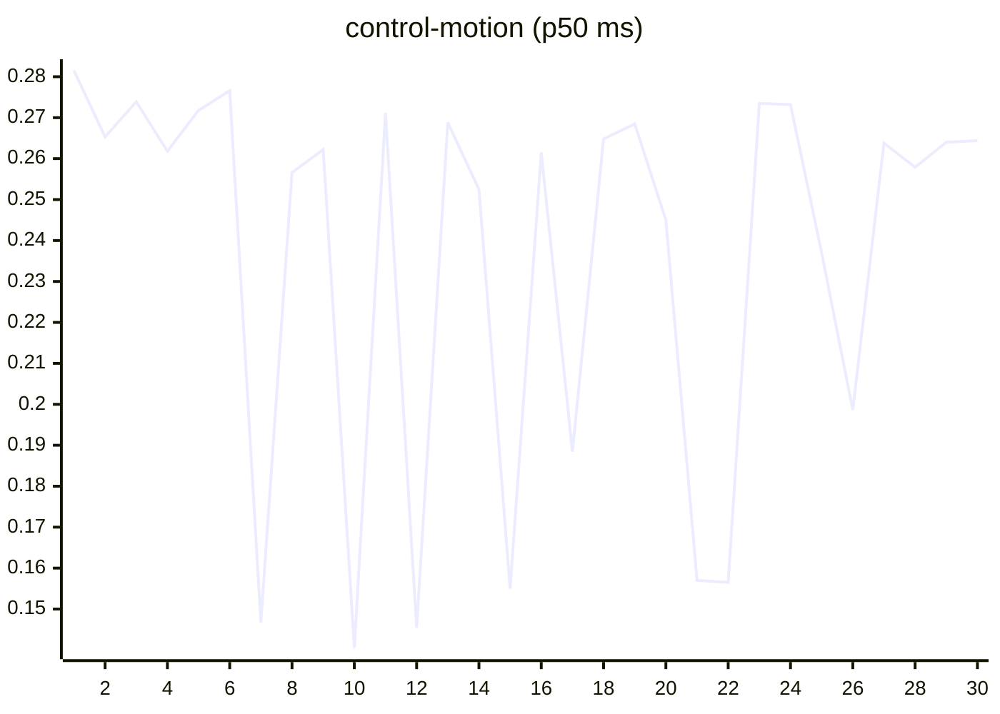
```mermaid
xychart-beta
    title "control-motion (p50 ms)"
    x-axis 1 --> 30
    line [0.2815, 0.2653, 0.2739, 0.2618, 0.2718, 0.2766, 0.1467, 0.2566, 0.2622, 0.1405, 0.2712, 0.1454, 0.2688, 0.2525, 0.1550, 0.2615, 0.1884, 0.2648, 0.2685, 0.2450, 0.1570, 0.1565, 0.2735, 0.2732, 0.2370, 0.1986, 0.2638, 0.2579, 0.2640, 0.2644]
```

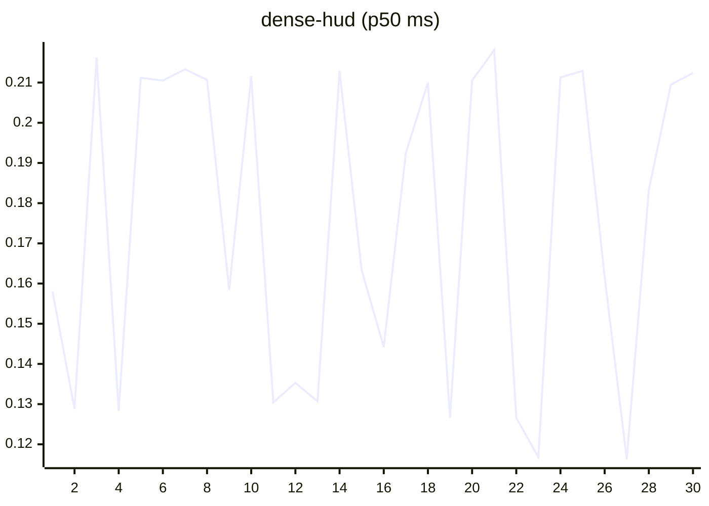
```mermaid
xychart-beta
    title "dense-hud (p50 ms)"
    x-axis 1 --> 30
    line [0.1581, 0.1288, 0.2162, 0.1283, 0.2112, 0.2105, 0.2133, 0.2107, 0.1584, 0.2116, 0.1304, 0.1353, 0.1307, 0.2129, 0.1633, 0.1442, 0.1925, 0.2100, 0.1266, 0.2105, 0.2181, 0.1266, 0.1168, 0.2113, 0.2129, 0.1617, 0.1163, 0.1833, 0.2095, 0.2124]
```

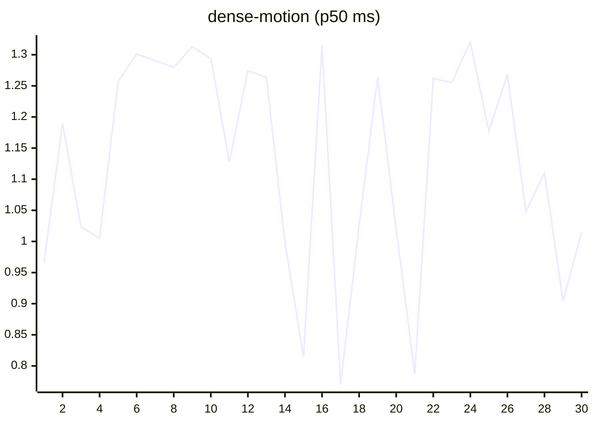
```mermaid
xychart-beta
    title "dense-motion (p50 ms)"
    x-axis 1 --> 30
    line [0.9653, 1.1895, 1.0233, 1.0054, 1.2572, 1.3012, 1.2904, 1.2798, 1.3128, 1.2940, 1.1276, 1.2742, 1.2636, 0.9981, 0.8144, 1.3160, 0.7697, 1.0258, 1.2636, 1.0200, 0.7874, 1.2619, 1.2553, 1.3206, 1.1772, 1.2685, 1.0480, 1.1102, 0.9040, 1.0144]
```

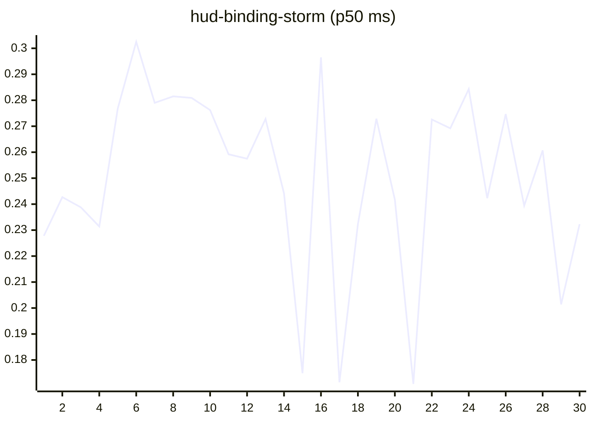
```mermaid
xychart-beta
    title "hud-binding-storm (p50 ms)"
    x-axis 1 --> 30
    line [0.2278, 0.2427, 0.2388, 0.2314, 0.2768, 0.3025, 0.2790, 0.2815, 0.2809, 0.2762, 0.2592, 0.2575, 0.2728, 0.2441, 0.1749, 0.2965, 0.1714, 0.2323, 0.2729, 0.2417, 0.1708, 0.2726, 0.2692, 0.2843, 0.2423, 0.2747, 0.2394, 0.2607, 0.2014, 0.2323]
```

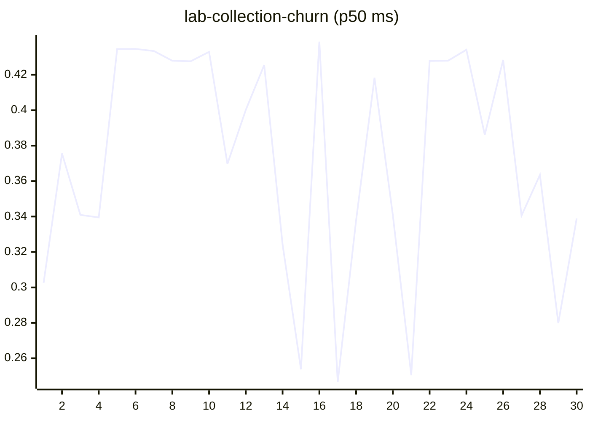
```mermaid
xychart-beta
    title "lab-collection-churn (p50 ms)"
    x-axis 1 --> 30
    line [0.3026, 0.3756, 0.3409, 0.3395, 0.4345, 0.4346, 0.4334, 0.4279, 0.4276, 0.4329, 0.3697, 0.4002, 0.4255, 0.3242, 0.2538, 0.4387, 0.2466, 0.3379, 0.4183, 0.3407, 0.2505, 0.4278, 0.4279, 0.4341, 0.3861, 0.4284, 0.3405, 0.3635, 0.2798, 0.3389]
```

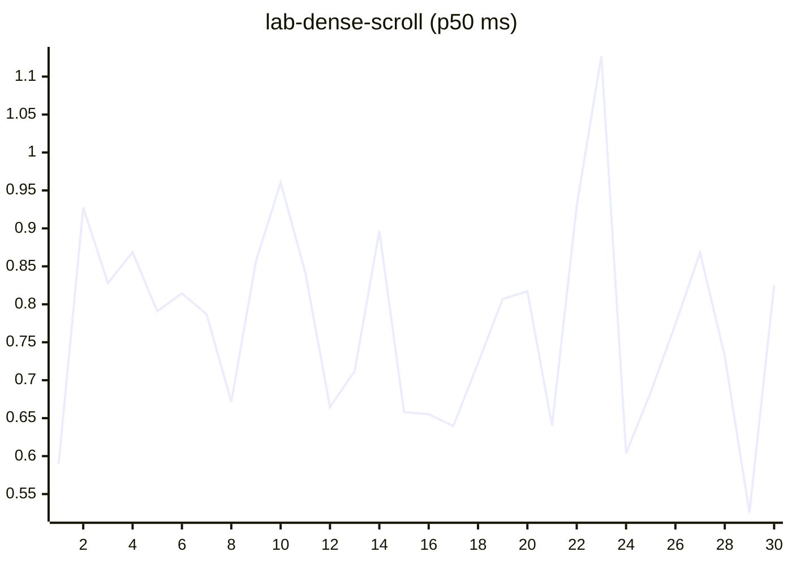
```mermaid
xychart-beta
    title "lab-dense-scroll (p50 ms)"
    x-axis 1 --> 30
    line [0.5895, 0.9275, 0.8280, 0.8687, 0.7908, 0.8143, 0.7869, 0.6713, 0.8570, 0.9604, 0.8416, 0.6647, 0.7120, 0.8968, 0.6580, 0.6552, 0.6397, 0.7226, 0.8071, 0.8171, 0.6401, 0.9297, 1.1273, 0.6038, 0.6843, 0.7739, 0.8680, 0.7317, 0.5254, 0.8252]
```

```mermaid
xychart-beta
    title "locale-textsize-change (p50 ms)"
    x-axis 1 --> 30
    line [0.0443, 0.0415, 0.0430, 0.0425, 0.0433, 0.0422, 0.0234, 0.0385, 0.0428, 0.0225, 0.0425, 0.0226, 0.0436, 0.0422, 0.0237, 0.0418, 0.0334, 0.0413, 0.0423, 0.0410, 0.0237, 0.0233, 0.0389, 0.0419, 0.0335, 0.0329, 0.0415, 0.0423, 0.0424, 0.0431]
```

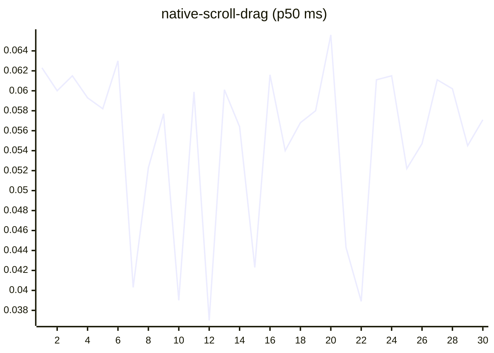
```mermaid
xychart-beta
    title "native-scroll-drag (p50 ms)"
    x-axis 1 --> 30
    line [0.0623, 0.0600, 0.0615, 0.0593, 0.0582, 0.0630, 0.0403, 0.0523, 0.0577, 0.0390, 0.0599, 0.0370, 0.0601, 0.0564, 0.0423, 0.0616, 0.0540, 0.0568, 0.0580, 0.0656, 0.0443, 0.0389, 0.0611, 0.0615, 0.0522, 0.0547, 0.0611, 0.0602, 0.0545, 0.0571]
```

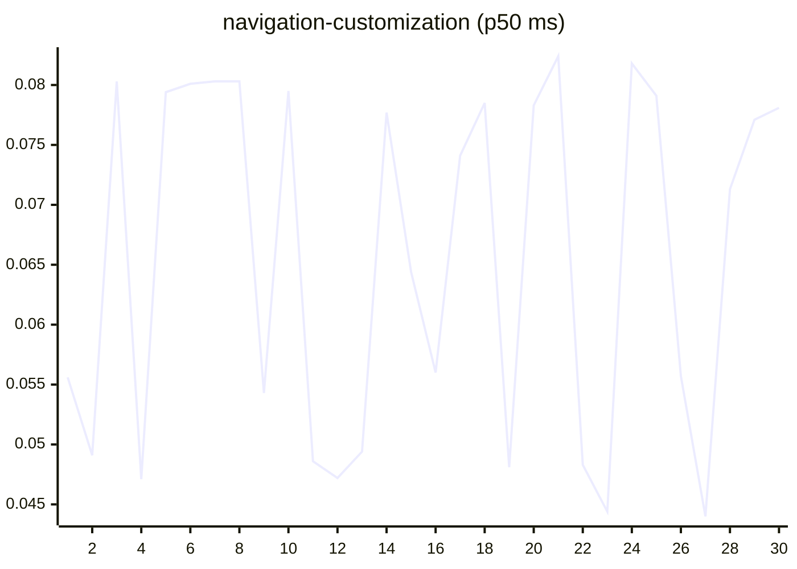
```mermaid
xychart-beta
    title "navigation-customization (p50 ms)"
    x-axis 1 --> 30
    line [0.0556, 0.0491, 0.0803, 0.0471, 0.0794, 0.0801, 0.0803, 0.0803, 0.0543, 0.0795, 0.0486, 0.0472, 0.0494, 0.0777, 0.0644, 0.0560, 0.0741, 0.0785, 0.0481, 0.0783, 0.0824, 0.0483, 0.0444, 0.0818, 0.0791, 0.0557, 0.0440, 0.0713, 0.0771, 0.0781]
```

```mermaid
xychart-beta
    title "picker-menu-open-close (p50 ms)"
    x-axis 1 --> 30
    line [5.0120, 5.7822, 4.6627, 4.5372, 6.2442, 5.9038, 6.6044, 6.2815, 6.5623, 6.5728, 5.0278, 6.3599, 6.2355, 5.3362, 4.1492, 5.7473, 4.0112, 4.5489, 6.1919, 4.6774, 3.9267, 6.3897, 6.0683, 6.7415, 5.8582, 6.3016, 4.6878, 5.9725, 4.4246, 4.5868]
```

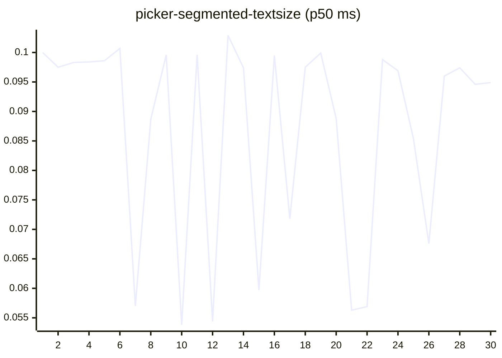
```mermaid
xychart-beta
    title "picker-segmented-textsize (p50 ms)"
    x-axis 1 --> 30
    line [0.1000, 0.0975, 0.0983, 0.0984, 0.0986, 0.1007, 0.0570, 0.0887, 0.0996, 0.0538, 0.0996, 0.0544, 0.1029, 0.0974, 0.0597, 0.0995, 0.0718, 0.0975, 0.0999, 0.0888, 0.0563, 0.0569, 0.0988, 0.0969, 0.0854, 0.0676, 0.0960, 0.0974, 0.0946, 0.0949]
```

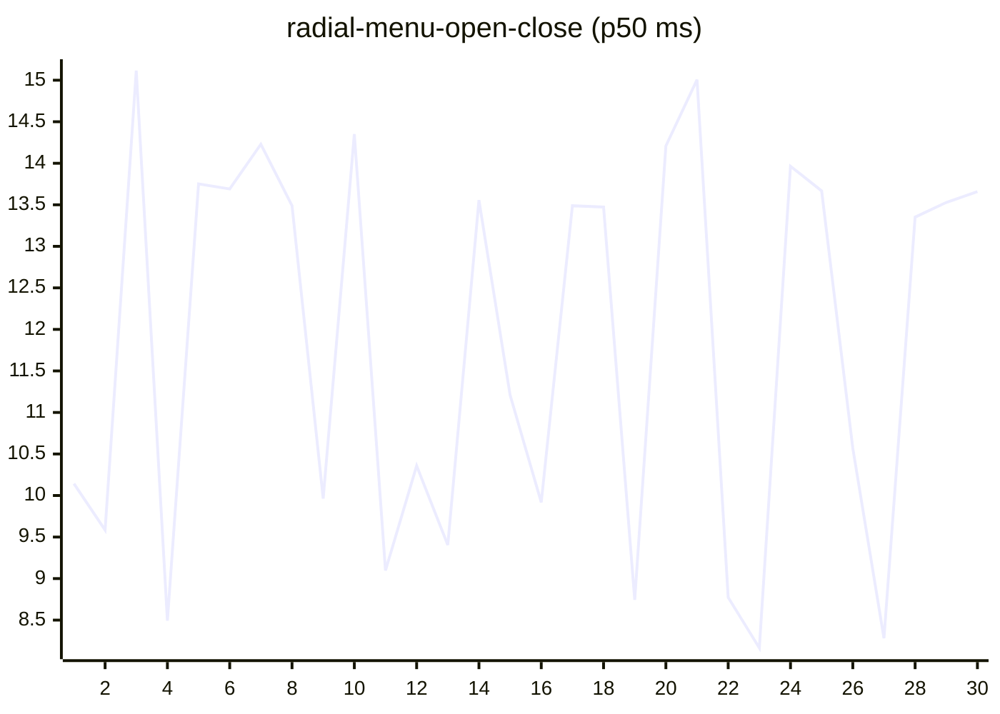
```mermaid
xychart-beta
    title "radial-menu-open-close (p50 ms)"
    x-axis 1 --> 30
    line [10.1425, 9.5839, 15.1159, 8.4930, 13.7518, 13.6910, 14.2293, 13.4899, 9.9631, 14.3516, 9.0969, 10.3580, 9.4040, 13.5562, 11.2086, 9.9173, 13.4886, 13.4731, 8.7442, 14.2081, 15.0064, 8.7734, 8.1647, 13.9647, 13.6671, 10.5695, 8.2821, 13.3516, 13.5281, 13.6578]
```

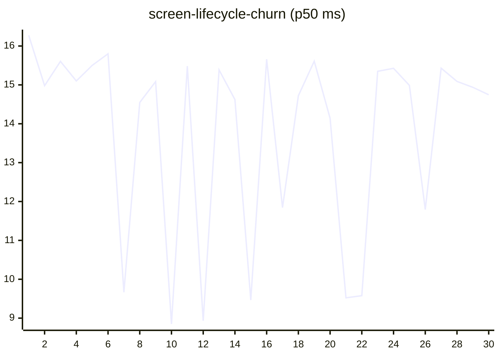
```mermaid
xychart-beta
    title "screen-lifecycle-churn (p50 ms)"
    x-axis 1 --> 30
    line [16.2758, 14.9800, 15.6047, 15.1004, 15.5018, 15.7992, 9.6661, 14.5485, 15.0845, 8.8497, 15.4803, 8.9330, 15.3846, 14.6222, 9.4657, 15.6595, 11.8442, 14.7213, 15.6094, 14.1404, 9.5225, 9.5780, 15.3495, 15.4269, 14.9874, 11.7933, 15.4305, 15.0900, 14.9376, 14.7456]
```

```mermaid
xychart-beta
    title "scroll-focus-traversal (p50 ms)"
    x-axis 1 --> 30
    line [0.2491, 0.1863, 0.4168, 0.1682, 0.3463, 0.4102, 0.3477, 0.3974, 0.2584, 0.3566, 0.1763, 0.1878, 0.1899, 0.4106, 0.2671, 0.2443, 0.3323, 0.3461, 0.1720, 0.4071, 0.4212, 0.1794, 0.1738, 0.3583, 0.3488, 0.2632, 0.1731, 0.3559, 0.4123, 0.3470]
```

```mermaid
xychart-beta
    title "settings-churn (p50 ms)"
    x-axis 1 --> 30
    line [4.1104, 3.9365, 4.0094, 3.9311, 3.8826, 4.0034, 2.4122, 3.5975, 3.9373, 2.2758, 4.0720, 2.3180, 3.9370, 3.8504, 2.4242, 4.0029, 2.9213, 3.9101, 3.9346, 3.5400, 2.4981, 2.4112, 3.9313, 3.9827, 3.6842, 2.9600, 3.9402, 3.9037, 3.8852, 3.8874]
```

```mermaid
xychart-beta
    title "shadow-storm (p50 ms)"
    x-axis 1 --> 30
    line [0.0004, 0.0006, 0.0006, 0.0005, 0.0006, 0.0005, 0.0005, 0.0005, 0.0006, 0.0006, 0.0007, 0.0003, 0.0003, 0.0006, 0.0003, 0.0005, 0.0003, 0.0005, 0.0006, 0.0006, 0.0003, 0.0006, 0.0006, 0.0004, 0.0003, 0.0005, 0.0006, 0.0003, 0.0003, 0.0005]
```

```mermaid
xychart-beta
    title "stylesheet-state-churn (p50 ms)"
    x-axis 1 --> 30
    line [0.2760, 0.4462, 0.4196, 0.3798, 0.4136, 0.3689, 0.3490, 0.3439, 0.4287, 0.4552, 0.4064, 0.2532, 0.2627, 0.4348, 0.2567, 0.3253, 0.2482, 0.3268, 0.4212, 0.4202, 0.2626, 0.4522, 0.4744, 0.2757, 0.2547, 0.3426, 0.4392, 0.2833, 0.2439, 0.3783]
```

```mermaid
xychart-beta
    title "theme-swap-assets (p50 ms)"
    x-axis 1 --> 30
    line [1.7851, 1.4789, 2.4892, 1.3140, 2.3131, 2.2516, 1.9473, 1.8733, 1.4540, 2.0397, 1.1850, 1.2793, 1.1733, 1.8976, 1.6482, 1.4574, 1.9094, 1.9024, 1.1643, 1.7819, 2.1619, 1.1552, 1.0581, 1.8573, 1.8118, 1.4261, 1.0897, 1.8006, 1.8292, 1.8218]
```

```mermaid
xychart-beta
    title "theme-swap-flat (p50 ms)"
    x-axis 1 --> 30
    line [0.3198, 0.2619, 0.4434, 0.2339, 0.4407, 0.4280, 0.4363, 0.4235, 0.3316, 0.4379, 0.2589, 0.2616, 0.2540, 0.4218, 0.3054, 0.2676, 0.3624, 0.4218, 0.2436, 0.4311, 0.4464, 0.2540, 0.2314, 0.4388, 0.4372, 0.3396, 0.2353, 0.3878, 0.4400, 0.4400]
```

```mermaid
xychart-beta
    title "theme-swap-metrics (p50 ms)"
    x-axis 1 --> 30
    line [1.3408, 1.7593, 1.7245, 1.6804, 1.7547, 1.6926, 1.4410, 1.4690, 1.7671, 1.8831, 1.8236, 1.1007, 1.1142, 1.7425, 1.1116, 1.4099, 1.1021, 1.4421, 1.7457, 1.7623, 1.0742, 1.8376, 2.1766, 1.3874, 1.1282, 1.5453, 1.8023, 1.1545, 1.0747, 1.5747]
```

```mermaid
xychart-beta
    title "virtual-list-scroll (p50 ms)"
    x-axis 1 --> 30
    line [0.1434, 0.1653, 0.1332, 0.1296, 0.1949, 0.1709, 0.2205, 0.1936, 0.2004, 0.1915, 0.1452, 0.1766, 0.1937, 0.1545, 0.1192, 0.1725, 0.1146, 0.1237, 0.1937, 0.1328, 0.1149, 0.2387, 0.2094, 0.1951, 0.1690, 0.1968, 0.1330, 0.1860, 0.1610, 0.1608]
```
