# Facet performance

Latest: `b38f93f7ba579cdd7081c6360ae53a1ec7ffc0a9` on 2026-11-14T060357Z, measured on the CI Ubuntu runner by the paired performance shards.
Times are milliseconds per frame or operation: the median over paired rounds of each round's p50 and p95.
Retained heap is the scene's mounted retained Luau heap. Change compares the p50 with the previous main commit measured in the same paired shard, on the same runner.

| Scene | p50 ms | p95 ms | Retained KiB | Change |
| --- | ---: | ---: | ---: | ---: |
| adaptive-navigation-images | 0.8547 | 1.0928 | 4037 | +2.1% |
| alert-present-dismiss | 2.8095 | 3.9723 | 609 | +1.3% |
| animation-interruption | 0.0333 | 0.0359 | 391 | -3.0% |
| async-image-burst | 0.0292 | 0.0350 | 489 | -0.6% |
| async-image-grid | 2.5214 | 3.8519 | 681 | -0.2% |
| collection-mutation | 0.2898 | 0.3366 | 2792 | -0.3% |
| control-motion | 0.1731 | 0.6430 | 1745 | +0.8% |
| dense-hud | 0.1106 | 0.1235 | 740 | -0.4% |
| dense-motion | 0.7888 | 1.2136 | 1554 | -2.6% |
| hud-binding-storm | 0.2286 | 0.2483 | 484 | +1.4% |
| lab-collection-churn | 0.3667 | 0.4976 | 4766 | +2.6% |
| lab-dense-scroll | 0.1392 | 0.2100 | 5826 | +0.3% |
| locale-textsize-change | 0.0272 | 0.0316 | 543 | -3.0% |
| native-scroll-drag | 0.0465 | 0.0598 | 1933 | -8.0% |
| navigation-customization | 0.0403 | 0.0483 | 3974 | -1.2% |
| picker-menu-open-close | 5.9413 | 9.3842 | 801 | +2.6% |
| picker-segmented-textsize | 0.0673 | 0.0763 | 923 | +4.7% |
| radial-menu-open-close | 2.4370 | 3.1254 | 2185 | -0.1% |
| screen-lifecycle-churn | 14.5988 | 21.1486 | 699 | -0.2% |
| scroll-focus-traversal | 0.2121 | 0.3929 | 1243 | -0.1% |
| settings-churn | 3.7777 | 5.7600 | 528 | +0.8% |
| shadow-storm | 0.0004 | 0.0005 | 2010 | +2.4% |
| stylesheet-state-churn | 0.2769 | 0.3559 | 2519 | +1.2% |
| theme-swap-assets | 2.0587 | 2.5131 | 6112 | +0.1% |
| theme-swap-flat | 1.0493 | 1.3469 | 4184 | +0.4% |
| theme-swap-metrics | 2.0143 | 2.4572 | 5862 | +0.0% |
| virtual-list-scroll | 0.1411 | 0.1962 | 3871 | -3.8% |

| Microbenchmark | p50 ms | p95 ms | Change |
| --- | ---: | ---: | ---: |
| billboard-nameplate-storm | 0.1665 | 0.1816 | -0.9% |
| collection-mutation | 0.0080 | 0.0104 | -0.4% |
| collection-selection-update | 0.0017 | 0.0028 | -2.0% |
| hud-binding-storm | 0.2411 | 0.2663 | +0.7% |
| motion-declarative | 0.8509 | 1.0996 | +0.6% |
| motion-explicit | 0.7769 | 1.1124 | +0.1% |
| mount-ramp | 172.2574 | 182.6436 | -0.4% |
| mount-ramp-inherited | 182.2558 | 192.6218 | +0.1% |
| mounted-slice-update-storm | 0.2199 | 0.2735 | -0.2% |
| outline-measured-update | 1.1465 | 1.6294 | -0.3% |
| reserved-slot-record-update | 0.4802 | 0.5523 | +4.6% |
| settings-churn | 0.0102 | 0.0116 | -1.6% |
| sparse-update-under-load | 0.0025 | 0.0027 | -2.7% |
| table-mutation | 0.2697 | 0.3382 | +0.0% |
| table-resize-drag | 0.8425 | 1.0878 | +0.6% |
| table-sort-values | 0.8602 | 1.3328 | -0.9% |
| table-source-refresh | 0.2231 | 0.3807 | -0.2% |
| textinput-typing-storm | 0.2214 | 0.3630 | -1.2% |
| timer-readout-storm | 0.1033 | 0.6083 | +9.5% |
| zz-yardstick-cpu-after | 1.2151 | 1.2422 | +0.1% |
| zz-yardstick-cpu-before | 1.2133 | 1.2219 | -0.0% |

## Scene p50 over the last 30 main commits

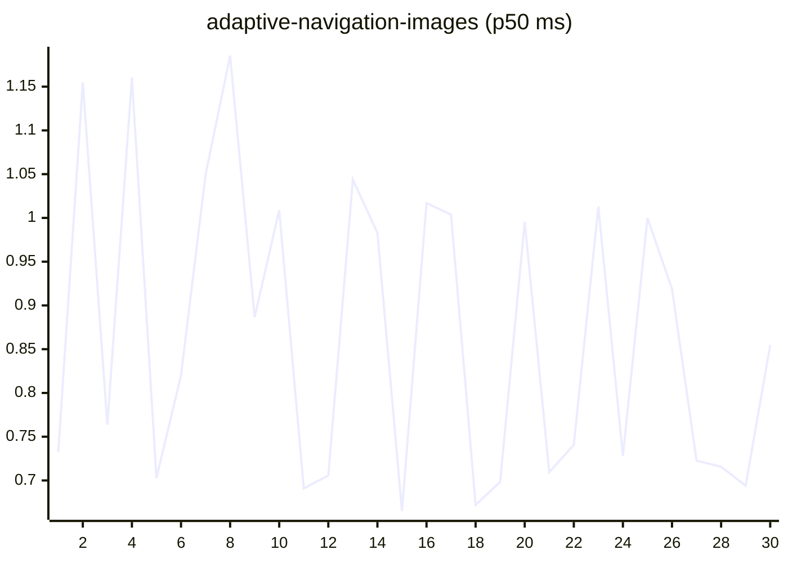
```mermaid
xychart-beta
    title "adaptive-navigation-images (p50 ms)"
    x-axis 1 --> 30
    line [0.7325, 1.1549, 0.7635, 1.1603, 0.7028, 0.8201, 1.0494, 1.1854, 0.8867, 1.0090, 0.6909, 0.7058, 1.0439, 0.9829, 0.6652, 1.0169, 1.0037, 0.6721, 0.6983, 0.9956, 0.7094, 0.7407, 1.0129, 0.7280, 1.0000, 0.9189, 0.7227, 0.7156, 0.6941, 0.8547]
```

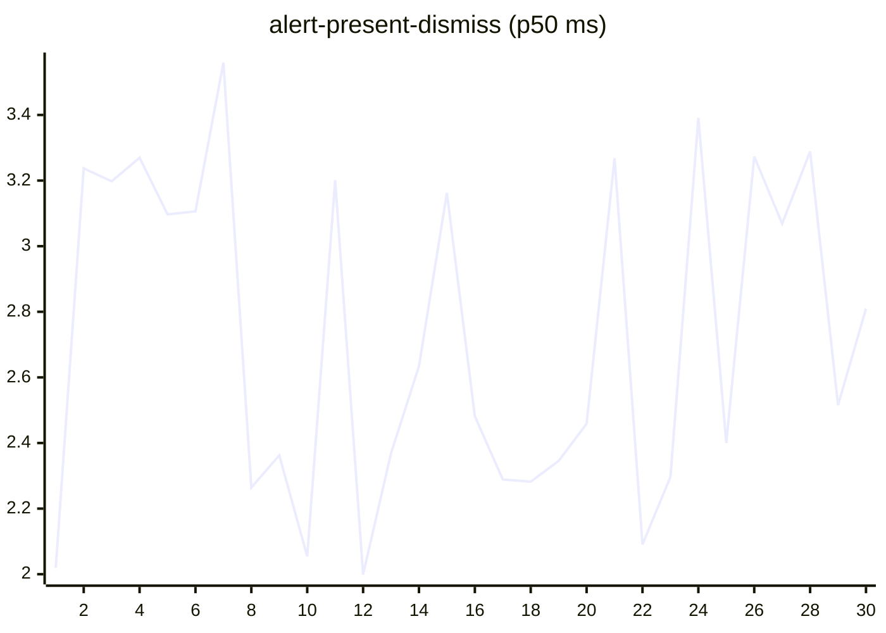
```mermaid
xychart-beta
    title "alert-present-dismiss (p50 ms)"
    x-axis 1 --> 30
    line [2.0200, 3.2371, 3.1976, 3.2697, 3.0970, 3.1061, 3.5597, 2.2642, 2.3626, 2.0543, 3.2013, 1.9993, 2.3689, 2.6340, 3.1626, 2.4814, 2.2888, 2.2819, 2.3455, 2.4588, 3.2682, 2.0908, 2.2965, 3.3910, 2.4000, 3.2732, 3.0684, 3.2888, 2.5156, 2.8095]
```

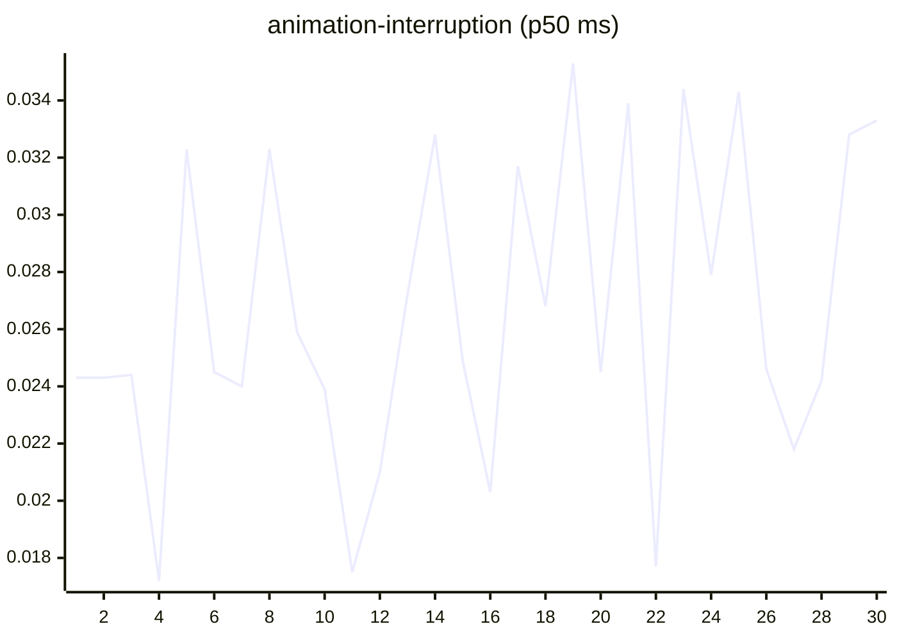
```mermaid
xychart-beta
    title "animation-interruption (p50 ms)"
    x-axis 1 --> 30
    line [0.0243, 0.0243, 0.0244, 0.0172, 0.0323, 0.0245, 0.0240, 0.0323, 0.0259, 0.0239, 0.0175, 0.0210, 0.0272, 0.0328, 0.0249, 0.0203, 0.0317, 0.0268, 0.0353, 0.0245, 0.0339, 0.0177, 0.0344, 0.0279, 0.0343, 0.0246, 0.0218, 0.0242, 0.0328, 0.0333]
```

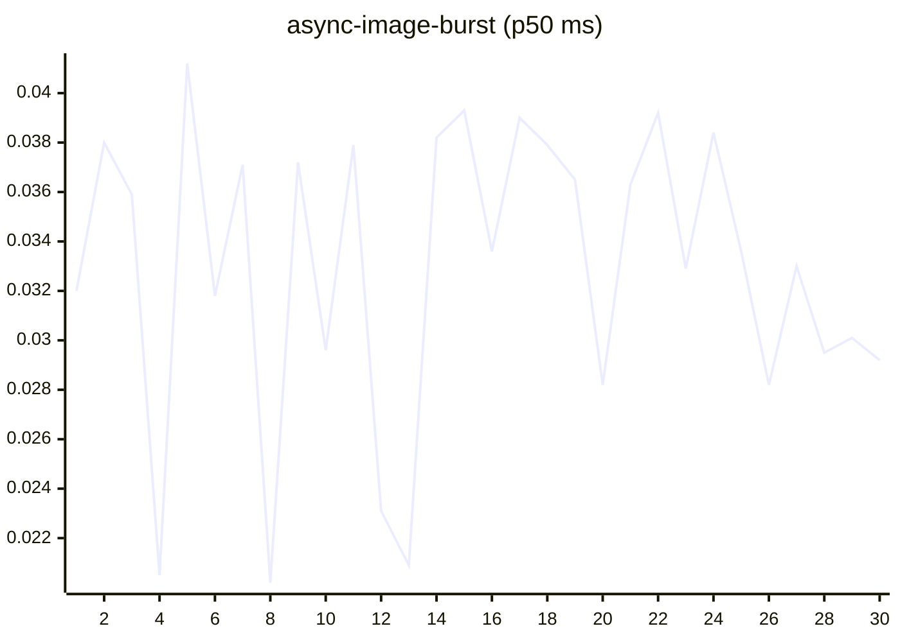
```mermaid
xychart-beta
    title "async-image-burst (p50 ms)"
    x-axis 1 --> 30
    line [0.0320, 0.0380, 0.0359, 0.0205, 0.0412, 0.0318, 0.0371, 0.0202, 0.0372, 0.0296, 0.0379, 0.0231, 0.0209, 0.0382, 0.0393, 0.0336, 0.0390, 0.0379, 0.0365, 0.0282, 0.0363, 0.0392, 0.0329, 0.0384, 0.0336, 0.0282, 0.0330, 0.0295, 0.0301, 0.0292]
```

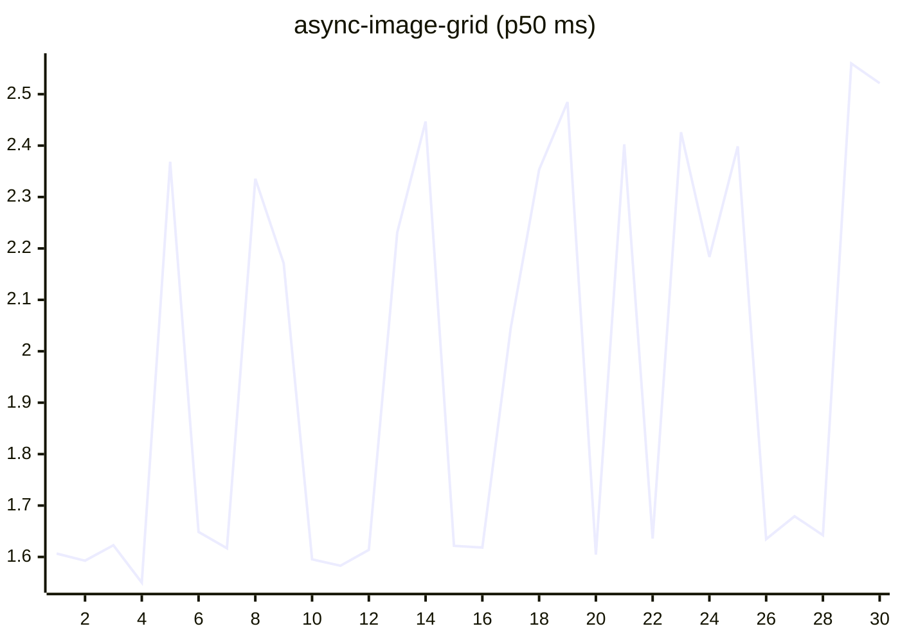
```mermaid
xychart-beta
    title "async-image-grid (p50 ms)"
    x-axis 1 --> 30
    line [1.6066, 1.5928, 1.6229, 1.5501, 2.3685, 1.6487, 1.6169, 2.3355, 2.1710, 1.5954, 1.5829, 1.6137, 2.2308, 2.4470, 1.6216, 1.6184, 2.0452, 2.3531, 2.4847, 1.6045, 2.4025, 1.6357, 2.4260, 2.1835, 2.3985, 1.6346, 1.6792, 1.6424, 2.5597, 2.5214]
```

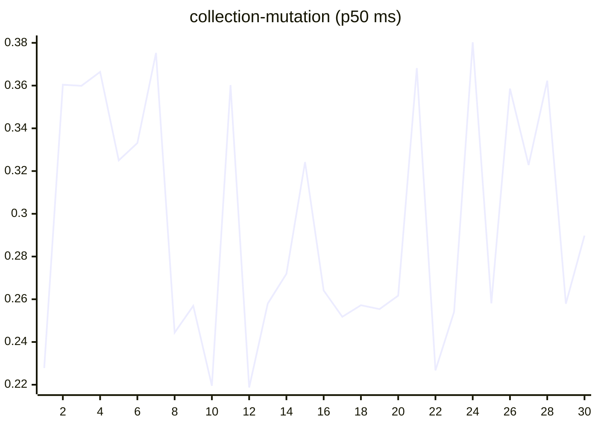
```mermaid
xychart-beta
    title "collection-mutation (p50 ms)"
    x-axis 1 --> 30
    line [0.2278, 0.3604, 0.3599, 0.3664, 0.3250, 0.3331, 0.3753, 0.2444, 0.2569, 0.2195, 0.3602, 0.2187, 0.2580, 0.2719, 0.3242, 0.2641, 0.2518, 0.2572, 0.2554, 0.2617, 0.3682, 0.2267, 0.2541, 0.3803, 0.2581, 0.3586, 0.3228, 0.3623, 0.2579, 0.2898]
```

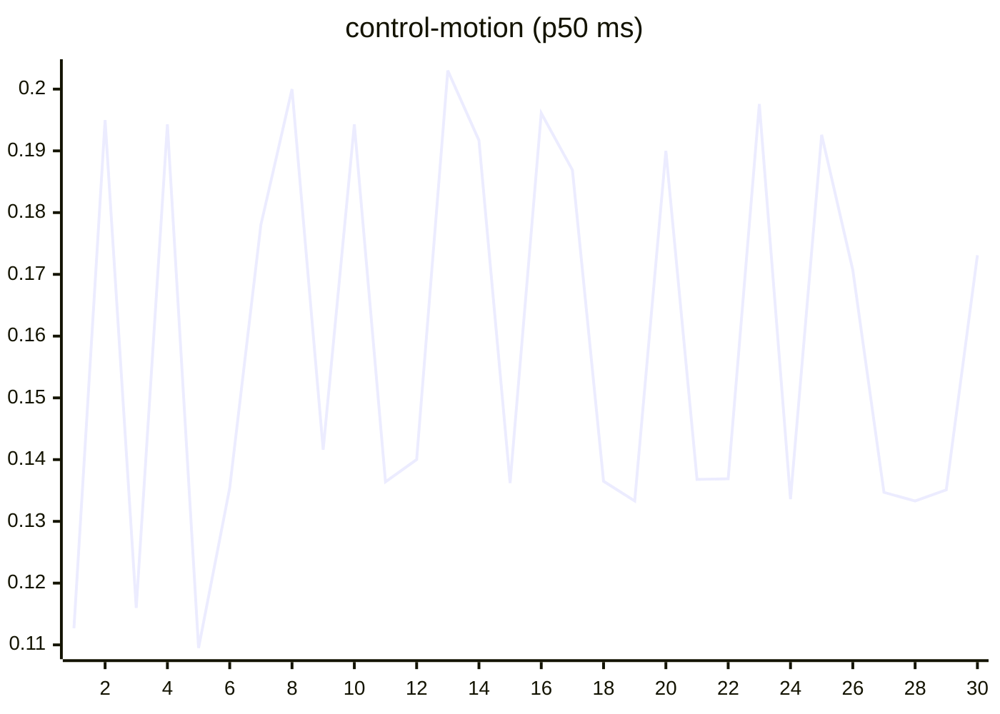
```mermaid
xychart-beta
    title "control-motion (p50 ms)"
    x-axis 1 --> 30
    line [0.1127, 0.1950, 0.1160, 0.1943, 0.1095, 0.1354, 0.1780, 0.2000, 0.1416, 0.1943, 0.1364, 0.1400, 0.2030, 0.1917, 0.1362, 0.1961, 0.1869, 0.1365, 0.1333, 0.1900, 0.1368, 0.1369, 0.1976, 0.1336, 0.1926, 0.1707, 0.1347, 0.1333, 0.1351, 0.1731]
```

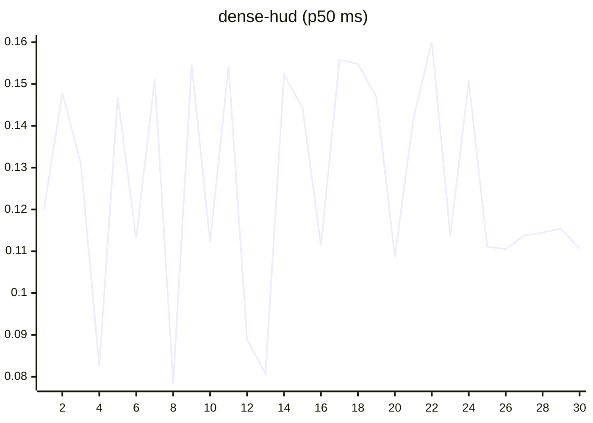
```mermaid
xychart-beta
    title "dense-hud (p50 ms)"
    x-axis 1 --> 30
    line [0.1198, 0.1479, 0.1310, 0.0825, 0.1469, 0.1131, 0.1512, 0.0783, 0.1546, 0.1122, 0.1543, 0.0888, 0.0808, 0.1522, 0.1444, 0.1114, 0.1558, 0.1548, 0.1469, 0.1086, 0.1417, 0.1601, 0.1137, 0.1508, 0.1111, 0.1105, 0.1138, 0.1145, 0.1154, 0.1106]
```

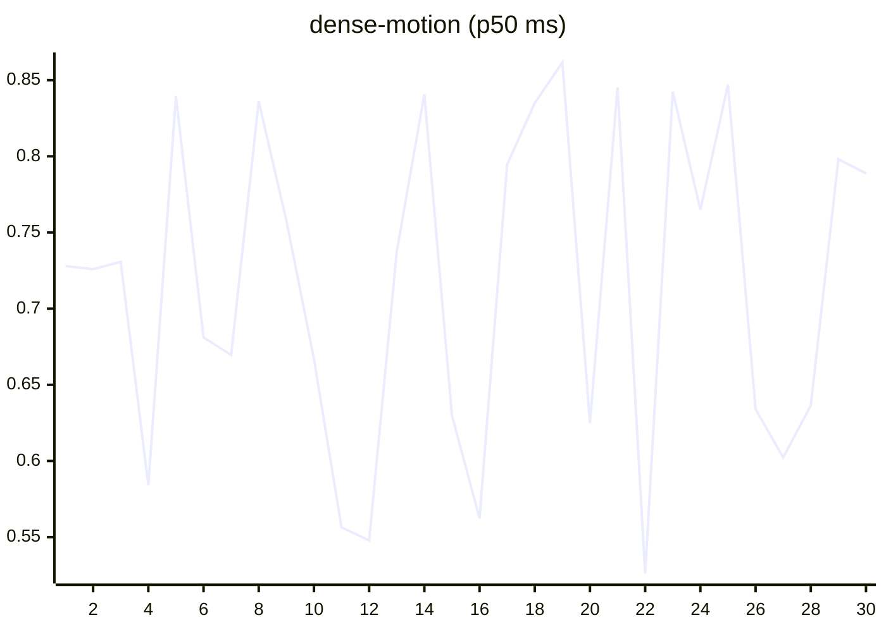
```mermaid
xychart-beta
    title "dense-motion (p50 ms)"
    x-axis 1 --> 30
    line [0.7280, 0.7259, 0.7307, 0.5841, 0.8396, 0.6811, 0.6696, 0.8361, 0.7579, 0.6670, 0.5564, 0.5479, 0.7374, 0.8407, 0.6299, 0.5623, 0.7946, 0.8350, 0.8616, 0.6249, 0.8453, 0.5261, 0.8424, 0.7649, 0.8471, 0.6340, 0.6023, 0.6364, 0.7981, 0.7888]
```

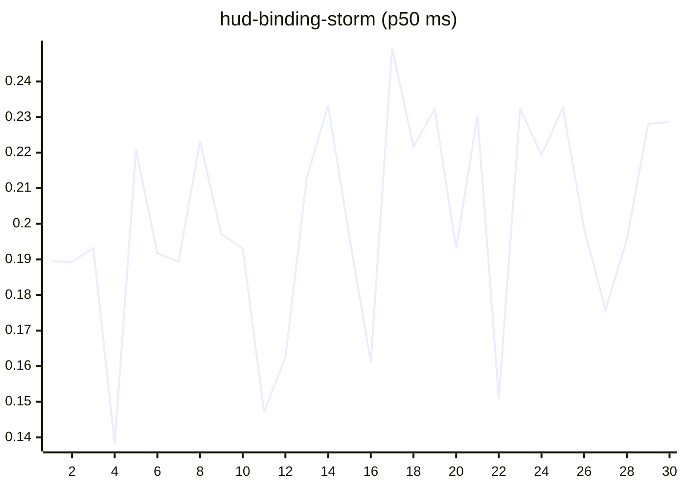
```mermaid
xychart-beta
    title "hud-binding-storm (p50 ms)"
    x-axis 1 --> 30
    line [0.1895, 0.1893, 0.1932, 0.1382, 0.2207, 0.1917, 0.1894, 0.2232, 0.1971, 0.1931, 0.1471, 0.1625, 0.2129, 0.2333, 0.1963, 0.1612, 0.2493, 0.2217, 0.2323, 0.1930, 0.2305, 0.1509, 0.2324, 0.2193, 0.2326, 0.1986, 0.1758, 0.1956, 0.2281, 0.2286]
```

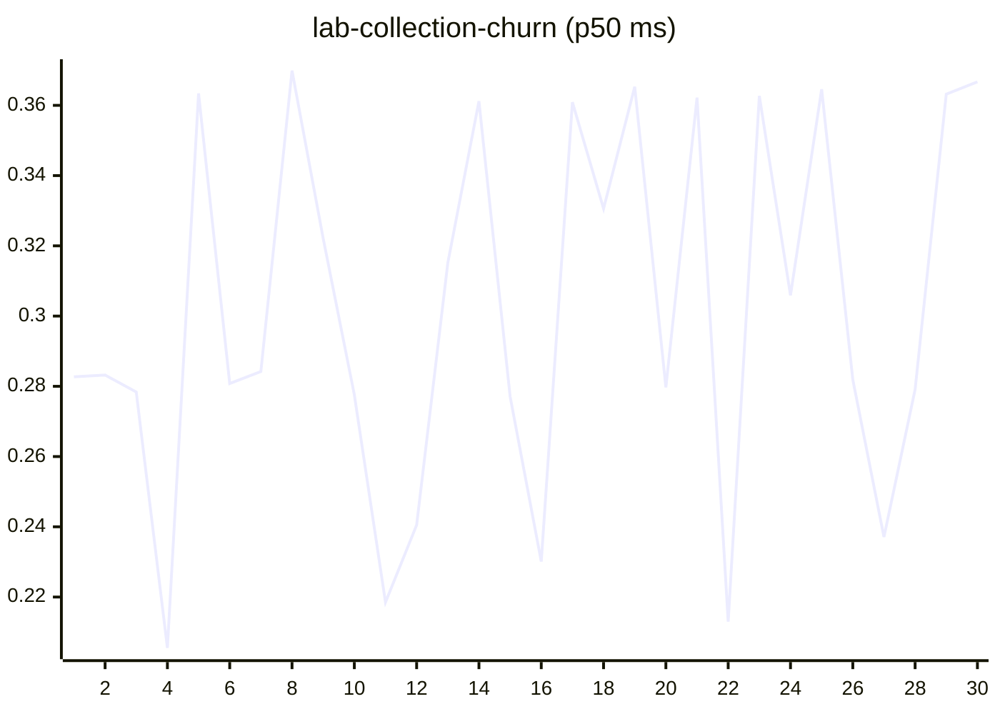
```mermaid
xychart-beta
    title "lab-collection-churn (p50 ms)"
    x-axis 1 --> 30
    line [0.2827, 0.2832, 0.2784, 0.2055, 0.3634, 0.2808, 0.2842, 0.3699, 0.3221, 0.2776, 0.2185, 0.2405, 0.3151, 0.3612, 0.2771, 0.2301, 0.3609, 0.3306, 0.3653, 0.2797, 0.3622, 0.2130, 0.3627, 0.3059, 0.3646, 0.2819, 0.2371, 0.2791, 0.3632, 0.3667]
```

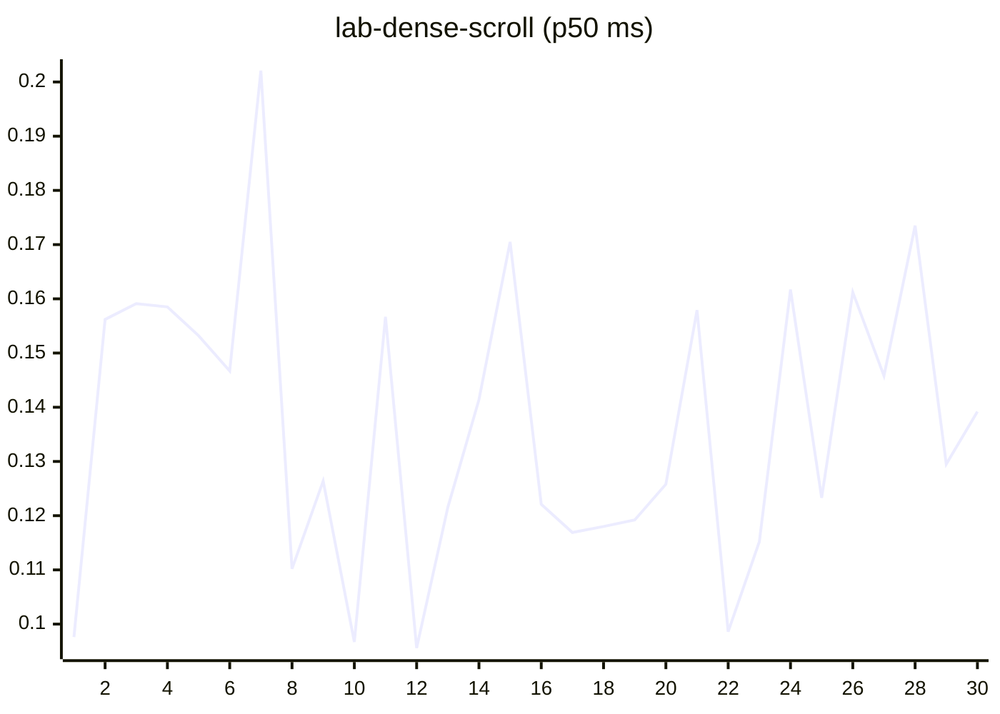
```mermaid
xychart-beta
    title "lab-dense-scroll (p50 ms)"
    x-axis 1 --> 30
    line [0.0976, 0.1562, 0.1591, 0.1585, 0.1532, 0.1467, 0.2021, 0.1102, 0.1264, 0.0967, 0.1567, 0.0956, 0.1215, 0.1414, 0.1705, 0.1221, 0.1169, 0.1180, 0.1192, 0.1258, 0.1579, 0.0986, 0.1152, 0.1617, 0.1233, 0.1612, 0.1458, 0.1735, 0.1295, 0.1392]
```

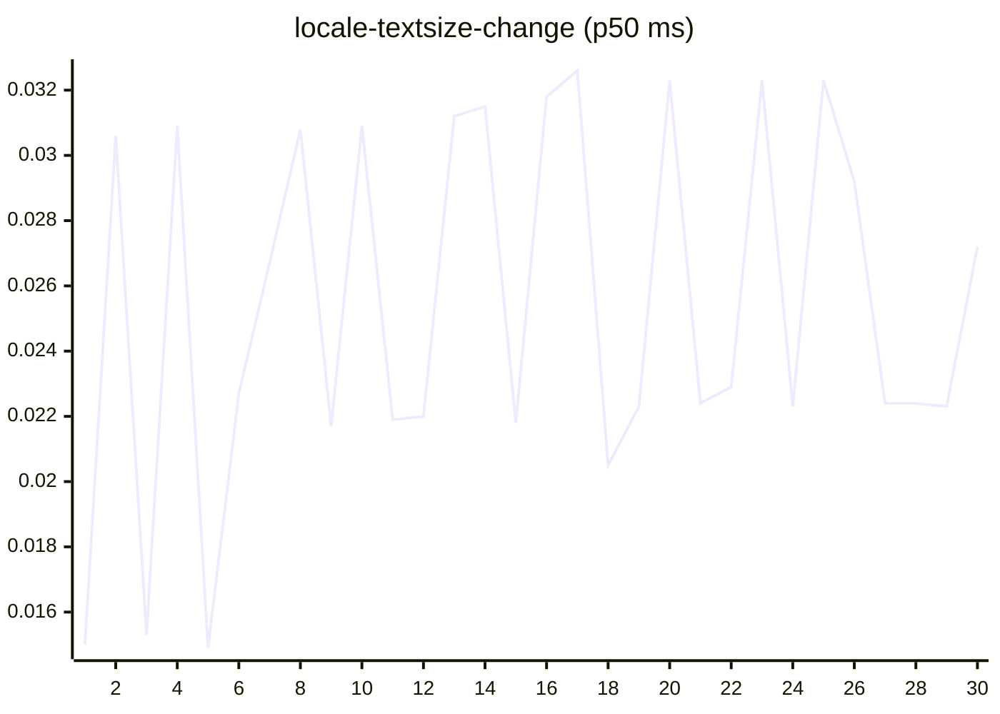
```mermaid
xychart-beta
    title "locale-textsize-change (p50 ms)"
    x-axis 1 --> 30
    line [0.0150, 0.0306, 0.0153, 0.0309, 0.0149, 0.0227, 0.0267, 0.0308, 0.0217, 0.0309, 0.0219, 0.0220, 0.0312, 0.0315, 0.0218, 0.0318, 0.0326, 0.0205, 0.0223, 0.0323, 0.0224, 0.0229, 0.0323, 0.0223, 0.0323, 0.0292, 0.0224, 0.0224, 0.0223, 0.0272]
```

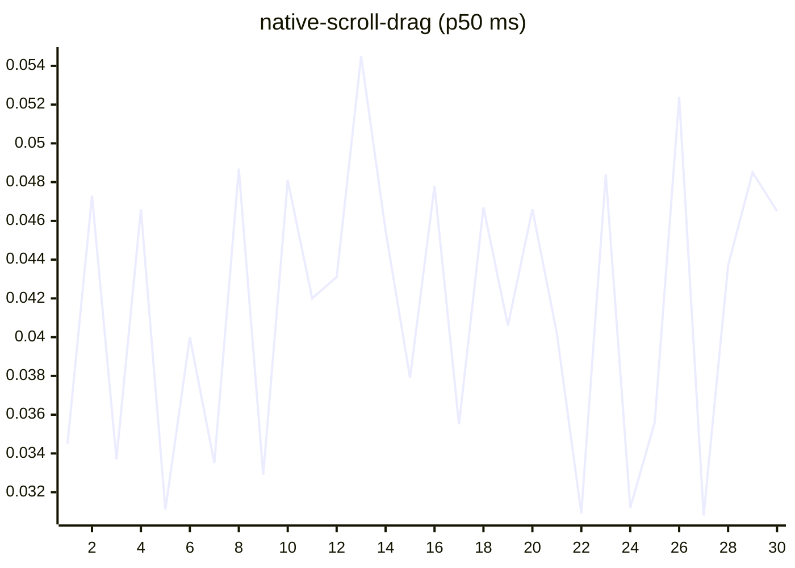
```mermaid
xychart-beta
    title "native-scroll-drag (p50 ms)"
    x-axis 1 --> 30
    line [0.0345, 0.0473, 0.0337, 0.0466, 0.0311, 0.0400, 0.0335, 0.0487, 0.0329, 0.0481, 0.0420, 0.0431, 0.0545, 0.0455, 0.0379, 0.0478, 0.0355, 0.0467, 0.0406, 0.0466, 0.0402, 0.0309, 0.0484, 0.0312, 0.0356, 0.0524, 0.0308, 0.0437, 0.0485, 0.0465]
```

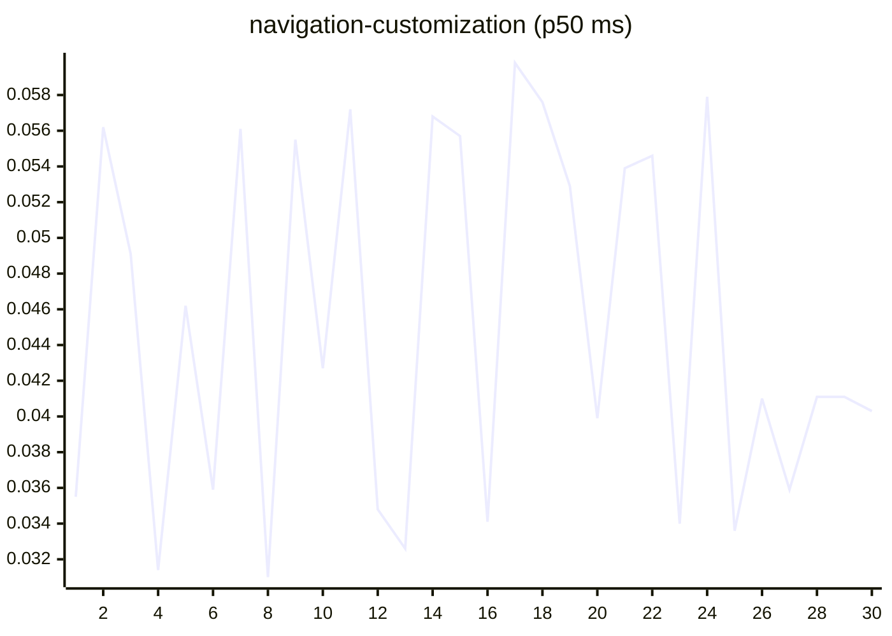
```mermaid
xychart-beta
    title "navigation-customization (p50 ms)"
    x-axis 1 --> 30
    line [0.0355, 0.0562, 0.0491, 0.0314, 0.0462, 0.0359, 0.0561, 0.0310, 0.0555, 0.0427, 0.0572, 0.0348, 0.0326, 0.0568, 0.0557, 0.0341, 0.0598, 0.0576, 0.0529, 0.0399, 0.0539, 0.0546, 0.0340, 0.0579, 0.0336, 0.0410, 0.0359, 0.0411, 0.0411, 0.0403]
```

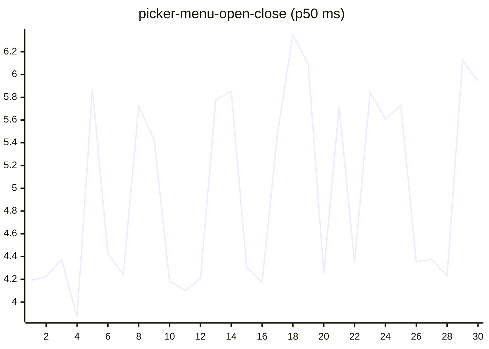
```mermaid
xychart-beta
    title "picker-menu-open-close (p50 ms)"
    x-axis 1 --> 30
    line [4.1891, 4.2236, 4.3733, 3.8708, 5.8694, 4.4248, 4.2362, 5.7230, 5.4264, 4.1828, 4.1028, 4.2034, 5.7775, 5.8503, 4.3049, 4.1731, 5.4814, 6.3520, 6.0839, 4.2522, 5.7175, 4.3452, 5.8449, 5.6085, 5.7317, 4.3559, 4.3756, 4.2307, 6.1258, 5.9413]
```

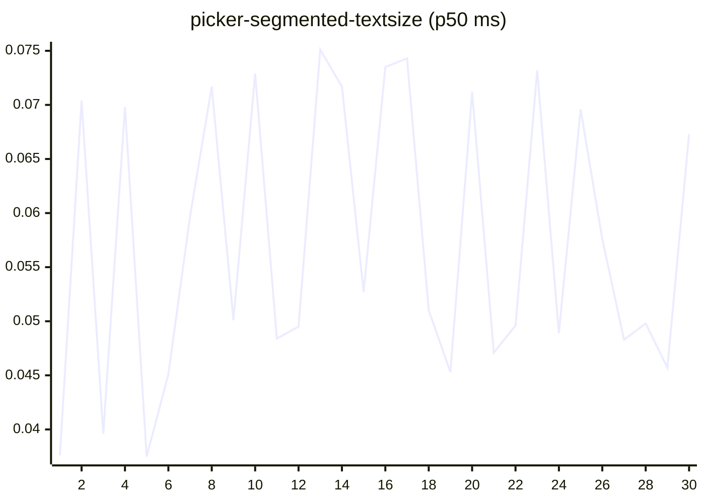
```mermaid
xychart-beta
    title "picker-segmented-textsize (p50 ms)"
    x-axis 1 --> 30
    line [0.0376, 0.0704, 0.0396, 0.0698, 0.0375, 0.0451, 0.0597, 0.0717, 0.0501, 0.0729, 0.0484, 0.0495, 0.0751, 0.0717, 0.0527, 0.0735, 0.0743, 0.0510, 0.0453, 0.0712, 0.0471, 0.0496, 0.0732, 0.0489, 0.0696, 0.0576, 0.0483, 0.0498, 0.0457, 0.0673]
```

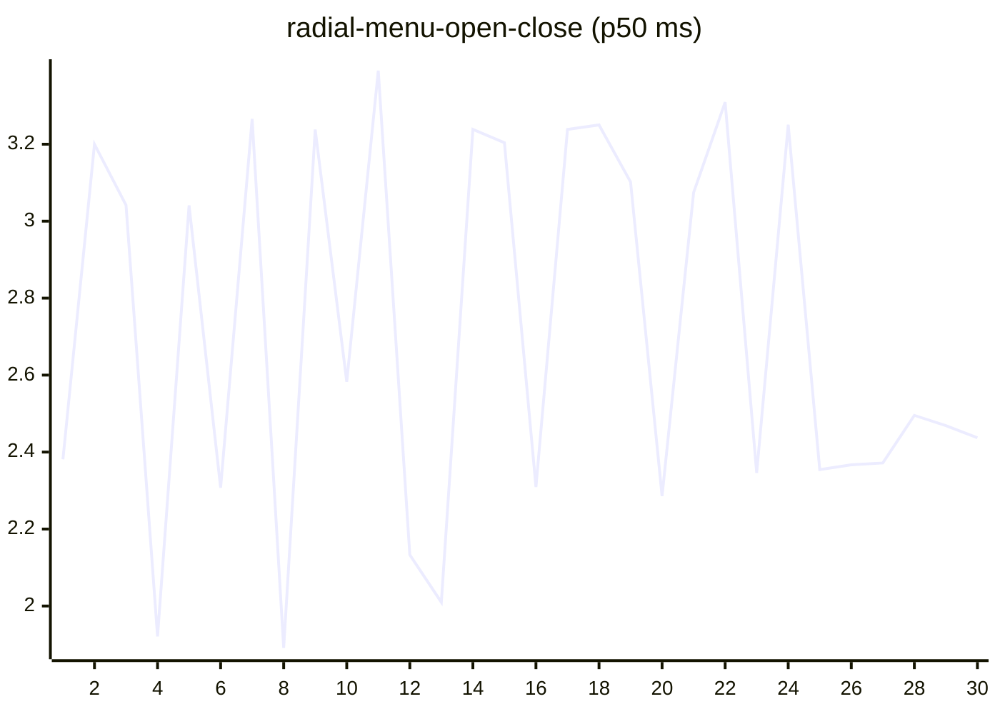
```mermaid
xychart-beta
    title "radial-menu-open-close (p50 ms)"
    x-axis 1 --> 30
    line [2.3812, 3.1998, 3.0418, 1.9210, 3.0409, 2.3073, 3.2658, 1.8910, 3.2382, 2.5826, 3.3913, 2.1328, 2.0098, 3.2386, 3.2038, 2.3093, 3.2385, 3.2500, 3.1020, 2.2857, 3.0743, 3.3090, 2.3458, 3.2504, 2.3544, 2.3668, 2.3717, 2.4954, 2.4685, 2.4370]
```

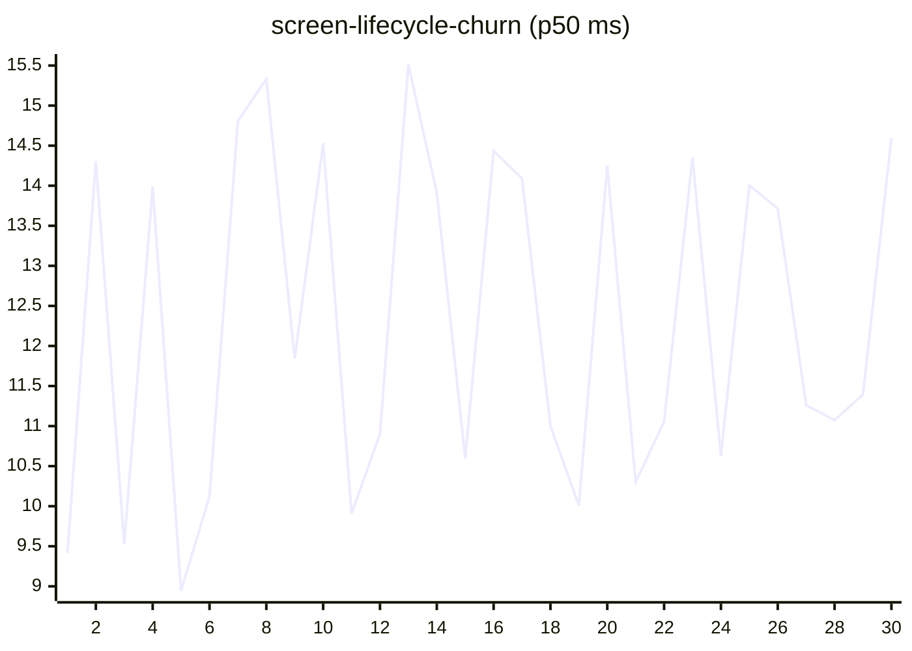
```mermaid
xychart-beta
    title "screen-lifecycle-churn (p50 ms)"
    x-axis 1 --> 30
    line [9.4107, 14.3067, 9.5273, 13.9881, 8.9443, 10.1224, 14.8053, 15.3321, 11.8425, 14.5307, 9.9071, 10.9019, 15.5148, 13.9104, 10.5962, 14.4348, 14.0887, 10.9995, 10.0109, 14.2492, 10.2994, 11.0552, 14.3516, 10.6260, 14.0043, 13.7160, 11.2608, 11.0741, 11.3953, 14.5988]
```

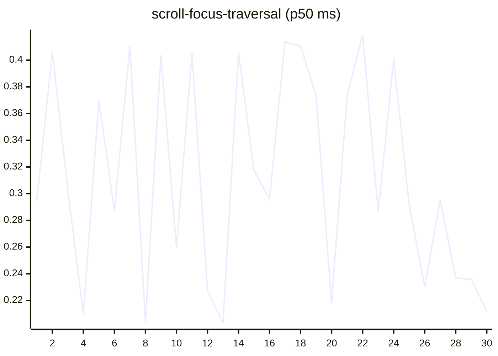
```mermaid
xychart-beta
    title "scroll-focus-traversal (p50 ms)"
    x-axis 1 --> 30
    line [0.2948, 0.4062, 0.3027, 0.2099, 0.3700, 0.2873, 0.4105, 0.2037, 0.4037, 0.2593, 0.4054, 0.2273, 0.2031, 0.4057, 0.3172, 0.2960, 0.4139, 0.4104, 0.3734, 0.2176, 0.3735, 0.4187, 0.2864, 0.4004, 0.2919, 0.2301, 0.2953, 0.2369, 0.2359, 0.2121]
```

```mermaid
xychart-beta
    title "settings-churn (p50 ms)"
    x-axis 1 --> 30
    line [2.4565, 3.8237, 2.4229, 3.7182, 2.2857, 2.6154, 3.7298, 3.8850, 3.0344, 3.7915, 2.5710, 2.6966, 4.0226, 3.6687, 2.6457, 3.7562, 3.7077, 2.6629, 2.5801, 3.6929, 2.6341, 2.6937, 3.7401, 2.7138, 3.7017, 3.4348, 2.7149, 2.7917, 2.8706, 3.7777]
```

```mermaid
xychart-beta
    title "shadow-storm (p50 ms)"
    x-axis 1 --> 30
    line [0.0003, 0.0005, 0.0005, 0.0006, 0.0005, 0.0005, 0.0005, 0.0004, 0.0005, 0.0003, 0.0005, 0.0003, 0.0005, 0.0005, 0.0005, 0.0004, 0.0005, 0.0005, 0.0005, 0.0004, 0.0006, 0.0003, 0.0005, 0.0006, 0.0005, 0.0006, 0.0005, 0.0006, 0.0004, 0.0004]
```

```mermaid
xychart-beta
    title "stylesheet-state-churn (p50 ms)"
    x-axis 1 --> 30
    line [0.2085, 0.3485, 0.3556, 0.3613, 0.3147, 0.3169, 0.3856, 0.2355, 0.2707, 0.2126, 0.3524, 0.2020, 0.2693, 0.2882, 0.3261, 0.2577, 0.2599, 0.2589, 0.2752, 0.2547, 0.3534, 0.2229, 0.2557, 0.3742, 0.2607, 0.3507, 0.3192, 0.3615, 0.2490, 0.2769]
```

```mermaid
xychart-beta
    title "theme-swap-assets (p50 ms)"
    x-axis 1 --> 30
    line [2.1953, 2.8774, 2.7009, 1.6695, 2.8448, 2.1851, 2.9101, 1.6390, 2.8948, 2.2949, 3.0614, 1.8572, 1.7457, 2.9533, 2.8187, 2.1921, 2.9127, 2.8992, 2.7889, 2.1221, 2.7362, 3.1718, 2.2204, 2.9704, 2.1483, 2.0323, 2.1355, 2.0861, 2.0721, 2.0587]
```

```mermaid
xychart-beta
    title "theme-swap-flat (p50 ms)"
    x-axis 1 --> 30
    line [1.2965, 1.6692, 1.3393, 0.9060, 1.6735, 1.2854, 1.6224, 0.8885, 1.6453, 1.1602, 1.6540, 0.9729, 0.9063, 1.6440, 1.4074, 1.2941, 1.6455, 1.6160, 1.4466, 1.0713, 1.4277, 1.6396, 1.2867, 1.6299, 1.2787, 1.0311, 1.2685, 1.0628, 1.0589, 1.0493]
```

```mermaid
xychart-beta
    title "theme-swap-metrics (p50 ms)"
    x-axis 1 --> 30
    line [1.4608, 2.5967, 2.6141, 2.6465, 2.4137, 2.3307, 2.9104, 1.8198, 2.0838, 1.5181, 2.6149, 1.5246, 2.0854, 2.4711, 2.4836, 1.9281, 2.0545, 2.0938, 2.1552, 1.9450, 2.6699, 1.5451, 2.0613, 2.8759, 2.1060, 2.5629, 2.3265, 2.5949, 1.8845, 2.0143]
```

```mermaid
xychart-beta
    title "virtual-list-scroll (p50 ms)"
    x-axis 1 --> 30
    line [0.1032, 0.1002, 0.1041, 0.0958, 0.1438, 0.1006, 0.0998, 0.1461, 0.1239, 0.0976, 0.0928, 0.1011, 0.1337, 0.1421, 0.0970, 0.1027, 0.1218, 0.1406, 0.1433, 0.0974, 0.1445, 0.0987, 0.1439, 0.1347, 0.1453, 0.0992, 0.1070, 0.0996, 0.1444, 0.1411]
```
